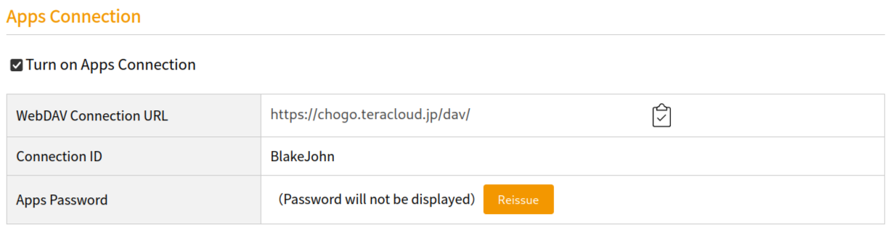

为了实现容量较大，上下行没限制，随时可以访问的网盘，我们可以选择使用现有的网盘服务或自建网盘。

# 01 网盘服务

网盘服务也分为不同的类型，一种是专门用于 **云端存储** 的网盘服务，只提供在自己需要时进行上传下载的服务，而另一种则是主要用于 **多端同步** 的同步云盘。

## 1.1 云端存储

云端存储最重要的就是容量大，上传下载不限速，国内有许多可以选得网盘，大头主要有：

- **百度网盘** - 百度网盘是最老的几个网盘，但是他限速十分让人反感，可以当成一个久久用一次的备份盘，优点是 windows , linux , android , ios , macos , harmonyos 等全部支持，可以说是最全的
	- **百度网盘青春版** - 这是专门响应国家对于网盘限速的限令而出的不限速网盘，但是容量小，只有10G，而且不支持分享，可以说只能用来存点进场用的，但是不和他人分享的数据
- **阿里云盘** - 相比于百度网盘，他确实做到了不限速，值得一试，但可惜的时暂时没有 linux 端
- **华为云盘** - 华为云盘是华为专门推出的云盘服务，免费5GB，50GB每月4.8元，对于华为生态的用户可以说是必不可少的，值得一试，但是没有 linux 端
- **infiniCloud** - infiniCloud 是一个日本的网盘，免费25GB，虽然少，但是可以用来存储一些文本文件，同时支持 webdav

## 1.2 同步云盘

同步云盘最重要的就是多端同步，而且需要满足我们的流量要求，国内的服务商家有坚果云，阿里云，华为云可以用，国外的倒是有不少，但是需要魔法，这个违背了我们对于同步盘的需求， *我们需要随时同步更改的内容，但是不会一整天使用魔法* 。

- **坚果云** - 坚果云是国内比较好的选择
	- 坚果云最大的特色就是 **没有限制使用的容量**，而是限制每月的上传下载流量，每月限制上传 1GB，下载 3GB，理论上来说是无限容量，而且上传下载并不限速。不过坚果云使用的是增量上传与下载，只操作修改的文件，这样实际上我们一个月能用的流量要超过 1GB。此外，我们使用同步云盘主要是要在多端及时同步我们的工作文件，最主要的是上传与下载文本文件，需要的使用量其实不多，而能够及时同步就是最好的。坚果云还有一个特点就是支持 windows , linux, android , harmonyos , macos , ios 全平台，可以很好地满足对于笔记文件，文稿，待办事项等文件的同步。
	- 同时，坚果云也支持webdav，可以和多种应用联合，如 Zotero ，可以实现文献的全平台同步。
- **阿里云盘** - 阿里云盘也推出了同步文件夹的功能
	- 最大的优点就是他的同步文件夹基于你现有的网盘服务，只要你的网盘还有空间，就能进行同步，同时也不会限制上传下载的流量和速度
- **华为云** - 华为云也有同步文件夹的功能，也是基于现有的网盘服务，最主要的就是可以和华为的生态进行联动，而且华为云十分安全

# 02 自建网盘

自建网盘的服务实际上也分为两种，一种是 **基于厂家提供的云盘服务并利用 webdav 进行网盘的搭建与同步** ， 另外一种则是 **完全基于云盘服务使用本地服务器基于 webdav 提供网盘服务** 。

第一种操作起来最为便捷，也不需要什么技术，更不需要什么设备。只需要选择一个提供了 webdav 服务的网盘即可，推荐的有 **坚果云**，**infiniCloud**，**阿里云**。

而第二种则需要懂得如何将本地的设备搭建成一个提供 webdav 服务的服务器。可以选择使用 **ownCloud** , **seafile** , **cloudreve** 来搭建自己的服务器。

# 03 使用已有的网盘服务设置同步功能

坚果云可以用于同步我们的纯文本文件，但是有时候我们也需要同步一些具有较大内容的文件，同时上传下载较为频繁，这时候坚果云就显得有点不够用。这种情况下我们需要的空间仍然不会很大，但是频繁访问，因此我选择使用 infiniCloud 来进行同步功能的设置。

## 3.1 基本流程

1. 注册 infiniCloud 获取 25GB 的免费空间
2. 开启 infiniCloud 的 WebDAV 服务
3. 通过可以连接到 WebDAV 的同步工具将本地的内容同步到网盘

## 3.2 注册并开启 infiniCloud 的 WebDAV 服务

我们直接到官网 [infiniCloud](https://infini-cloud.net/en/) 注册并登录账号，就能直接获得 20GB 的永久免费空间。

然后，我们登录账号后，在 `My Page` 中可以看到一个 `Apps Connection` 的设置栏目，开启该设置，并点击生成 `Apps Password` ，就可以开启 WebDAV 服务。

> 记得将这个密码保存下来，后续我们通过网络访问我们的云盘，就需要通过 id 和 password 进行登录

## 3.3 使用同步工具连接 WebDAV
- 
推荐使用 [Syncovery](https://www.syncovery.com/) 来进行同步。

[Syncovery](Syncovery.md) 是一个跨平台的同步工具，对于本地备份及网络同步都有着很好的支持，因此，我们可以通过他来设定一个自动同步的计划，既可以在需要的时候手动同步，又可以按计划自动同步，这样很好！

除此之外，我们还可以通过 [RaiDrive](https://www.raidrive.com) 将 infiniCloud 网盘挂在到本地，这样就可以很轻松地访问与管理云盘里的内容了。

> [!seealso] 
> **除了需要频繁同步大文件，为什么选择使用 infiniCloud 的 WebDAV 服务？**
> 
> 这是因为坚果云服务器的客户端在 Arch 上开着就需要占用 `426MB` 的内存，而使用 WebDAV 服务就只需要开启一个 Syncovery 的服务而已，只需要 `29MB` 就能完成实现坚果云的功能。
> 
> 对于一个使用 Arch 系统的人来说，426 明显是不能忍的，虽然并不差这点内存。

# 04 将自己的设备搭建成网盘服务器

## 4.1 最简方式

这里最简单的方法就是通过使用 [Syncthing] 来实现文件的传输与同步。 **Syncthing** 是一个用于实现多端通信与文件传输的程序，可以很安全地将文件在不同设备之间进行同步。只要设备开着 Syncthing 就能进行同步，十分方便。

但是 Syncthing 的同步需要提前配置好通信设备的 ID ，在陌生设备上要访问我们的服务器就有点困难，不过对于日常使用来说（游戏本扔实验室，带着轻薄本跑），已经绰绰有余了。

## 4.2 真正的网盘服务

我们可以通过 **Clouderve** , **seafiles** , **ownCloud** 等开源项目自建服务器，这样我们就能通过 WebDAV 来在任意位置访问我们的云盘。