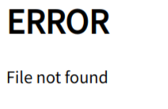

[Syncovery](https://www.syncovery.com) 是一个用于自动同步的工具，既可以实现本地备份，又可以实现云盘同步。

# 01 Installation

## 1.1 Linux

我们可以在 [此处](https://www.syncovery.com/download/linux/) 下载我们需要的工具，不同发行版可以按照上面的文档来下载，这里我们减少在 Arch 上的安装。

我们选择带 Web GUI 的[版本](https://www.syncovery.com/release/SyncoveryCL-x86_64-10.16.11-Web.tar.gz)，将压缩包下载到本地，并解压至 `./local/share/syncovery` 目录中，也可以 : 

```bash
wget https://www.syncovery.com/release/SyncoveryCL-x86_64-10.16.11-Web.tar.gz -o syncovery.tar.gz
mkdir ~/.local/share/syncovery
tar -xf syncovery.tar.gz -C ~/.local/share/syncovery
```

然后我们将其可执行文件链接到 `~/.local/bin` 中即可 : 

```bash
ln -f ~/.local/share/syncovery/SyncoveryCL ~/.local/bin/syncovery
```

然后，我们就能在终端中使用该命令了。

> [!note] 
> 我将 `SyncoveryCL` 命令链接到了系统路径中，并且以 `syncovery` 为链接名，因此，在后面我都将使用 `syncovery` 命令来操作

# 02 GUI 使用

## 2.1 基本使用

syncovery 提供了一个 webgui 来供我们便捷使用，我们只需要启动 syncovery 服务，然后访问开放的端口即可。

syncovery 使用的端口默认为 `localhost:8999` ，我们只需要在浏览器中输入该网址，并使用默认的 User ID `default` 以及默认的 Password `pass` 即可访问。

我们第一次使用的时候，需要设置服务端口为 `localhost` ，然后才能正常使用服务 : 

```bash
syncovery SET /WEBSERVER=localhost
syncovery start
```

通过 `syncovery start` 命令就可以启动服务。

除了使用默认的用户名，密码和开放的端口，我们也可以自己设置 : 

```bash
syncovery SET /WEBSERVER=localhost /WEBUSER=blake /WEBPASS=blake /WEBPORT=9090
syncovery start
```

通过上面的命令，我们就可以使用 `localhost:9090` 来访问 syncovery 的gui服务，然后我们可以使用 `blake` 账户和 `blake` 密码来登录我们的服务。

## 2.2 problem #bug #problem #solved 

我们或许会在下载目录下尝试运行 syncovery ，并访问其 webgui，等到确认运行正常无误后，我们才会将其安装到 `~/.local/share` 目录下。等我们将其移动到 `~/.local/share` 目录下后，我们可能会发现再次访问 webgui 会遇到打不开的情况，并显示 :



这是因为我们第一次运行的时候，他自动设置并加载了web页面的目录位置为下载目录，当我们移动它到 `~/.local/share` 之后，设置并未更新，程序仍然在下载目录下查找web页面，因此会出现问题，这个时候，只需要重新设置web页面的位置即可 : 

```bash
syncovery SET /WEBDOCSPATH=/home/blake/.local/share/syncovery/WebDocs
```

> [!attention] 
> 这里要求使用绝对路径，而不能使用 `~` 来代表个人目录

在重新设置好路径之后，重新启动服务，就可以正常访问了。

> 我们可以通过 `killall syncovery` 来终止我们的服务

