在上一节，我们成功安装了[终端里的 Arch ](01%20基本安装.md)。但是，这还远远达不到日常使用的需求，因此，这一节我们来安装桌面环境和基本的使用工具。

桌面环境 (Desktop Environment - DE) 的选择有不少，gnome, kde, xfce, hyprland 等等。在众多的桌面环境中，对于新手比较推荐的是 `KED-Plasma` 。

- `gnome` 可自定义的程度远不如 `kde` ，而且有较多的附带软件，稍微显得臃肿，但是，gnome的界面及动画及其华丽，对于不喜欢折腾的人来说无疑是最好的选择。
- `xfce` 是及其轻量的桌面环境，占用系统资源极小，但是其界面就远远不如 `gnome` 和 `kde` 好看，甚至有些许简陋。
- `hyprland` 是一个轻量，完全自定义的桌面环境，他的任何一个组件都需要自己下载并且 **编辑配置文件** ，没有图形化配置，因此完全不适合新手。但是也可以在网上看看 Hyprland 有多么诱人。

综上，我们选择了一款既可以开箱即用，界面好看，又允许用户高度定制，并且资源占用适中的桌面环境 `kde` 来入门 Arch 。

在启动 Arch 后，我们可以使用刚刚创建的[个人用户](01%20基本安装.md#3.6.2%20建立个人用户)来登陆。

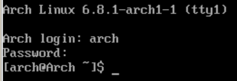

# 1 安装 KDE

安装 `kde` 十分地简单 : 

```bash
sudo pacman -S plasma
```

上一节我们提到，安装软件是需要超级用户权限的，所以我们需要在 `pacman` 前面加上 `sudo` 来使用超级用户权限。 `sudo` 为 `super user do` ，即使用超级用户的权限来执行命令。

在输入密码之后，我们 **无脑敲回车，使用默认的安装选项** 。

在安装完成之后，我们重启电脑后就会发现并没用进入图形化界面，这是因为我们没有启动 `DM` 服务，即 `Display Manager` 。 `DM` 是用来帮助我们管理桌面环境，选择以哪个用户，哪种桌面环境登陆系统的图形化界面。

# 2 DM

与 Windows 不同，Linux 在选择用户的界面并不属于桌面环境，而是用来选择用户和桌面环境的。真正的桌面环境是在输入密码并敲回车之后才启动的，这种通过 `DM` 来管理用户和桌面环境让系统能够轻松地在不同用户和不同桌面环境之间切换，大大提高了 Linux 的丰富度。我们可以选择不同的桌面环境应对不同的开发流程。

`DM` 有许多种选择，如和 `gnome` 配套的 `gdm` ，适用于多种桌面环境的 `lightdm` 和 `sddm` 。下载 `kde` 桌面时默认下载 `sddm` 作为 管理器。此时，我们只需要 : 

```bash
sudo systemctl enable sddm
```

这样，在我们 **下次重启** 之后，我们就能进入 `DM` 并且可以选择用户及桌面环境。 **但是！现在先别重启。** 

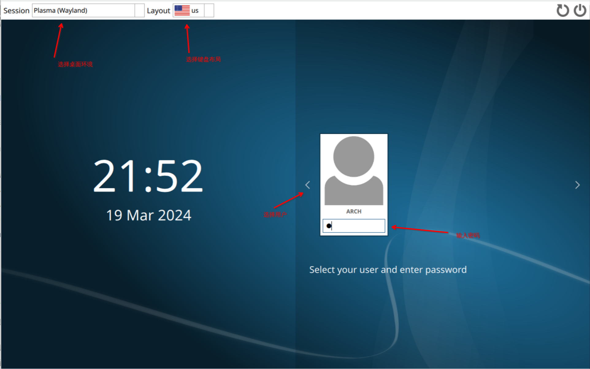

上图就是 `sddm` 的界面，看上去有点丑，但是我们可以在后面给他换个主题。

# 3 必要的工具

我们只是安装了一个桌面环境， `kde` 在 6.0 版本删除了安装时大量附带的软件包，因此 6.0 版本的 `kde` 十分精简，只有必要的工具，这就让我们可以自由选择要那些工具。当然，这无疑也提高了我们的工作量。

在安装完桌面环境，并启动 `DM` 服务之后，我们先不要急着重启进入桌面环境，因为这时进入了桌面环境后你会发现找不到给你敲命令的地方(终端)，打不开文件夹(文件资源管理器)，甚至没有浏览器可以给你用 ! 想要在设置里看看还会发现全都是英文，没有中文字体，也找不到中文输入法在哪。一点都用不了 ! 

> 只能说，心急吃不了热豆腐 ( )
> 我可没说要重启，只不过展示一下 sddm 长啥样

这个时候，想要解决上面的各种问题当然很简单，没有终端就安装终端，没有文件资源管理器就安装文件资源管理器，安装浏览器，安装中文，安装输入法......但是还是那个问题，找不到可以敲命令的地方。

## 3.1 终端模拟器

我们有两种解决方法，一种是在应用商店 `Dicover` 中下载 KDE 桌面最合适的 **终端模拟器 `konsole`** ，然后启动 konsole 来通过命令安装我们想要的软件。

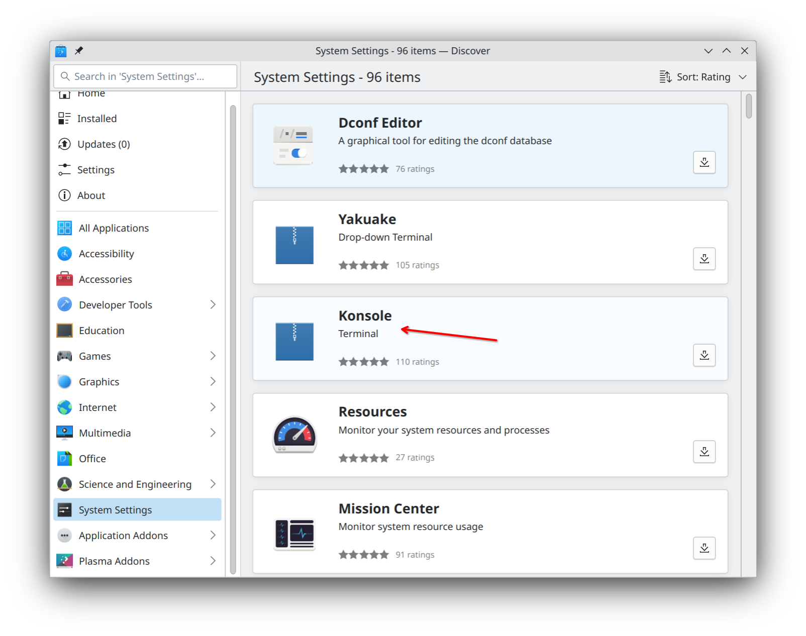

另一种解决方法就是重新回到 `tty` 来通过命令安装我们需要的各种软件。那么这个时候问题又来了，如何回到 `tty` 中？

其实想要切回 `tty` 很简单，只需要按下 `Ctrl + Alt + F<x>` `x = 1, 2, ..., 12` ，我们就能从图形化界面切换到 `tty` ，一共有 12 个可供切换，分别对应着 `tty1 ~ tty12` 。而一般情况下，我们所在的桌面环境占用了 `tty1` ， `DM` 占用了 `tty2` ，因此我们可以使用的还剩下从 3 开始的 `tty` 终端。

在 `tty3` 中，我们需要重新登陆，并通过 `pacman` 或者 `yay` 来安装我们想要的软件。

```bash
sudo pacman -S konsole
```

> 这里建议选择在 `tty` 中通过敲命令的方式来下载。因为我们并没有为 `Discover` 更换镜像源，这就导致了下载速度极慢，而 `pacman` 的镜像源由于我们在 `ISO` 中编辑过，并且在 `pacstrap` 时不附带任何选项，已经成功将镜像源的配置复制过来了，因此下载速度飞快。如果觉得不保险，也可以再次编辑 `/etc/pacman.d/mirrorlist` 或者通过 `cat` 查看。

既然这一段的标题为终端模拟器，自然不会只有 konsole 一个。在 Discover 中，你还能发现另一款终端模拟器 `Yakuake` 。

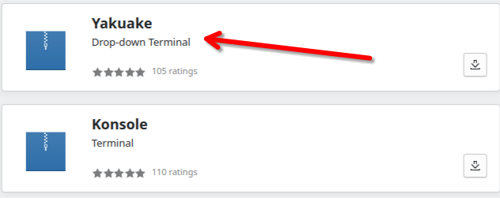

它是一款下拉式终端模拟器，旨在让你在工作时随时唤出，执行命令之后随时关闭，第一次启动时会提示你设置唤醒快捷键，默认为 `F12` ，效果如下 : 

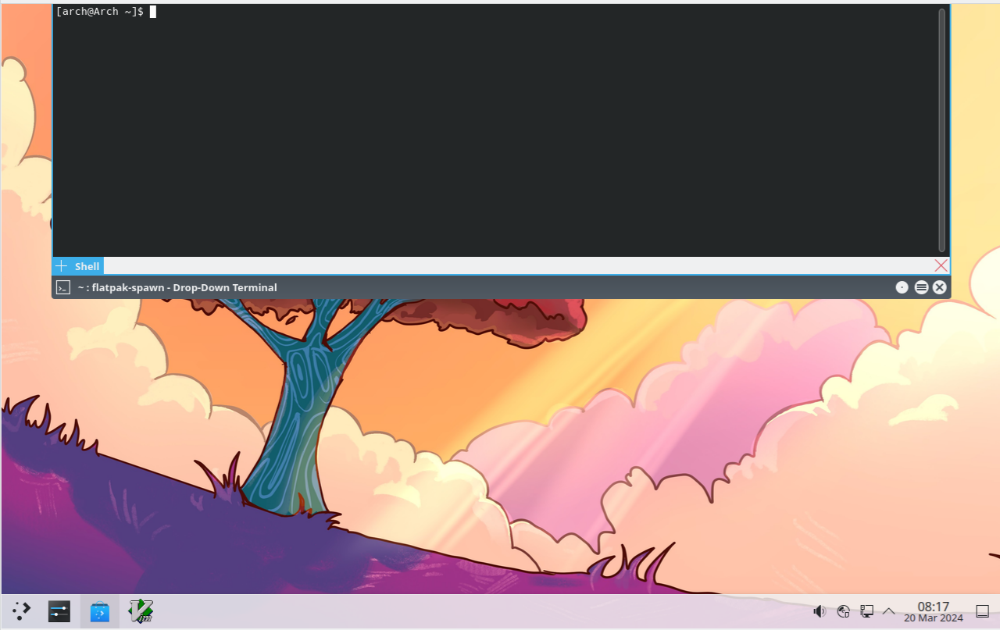

此外，还有其他好用的终端模拟器如 `kitty` , `terminator` , `alacritty` 等等，可以看[这篇文章](https://zhuanlan.zhihu.com/p/358691410) 
> 我们会在后续讲 `kitty` 

## 3.2 进入桌面

这个时候，我们才能放心地进入桌面，因为只要有地方敲命令，Linux 就有本体。

KDE 6.0 为我们提供了两种不同支持的桌面环境 `X11` 和 `Wayland` ， `Wayland` 是较新的环境，也是 6.0 默认的，如果发现输入密码后卡住，无法进入，那么可以重启之后在左上角选择桌面环境的地方切换到 `X11` 。 `X11` 作为老牌环境，对更多的机子有着更高的适应性。

## 3.3 文件资源管理器

我们需要一个软件来管理我们的文件系统，这时候，我们就有[很多种选择](https://zhuanlan.zhihu.com/p/113772180) : 

- `dolphin` : KDE 社区开发的
- `thunar` : xfce 桌面的默认文件资源管理器
- `nautilus` : gnome桌面的文件资源管理器
- `krusader` : 适用于 KDE 的文件资源管理器
- `ranger` / `midnight commander` : 命令行文件资源管理器

我比较推荐使用 `dolphin` 或者是 `thunar` 作为 KDE 的文件资源管理器，轻量好用。

```bash
sudo pacman -S dolphin

# 或者

sudo pacman -S thunar
```

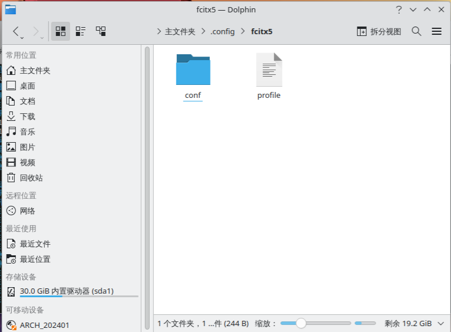

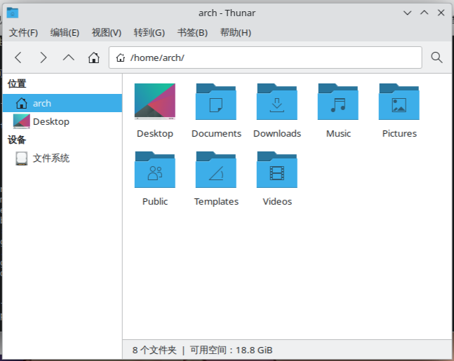

## 3.4 语言

相信你已经对 KDE 桌面进行了一番探索，你就会发现，他设置里的选项是真的多，全英文是真的看不懂，好不容易找到设置语言的地方，结果发现，中文会有方框出现。

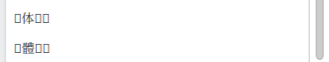

这是因为我们没有安装中文字体和中文支持，接下来，我们就安装一些字体。

```bash
sudo pacman -S wqy-zenhei # 优秀的中文字体
```

KDE 桌面也默认为我们安装了 `noto-fonts` ，因此我们不需要额外安装。

安装完中文字体，再次回到语言设置，你就会发现，还是方框，别着急，我们需要设置好语言之后再重启后才能见到效果。

> 对于一个系统的安装，就是要不断下载软件，不断配置，不断开启服务，不断重启 ... 
> ~~直到电脑崩掉~~

我们来详细讲讲如何安装中文。

1. 在 `System Setting` 中找到 `Region & Language` 中的 `language` 选项。

> 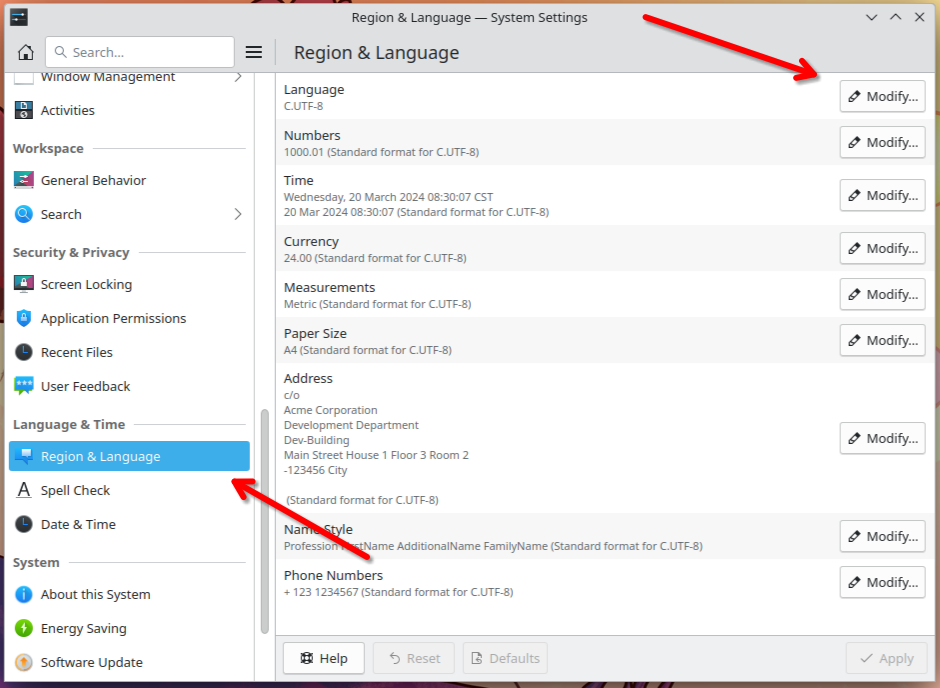

> 如果看到和我一样的 `C.UTF-8` ，那就证明你前面忘记设置系统的默认语言，系统为你设置了默认的语言。此时再打开 `/etc/locale.conf` 就会发现多了一行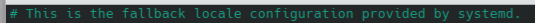我们可以[重新设置一下](01%20基本安装.md#3.3.2%20设置语言) 

2. 点击 `Modify` ，然后选择 `Change Language` ，选择 `简体中文` 之后就点击 `Apply` ，然后重启电脑 !

> 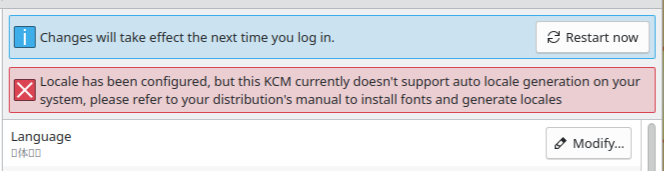

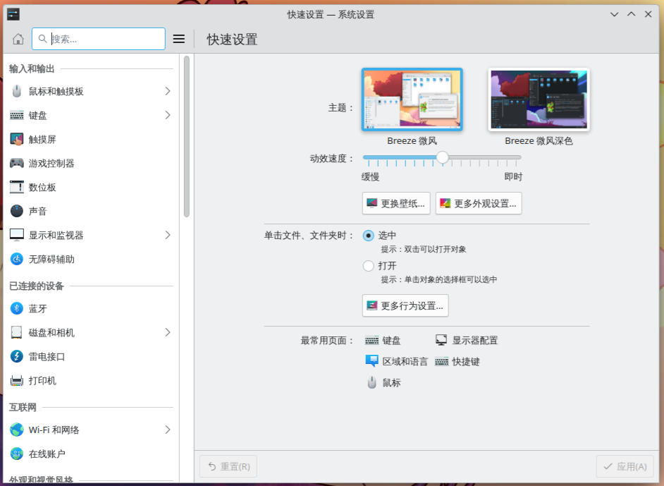

现在是能够显示出中文了，但是我们却发现还无法输入中文。我们需要为中文安装输入法，这里推荐 `fcitx` 架构的输入法，并使用最经典的中文输入引擎 : 

```bash
sudo pacman -S fcitx5 fcitx5-chinese-addons # 输入法框架和输入法引擎
yay -S fcitx5-input-support # 输入法支持模块
```

安装完之后，我们就可以看到目前拥有的输入法引擎

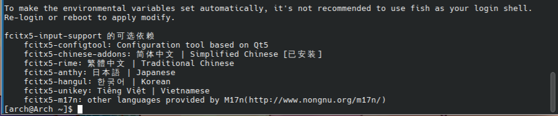

然后我们就能在 `设置-键盘-虚拟键盘` 中找到我们所用的输入法，根据桌面环境选择 (不知道选哪个就选 `fxitx5`) 后，系统就会启动fcitx5，并在你第一次使用拼音输入时提醒你是否开启云拼音，建议开启。

安装好输入法之后，我们尝试输入，发现输入法的样式可能不对你胃口，想要配置一下。在右键输入法图标选择配置之后，我们会发现他弹出一个文件夹 ??? 可能这里你会一头雾水，但这正体现出了 Linux 系统的特点，所有的配置文件都可以由自己编写。

当然，现在自己编写配置文件可能稍有难度，因此，我们下载一个用来配置输入法的工具。

```bash
sudo pacman -S fcitx5-configtool
```

当然，我们也需要下载一些输入法的样式来选择，最基本的有

```bash
sudo pacman -S fcitx5-material-color
```

> 其余的不属于安装教程了，感兴趣的可以自己在网上搜索，我觉得 KDE 6.0 自带的皮肤就已经很好看了，不需要再花功夫去折腾了

## 3.5 浏览器

一个系统怎么能少了浏览器， Linux 系统下可以选择的浏览器有[特别多](https://zhuanlan.zhihu.com/p/444360617)

- `chromium` : `chrome` 的开源替代品
- `vivaldi` : 功能十分丰富，账号可以不用科学上网
- `firefox` : Linux 下优化效果很好的浏览器，但是插件商店很多无法访问
- `microsoft-edge` : 功能强大，但对 Linux 的优化不如其他浏览器，显卡工作时在打开浏览器的时候会卡
- `opera` : 全新的浏览器体验
- `brave` : 注重隐私的浏览器，速度快，但是需要科学上网

大家可以根据自己的喜好来选择。

```bash
sudo pacman -S chromium firefox vivaldi opera-beta brave-bin

# edge 不在官方的仓库中，需要使用 AUR 仓库来下载并构建

yay -S microsoft-edge-dev-bin
```

> edge 有 stable 版本和 dev 版本，可以看看自己的电脑能用哪个

> 对于需要下载的软件，我们可以到 Discover 商店中查找，选择自己喜欢的然后再通过命令行下载

## 3.6 媒体播放器

一个系统怎么能少了[图片](https://zhuanlan.zhihu.com/p/53902052)，[音频](https://blog.csdn.net/boazheng/article/details/113805561)和[视频](https://zhuanlan.zhihu.com/p/90043510)。

可供选择的太多，上面三个文章也只不过是用于参考，未列出的优秀软件还有很多，可以自己去探索一番。

我比较喜欢用 `gwenview` / `feh` 作为图片查看器， `Elisa` / `spotify` / `qmmp` 作为音乐播放器， `vlc` / `mpv` 作为媒体播放器。

```bash
sudo pacman -S gwenview feh
sudo pacman -S elisa qmmp
sudo pacman -S vlc mpv
yay -S spotify
```

其中， `vlc` 是KDE 桌面自带的。

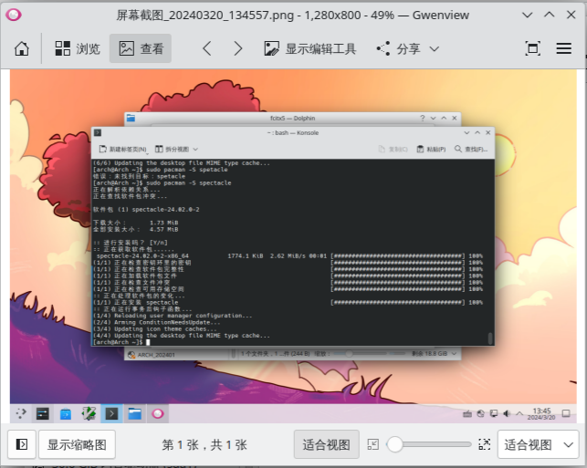

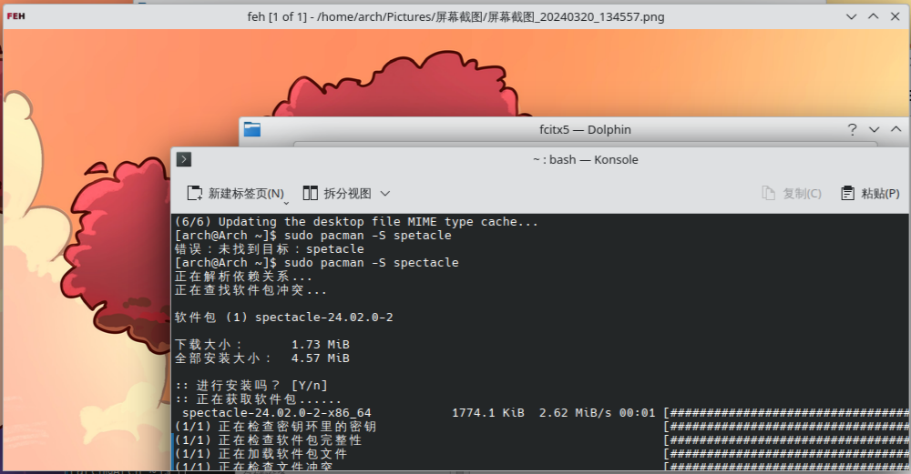

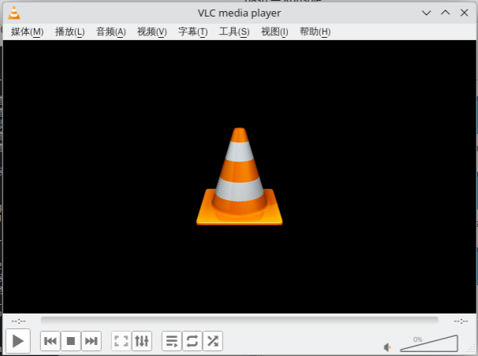

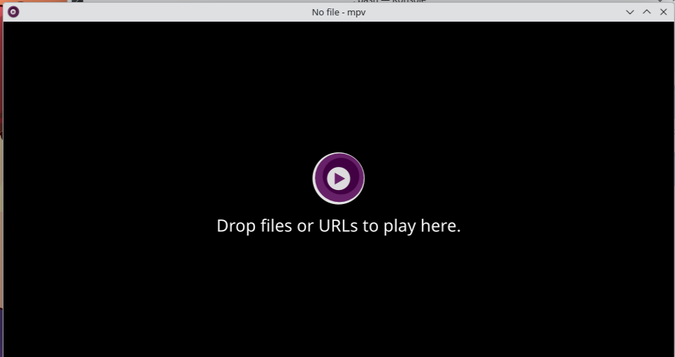

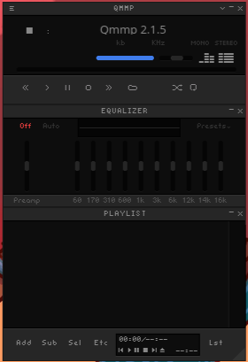


`spotify` 需要登陆才能使用。

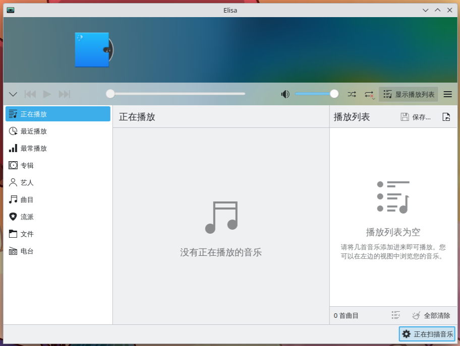

# 4 驱动

不管是哪个系统，总有一个难题，那便是安装显卡驱动。好在， Linux 为我们提供了方便的安装方式，我们可以直接从仓库中下载需要的显卡驱动。

```bash
sudo pacman -S nvidia
```

此时会默认下载最新的驱动，以及一些必要的组件。

然后，我们可以下载一个用来切换显卡的工具 : 

```bash
yay -S envycontrol
```

然后我们就可以使用命令 `sudo envycontrol -s <MODE>` 来切换模式 : 

```bash
sudo envycontrol -s integrated # 切换到核显
sudo envycontrol -s hybrid     # 混合模式
sudo envycontrol -s nvidia     # 独显
```

> 安装玩显卡驱动或者是切换工作模式时一定要记得重启 !!!

在显卡工作的时候，我们可以输入命令 `nvidia-smi` 来查看显卡的工作信息 : 

```bash
nvidia-smi
```

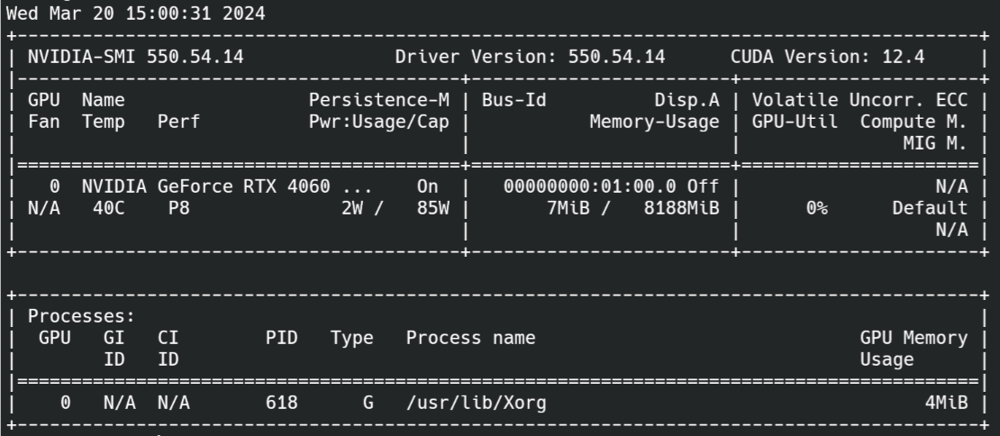

# 5 总结

在安装完桌面环境之后，我们可以通过 `neofetch` 来查看基本的系统信息 : 

```bash
sudo pacman -S neofetch

neofetch
```

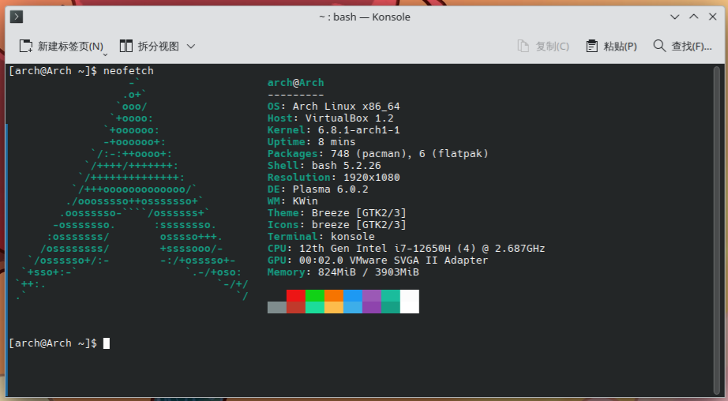

从上往下分别是
- 当前用户名@主机名
- 使用的操作系统及位数
- 使用的 Host
- 内核版本
- 更新时间
- 安装包个数及安装源
- 使用的shell
- 屏幕分辨率
- 桌面环境
- 窗口管理器 - WM - Windows Manager
- 主题
- 图标
- 终端
- CPU
- GPU
- 内存
- 终端的提示颜色

> 从这里我们也可以轻易地看出一共有多少显卡在工作，比其他五花八门的方法更加直观准确。每多一个显卡就会多一行 GPU 信息

可以看到，我们自己安装的 Arch 是十分精简的，开机内存仅占用不到 1G ，和 Windows 是完全不同的。而我们的系统功能却是十分完备的，该有的一点不少。

[下一节](03%20基础配置和工具.md)，我们将讲讲如何安装开发工具，配置开发环境，以及一些有用的工具软件。