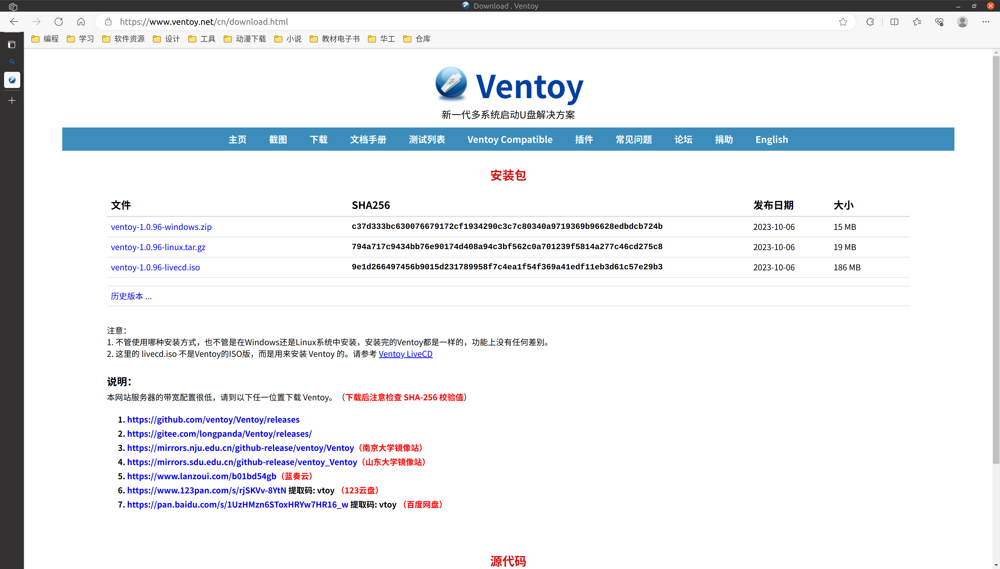
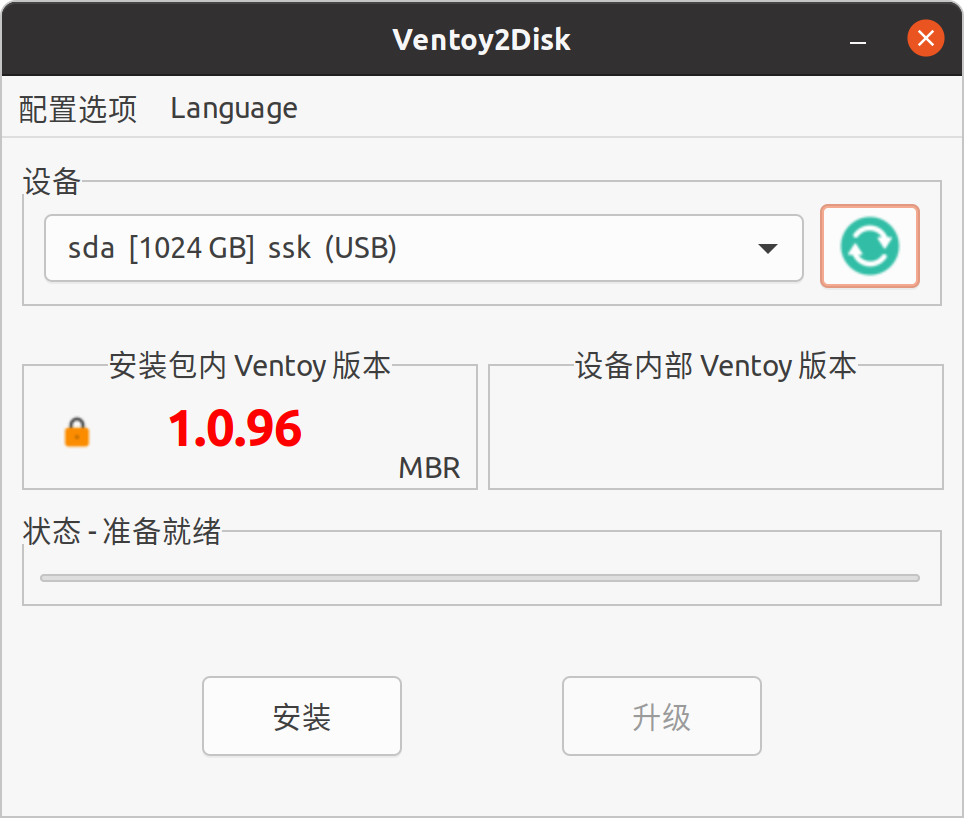
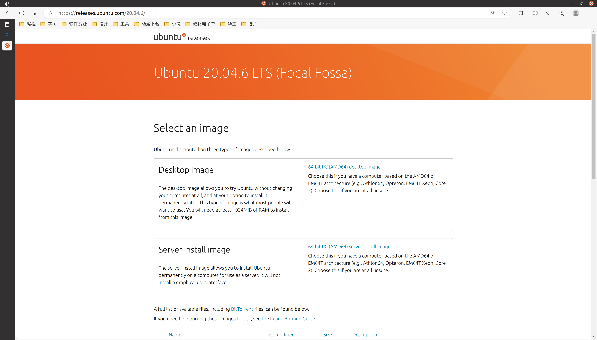

Linux 系统的安装对于想要用他来新手来说可以算是噩梦，不过，我们有多种摸鱼方式来安装，以下，我将通过 `ubuntu-20.04` 版本来演示 Linux 系统的安装方法

# 0.1 启动盘的制作

想要安装一个系统，必不可少的工具便是 **启动盘** ，可以说，如果没有启动盘，我们将无法 ~~自由自在地把电脑搞崩~~ 。而启动盘的选择也有许多，这里，我推荐使用 `ventoy` 作为镜像管理的工具

## 0.1.1 下载 `ventoy` 

我们可以直接从官网——[ventoy](https://www.ventoy.net/cn/) ，选择对应的操作系统的压缩包来安装

下载好并解压后，我们直接运行目标文件来进行安装的操作

> [!attention] ATTENTION
> 一定要仔细检查选择的盘，并且提前做好备份，因为安装 ventoy 会先 **将整个磁盘格式化！**

当安装好之后，启动盘就算制作完成了

# 0.2 下载官方镜像

## 0.2.1 官方渠道

同样，我们到官方网站中下载镜像——[ubuntu](https://cn.ubuntu.com/) ，我们选在查看历史版本的镜像——[ubuntu 20.04 LTS](https://releases.ubuntu.com/20.04.6/) ，并下载 **64位桌面镜像** 

下载完成后的镜像只需要 **拷贝** 到刚刚制作好的启动盘就完成了

## 0.2.2 其他镜像源

如果在官方网站下载速度较慢，也可以在其他源下载

- [Linux](https://www.linux.org/pages/download/)
- [清华镜像源](https://mirrors.tuna.tsinghua.edu.cn/)
- [中科大镜像源](https://mirrors.ustc.edu.cn/)

# 0.3 开始安装

Ubuntu 的安装很简单，只需要 **合理地分区** ，并按引导走就好了。

对于分区，新手建议如下分区：

- 主分区 ext4 `/` 100G
- 逻辑分区 `EFI` 512M
- 逻辑分区 `Swap` 2\*物理内存
- 主分区 ext4 `/home` 100G 
- 主分区 ext4 `/opt` 50G

> [!attention] 
> 虽然许多依赖以及二进制文件都安装在 `/usr` 目录下，但是 **不能将 `/usr` 单独挂载在一个分区上** ，不然会导致无法正常启动，出现找不到 `init` 文件的情况

## 详细安装教程

