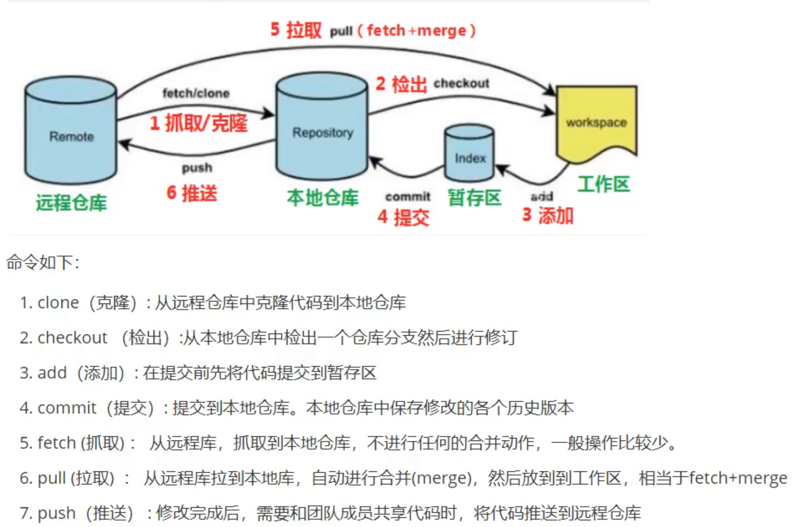
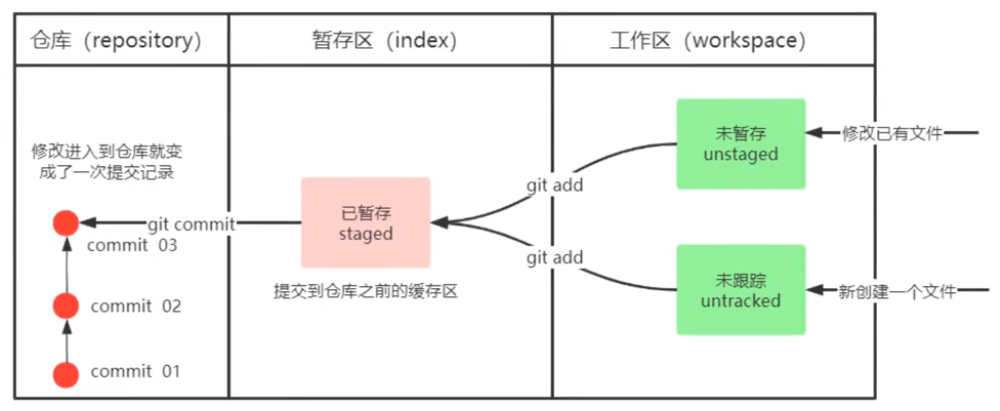
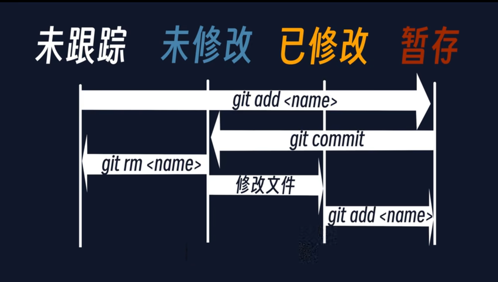
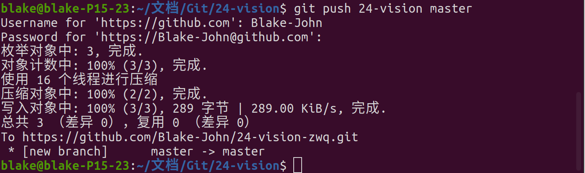
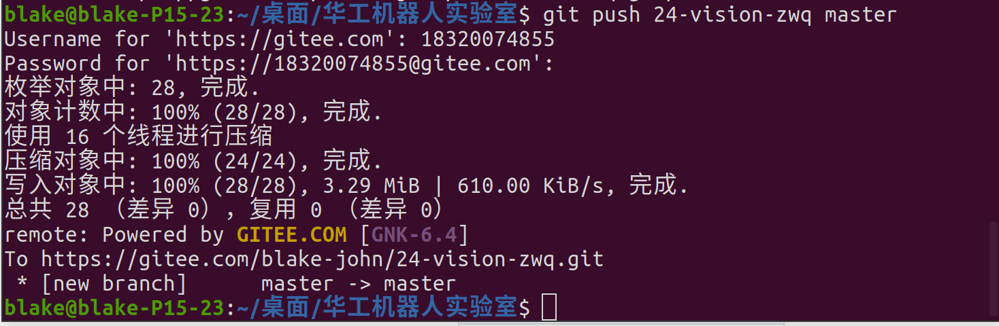
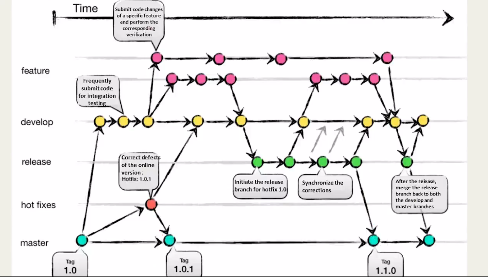
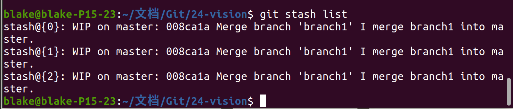
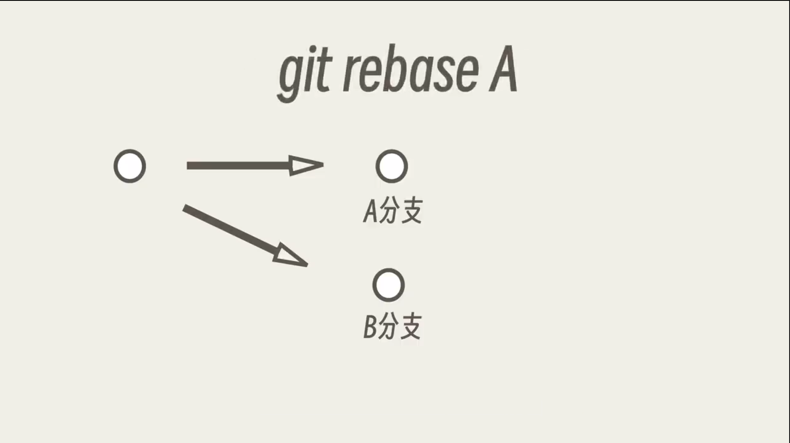
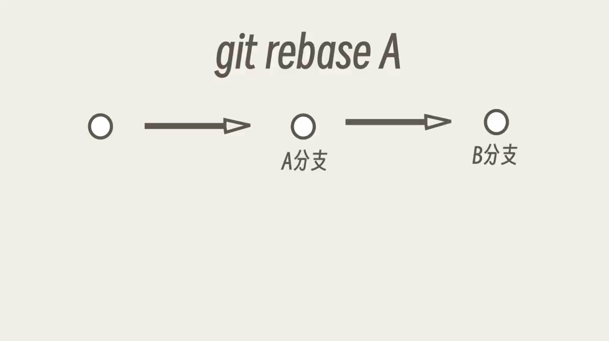

# 什么是Git？
* 免费开源的分布式版本管理系统
# Git的开发场景
* 代码备份
* 代码还原
* 协同开发
* 追溯问题代码的编写人和编写时间
# Git的基本工作流程


# 安装Git

```bash
sudo apt install git-all
```

# Git的使用
## 1.基础配置
### 1.1 身份说明

* 配置姓名

```bash
git config --global user.name "[姓名]"
```

* 配置邮箱

```bash
git config --global user.email [邮箱地址]
```

* 显示全局配置信息

```bash
git config --global -l
```

*该配置只是说明性配置，与注册登陆不同*

### 1.2 创建和初始化仓库

1. 创建自己的仓库：
	* 创建或打开想要作为仓库的文件夹
	* 在文件夹中打开终端
	* 使用初始化命令

```bash
mkdir -p ~/文档/Git/1
cd ~/文档/Git/1
git init
```

2. 设置文件跟踪（将文件设置为暂存状态）
	* 只有将文件设置为跟踪才能写入版本信息中
	* 文件被设置为跟踪将会永远被跟踪
	* 可以通过命令将跟踪删除

```bash
git add [文件]
# 设置文件被git跟踪

git rm [文件]
# 移除文件

git rm --cached [文件名]
# 保留在目录中但是不被跟踪
```

3. 修改文件后的设置
	* 文件被修改后可以将其设置为缓存状态
	* 也可以将文件直接设置为修改后的版本
	* 最后可以对仓库提交此次修改

```bash
git add [文件名]
# 将修改后的文件加入缓存

git reset HEAD [文件名]
# 取消缓存状态，将修改后的文件写入仓库

git commit
# 从缓存中提交此次修改
```

> 文件不同状态之间的转化示意图如下





### 1.3 git commit 的使用

* 每次提交都需要写一个提交信息

```bash
	git commit
	# 进入编辑器内部对提交说明文件进行编辑

	git commit -m [说明内容]
	# 可以直接将说明内容写入文件，比较简洁

	git commit -a
	# 可以直接提交修改后或删除后但未添加到暂存的文件
	# 但是从未被跟踪的文件不会被提交

	git commit --amend
	# 当你提交了代码，之后又有新的改动，不想重新创建一个commit，就可以用`--amend`将新的内容提交到上一次commit中
	git commit --allow-empty
	# `--allow-empty`允许提交时说明为空
```

```ad-attention
中断编写提交信息将会中断提交,空提交信息也会中断提交
包括不保存，强制退出，按下 `ctrl` + `Z` (没有给你撤销的功能)
```

* 取消提交

```bash
git reset HEAD --soft
# 撤销提交，注意，不能取消第一次提交
```

### 1.4 查看文件状态
#### git status
* 查看哪些文件被修改，哪些文件暂存，哪些文件提交，即查看当前仓库下文件的状态

```bash
git status
```

#### git diff
* 查看文件修改的详细信息，第几行第几个字母被修改
 
```bash
git diff
```

#### git log
* 查看文件的提交记录

```bash
git log
# 该命令会展示作者、时间、以及提交时写入的日志
# 故提交时一定要认真编写提交信息

git log --pretty=oneline
# 把每一次提交的信息在一行中展示

git log --graph
# 以图形化展示日志

git log --abbrev-commit
# 使得输出的commitid（即版本号/哈希值）更短
```

> 对于经常使用的长命令，我们可以为一整串命令设置一个别名，如：
> `git config --global alias.logs "log --abbrev-commit --graph"` 
> 这样，我们就能够通过简短的命令 `logs` 来代替一长串命令

### 1.5 设置文件忽略
* 有的时候一些文件并不需要列入Git的管理，也不需要他们总是出现在未跟踪文件列表，如一些日志文件，编译的临时文件。
* 这时我们可以在工作哦目录中创建一个名为`.gitignore`的文件，列出要忽略的文件模式，例如：

```bash
# dir 不需要提交的目录
/modules

# file 不需要提交的文件
[文件名]

# log 不需要提交的以后缀结尾的文件
*.log

# 该文件支持正则表达式，可以任意列举不想提交的文件
# 且该文件支持注释，# 后面跟着的就是注释
```

### 1.6 查看提交的文件

1. 可以在终端中列出所有提交的文件的内容

```bash
git show
```

2. 可以列出所提交的文件

```bash
git ls-files
```

## 2.远程仓库
### 2.1 常用的远程仓库有哪些？

* Github：开源项目仓库
* Gitee：国内的软件项目托管平台
* GitLab：需要自己搭建，企业常用

### 2.2 建立仓库的公私密钥

* 可以通过输入账号和密码进行鉴权，但是一般我们通过配置公私钥对来鉴权
* 也可以通过令牌来鉴权

> 如何登陆到Github(鉴权)？
> 可以创建一个令牌，然后就可以使用用户名及令牌密码登陆
> > Developer settings > Personal access tokens > Tokens(classic) > Generate new tokens(classic)
> 
> 如何登陆到Gitee(鉴权)？
> > 可一创建一个令牌，但是用于鉴权的用户名并非你的用户名，而是注册时的手机号





### 2.3 建立本地仓库并链接远程仓库

1. 将远程仓库链接到本地仓库

```bash
git remote add [远程仓库名] [远端仓库链接]
# 将远端仓库链接到本地，仓库名可以不同

git remote rename [原名] [新名]
# 重命名链接本地的仓库
```

2. 查看远程仓库

```bash
git remote -vv
# 该命令会展示目前有的远程仓库的本地名称
# -v 会展示一定的信息
# -vv 会展示最详细的信息
```

### 2.4 将本地仓库推送到远程仓库

1. 通过 URL 进行推送

```bash
git push [仓库名] [分支名(默认为 master)]

git push -u [仓库名] [分支名]
# -u 可以记录推送记录，下次可以直接使用 `git push`来推送到第一次推送的位置及分支

git push -f --set-upstream [远程仓库名称] [本地分支名]:[远程分支名]
# -f 是强制推送，直接覆盖上次推送
# --set-upstream 表示推送到远端的同时建立本地分支和远端分支的关联关系
# 再推送的时候就可以直接`git push`
# -u 即为 -set--upstream
```


2. 可以通过ssh进行推送
	1. 进入ssh文件中
	2. 生成密钥

```bash
cd [目录]
ssh-keygen -t rsa -b 4096 -C "[此处写评论，建议写邮箱]"
# -t 指定密钥生成的算法
# -b 指定密钥的大小
# -C 添加评论，建议写自己的邮箱
```

3. 生成密钥之后将密钥的内容塞入`SSH keys`中，就可以通过ssh访问仓库

### 2.5 取消远程仓库和本地仓库的链接
```bash
git remote remove [与远程仓库链接的本地仓库名]
# 执行该命令之后，会取消本地仓库与远程仓库的链接
```

### 2.6 本地仓库链接多个远程仓库

* 通常用于多端备份
1. 直接在工作区中再添加一个仓库并链接到另一个URL/SSH
	* 这样做每次`push`和`pull`都需要分开操作，每次需要指定目标仓库
2. 同一个仓库链接不同URL/SSH
	* 这样每次`push`和`pull`不需要指定目标仓库，而是将该仓库同时提交到两个远端或者将两个远端的内容拉取到本地仓库

```bash
git remote set-url -add [本地仓库名] [URL/SSH]
```

## 3.分支

* 每次生成一个新版本的时候都会生成一个提交对象，每个提交对象就有一个独一无二的哈希值
* 分支就是一个包含哈希值的文件，可以理解为指向对象的指针
* 我们可以在一个提交对象上生成多个分支
* 在初始化仓库的时候，就会生成一个master分支，每次提交分支都会向前移动



### 3.1 查看分支

```bash
git log --all
# --all 会展示所有分支的所有信息
# 输出：
# commit [哈希值] (HEAD -> [分支],[远程仓库]/[远程仓库的分支])
# HEAD 后面表示我们现在所在的分支
# 还会输出此时远程仓库所在的分支

git status
# 会直接输出所在的分支

git branch --list
# 列出仓库中所有的分支,并显示当前所在的分支

git branch -vv
	# 查看本地分支与远端分支的关系
```

### 3.2 创建并切换分支

```bash
git branch [分支名]
# 创建分支

git checkout [分支名]
# 可以切换分支

git checkout -b [分支名]
# 可以快速创建并切换到目标分支
```

### 3.3 删除分支

* 分支过多或已经失效的分支可以选择删除
* 删除请三思而后行

```bash
git branch -d [要删除的分支名]
# 删除分支，但是删除时需要做各种检查

git branch -D [要删除的分支名]
# 不做任何检查，强制删除分支
```

### 3.4 合并分支

```bash
git merge [要合并的分支]
# 注意！
# 该方法会将目标分支合并到当前工作的分支中
# 该方法会将目标分支覆盖到当前分支中，最后留下单独一份文件，即当前分支的文件会被覆盖
# 并且在查看日志的时候会将其合并的信息显示出来

git log --merge
# 只展示合并的分支
```

> 在合并分支的时候会遇到同一个文件不同内容的冲突，这是该如何解决？
> > 1.处理文件中冲突的地方
> > 2.将解决完冲突的文件加入暂存区
> > 3.提交到仓库

### 3.5 拉取远程仓库中的分支

```bash
git fetch [远程仓库名字] [分支名]
# 可以抓取链接到本地的远程仓库中的分支
# 但此时得到的是一个新的分支，不再当前工作目录中
# 如果不制定远端名称和分支，则抓取所有分支

git checkout [远程仓库分支]
# 通过该命令可以直接将远程仓库抓取的分支保存到本地
# 确切地说，应该是对远程仓库的分支建立一个跟踪分支
# 相当于以下代码
git checkout -b [本地分支名] [远程仓库名]/[远程仓库分支名]
git checkout --track [远程仓库名]/[远程仓库分支名]
```

^32d11e

## 4.克隆、抓取、拉取
### 4.1 克隆

* 克隆用于将远端仓库整个复制到本地

```bash
git clone [URL] [克隆到本地时的仓库名]
# 克隆是克隆一整个仓库
```

### 4.2 抓取

* 抓取是将远端仓库中的更新抓取到本地，不会进行合并

```bash
git fetch [远程仓库名字] [分支名]:[临时分支]
# 得到的远程分支是一个新的版本，而本地分支仍停留在原先版本
# 这时要获得最新的版本，则需要将本地当前的分支与抓取的远程分支进行合并
git merge [目标分支名]

# 如果不指定远端名称和分支，则抓取所有分支
```

### 4.3 拉取

* 拉取相当于`fetch`+`merge`，将远程分支抓取到本地后与当前分支进行合并
* 由于会直接合并，故拉取的时候要谨慎，可以用上面[[#3.5 拉取远程仓库中的分支]]的方法进行平替

```bash
git pull [远程仓库名] [远程分支名]
# 拉取指令会将远端仓库的修改拉取到本地并自动进行合并
# 如果不制定远端名称和分支，则拉取所有分支并更新当前分支
```

## 5.贮藏

* 当你正在某个分支写代码时，突然被告知另一个分支中某个地方有bug，需要紧急修复
* 此时你无法切换分支，因为你还在工作目录中修改文件，你的工作目录是“脏”的，不“干净”
* 你当然可以先将代码提交上去，再切换分支，但并不推荐
* 这个时候就可以先将我们写的代码贮藏起来

```bash
git stash
git stash push
# 将修改的文件暂时储存起来
```

* 等你另一个工作完了之后，可以切换回原来的分支，并将贮藏起来的文件拉出来继续编辑
* 可以对同一个文件贮藏多次，这样可以选择要恢复哪一次贮藏的文件
* 但是应用贮藏版本的前提是当前分支中没有修改的文件，即分支应该“干净”才能应用贮藏

```bash
git stash list
# 列出所有贮藏版本

git stash apply stash@{[版本号]}
# 将其中的某个贮藏版本应用于但前分支
# 若只有一个版本，则可以直接
git stash apply

git checkout -- [文件名]
# 将文将恢复成未修改的版本

git stash pop
# 可以直接将最后一次贮藏恢复
# 但是会直接将最后一次贮藏删除
```



* 在用完stash后该如何删除多余的贮藏？

```bash
git stash drop stash@{[版本号]}
```

## 6.重置/版本回退

* 当发现提交的文件中有严重错误时，可以将提交撤销与重置
* 首先我们可以查看提交的历史记录

```bash
git reflog
# 查看已删除的提交记录
# 查看之前所有的提交操作
```

* 然后我们可以通过以下操作重置/回退

```bash
git reset HEAD --soft
# 将当前提交重置

git reset HEAD --soft
# 回到上一次提交
# head 指的是当前的分支
# ~ 为祖先的引用，意思是将上一次提交撤销
# ~ 后可加数字,表示倒数第几次
# --soft 指的是只撤销提交，不清除文件的暂存状态
# 若不添加 --soft 则会清除文件的暂存状态，但是上次文件的修改并没有被撤销
```

> 以上只是退回上一次的提交版本，但是本地的文件仍未被修改,
> 而以下操作则会将本地文件也退回上一个版本

```bash
git reset head~ --hard
# --hard 不光把暂存取消，而且把之前文件修改的内容也撤销
# 相当于彻底退回上一个版本

git reset --hard [commitID]
# 可以根据版本号（哈希值）来退回到特定的提交版本(推荐)
```

## 7.rebase

* 相当于把分支搬家，可以把当前分支移动到另一分支上

```bash
git rebase [目标分支]
# 将当前分支转移到目标分支上，相当于把当前分支的内容提交到目标分支中
# 即对目标分支进行一次提交，而提交的内容不是目标分支中的文件，而是当前分支的文件
# 并且会删除当前所在分支
```





> 变基操作可以整理提交的分支目录结构，让自己的提交更美观
> 但是要注意：
> 	若你的分支已经提交到远程仓库中，别人可能拿你的分支进行二次开发，若此时再变基，则会使别人开发中的项目丢失
> 	举个例子：你盖了一层楼，别人在你这层楼的基础上继续盖第二层楼，若你此时进行变基操作，则别人盖第二层楼的时候就会发现，第一层楼没了

* rebase还有一个重要的交互功能

```bash
git rebase -i head~[选择要修改的提交的数]
# 可以选择对前几次提交变基，即对前几次修改进行修改
```

## 8.彻底删除本地仓库

* 可以保留文件，但是删除仓库记录，也可将所有文件删除
* 删除前请三思而后行

```bash
ls -ahl
# 列出所有文件的详细信息，包括隐藏文件
rm -rf .git
# 删除仓库的管理文件，这样，git便不再管理该仓库

rm -rf [仓库名]
# -r 用于递归删除每个目录及其内容
# -f 用于没有提示的情况下强制删除不存在的文件和参数
```

# VSCode中Git的使用
## 1.下载插件

- 要在 `VSCode` 中使用 `Git` 需要下载以下插件


## 2.读懂命令手册

- `GitLens` 内置了十分丰富的 **UI界面** 的命令，可以通过菜单的选择来进行代码提交的操作
- `Gie Graph` 通过图表的形式生动地展示出了提交记录
- `Git History` 可以记录你的提交的历史信息