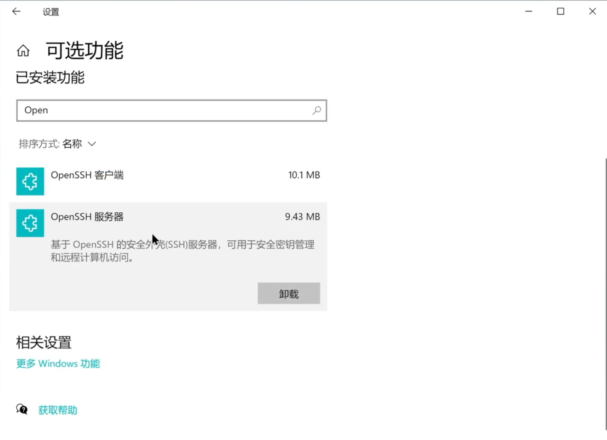
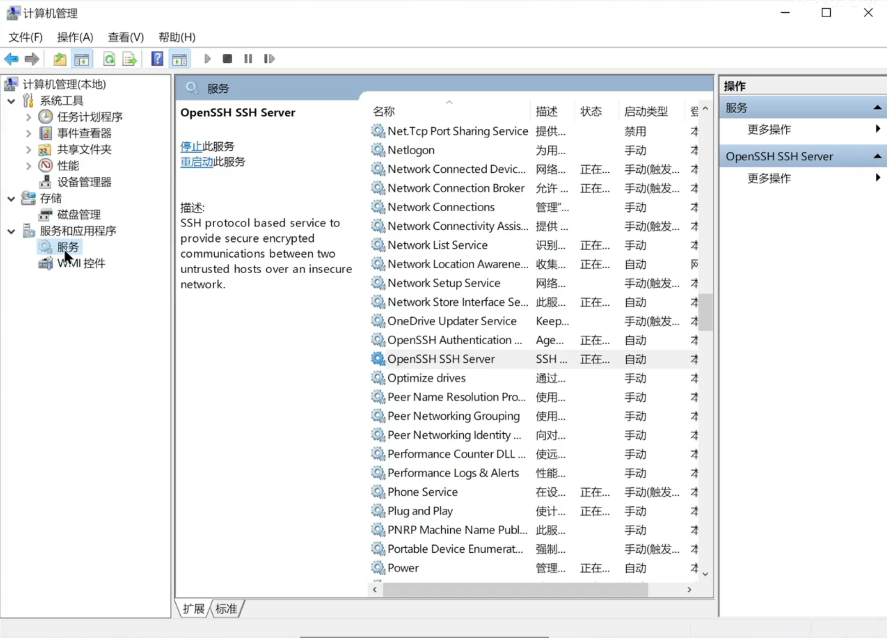
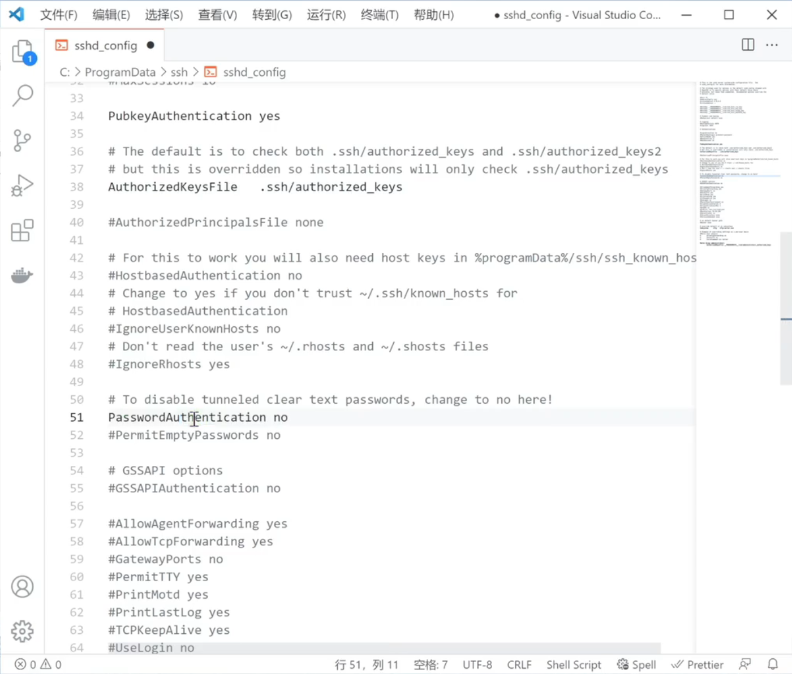
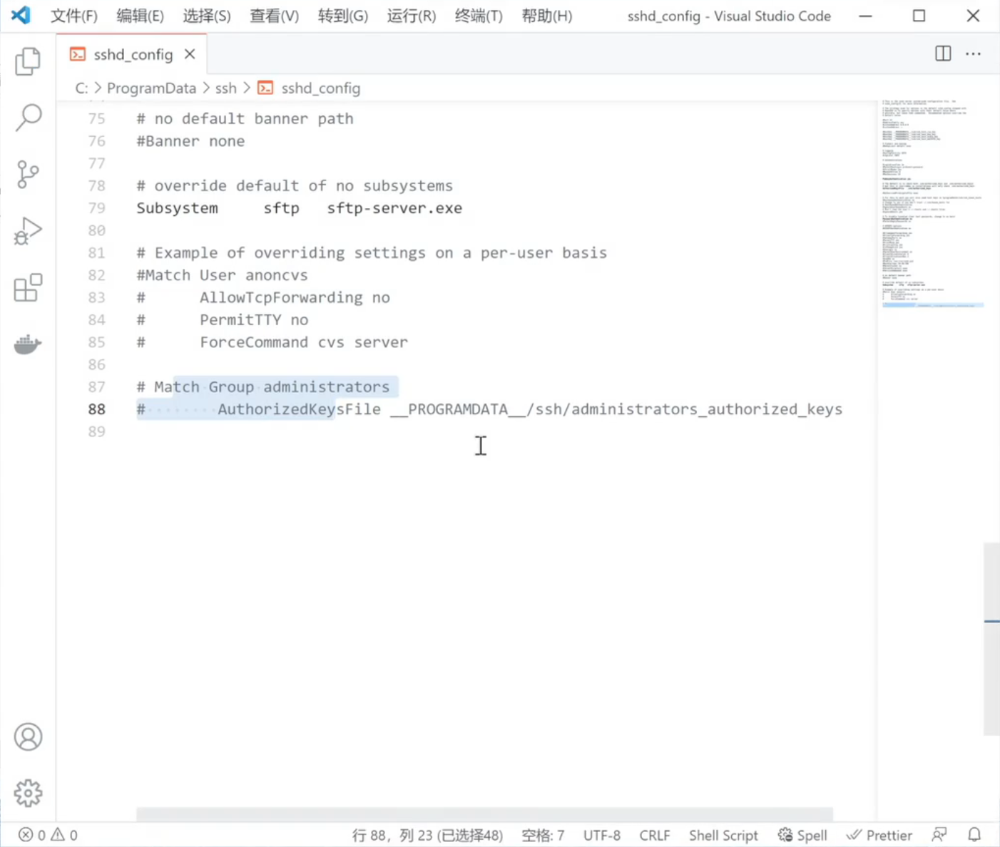

# 2.1 控制目标端的配置
1. 安装以下服务


2. 启动服务
	* 在计算机管理中找到该服务
	- 

	* 右键启动该服务
	* 双击后将服务`启动类型`设置为`自动`
	* 查看服务是否启动成功
```powershell
	# 打开 Windows PowerShell
	Get-Service -Name *ssh*
```

```ad-tip
若`ssh-agent`和`sshd`的`Status`都处于`Running`状态则表示服务启动成功

```
3. 查看SSH服务器是否开始监听22号端口
```powershell
	netstat -an | findstr :22
```

```ad-tip
若为`LISTENING`则正在监视

```
4. 查看电脑的IP地址
```powershell
	ipconfig
	# 记录 IPv4 地址
```

# 2.2 连接Windows主机
## 1.直接连接
```powershell
	ssh [microsoft_id]@[IPv4]
	# 微软id可以尝试用户名或者是邮箱
	# 为了保证邮箱中的@不与命令中的@冲突，可以用引号括起来
	ssh "2991151588@qq.com"@[IPv4]
```

## 2.密钥连接
* `ssh-copy-id`对windows可能会失效
* 所以我们应该自己将公钥信息写入系统中
1. 在`~/.ssh`中新建`authorized_keys.txt`文件
2. 将公钥拷入该文件中
3. 将后缀`.txt`删除
4. 转到`C:\ProgramData\ssh`
5. 通过vscode打开`sshd_config`文件
6. 将`第34行`，`第38行`，`第51行`**取消注释**

7. 将`最后两行`**注释掉**

8. 记得保存！！！
9. 重新启动`OpenSSH SSH Server`服务