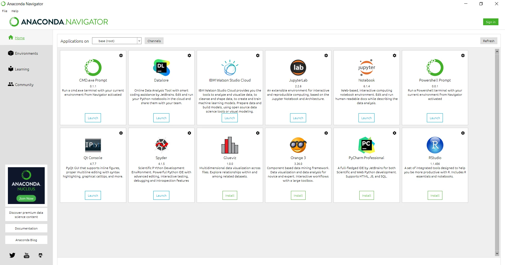
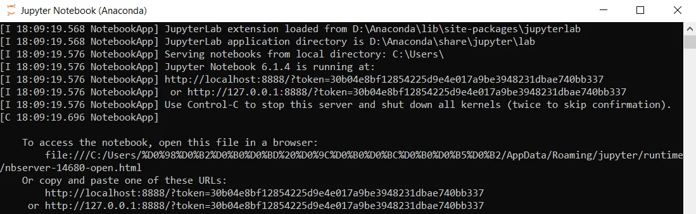
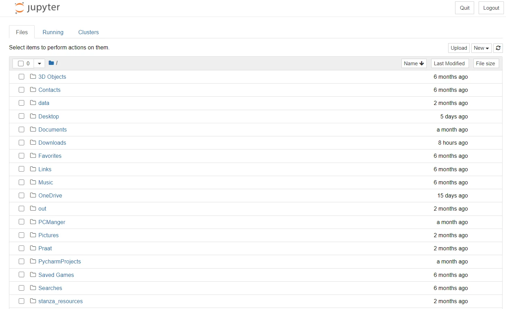
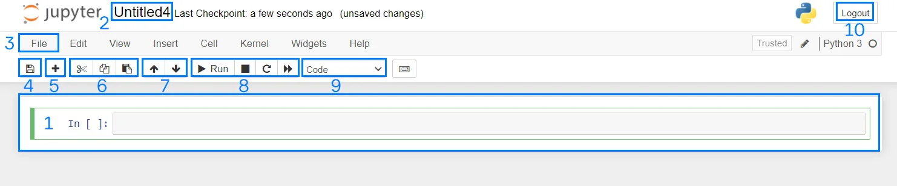
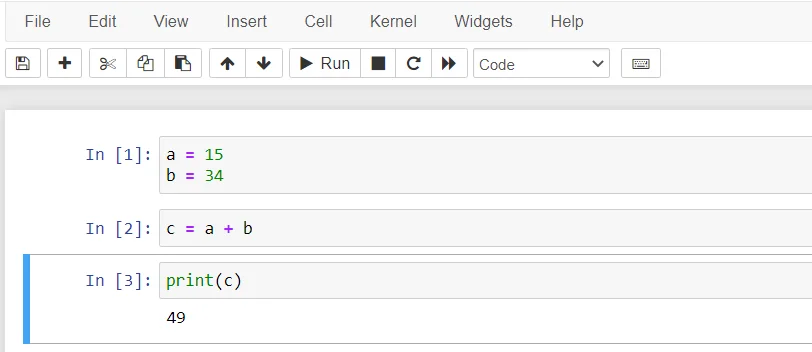
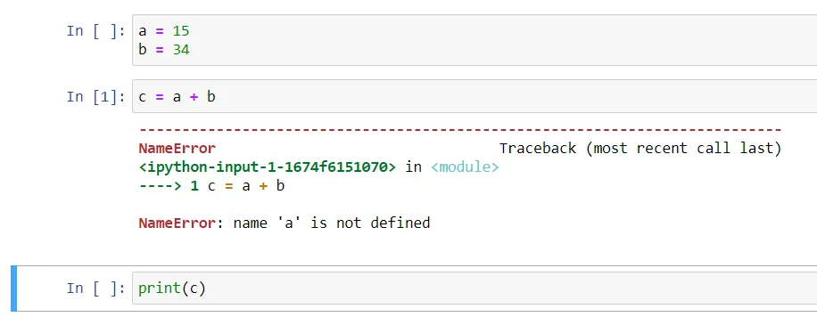
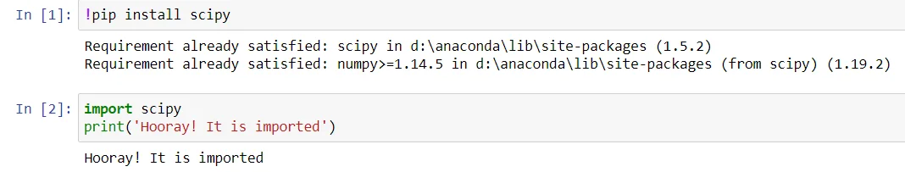

So far, we have been interacting with Python through the console, PyCharm, or other IDEs. In this topic, we are going to cover another coding environment called **Jupyter Notebook**.

It is a powerful tool for **data science projects**. The Jupyter name comes from the main supported languages: **Ju**lia, **Py**thon, and **R**.

It is an app that allows you to **make programs in your browser**.

Jupyter runs either locally on your computer (no Internet connection is required) or on a remote server. It lets you **execute the code in small chunks**, which is really good for debugging and for showing your results to others.

You can even **add text to explain what your code does** ! That's why so many data scientists and programmers use it to share their work with collegues. In this topic, we will learn how to set up Jupyter Notebook on your local machine and how you can use it in your projects.

# 01 Installation

You can install Jupyter Notebook in two ways:

1. Through `pip`:

```python
pip install jupyter
```

2. Or through [Anaconda](https://docs.anaconda.com/anaconda/install/) that conveniently installs Python, Jupyter Notebook, Orange, and other commonly used tools for data science. To do it with Anaconda, please, follow these steps:
    
    - Download and install Anaconda, following the instructions on the download page.
    - Run it. You will see this page:
    > 
    - Find Jupyter Notebook and install it.
    - Off we go!

# 02 Usage

## 2.1 Start

If you used `pip`, type `jupyter notebook` in the Terminal or in the Command prompt. If you installed it with Anaconda, click on the program shortcut. You will see the following lines.



It creates a local web server, and after that, all you need to do is copy and paste the URL to your browser to access the app. You will see the main page and start it **from the working directory** .



To create a new notebook, select `'New' > 'Python 3'`. You can find the _'New'_ button in the upper-right part of the page. Under the _'Notebook'_ tab, you can see available **kernels**.

**Every notebook has a kernel**, an execution environment associated with it. The kernel runs the code in a specific programming language (R, Python, etc.). It also provides access to various libraries, performs the computation, and produces the results.

This kernel is a part of the global **IPython** kernel. IPython (Interactive Python) is a shell that provides additional command syntax, code highlighting, and auto-completion for Python. You can also use notebooks for many other languages to install additional kernels: **IRkernel, IJulia**, etc.

## 2.2 Interface

Let's take a look at the Jupyter Notebook interface. In this case, a **notebook** is a document that contains **pieces of code** as well as various text elements (paragraphs, links, and so on).



We highlighted the main parts of the interface. Let's have a closer look at them.

1. The main building unit of a notebook is a **cell**. That's where we can **write our code or add any text information**. Each cell can **be executed independently**.
    
2. By default, a notebook bears the `Untitled` name, but you can easily change it by clicking on it.
    
3. The `File` button allows you to copy, save, rename or download your file. Mind that there are a lot of extensions that can save your notebook. We will focus on two of them: `.py` and `.ipynb`. The first one is a standard extension of Python files that can be run with the Python console. The second extension, `.ipynb`, stands for **IPython Notebook**; it is a default notebook extension.
    
4. The `Floppy disk` symbol allows you to save the notebook.
    
5. The `Plus` symbol **adds cells**.
    
6. The next three buttons allow you to **remove, copy, or insert a cell**.
    
7. The `Up` and `Down` arrows move a cell.
    
8. By pressing the next set of buttons, you can run a cell, interrupt the kernel, or restart the kernel. For running a cell, you can also use `Shift+Enter` . You can find more information about shortcuts in the [Documentation](https://jupyter-notebook.readthedocs.io/en/latest/examples/Notebook/Notebook%20Basics.html?highlight=keyboard#Keyboard-Navigation). Interrupting the kernel is useful in case there's an infinite loop. Restarting allows you to clear all variables.
    
9. You can also change the type of the cell by clicking on the _Code_ button. There are four types: **code**, **markdown**, **raw NBConvert**, and **heading**. If you need to change the title of your notebook, use heading. The markdown cell is used for writing a text and transforming it with the special markdown syntax. You can read about it in [the Markdown Guide](https://www.markdownguide.org/basic-syntax/). The Raw NBConvert type is used for unmodified content.
    
10. Once your code is ready, press the _Logout_ button in the upper-right corner of the page. Your session will be stopped.

## 2.3 Example program

Let's discuss the programming pipeline in more detail. Suppose, we need to write a basic calculator and sum up two integers. Below is an example of this program (screenshots were cropped for readability purposes) :



The results are printed right after the cell. Of course, you can write everything in one cell as well.

By the way, have you noticed **the numbers in the square brackets** to the left of the cells? They **show the order in which the cells were executed**. This order is pivotal in Jupyter Notebook. Let's say you run the middle cell first. What is going to happen in this case?



It will produce an error since we haven't set our variables! Please, **pay attention to the execution order**.

We can also **install libraries with Jupyter Notebook**. You can **execute terminal commands** directly in your Jupyter Notebook. To do so, put an exclamation mark `!` at the beginning of the command. This will tell the app that it is not a Python command. Wonderful, isn't it?



> [!attention] 
> We **can't choose the virtual environment if we use the web server of the jupyter** !

