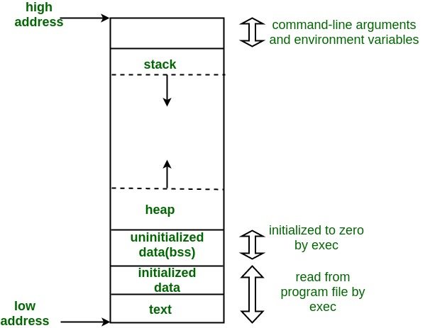

# 01 Create the instant

We have two way to create an instant : 

- Create the instant **on stack** 
- Create the instant **on heap** 

## 1.1 What are stack and heap ? 

Stack and heap are the way to manage the memory.

### 1.1.1 Memory Layout

The stack will **allocate the memory from higher to lower**, and **free the memory from lower to higher** , while the heap will **allocate the memory from lower to higher** and **free the memory by order we want or default** : 



A typical memory representation of a C/C++ program consists of the following sections.

1. Text segment  (i.e. instructions)
2. Initialized data segment 
3. Uninitialized data segment  (bss)
4. Heap 
5. Stack

#### 1. Text Segment

The text segment is also known as **code segment** or **simply as text** . It contains the executable constructions that control the program to run.

The text segment may be placed under the stack and heap, so as to **prevent stack or heap overflows from overwriting it** .

#### 2. Initialized Data Segment

The initialized data segment stores the data which is **global variables or static variables and has been already initialized** .

For example, if you initialize `int i = 10;` **before** main function or `static int j = 2;` **in** main function, the variables `i` , `j` will be stored in this segment.

#### 3. Uninitialized Data Segment

The uninitialized data segment is also known as **bss** segment. All the **global variables or static variables** that **are initialized to zero** or do **not have explicit initialization** in source code will be stored in this segment.

For example, if you initialize `int i;` **before** main function or `static int j;` **in** main function, the variable `i` , `j` will be stored in this segment.

#### 4. Example

Let's see the code below : 

```C++
#include <stdio.h>

int main ()
{
	return 0;
}
```

We use `size` to check the binary file : 

```bash
g++ 18.new.cpp -o 18.new
size 18.new
```

Then, we have : 

```
text    data     bss     dec     hex filename
1175     560       8    1743     6cf 18.new
```

We can know that the data in the program `18.new` takes up 560 bytes and the bss take up 8 bytes. If we add some variables : 

```C++
#include <stdio.h>

int global = 10; /* Uninitialized variable stored in bss*/

int main(void)
{
	static int test;
	return 0;
}
```

Then the output of `size` is : 

```
text    data     bss     dec     hex filename
1175     564      12    1751     6d7 18.new
```

We can find that the **data increases by `4 bytes` and bss increases by `4 bytes`** . The increased size is the size of an `int` type variable.


### 1.1.2 Stack

The allocation happens on **contiguous blocks of memory**. We call it a stack memory allocation because the allocation happens in the function call stack. The size of memory to be allocated is known to the compiler and **whenever a function is called**, **its variables get memory allocated on the stack**. And **whenever the function call is over, the memory for the variables is de-allocated**. This kind of memory allocation is also known as **Temporary memory allocation**  because **any value stored in the stack memory scheme is deleted as soon as the method complete.**

> [!note] 
> The variables on the stack allocate the memory from **higher address to lower adderss** .

### 1.1.3 Heap

The memory is allocated **during the execution** of instructions written by programmers. It is called a heap because **it is a pile of memory space available to programmers to allocate and de-allocate.**  Heap memory allocation **isn’t as safe as Stack memory allocation** because the **data stored in this space is accessible or visible to all threads**. If a programmer does not handle this memory well, **a memory leak can happen in the program**.

## 1.2 How to create instant on stack and heap ?

To create instants on the stack, we just do what we want to do. When a **function** or a **block** is called, the program will create a stack frame and queeze it into the stack. When the function or block **come to the end** , the stack frame will be thrown out and all the variable stored in the stack will disappear.

```C++
#include <iostream>

int main () // mian function stack starts
{
	int a = 1; // variable in main function stack
	int b = 2;

	{ // block stack starts
		int c = 3; // variable in block stack
		int a = 2;
	} // block stack ends, `c`, `a` will be deleted
} // main function stack ends, `a`, `b` will be deleted
```

To create instants on the heap, we need to use `new` keyword. When we use the new keyword, we will allocate some memory and these memories are **controlled by ourselves** . We can decide when the memory will be de-allocate.

```C++
#include <iostream>

int main ()
{
	int* a = new int; // create `a` on the heap

	{
		int b = 1; // create `b` on block stack
		int* c = new int; // create `c` on the heap
		*c = b;
	} // end of block stack, `b` will be deleted but `c` still alive

	std::cout << *c << std::endl; // 1

	delete c;
}
```

# 02 `new` 

**The main purpose of `new` is to allocate the memory on the heap** .The function of `new` is to find out a memory that is big enough and then **return a pointer at that memory to us** . We can use the returned pointer to **manipulate the memory** because that memory belongs to us.

```C++
#include <iostream>

class Entity
{
	private : 
		const char* m_Name;

	public : 
		Entity () : m_Name ("Unknown") {}
		Entity (const char* name) : m_Name (name) {}
		const char* GetName () const { return m_Name; } 
}

int main ()
{
	int* a = new int (4); // init the `a` to be 4
	int* e = new Entity; // init the `e` with name "Unknown"
	int* e2 = new Entity ("Cherno"); // init the `e2` with name "Cherno"

	int* b = new int[4]; // allocate an array with 4 members

	delete a;
	delete e;
	delete e2;
	delete[] b; // to de-allocate the array, we need to add `[]` after delete
}
```

We should always remember to call `delete` function to de-allocate the memory when we do not use that pointer.