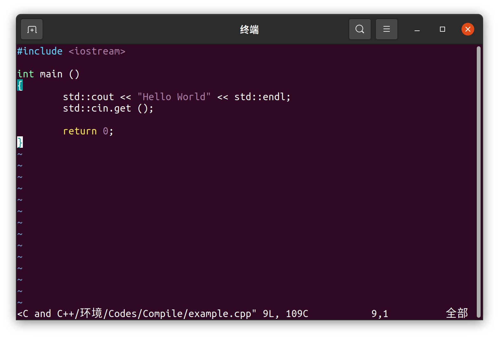
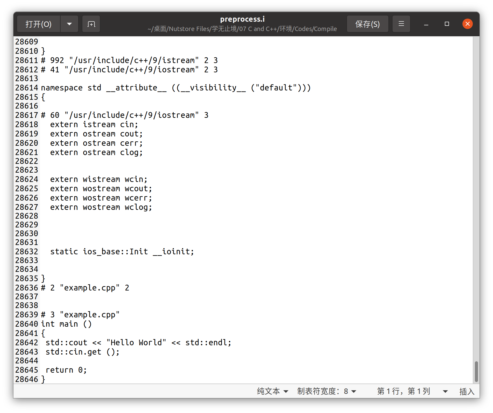
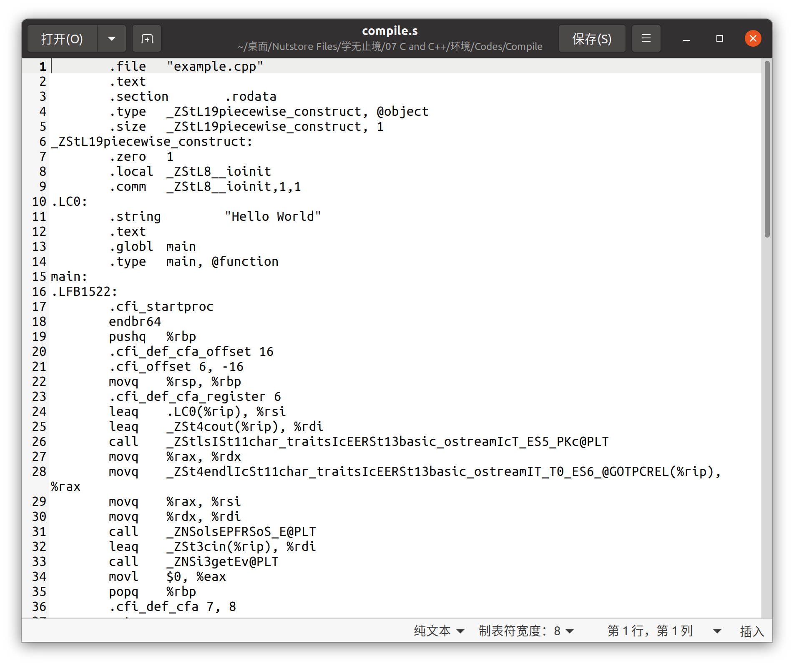
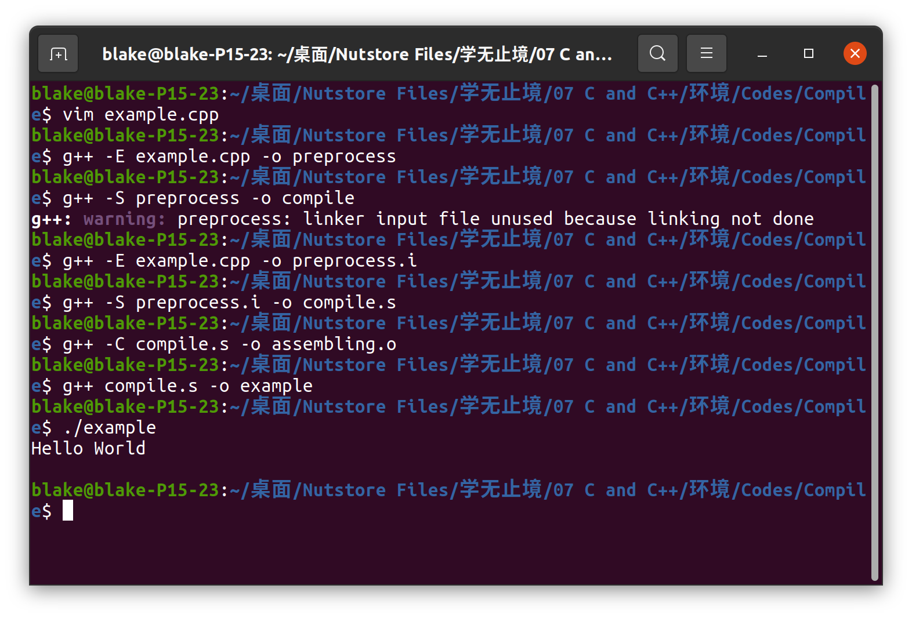
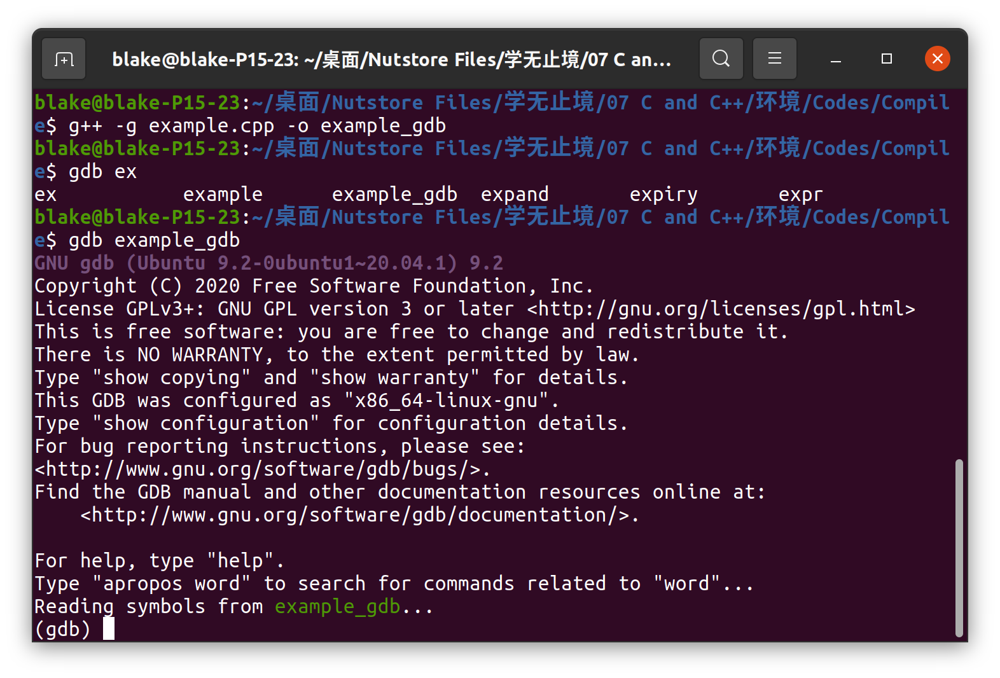

# 00 环境配置

## 0.1 编辑器

- VSCode

## 0.2 编译器和调试器

1. 编译器
	- gcc
	- g++
2. 调试器
	- gdb

```bash
sudo apt install gcc g++ gdb build-essential
```

## 0.3 编译

- 我们通过 `CMake` 来生成编译文件 `Makefile`
- 然后通过 `make` 来编译项目

```bash
sudo apt install cmake make
```

## 0.4 确认是否安装成功

```bash
gcc --version
g++ --version
gdb --version
cmake --version
make --version
```

# 01 GCC编译器

- `gcc` 编译器支持编译 **GO、Objective-C、Objective-C++** 等程序
- Linux开发必须要熟悉gcc
- **VSCode** 实际上是通过调用 gcc/g++ 来实现 C/C++ 的编译工作
- 在实际使用中
	- gcc 用于编译 C
	- g++ 用于编译 C++

## 1.1 编译

在Linux中，我们可以直接通过命令行调用 gcc/g++ 来编译程序，如：

```bash
g++ test.cpp -o test
```

- 上面的命令会调用 g++ 编译器将 `test.cpp` 编译成一个 **可执行的二进制文件** ，并且该文件名由参数 `-o` 指定，为 `test`

但事实上，这条命令包括了以下四个过程：

1. 预处理 Pre-Processing
2. 编译 Compileing
3. 汇编 Assembling
4. 链接 Linking

假设我们有如下代码：



### 1.1.1 预处理 Pre-Processing

```bash
g++ -E test.cpp -o test.i
```

- `-E` 选项指示编译器仅对输入文件进行 **[[../C++/01 Basic/02.How C++ Work#2.2.1 Preprocess Statement|预处理]]** 
- 通过这一步生成的文件如下所示：



- 可以看到，在我们编写的代码中
	1. `#include <iostream>` 变成了长达 28639 行的代码
	2. 我们写的程序其余部分保持不变

### 1.1.2 编译 Compiling

```bash
g++ -S preprocess.i -o compile.s
```

- `-S` 选项指示编译器对输入文件进行 **[[../C++/01 Basic/02.How C++ Work#2.2.2 Compiled|编译]]** 

通过这一步生成的文件如下：



- 这个文件中的代码都是汇编语言

### 1.1.3 汇编 Assembling

```bash
g++ -C compile.s -o assembling.o
```

- `-C` 选项指示编译器把代码编译为 **机械语言 (二进制文件)** ，通常情况下，编译和汇编会同时进行

```ad-note
`-c` 参数不同于 `-C` ，会编译和汇编文件，但是不链接

> `-c` Compile and assemble, but do not link.
```

### 1.1.4 链接 Linking

```bash
g++ assembling.o -o example
```

- 这一步会将二进制文件编译成可执行文件，并且将需要的库进行 **[[../C++/01 Basic/02.How C++ Work#2.2.3 Link|链接]]** ，链接完成后我们可以执行该文件



## 1.2 重要编译参数

### 1.2.1 `-g`

> 编译带调试信息的可执行文件

```bash
g++ -g example.cpp -o example_gdb
```

- `-g` 选项会指示编译器产生能被 **GNU调试器GDB所使用的调试信息** 



### 1.2.2 `-O<n>`

> 优化源代码

`-O<n>` 选项会指示编译器在编译的时候 **对代码进行优化** ，一般 `n` 为 `0, 1, 2, 3` 

所谓优化，就是省略代码中从未使用过的变量，直接将常量表达式用结果值代替，减少不必要的代码，提高可执行文件的运行效率

```bash
g++ example.cpp -O example
# 同时减小代码的长度和执行时间，其效果等同于 -O1

g++ example.cpp -O0 example
# 表示不作优化

g++ example.cpp -O1 example
# 默认优化

g++ example.cpp -O2 example
# 除了完成 -O1 的优化之外，还进行一些额外的调整工作，如指令调整

g++ example.cpp -O3 example
# 包括一些循环展开与处理特性相关的工作
```

在实际编译过程中，我们常使用 `-O2` 选项，此外， `-O<n>` 选项会使编译的速度降低，但是 **代码的执行速度通常会更快** 

### 1.2.3 `-l` 和 `-L`

> 指定 **库文件/库文件路径**

`-l` 是用来指定程序要链接的库， `-l`  **紧跟**着的参数就是库名

```bash
g++ -l<lib> example.cpp -o example
g++ -lglog example.cpp -o example
```

- `-l` 选项会在 `/lib` ， `/usr/lib` 和 `/usr/local/lib` 等目录下检索目标库
- 若库文件不在上述三个目录中，如自建库，则需要调用 `-L` 指定 **库文件所在目录** 

```bash
g++ -L<path_to_lib> -l<lib> example.cpp -o example
g++ -L/mylib -lmylib example.cpp -o example
```

### 1.2.4 `-I`

> 指定头文件搜索目录

g++ 会自动在 `/usr/include` 目录中查找头文件，若是头文件不在其中，我们需要使用 `-I` 来指定头文件存放的位置

```bash
g++ -I<path_to_headfile> example.cpp -o example
g++ -I/myinclude example.cpp -o example
```

- `-I` 选项可以使用绝对路径，也可以使用相对路径

### 1.2.5 `-Wall`

> 打印 gcc/g++ 提供的警告信息

```bash
g++ -Wall example.cpp -o example
```

### 1.2.6 `-w`

> 关闭所有警告信息

```bash
g++ -w example.cpp -o example
```

### 1.2.7 `-std==<version>`

> 设置编译标准

```bash
g++ -std=c++14 example.cpp -o example
# 以 c++14 的标准来编译文件
```

### 1.2.8 `-D`

> 定义 **宏**

常用于 `debug` 的场景

`-DDEBUG` 定义 DEBUG 宏

# 02 编译库文件

在 C++ 中，库文件分为 **静态库** 和 **动态库** 两种

## 2.1 静态库和动态库的区别

1. 静态库在生成可执行文件的时候 **会将库打包进可执行文件中** ，此时的库和由 `.cpp` 文件编译的 Object 十分相似，最后都会和其他程序一起打包成一个可执行文件
2. 动态库在生成可执行文件的时候 **只会将包含的库信息写入可执行文件** ，在执行的时候由计算机在默认的路径中搜索库文件，若该库文件不在默认路径中，则需要手动指定动态库的位置 -> [[Cpp环境配置及编译器使用#4. 运行|如何运行]] ^1bb61b

## 2.2 生成静态库

生成静态库需要使用到归档命令，即将一个可执行的程序打包

### 1. 编译库文件，生成 `.o` 文件

```bash
g++ -c -I../include mylib.cpp
# 会默认生成 .o 文件，或者可以写详细
g++ -I../include -c mylib.cpp -o mylib.o
```

### 2. 生成静态库 `libmylib.a`

```bash
ar rs <lib> <target_file>
ar rs libmylib.a mylib.o
```

- 其中 `ar rs` 为归档命令

### 3. 将 `main.cpp` 编译汇编并链接静态库

```bash
g++ main.cpp -Iinclude -Lsrc -lmylib -o static_main
```

```ad-seealso
对于静态库，若没有重复使用的想法，则可以直接将目标库和主函数一起打包成可执行文件

```bash
g++ main.cpp -c
# 生成 main.o

g++ -I../include -c mylib.cpp
# 生成 mylib.o

g++ main.o ./src/mylib.o -o static1_main

# 甚至可以更简单
g++ main.cpp ./src/mylib.cpp -Iinclude -o static2_main
``````


## 2.2 生成动态库

### 1. 编译文件，生成 `.o` 文件

```bash
g++ -c -I../include -fPIC mylibc.cpp
```

### 2. 将 `.o` 文件装为动态库 `.so` 

```bash
g++ --shared mylib.o -o libmylib.so
```

> 上面两条指令也可以合成一条
> `g++ mylib.cpp -c -I../include -fPIC --shared -o libmylib.so`

### 3. 链接动态库

```bash
g++ main.cpp -Iinclude -Lsrc -lmylib -o dynamic_main
```

> 注意：编译器会 **默认链接动态库** ！当 `src` 目录中同时有 `.a` 和 `.so` 的库时，优先链接 `.so` 的动态库

### 4. 运行

```bash
LD_LIBRARY_PATH=<path> <target_file>
LD_LIBRARY_PATH=src ./dynamic_main
```

> [原因](Cpp环境配置及编译器使用.md#^1bb61b)

# 03 GDB调试器

## 3.1 什么是 GDB ？

`GDB(GNU Debugger)` 是一个用来测试 C/C++ 程序的功能强大的调试器，是 Linux 开发 C/C++ 最常用的调试器，而 VSCode 就是通过调用 GDB调试器来实现 C/C++ 的调试工作

## 3.2 GDB 可以做什么？

1. 设置 **断点** （断点可以是条件表达式）
2. 使程序在指定的代码上 **暂停执行** ，便于观察
3. **单步执行** 程序，便于调试
4. **监视** 程序中变量值的变化
5. 动态改变程序的 **执行环境** 
6. 分析崩溃程序产生的 **core文件**

## 3.3 常用调试命令参数

### 1. 开始调试

```bash
gdb <target_file>
gdb main
```

### 2. 查看帮助

```gdb
help (h)
help <target_parameter>
```

### 3. 执行相关

```gdb
run (r)
# 重新开始运行文件

start
# 单步执行，运行程序，停在第一行执行语句

next (n)
# 单步调试（逐过程，会执行完一整个函数）

step (s)
# 逐行/逐语句

continue
# 继续运行
```

### 4. 监视相关

#### 查看代码

```gdb
list (l)
# 查看源代码

list-<n>
# 查看第n行代码

list <function>
# 查看指定函数代码
```

#### 变量及栈帧

```gdb
set
# 设置变量的值

backtrace (bt)
# 查看函数的栈帧和层级关系

frame (f)
# 切换函数的栈帧

info (i)
# 查看函数内部局部变量的值

finish
# 结束当前函数，返回到函数的调用点

print (p)
# 打印值及地址
```

### 5. 退出

```gdb
quit (q)
# 退出 gdb
```