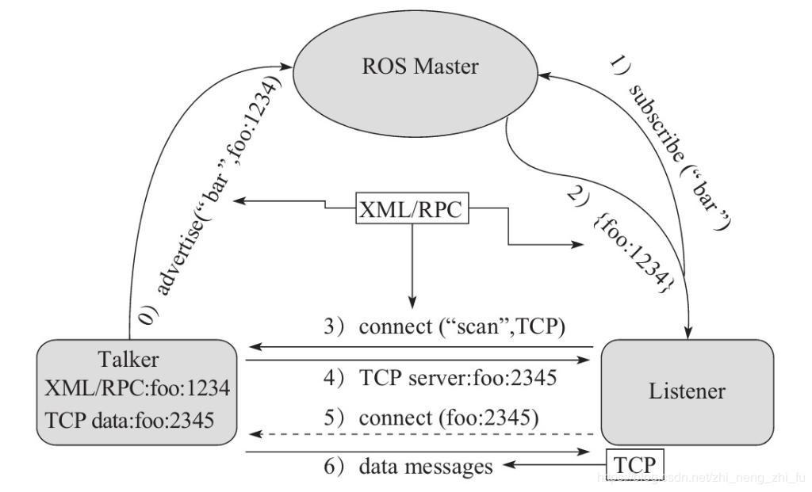

***话题通信*** 是ROS中**使用频率最高**的一种通信模式，话题通信是基于**发布订阅**方式实现不同节点之间数据交互的通信模式，也即:一个节点发布消息，另一个节点订阅该消息。话题通信的应用场景也极其广泛，比如下面一个常见场景:

> 机器人在执行导航功能，使用的传感器是激光雷达，机器人会采集激光雷达感知到的信息并计算，然后生成运动控制信息驱动机器人底盘运动。

在上述场景中，就不止一次使用到了话题通信。

- 以激光雷达信息的采集处理为例，在 ROS 中有一个节点需要时时的发布当前雷达采集到的数据，导航模块中也有节点会订阅并解析雷达数据。
- 再以运动消息的发布为例，导航模块会根据传感器采集的数据时时的计算出运动控制信息并发布给底盘，底盘也可以有一个节点订阅运动信息并最终转换成控制电机的脉冲信号。

以此类推，像雷达、摄像头、GPS.... 等等一些**传感器数据的采集**，也都是使用了话题通信，换言之，话题通信适用于**不断更新的数据传输**相关的应用场景。

# 01 理论模型
话题通信实现模型是比较复杂的，该模型如下图所示,该模型中涉及到三个角色:

- **ROS Master** (管理者)
- **Talker** (发布者)
- **Listener** (订阅者)

ROS Master 负责保管 Talker 和 Listener **注册**的信息，并**匹配话题相同的 Talker 与 Listener**，帮助 Talker 与 Listener 建立连接，连接建立后，Talker 可以发布消息，且发布的消息会被 Listener 订阅。



整个流程由以下步骤实现:

 0. Talker注册
	Talker启动后，会通过RPC在 ROS Master 中注册自身信息，其中包含所发布消息的话题名称。ROS Master 会将节点的注册信息加入到注册表中。

1. Listener注册
	Listener启动后，也会通过RPC在 ROS Master 中注册自身信息，包含需要订阅消息的话题名。ROS Master 会将节点的注册信息加入到注册表中。

2. ROS Master实现信息匹配
	ROS Master 会根据注册表中的信息匹配Talker 和 Listener，并通过 RPC 向 Listener 发送 Talker 的 RPC 地址信息。

3. Listener向Talker发送请求
	Listener 根据接收到的 RPC 地址，通过 RPC 向 Talker 发送连接请求，传输订阅的话题名称、消息类型以及通信协议(TCP/UDP)。
4. Talker确认请求
	Talker 接收到 Listener 的请求后，也是通过 RPC 向 Listener 确认连接信息，并发送自身的 TCP 地址信息。

5. Listener与Talker件里连接
	Listener 根据步骤4 返回的消息使用 TCP 与 Talker 建立网络连接。

6. Talker向Listener发送消息
	连接建立后，Talker 开始向 Listener 发布消息。

> 注意1:上述实现流程中，前五步使用的 RPC协议，最后两步使用的是 TCP 协议
> 
> 注意2: Talker 与 Listener 的启动无先后顺序要求
> 
> 注意3: Talker 与 Listener 都可以有多个
> 
> 注意4: Talker 与 Listener 连接建立后，不再需要 ROS Master。也即，即便关闭ROS Master，Talker 与 Listern 照常通信。

# 02 Code

## 2.1 C++

**需求:**

> 编写发布订阅实现，要求发布方以10HZ(每秒10次)的频率发布文本消息，订阅方订阅消息并将消息内容打印输出。

**分析:**

在模型实现中，ROS master 不需要实现，而连接的建立也已经被封装了，需要关注的关键点有三个:

1. 发布方
2. 接收方
3. 数据(此处为普通文本)

**流程:**

1. 编写发布方实现；
2. 编写订阅方实现；
3. 编辑配置文件；
4. 编译并执行。

### 2.1.1 Setup

```bash
# 创建工作空间
mkdir -p mytopic/src
cd mytopic
catkin_make

# 创建包
cd src
catkin_create_pkg cpp_pubsub roscpp std_msgs
cd cpp_pubsub/src
touch publisher.cpp subscriber.cpp
```

### 2.1.2 CMake

```CMake
add_executable(publisher src/publisher.cpp)
add_executable(subscriber src/subscriber.cpp)

target_link_libraries(publisher
	${catkin_LIBRARIES}
)
target_link_libraries(subscriber
	${catkin_LIBRARIES}
)
```

### 2.1.3 publisher

#### normal

我们在主函数中配置节点并设置 publisher : 

```C++
#include <iostream>
#include <ros/ros.h>
#include <std_msgs/String.h>

int main(int argc, char *argv[])
{
    // init the ros node with the name of the node
    ros::init(argc, argv, "publisher");
    // create a handler to handle the node
    ros::NodeHandle node_handler;

    // create a publisher by handler
    // Advertise a topic, simple version with the spsific message type
    //* topic – Topic to advertise on
    //* queue_size – Maximum number of outgoing messages to be queued for delivery to subscribers
    ros::Publisher pub = node_handler.advertise<std_msgs::String>("MyTopic_Chat", 10);

	std_msgs::String msg;
    std::string content = "Hello Topic !";
    int count = 0;

    // set the publish rate
    //* frequency - The desired rate to run at in Hz
    ros::Rate rate(1);

    while (ros::ok())
    {
        msg.data = content + " count " + std::to_string(count);
        pub.publish(msg);
        ROS_INFO("Publish : %s", msg.data.c_str());
        rate.sleep();
        count++;
        ros::spinOnce();
    }
    
    return 0;
}
```

主要通过 `ros::Nodehandle` 来创建一个用于处理节点的 `node_handler` ，然后通过这个 handler 来创建话题，创建 publisher，最后设置 `rate` ，向话题发布数据。

#### class

我们还可以通过封装一个类用于话题发布 : 

```C++
#include <ros/ros.h>
#include <std_msgs/String.h>

class MinimalPublisher : public ros::NodeHandle
{
    public :
        MinimalPublisher(const std::string& topic_name)
        : count_(0)
        {
            this->pub_ = this->advertise<std_msgs::String>(topic_name, 10);
            auto timer_callback =
			[this](const ros::TimerEvent& event) -> void
			{
				this->msg_.data = "Hello Topic !" + std::to_string(this->count_++);       
				ROS_INFO(this->msg_.data.c_str());
				this->pub_.publish(this->msg_);
			};
            
            
            ros::Rate r(1);
            this->timer_ = this->createTimer(ros::Duration(1), timer_callback);
            // ros::Duration() in second
        }

    private :
        std_msgs::String msg_;
        int count_;
        ros::Publisher pub_;
        ros::Timer timer_;
        

};

int main(int argc, char *argv[])
{
    ros::init(argc, argv, "publisher");
    ROS_INFO("Publisher");
    MinimalPublisher pub ("MyTopic_Chat");
    ros::spin();

    return 0;
}
```

在这个类中，我们了继承 `ros::NodeHandle` ，并设置 `pub_` , `timer_` , `msg_` 用于话题通信。其中

- `pub_` - publisher，用于发布数据
- `msg_` - 存储发布的数据
- `timer_` - 用于计时，但计时结束后会调用回调函数用于执行其他指令
	- `timer_callback` - **lambda** 表达式，其 `capture` 为整个类，参数为 `const ros::TimerEvent& event` ，返回类型为 `void` 

### 2.1.3 subscriber

#### normal

```C++
#include <iostream>
#include <ros/ros.h>
#include <std_msgs/String.h>

void sub_callback(const std_msgs::String::ConstPtr& msg_ptr)
{
    ROS_INFO("I heard : %s", msg_ptr->data.c_str());
}

int main(int argc, char *argv[])
{
    ros::init(argc, argv, "subscriber");
    ros::NodeHandle node_handler;

    // create a subscriber subscribs the specific topic
    // Subscribe to a topic, version for bare function, and process the recieved data
    //* M – [template] M here is the message type
    //* topic – Topic to subscribe to
    //* queue_size – Number of incoming messages to queue up for processing (messages in excess of this queue capacity will be discarded).
    //* fp – Function pointer to call when a message has arrived
    ros::Subscriber sub = node_handler.subscribe<std_msgs::String>("MyTopic_Chat", 10, sub_callback);

    ros::spin();
    
    return 0;
}

```

其中，我们需要定义一个回调函数 `sub_callback` 用于处理接受到的数据，其参数应为 `const <message_type>::ConstPtr& msg_ptr` 

#### class

```C++
#include <std_msgs/String.h>


class MinimalSubscriber : public ros::NodeHandle
{
    public :
        MinimalSubscriber(const std::string& topic_name)
        {
            auto callback = 
            [this](const std_msgs::String::ConstPtr& msg_ptr) -> void
            {
                ROS_INFO("I heard : %s", msg_ptr->data.c_str());
            };
            this->sub_ = this->subscribe<std_msgs::String>(topic_name, 10, callback);
        }

    private :
        ros::Subscriber sub_;

};


int main(int argc, char *argv[])
{
    ros::init(argc, argv, "subscriber");

    MinimalSubscriber sub ("MyTopic_Chat");
    ros::spin();

    return 0;
}

```

# 03 msg

在 ROS 通信协议中，数据载体是一个较为重要组成部分，ROS 中通过 std_msgs 封装了一些原生的数据类型,比如:String、Int32、Int64、Char、Bool、Empty.... 但是，这些数据一般只包含一个 data 字段，结构的单一意味着功能上的局限性，当传输一些复杂的数据，比如: 激光雷达的信息... std_msgs 由于描述性较差而显得力不从心，这种场景下可以使用自定义的消息类型

msgs只是简单的文本文件，每行具有字段类型和字段名称，可以使用的字段类型有：

- int8, int16, int32, int64 (或者无符号类型: uint*)
- float32, float64
- string
- time, duration
- other msg files
- variable-length array\[\] and fixed-length array\[C\]

ROS中还有一种特殊类型：`Header`，标头包含时间戳和ROS中常用的坐标帧信息。会经常看到msg文件的第一行具有`Header标头`。

## 3.1 定义 `.msg` 文件

我们需要在包中新建 `msg/` 目录，并添加 `.msg` 文件 : 

```bash
mkdir my_msg/src -p
cd my_msg/
catkin_make

cd src
catkin_create_pkg my_msg roscpp std_msgs

cd my_msg
mkdir msg
touch msg/Person.msg
```

`Person.msg` : 

```msg
string name
uint16 age
float64 height
```

## 3.2 配置文件

### 3.2.1 Package.xml

我们要自己生成 msg ，就需要为其添加编译依赖与执行依赖 : 

```xml
<build_depend>message_generation</build_depend>
<exec_depend>message_runtime</exec_depend>
```

> 我们可以在创建包的时候就向其添加依赖
> `catkin_create_pkg my_msg roscpp std_msgs message_generation message_runtime`


### 3.2.2 CMake

同时，我们要在 `CMakeLists.txt` 中配置依赖 : 

```CMake
find_package(
	catkin REQUIRED
	COMPONENT
	roscpp
	std_msgs
	message_generation # 用于生成自定义 msg
)
```

> 注意，要使用 `message_generation` 需要有 `std_msgs` 作为依赖

添加 msg 源文件 : 

```CMake
add_message_file(
	FILES
	Person.msg
)
```

为源文件添加依赖 : 

```CMake
generate_messages(
	DEPENDENCIES
	std_msgs
)
```

将其编译为可用依赖 : 

```CMake
catkin_package(
	CATKIN_DEPENDS roscpp std_msgs message_runtime
)
```

## 3.3 编译

我们将其编译后就可以使用，其头文件存放在 `devel/include/my_service/Person.h`

## 3.4 调用

### 3.4.1 publisher

```C++
#include <ros/ros.h>
#include <my_msg/Person.h>

int main(int argc, char *argv[])
{
    ros::init(argc, argv, "Talk_Person");
    ros::NodeHandle handler;
    ros::Publisher pub = handler.advertise<my_msg::Person>("Chat", 10);
    my_msg::Person person;
    person.name = "Talker";
    person.age = 200;
    person.height = 1.45;

    auto timer_callback = 
    [pub, &person](const ros::TimerEvent &event) -> void
    {
        ROS_INFO("Name : %s, Age : %d, Height : %.2f", person.name.c_str(), person.age++, person.height);
        pub.publish(person);
    };

    ros::Timer timer = handler.createTimer(ros::Duration(1), timer_callback);

    ros::spin();
    
    return 0;
}
```

### 3.4.2 subscriber

```C++
#include <ros/ros.h>
#include <my_msg/Person.h>


int main(int argc, char *argv[])
{
    ros::init(argc, argv, "Listener");
    ros::NodeHandle handler;
    auto sub_callback = 
    [](const my_msg::Person::ConstPtr msg_ptr)
    {
        ROS_INFO("Name : %s, Age : %d, Height : %.2f", msg_ptr->name.c_str(), msg_ptr->age, msg_ptr->height);
    };
    ros::Subscriber sub = handler.subscribe<my_msg::Person>("Chat", 10, sub_callback);

    ros::spin();
    
    return 0;
}
```