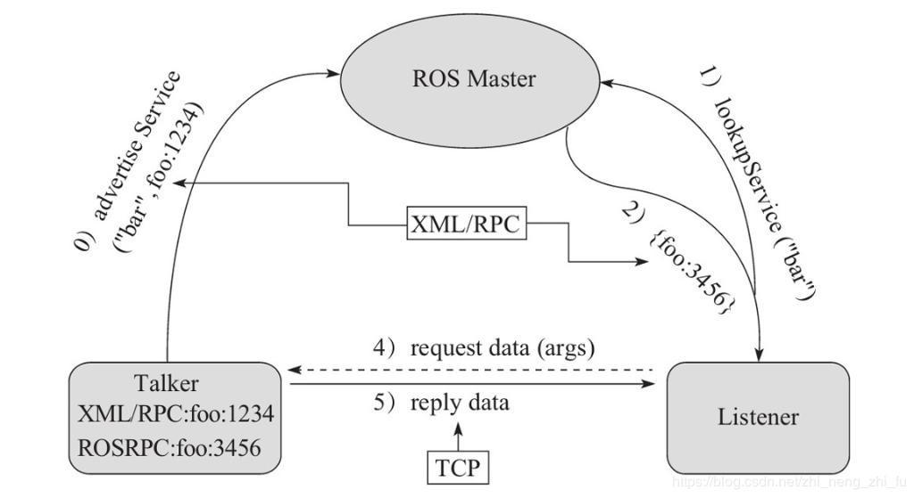

# 01 Model

服务通信也是ROS中一种极其常用的通信模式，服务通信是基于**请求响应**模式的，是一种应答机制。也即: 一个节点A向另一个节点B发送请求，B接收处理请求并产生响应结果返回给A。比如如下场景:

> 机器人巡逻过程中，控制系统分析传感器数据发现可疑物体或人... 此时需要拍摄照片并留存。

在上述场景中，就使用到了服务通信。

- 一个节点需要向相机节点发送拍照请求，相机节点处理请求，并返回处理结果

与上述应用类似的，服务通信更适用于对时时性有要求、具有一定逻辑处理的应用场景。

服务通信较之于话题通信更简单些，理论模型如下图所示，该模型中涉及到三个角色:

- ROS master(管理者)
- Server(服务端)
- Client(客户端)

ROS Master 负责保管 Server 和 Client 注册的信息，并匹配话题相同的 Server 与 Client ，帮助 Server 与 Client 建立连接，连接建立后，Client 发送请求信息，Server 返回响应信息。



整个流程由以下步骤实现:
0. **Server注册** - Server 启动后，会通过RPC在 ROS Master 中注册自身信息，其中包含提供的服务的名称。ROS Master 会将节点的注册信息加入到注册表中。
	
1. **Client注册** - Client 启动后，也会通过RPC在 ROS Master 中注册自身信息，包含需要请求的服务的名称。ROS Master 会将节点的注册信息加入到注册表中。
	
2. **ROS Master实现信息匹配** - ROS Master 会根据注册表中的信息匹配Server和 Client，并通过 RPC 向 Client 发送 Server 的 **TCP** 地址信息。
	
3. **Client发送请求** - Client 根据步骤2 响应的信息，使用 TCP 与 Server 建立网络连接，并发送请求数据。
	
1. **Server发送响应** - Server 接收、解析请求的数据，并产生响应结果返回给 Client。

> 注意:
> 
> 1. 客户端请求被处理时，需要保证服务器已经启动；
> 2. 服务端和客户端都可以存在多个。

# 02 `srv` 

与话题通信一样，我们可以自己定义 `.srv` 文件用于存储我们自己的服务数据类型。我们先创建一个包 : 

```bash
mkdir -p my_service/src
cd my_service
catkin_make

cd src
catkin_create_pkg my_service roscpp std_msgs message_generation message_runtime

cd my_service
mkdir srv
touch srv/AddTwoInts.srv
```

## 2.1 定义 `.srv` 

服务通信中，数据分成两部分，**请求** 与 **响应**，在 srv 文件中请求和响应使用 `---` 分割，具体实现如下:

功能包下新建 `srv/` 目录，添加 `AddTwoInts.srv` 文件，内容:

```srv
# 客户端请求时发送的两个数字
int32 num1
int32 num2
---
# 服务器响应发送的数据
int32 sum
```

## 2.2 编译配置文件

### 2.2.1 `Package.xml` 

```xml
  <build_depend>message_generation</build_depend>
  <exec_depend>message_runtime</exec_depend>
```

### 2.2.2 CMake

```CMake
find_package(
	catkin REQUIRED
	COMPONENTS
	roscpp
	std_msgs
	message_generation
	message_runtime
)
```

```CMake
add_service_files(
	FILES
	AddTwoInts.srv
)
```

```CMake
generate_message(
	DEPENDENCIES
	std_msgs
)
```

> 可以不用配置 `catkin_package()`

## 2.3 编译

编译完成即可调用，其头文件处于 `devel/include/my_service/AddTwoInts.h` 

# 03 Code

## 3.1 Server

```C++
#include <ros/ros.h>
#include "my_service/AddTwoInts.h"

bool server_callback(
    my_service::AddTwoInts::Request& request,
    my_service::AddTwoInts::Response& response
)
{
    response.sum = request.num1 + request.num2;
    ROS_INFO(
        "Num 1 : %ld, Num 2 : %ld, Sum : %ld", 
        request.num1, request.num2, response.sum
    );
    return true;
}

class MinimalServer : public ros::NodeHandle
{
    public : 
        MinimalServer(const std::string& service_name, auto server_callback)
        {
            this->server_ = this->advertiseService(service_name, server_callback);
            ROS_INFO("Service Started !");
        }

    private :
        ros::ServiceServer server_;
};


int main(int argc, char *argv[])
{
    ros::init(argc, argv, "Server");
    MinimalServer server("AddTwoInts", server_callback);
    ros::spin();
    return 0;
}
```

## 3.2 Client

```C++
#include <ros/ros.h>
#include "my_service/AddTwoInts.h"

class MinimalClient : public ros::NodeHandle
{
    public :
        MinimalClient(const std::string& service_name)
        {
            this->client_ = this->serviceClient<my_service::AddTwoInts>(service_name);
            this->srv_.request.num1 = 10;
            this->srv_.request.num2 = 2;
            auto timer_callback =
            [this, &service_name](const ros::TimerEvent& event)
            {
                if (ros::service::waitForService(service_name))
                {

                    ROS_INFO("Request for num1 : %ld, num2 : %ld", this->srv_.request.num1, this->srv_.request.num2);
                    if (this->client_.call(this->srv_))
                    {
                        ROS_INFO("Request Succeed ! Response : %ld", this->srv_.response.sum);
                    }
                    else
                    {
                        ROS_INFO("Request Failed !");
                    }
                    this->srv_.request.num2++;
                }
                else
                {
                    ROS_INFO("Wait For Service ...");
                }
            };

            this->timer_ = this->createTimer(ros::Duration(3), timer_callback);
        }

    private :
        ros::ServiceClient client_;
        ros::Timer timer_;
        my_service::AddTwoInts srv_;
};


int main(int argc, char *argv[])
{
    ros::init(argc, argv, "Client");
    MinimalClient client("AddTwoInts");
    ros::spin();
    
    return 0;
}
```
