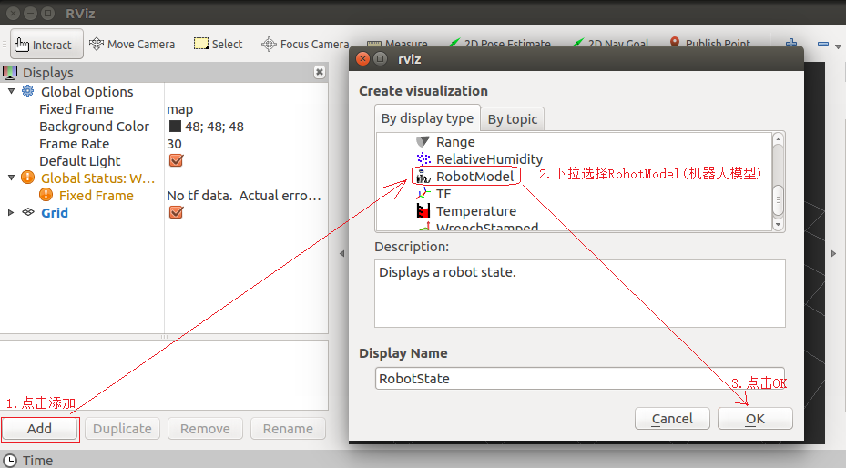
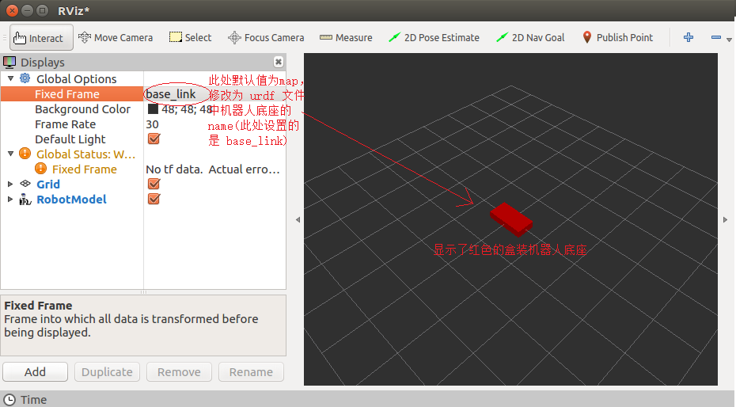
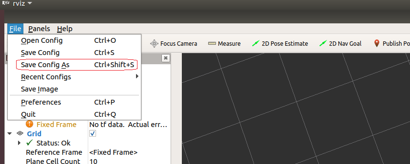

前面介绍过，URDF 不能单独使用，需要结合 Rviz 或 Gazebo，**URDF 只是一个文件，需要在 Rviz 或 Gazebo 中渲染成图形化的机器人模型**，当前，首先演示URDF与Rviz的集成使用，因为URDF与Rviz的集成较之于URDF与Gazebo的集成更为简单，后期，基于Rviz的集成实现，我们再进一步介绍URDF语法。

# 01 概述

**需求描述:**

在 Rviz 中显示一个盒状机器人

**结果演示:**


**实现流程：**

1. 准备:  新建功能包，导入依赖
    
2. 核心 : 编写 urdf 文件
    
3. 核心 : 在 launch 文件集成 URDF 与 Rviz
    
4. 在 Rviz 中显示机器人模型

# 02 实现

## 2.1 创建功能包

创建一个新的功能包，名称自定义，导入依赖包 : `urdf` 与 `xacro` ，在当前功能包的目录下新建几个目录 :

- `urdf` : 存储 urdf 文件的目录
- `meshes` : 机器人模型渲染文件(暂不使用)
- `config` : 配置文件
- `launch` : 存储 launch 启动文件

```bash
mkdir -p my_robot/src
cd my_robot
catkin_make

cd src
catkin_create_pkg my_robot urdf xacro
cd my_robot
mkdir urdf meshes config launch
```

## 2.2 编写 URDF 文件

添加一个 `urdf/my_robot.urdf` : 

```xml
<robot name="my_robot">
    <link name="base_link">
        <visual>
            <geometry>
                <box size="0.5 0.2 0.1" />
            </geometry>
        </visual>
    </link>
</robot>
```

## 2.3 在 launch 中集成 URDF 与 Rviz

```xml
<launch>

    <!-- 设置参数 -->
    <param name="robot_description" textfile="path_to_urdf_file" />

    <!-- 启动 rviz -->
    <node pkg="rviz" type="rviz" name="rviz" />

</launch>
```

我们需要通过设置一个名为 `robot_description` 的参数，并通过传入urdf的文件名来查找机器人模型。

## 2.4 Show model in Rviz

通过 `roslaunch` 运行rviz之后，我们需要手动添加机器人模型 : 



然后将 `Fixed Frame` 改成我们设置的名称 : 



## 2.5 优化rviz启动

重复启动 `launch` 文件时，Rviz 之前的组件配置信息不会自动保存，需要重复执行前面的操作，为了方便使用，我们可以将配置保存下来 : 



将其保存在 `config/` 目录下，然后修改 `launch` 文件，为其添加参数 : 

```xml
<launch>
    <param name="robot_description" textfile="path_to_urdf_file" />
    <node pkg="rviz" type="rviz" name="rviz" args="-d <path_to_rviz_file>" />
</launch>
```

