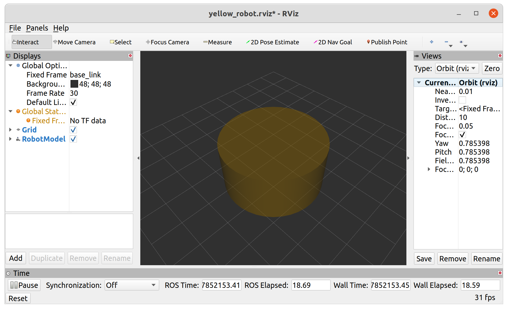
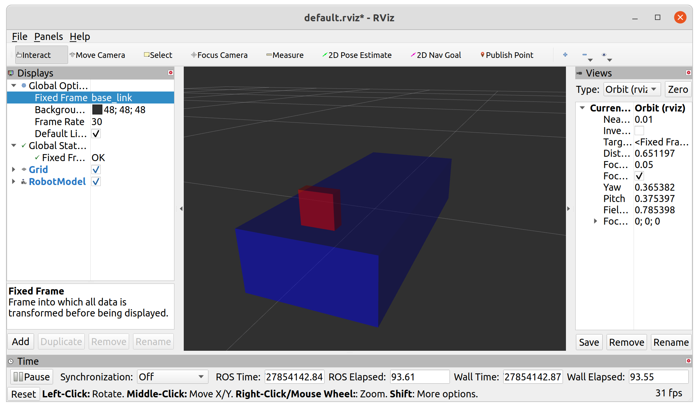
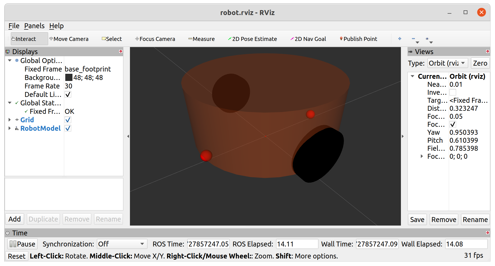

URDF 文件是一个标准的 XML 文件，在 ROS 中预定义了一系列的标签用于描述机器人模型，机器人模型可能较为复杂，但是 ROS 的 URDF 中机器人的组成却是较为简单，可以主要简化为两部分:连杆(link标签) 与 关节(joint标签)，接下来我们就通过案例了解一下 URDF 中的不同标签:

- `robot` - 根标签，类似于 launch文件中的launch标签
- `link` - 连杆标签
- `joint` - 关节标签
- `gazebo` - 集成gazebo需要使用的标签

关于gazebo标签，后期在使用 gazebo 仿真时，才需要使用到，用于配置仿真环境所需参数，比如: 机器人材料属性、gazebo插件等，但是该标签不是机器人模型必须的，只有在仿真时才需设置

# 01 `robot` 

urdf 中为了保证 xml 语法的完整性，使用了 `robot` 标签作为根标签，所有的 `link` 和 `joint` 以及其他标签都必须包含在 `robot` 标签内,在该标签内可以通过 `name` 属性设置机器人模型的名称

# 02 `link` 

### 2.1 属性

- `name` - 为连杆命名

## 2.2 子标签

- `visual` - 描述外观(对应的数据是可视的)
    - `geometry` - 设置连杆的形状
        - `box` - 盒状
            - 属性 : `size` - `长(x) 宽(y) 高(z)`
        - `cylinder` - 圆柱
            - 属性 : `radius` , `length` 
        - `sphere` - 球体
            - 属性 : `radius` 
        - `mesh` - 为连杆添加皮肤
            - 属性: `filename=资源路径(格式:**package://<packagename>/<path>/文件**)` 
    - `origin` - 设置偏移量与倾斜弧度
        - 属性1 : `xyz`  - `x偏移 y便宜 z偏移` 
        - 属性2 : `rpy`  - `roll翻滚 pitch俯仰 yaw偏航 (单位是弧度)`
    - `metrial` -  设置材料属性(颜色)
        - 属性 : `name` 
        - `color` 
            - 属性 : `rgba=红绿蓝权重值与透明度 (每个权重值以及透明度取值[0,1])` 
- `collision` - 连杆的碰撞属性
- `Inertial` - 连杆的惯性矩阵

在此，只演示`visual`使用。
## 2.3 案例

**需求:** 分别生成长方体、圆柱与球体的机器人部件

```xml
<robot>
    <link name="base_link">
        <visual>
            <!-- 形状 -->
            <geometry>
                <!-- 长方体的长宽高 -->
                <!-- <box size="0.5 0.3 0.1" /> -->
                <!-- 圆柱，半径和长度 -->
                <!-- <cylinder radius="0.5" length="0.1" /> -->
                <cylinder radius="2" length="2"/>
                <!-- 球体，半径-->
                <!-- <sphere radius="0.3" /> -->

            </geometry>
            <!-- xyz坐标 rpy翻滚俯仰与偏航角度(3.14=180度 1.57=90度) -->
            <origin xyz="0 0 0" rpy="0 0 0" />
            <!-- 颜色: r=red g=green b=blue a=alpha -->
            <material name="yellow">
                <color rgba="0.7 0.5 0 0.5" />
            </material>
        </visual>
    </link>
</robot>
```

效果如下 : 



# 03 `joint` 

urdf 中的 `joint` 标签用于描述机器人 **关节的运动学和动力学属性**，还可以指定关节运动的安全极限，机器人的两个部件(分别称之为 **parent link** 与 **child link**)以"关节"的形式相连接，不同的关节有不同的运动形式: 旋转、滑动、固定、旋转速度、旋转角度限制....比如 : 安装在底座上的轮子可以360度旋转，而摄像头则可能是完全固定在底座上。

> `joint` 标签对应的数据在模型中是不可见的

## 3.1 属性

- `name` - 为关节命名
- `type`  - 关节运动形式
    - `continuous` : 旋转关节，可以绕单轴无限旋转
    - `revolute` : 旋转关节，类似于 continues,但是有旋转角度限制
    - `prismatic` : 滑动关节，沿某一轴线移动的关节，有位置极限
    - `planer` : 平面关节，允许在平面正交方向上平移或旋转
    - `floating` : 浮动关节，允许进行平移、旋转运动
    - `fixed` : 固定关节，不允许运动的特殊关节

## 3.2 子标签

- `parent` (必需的) - `link` 的名字是一个强制的属性：
    - `link` : 父级连杆的名字，是这个link在机器人结构树中的名字。
- `child` (必需的) - `link` 的名字是一个强制的属性：
    - `link` : 子级连杆的名字，是这个link在机器人结构树中的名字。
- `origin` 
    - 属性 : `xyz=各轴线上的偏移量`, `rpy=各轴线上的偏移弧度` 
	    - xyz 为 `child_link` 相对于 `parent_link` 的偏移量
- `axis` 
    - 属性 : `xyz` - 用于设置围绕哪个关节轴运动。

## 3.3 案例

**需求:** 创建机器人模型，底盘为长方体，在长方体的前面添加一摄像头，摄像头可以沿着 Z 轴 360 度旋转。

urdf : 

```xml
<!-- 
    需求: 创建机器人模型，底盘为长方体，
         在长方体的前面添加一摄像头，
         摄像头可以沿着 Z 轴 360 度旋转

 -->
<robot name="mycar">
    <!-- 底盘 -->
    <link name="base_link">
        <visual>
            <geometry>
                <box size="0.5 0.2 0.1" />
            </geometry>
            <origin xyz="0 0 0" rpy="0 0 0" />
            <material name="blue">
                <color rgba="0 0 1.0 0.5" />
            </material>
        </visual>
    </link>

    <!-- 摄像头 -->
    <link name="camera">
        <visual>
            <geometry>
                <box size="0.02 0.05 0.05" />
            </geometry>
            <origin xyz="0 0 0" rpy="0 0 0" />
            <material name="red">
                <color rgba="1 0 0 0.5" />
            </material>
        </visual>
    </link>

    <!-- 关节 -->
    <joint name="camera2baselink" type="continuous">
        <parent link="base_link"/>
        <child link="camera" />
        <!-- 需要计算两个 link 的物理中心之间的偏移量 -->
        <origin xyz="0.2 0 0.075" rpy="0 0 0" />
        <axis xyz="0 0 1" />
    </joint>
</robot>
```

launch : 

```xml
<launch>

    <param name="robot_description" textfile="$(find urdf_rviz_demo)/urdf/urdf/urdf03_joint.urdf" />
    <node pkg="rviz" type="rviz" name="rviz" args="-d $(find urdf_rviz_demo)/config/helloworld.rviz" /> 

    <!-- 添加关节状态发布节点 -->
    <node pkg="joint_state_publisher" type="joint_state_publisher" name="joint_state_publisher" />
    <!-- 添加机器人状态发布节点 -->
    <node pkg="robot_state_publisher" type="robot_state_publisher" name="robot_state_publisher" />
    <!-- 可选:用于控制关节运动的节点 -->
    <node pkg="joint_state_publisher_gui" type="joint_state_publisher_gui" name="joint_state_publisher_gui" />

</launch>
```

结果如下 : 



## 3.4 优化

前面实现的机器人模型是半沉到地下的，因为默认情况下: 底盘的中心点位于地图原点上，所以会导致这种情况产生，可以使用的优化策略，将初始 link 设置为一个尺寸极小的 link(比如半径为 0.001m 的球体，或边长为 0.001m 的立方体)，然后再在初始 link 上添加底盘等刚体，这样实现，虽然仍然存在初始link半沉的现象，但是基本可以忽略了。这个初始 link 一般称之为 `base_footprint` : 

```xml
<!--

    使用 base_footprint 优化

-->
<robot name="mycar">
    <!-- 设置一个原点(机器人中心点的投影) -->
    <link name="base_footprint">
        <visual>
            <geometry>
                <sphere radius="0.001" />
            </geometry>
        </visual>
    </link>

    <!-- 添加底盘 -->
    <link name="base_link">
        <visual>
            <geometry>
                <box size="0.5 0.2 0.1" />
            </geometry>
            <origin xyz="0 0 0" rpy="0 0 0" />
            <material name="blue">
                <color rgba="0 0 1.0 0.5" />
            </material>
        </visual>
    </link>

    <!-- 底盘与原点连接的关节 -->
    <joint name="base_link2base_footprint" type="fixed">
        <parent link="base_footprint" />
        <child link="base_link" />
        <origin xyz="0 0 0.05" />
    </joint>

    <!-- 添加摄像头 -->
    <link name="camera">
        <visual>
            <geometry>
                <box size="0.02 0.05 0.05" />
            </geometry>
            <origin xyz="0 0 0" rpy="0 0 0" />
            <material name="red">
                <color rgba="1 0 0 0.5" />
            </material>
        </visual>
    </link>
    <!-- 关节 -->
    <joint name="camera2baselink" type="continuous">
        <parent link="base_link"/>
        <child link="camera" />
        <origin xyz="0.2 0 0.075" rpy="0 0 0" />
        <axis xyz="0 0 1" />
    </joint>

</robot>
```

# 04 示例

**需求描述:**

创建一个四轮圆柱状机器人模型，机器人参数如下,底盘为圆柱状，半径 10cm，高 8cm，四轮由两个驱动轮和两个万向支撑轮组成，两个驱动轮半径为 3.25cm,轮胎宽度1.5cm，两个万向轮为球状，半径 0.75cm，底盘离地间距为 1.5cm(与万向轮直径一致)

## 4.1 urdf

```xml
<?xml version="1.0"?>
<robot name="robot">
    <!-- body -->
    <link name="base_footprint">
        <visual>
            <geometry>
                <sphere radius="0.001"/>
            </geometry>
        </visual>
    </link>

    <link name="base_link">
        <visual>
            <geometry>
                <cylinder radius="0.1" length="0.08"/>
            </geometry>
            <origin xyz="0.0 0.0 0.0" rpy="0.0 0.0 0.0"/>
            <material name="yellow">
                <color rgba="0.8 0.3 0.1 0.5" />
            </material>
        </visual>
    </link>

    <link name="left_wheel">
        <visual>
            <geometry>
                <cylinder radius="0.0325" length="0.015"/>
            </geometry>
            <origin xyz="0.0 0.0 0.0" rpy="1.5705 0.0 0.0"/>
            <material name="black">
                <color rgba="0 0 0 1.0" />
            </material>
        </visual>
    </link>

    <link name="right_wheel">
        <visual>
            <geometry>
                <cylinder radius="0.0325" length="0.015"/>
            </geometry>
            <origin xyz="0.0 0.0 0.0" rpy="1.5705 0.0 0.0"/>
            <material name="black">
                <color rgba="0 0 0 1.0" />
            </material>
        </visual>
    </link>

    <link name="front_wheel">
        <visual>
            <geometry>
                <sphere radius="0.0075"/>
                <origin xyz="0.0 0.0 0.0" rpy="0.0 0.0 0.0"/>
                <material name="balck">
                    <color rgba="0 0 0 1.0" />
                </material>
            </geometry>
        </visual>
    </link>

    <link name="back_wheel">
        <visual>
            <geometry>
                <sphere radius="0.0075"/>
                <origin xyz="0.0 0.0 0.0" rpy="0.0 0.0 0.0"/>
                <material name="balck">
                    <color rgba="0 0 0 1.0" />
                </material>
            </geometry>
        </visual>
    </link>


    <!-- 关节 -->
    <joint name="base2footprint" type="fixed">
        <parent link="base_footprint"/>
        <child link="base_link"/>
        <origin xyz="0.0 0.0 0.055" rpy="0.0 0.0 0.0"/>
    </joint>

    <joint name="left2baselink" type="continuous">
        <parent link="base_link"/>
        <child link="left_wheel"/>
        <axis xyz="0 1 0"/>
        <origin xyz="0 0.1 -0.0225" rpy="0 0 0"/>
    </joint>
    
    <joint name="right2baselink" type="continuous">
        <parent link="base_link"/>
        <child link="right_wheel"/>
        <axis xyz="0 1 0"/>
        <origin xyz="0 -0.1 -0.0225" rpy="0 0 0"/>
    </joint>
    
    <joint name="front2baselink" type="continuous">
        <parent link="base_link"/>
        <child link="front_wheel"/>
        <axis xyz="1 1 1"/>
        <origin xyz="0.0925 0 -0.0475" rpy="0 0 0"/>
    </joint>
    
    <joint name="back2baselink" type="continuous">
        <parent link="base_link"/>
        <child link="back_wheel"/>
        <axis xyz="1 1 1"/>
        <origin xyz="-0.0925 0 -0.0475" rpy="0 0 0"/>
    </joint>
    
</robot>
```

## 4.2 launch

```xml
<?xml version="1.0"?>
<launch>

    <param name="robot_description" textfile="/home/blake-u/Desktop/ROS_learn/Emulation/cylinder_robot/src/robot/urdf/robot.urdf"/>
    <node name="rviz" pkg="rviz" type="rviz" output="screen" args="-d /home/blake-u/Desktop/ROS_learn/Emulation/cylinder_robot/src/robot/config/robot.rviz"/>
    
    <node name="robot_state_publisher" pkg="robot_state_publisher" type="robot_state_publisher" output="screen"/>
    <node name="joint_state_publisher" pkg="joint_state_publisher" type="joint_state_publisher" output="screen"/>
    <node name="joint_state_publisher_gui" pkg="joint_state_publisher_gui" type="joint_state_publisher_gui" output="screen"/>

</launch>
```

结果如下所示 : 

