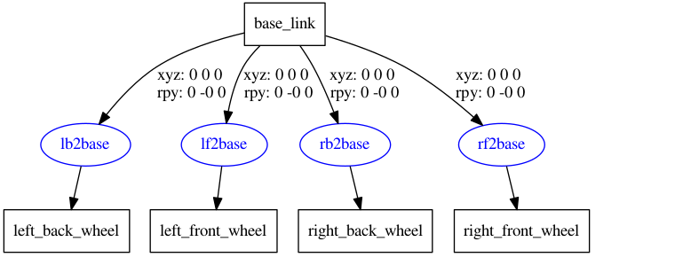

在 ROS 中，提供了一些工具来方便 URDF 文件的编写，比如:

- `check_urdf`命令可以检查复杂的 urdf 文件是否存在语法问题

- `urdf_to_graphiz`命令可以查看 urdf 模型结构，显示不同 link 的层级关系    

> 当然，要使用工具之前，首先需要安装，安装命令 : `sudo apt install liburdfdom-tools` 

# 01 urdf语法检查

使用 `check_urdf <file>` 检查，若无异常则合法 : 

```text
robot name is: robot
---------- Successfully Parsed XML ---------------
root Link: base_footprint has 1 child(ren)
    child(1):  base_link
        child(1):  back_wheel
        child(2):  front_wheel
        child(3):  left_wheel
        child(4):  right_wheel
```

# 02 结构查看

使用 `urdf_to_graphiz <file>` 可以从图形上结构化查看机器人结构 : 


