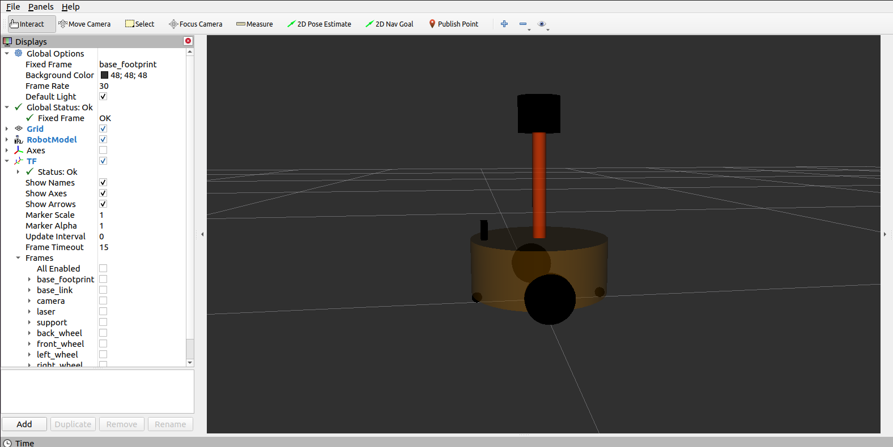

前面 URDF 文件构建机器人模型的过程中，存在若干问题。

> 问题1:在设计关节的位置时，需要按照一定的公式计算，公式是固定的，但是在 URDF 中依赖于人工计算，存在不便，容易计算失误，且当某些参数发生改变时，还需要重新计算。
> 
> 问题2:URDF 中的部分内容是高度重复的，驱动轮与支撑轮的设计实现，不同轮子只是部分参数不同，形状、颜色、翻转量都是一致的，在实际应用中，构建复杂的机器人模型时，更是易于出现高度重复的设计，按照一般的编程涉及到重复代码应该考虑封装。
> 
> ......

如果在编程语言中，可以通过变量结合函数直接解决上述问题，在 ROS 中，已经给出了类似编程的优化方案，称之为 : **Xacro** 

***Xacro*** 是 **XML Macros** 的缩写，Xacro 是一种 XML 宏语言，是可编程的 XML。

Xacro 可以声明变量，可以通过数学运算求解，使用流程控制控制执行顺序，还可以通过类似函数的实现，封装固定的逻辑，将逻辑中需要的可变的数据以参数的方式暴露出去，从而提高代码复用率以及程序的安全性。

# 01 Quick Start

使用xacro优化上一节案例中驱动轮实现，需要使用变量封装底盘的半径、高度，使用数学公式动态计算底盘的关节点坐标，使用 Xacro 宏封装轮子重复的代码并调用宏创建两个轮子(注意: 在此，演示 Xacro 的基本使用，不必要生成合法的 URDF )。

> 注意 : 创建功能包，导入 `urdf` 与 `xacro` 

## 1.1 编写 `robot.xacro` 文件 : 

```xml
<robot name="mycar" xmlns:xacro="http://wiki.ros.org/xacro">
    <!-- 属性封装 -->
    <xacro:property name="wheel_radius" value="0.0325" />
    <xacro:property name="wheel_length" value="0.0015" />
    <xacro:property name="PI" value="3.1415927" />
    <xacro:property name="base_link_length" value="0.08" />
    <xacro:property name="lidi_space" value="0.015" />

    <!-- 宏 -->
    <xacro:macro name="wheel_func" params="wheel_name flag" >
        <link name="${wheel_name}_wheel">
            <visual>
                <geometry>
                    <cylinder radius="${wheel_radius}" length="${wheel_length}" />
                </geometry>

                <origin xyz="0 0 0" rpy="${PI / 2} 0 0" />

                <material name="wheel_color">
                    <color rgba="0 0 0 0.3" />
                </material>
            </visual>
        </link>

        <!-- 3-2.joint -->
        <joint name="${wheel_name}2link" type="continuous">
            <parent link="base_link"  />
            <child link="${wheel_name}_wheel" />
            <!-- 
                x 无偏移
                y 车体半径
                z z= 车体高度 / 2 + 离地间距 - 车轮半径

            -->
            <origin xyz="0 ${0.1 * flag} ${(base_link_length / 2 + lidi_space - wheel_radius) * -1}" rpy="0 0 0" />
            <axis xyz="0 1 0" />
        </joint>

    </xacro:macro>
    <xacro:wheel_func wheel_name="left" flag="1" />
    <xacro:wheel_func wheel_name="right" flag="-1" />
</robot>
```

## 1.2 将 `.xacro` 转为 `.urdf` 

通过运行如下命令可以将 `.xacro` 文件转化为 `.urdf` 文件 : 

```bash
rosrun xacro xacro xxx.xacro > xxx.urdf
```

转化结果如下 : 

```xml
<?xml version="1.0" ?>
<!-- =================================================================================== -->
<!-- |    This document was autogenerated by xacro from test.xacro                     | -->
<!-- |    EDITING THIS FILE BY HAND IS NOT RECOMMENDED                                 | -->
<!-- =================================================================================== -->
<robot name="mycar">
  <link name="left_wheel">
    <visual>
      <geometry>
        <cylinder length="0.0015" radius="0.0325"/>
      </geometry>
      <origin rpy="1.57079635 0 0" xyz="0 0 0"/>
      <material name="wheel_color">
        <color rgba="0 0 0 0.3"/>
      </material>
    </visual>
  </link>
  <!-- 3-2.joint -->
  <joint name="left2link" type="continuous">
    <parent link="base_link"/>
    <child link="left_wheel"/>
    <!-- 
                x 无偏移
                y 车体半径
                z z= 车体高度 / 2 + 离地间距 - 车轮半径

            -->
    <origin rpy="0 0 0" xyz="0 0.1 -0.0225"/>
    <axis xyz="0 1 0"/>
  </joint>
  <link name="right_wheel">
    <visual>
      <geometry>
        <cylinder length="0.0015" radius="0.0325"/>
      </geometry>
      <origin rpy="1.57079635 0 0" xyz="0 0 0"/>
      <material name="wheel_color">
        <color rgba="0 0 0 0.3"/>
      </material>
    </visual>
  </link>
  <!-- 3-2.joint -->
  <joint name="right2link" type="continuous">
    <parent link="base_link"/>
    <child link="right_wheel"/>
    <!-- 
                x 无偏移
                y 车体半径
                z z= 车体高度 / 2 + 离地间距 - 车轮半径

            -->
    <origin rpy="0 0 0" xyz="0 -0.1 -0.0225"/>
    <axis xyz="0 1 0"/>
  </joint>
</robot>
```

> 注意！该 `.urdf` 文件并不合法，只用于演示如何生成

# 02 语法详解

xacro 提供了可编程接口，类似于计算机语言，包括变量声明调用、函数声明与调用等语法实现。在使用 xacro 生成 urdf 时，**根标签`robot`中必须包含命名空间声明:`xmlns:xacro="http://wiki.ros.org/xacro"`**

## 2.1 属性与算数运算

用于封装 URDF 中的一些字段，比如: PAI 值，小车的尺寸，轮子半径 ....

**属性定义**

```xml
<xacro:property name="xxxx" value="yyyy" />
```

**属性调用**

```xml
${属性名称}
```

**算数运算**

```xml
${数学表达式}
```

## 2.2 宏

类似于函数实现，提高代码复用率，优化代码结构，提高安全性

**宏定义**

```
<xacro:macro name="宏名称" params="参数列表(多参数之间使用空格分隔)">

    .....

    参数调用格式: ${参数名}

</xacro:macro>
```

**宏调用**

```
<xacro:宏名称 参数1=xxx 参数2=xxx/>
```

## 2.3 文件包含

机器人由多部件组成，不同部件可能封装为单独的 xacro 文件，最后再将不同的文件集成，组合为完整机器人，可以使用文件包含实现

**文件包含**

```
<robot name="xxx" xmlns:xacro="http://wiki.ros.org/xacro">
      <xacro:include filename="my_base.xacro" />
      <xacro:include filename="my_camera.xacro" />
      <xacro:include filename="my_laser.xacro" />
      ....
</robot>
```

# 03 基本使用流程

使用 Xacro 优化 URDF 版的小车底盘模型实现

## 3.1 `.xacro` 

文件如下 : 

```xml
<!--
    使用 xacro 优化 URDF 版的小车底盘实现：

    实现思路:
    1.将一些常量、变量封装为 xacro:property
      比如:PI 值、小车底盘半径、离地间距、车轮半径、宽度 ....
    2.使用 宏 封装驱动轮以及支撑轮实现，调用相关宏生成驱动轮与支撑轮

-->
<!-- 根标签，必须声明 xmlns:xacro -->
<robot name="my_base" xmlns:xacro="http://www.ros.org/wiki/xacro">
    <!-- 封装变量、常量 -->
    <xacro:property name="PI" value="3.141"/>
    <!-- 宏:黑色设置 -->
    <material name="black">
        <color rgba="0.0 0.0 0.0 1.0" />
    </material>
    <!-- 底盘属性 -->
    <xacro:property name="base_footprint_radius" value="0.001" /> <!-- base_footprint 半径  -->
    <xacro:property name="base_link_radius" value="0.1" /> <!-- base_link 半径 -->
    <xacro:property name="base_link_length" value="0.08" /> <!-- base_link 长 -->
    <xacro:property name="earth_space" value="0.015" /> <!-- 离地间距 -->

    <!-- 底盘 -->
    <link name="base_footprint">
      <visual>
        <geometry>
          <sphere radius="${base_footprint_radius}" />
        </geometry>
      </visual>
    </link>

    <link name="base_link">
      <visual>
        <geometry>
          <cylinder radius="${base_link_radius}" length="${base_link_length}" />
        </geometry>
        <origin xyz="0 0 0" rpy="0 0 0" />
        <material name="yellow">
          <color rgba="0.5 0.3 0.0 0.5" />
        </material>
      </visual>
    </link>

    <joint name="base_link2base_footprint" type="fixed">
      <parent link="base_footprint" />
      <child link="base_link" />
      <origin xyz="0 0 ${earth_space + base_link_length / 2 }" />
    </joint>

    <!-- 驱动轮 -->
    <!-- 驱动轮属性 -->
    <xacro:property name="wheel_radius" value="0.0325" /><!-- 半径 -->
    <xacro:property name="wheel_length" value="0.015" /><!-- 宽度 -->
    <!-- 驱动轮宏实现 -->
    <xacro:macro name="add_wheels" params="name flag">
      <link name="${name}_wheel">
        <visual>
          <geometry>
            <cylinder radius="${wheel_radius}" length="${wheel_length}" />
          </geometry>
          <origin xyz="0.0 0.0 0.0" rpy="${PI / 2} 0.0 0.0" />
          <material name="black" />
        </visual>
      </link>

      <joint name="${name}_wheel2base_link" type="continuous">
        <parent link="base_link" />
        <child link="${name}_wheel" />
        <origin xyz="0 ${flag * base_link_radius} ${-(earth_space + base_link_length / 2 - wheel_radius) }" />
        <axis xyz="0 1 0" />
      </joint>
    </xacro:macro>
    <xacro:add_wheels name="left" flag="1" />
    <xacro:add_wheels name="right" flag="-1" />
    <!-- 支撑轮 -->
    <!-- 支撑轮属性 -->
    <xacro:property name="support_wheel_radius" value="0.0075" /> <!-- 支撑轮半径 -->

    <!-- 支撑轮宏 -->
    <xacro:macro name="add_support_wheel" params="name flag" >
      <link name="${name}_wheel">
        <visual>
            <geometry>
                <sphere radius="${support_wheel_radius}" />
            </geometry>
            <origin xyz="0 0 0" rpy="0 0 0" />
            <material name="black" />
        </visual>
      </link>

      <joint name="${name}_wheel2base_link" type="continuous">
          <parent link="base_link" />
          <child link="${name}_wheel" />
          <origin xyz="${flag * (base_link_radius - support_wheel_radius)} 0 ${-(base_link_length / 2 + earth_space / 2)}" />
          <axis xyz="1 1 1" />
      </joint>
    </xacro:macro>

    <xacro:add_support_wheel name="front" flag="1" />
    <xacro:add_support_wheel name="back" flag="-1" />

</robot>
```

## 3.2 集成launch文件

**方式1:** 先将 xacro 文件转换出 urdf 文件，然后集成

先将 xacro 文件解析成 urdf 文件:`rosrun xacro xacro xxx.xacro > xxx.urdf`然后再按照之前的集成方式直接整合 launch 文件,内容示例:

```xml
<launch>
    <param name="robot_description" textfile="$(find demo01_urdf_helloworld)/urdf/my_base.urdf" />

    <node pkg="rviz" type="rviz" name="rviz" args="-d $(find demo01_urdf_helloworld)/config/helloworld.rviz" />
    <node pkg="joint_state_publisher" type="joint_state_publisher" name="joint_state_publisher" output="screen" />
    <node pkg="robot_state_publisher" type="robot_state_publisher" name="robot_state_publisher" output="screen" />
    <node pkg="joint_state_publisher_gui" type="joint_state_publisher_gui" name="joint_state_publisher_gui" output="screen" />

</launch>
```

**方式2:** 在 launch 文件中直接加载 xacro(**建议使用**)

launch 内容示例:

```xml
<launch>
    <param name="robot_description" command="$(find xacro)/xacro $(find xacro_car)/urdf/my_base.xacro" />

    <node pkg="rviz" type="rviz" name="rviz" args="-d $(find demo01_urdf_helloworld)/config/helloworld.rviz" />
    <node pkg="joint_state_publisher" type="joint_state_publisher" name="joint_state_publisher" output="screen" />
    <node pkg="robot_state_publisher" type="robot_state_publisher" name="robot_state_publisher" output="screen" />
    <node pkg="joint_state_publisher_gui" type="joint_state_publisher_gui" name="joint_state_publisher_gui" output="screen" />

</launch>
```

核心代码:

```xml
<param name="robot_description" command="$(find xacro)/xacro $(find xacro_car)/urdf/my_base.xacro" />
```

加载`robot_description`时使用`command`属性，属性值就是调用 xacro 功能包的 xacro 程序直接解析 xacro 文件。

# 04 实例

**需求描述:**

在前面小车底盘基础之上，添加摄像头和雷达传感器。

**结果演示:**



**实现分析:**

机器人模型由多部件组成，可以将不同组件设置进单独文件，最终通过文件包含实现组件的拼装。

**实现流程:**

1. 首先编写摄像头和雷达的 xacro 文件
2. 然后再编写一个组合文件，组合底盘、摄像头与雷达
3. 最后，通过 launch 文件启动 Rviz 并显示模型

## 4.1 摄像头和雷达 Xacro 文件实现

### 4.1.3 摄像头

`camera.xacro` : 

```xml
<?xml version="1.0"?>
<robot xmlns:xacro="http://www.ros.org/wiki/xacro" name="my_camera">
    <xacro:property name="camera_length" value="0.01"/>
    <xacro:property name="camera_width" value="0.025"/>
    <xacro:property name="camera_height" value="0.025"/>

    <!-- 摄像头安装位置 -->
    <xacro:property name="camera_x" value="0.08"/>
    <xacro:property name="camera_y" value="0.0"/>
    <xacro:property name="camera_z" value="${base_link_length / 2 + camera_height / 2}"/>

    <xacro:macro name="add_camera" params="">
        <link name="camera">
            <visual>
                <geometry>
                    <box size="${camera_length} ${camera_width} ${camera_height}"/>
                </geometry>
                <origin xyz="0.0 0.0 0.0" rpy="0.0 0.0 0.0"/>
                <material name="black" />
            </visual>
        </link>

        <joint name="camera2baselink" type="fixed">
            <parent link="base_link"/>
            <child link="camera"/>
            <origin xyz="${camera_x} ${camera_y} ${camera_z}" rpy="0.0 0.0 0.0"/>
        </joint>
    </xacro:macro>

    <xacro:add_camera />
    
</robot>
```

### 4.1.3 雷达

`rada.xacro` : 

```xml
<?xml version="1.0"?>
<robot xmlns:xacro="http://www.ros.org/wiki/xacro" name="rada">
    
    <!-- 雷达支架属性及安装位置 -->
    <xacro:property name="support_length" value="0.15"/>
    <xacro:property name="support_radius" value="0.01"/>
    <xacro:property name="support_x" value="0.0"/>
    <xacro:property name="support_y" value="0.0"/>
    <xacro:property name="support_z" value="${base_link_length / 2 + support_length / 2}"/>

    <xacro:macro name="add_rada_support" params="">
        <link name="support">
            <visual>
                <geometry>
                    <cylinder radius="${support_radius}" length="${support_length}"/>
                </geometry>
                <origin xyz="0.0 0.0 0.0" rpy="0.0 0.0 0.0"/>
                <material name="red">
                    <color rgba="0.8 0.2 0.0 0.8" />
                </material>
            </visual>
        </link>

        <joint name="support2baselink" type="fixed">
            <parent link="base_link"/>
            <child link="support"/>
            <origin xyz="${support_x} ${support_y} ${support_z}" rpy="0.0 0.0 0.0"/>
        </joint>
    </xacro:macro>
    
    <!-- 雷达属性 -->
    <xacro:property name="rada_length" value="0.05"/>
    <xacro:property name="rada_radius" value="0.03"/>
    <xacro:property name="rada_x" value="0.0"/>
    <xacro:property name="rada_y" value="0.0"/>
    <xacro:property name="rada_z" value="${support_length / 2 + rada_length / 2}"/>
    <xacro:macro name="add_rada" params="">
        <link name="rada">
            <visual>
                <geometry>
                    <cylinder radius="${rada_radius}" length="${rada_length}"/>
                </geometry>
                <origin xyz="0.0 0.0 0.0" rpy="0.0 0.0 0.0"/>
                <material name="black" />
            </visual>
        </link>

        <joint name="rada2support" type="fixed">
            <parent link="support"/>
            <child link="rada"/>
            <origin xyz="${rada_x} ${rada_y} ${rada_z}" rpy="0.0 0.0 0.0"/>
        </joint>
    </xacro:macro>

    <xacro:add_rada_support />
    <xacro:add_rada />
    
</robot>
```

## 4.2 组合原本的小车和摄像头与雷达

`robot.xacro` : 

```xml
<?xml version="1.0"?>
<robot xmlns:xacro="http://www.ros.org/wiki/xacro" name="full_car">
    <xacro:include filename="$(find full_car)/urdf/car.xacro"/>
    <xacro:include filename="$(find full_car)/urdf/camera.xacro"/>
    <xacro:include filename="$(find full_car)/urdf/rada.xacro"/>
    
</robot>
```

## 4.3 launch 文件

```xml
<?xml version="1.0"?>
<launch>

    <param name="robot_description" command="$(find xacro)/xacro $(find full_car)/urdf/robot.xacro"/>
    <node name="rviz" pkg="rviz" type="rviz" output="screen"/>
    <node name="joint_state_publisher" pkg="joint_state_publisher" type="joint_state_publisher" output="screen"/>
    <node name="robot_state_publisher" pkg="robot_state_publisher" type="robot_state_publisher" output="screen"/>
    <node name="joint_state_publisher_gui" pkg="joint_state_publisher_gui" type="joint_state_publisher_gui" output="screen"/>
    
</launch>
```
