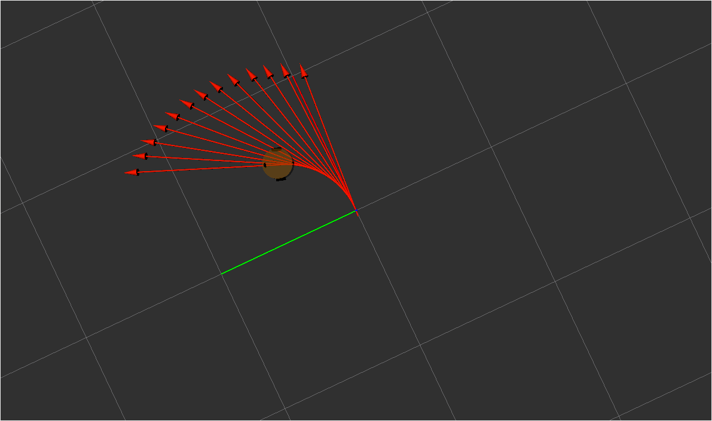

通过 URDF 结合 rviz 可以创建并显示机器人模型，不过，当前实现的只是静态模型，如何控制模型的运动呢？在此，可以调用 Arbotix 实现此功能。

---

# 01 简介

**Arbotix** : Arbotix 是一款 **控制电机、舵机的控制板**，**并提供相应的 ros 功能包**，这个功能包的功能不仅可以驱动真实的 Arbotix 控制板，它还提供一个差速控制器，通过接受速度控制指令更新机器人的 joint 状态，从而帮助我们实现机器人在 rviz 中的运动。

这个差速控制器在 arbotix_python 程序包中，完整的 arbotix 程序包还包括多种控制器，分别对应 dynamixel 电机、多关节机械臂以及不同形状的夹持器。

# 02 Quick Start

接下来，通过一个案例演示 arbotix 的使用。

**需求描述:**

控制机器人模型在 rviz 中做圆周运动

**结果演示:**



**实现流程:**

1. 安装 Arbotix
2. 创建新功能包，准备机器人 urdf、xacro 文件
3. 添加 Arbotix 配置文件
4. 编写 launch 文件配置 Arbotix
5. 启动 launch 文件并控制机器人模型运动

## 2.1 安装 Arbotix

```bash
sudo apt install ros-noetic-arbotix
```

## 2.2 添加 arbotix 所需配置文件

在包中添加一个 `config/circle.yaml` 文件来配置 arboxtix : 

```yaml
# 该文件是控制器配置,一个机器人模型可能有多个控制器，比如: 底盘、机械臂、夹持器(机械手)....
# 因此，根 name 是 controller
controllers: {
   # 单控制器设置
   base_controller: {
          #类型: 差速控制器
       type: diff_controller,
       #参考坐标
       base_frame_id: base_footprint, 
       #两个轮子之间的间距
       base_width: 0.2,
       #控制频率
       ticks_meter: 2000, 
       #PID控制参数，使机器人车轮快速达到预期速度
       Kp: 12, 
       Kd: 12, 
       Ki: 0, 
       Ko: 50, 
       #加速限制
       accel_limit: 1.0 
    }
}
```

## 2.3 launch 中配置 arbotix 节点

```xml
<node name="arbotix" pkg="arbotix_python" type="arbotix_driver" output="screen">
     <rosparam file="$(find my_urdf05_rviz)/config/hello.yaml" command="load" />
     <param name="sim" value="true" />
</node>
```

## 2.4 控制移动

在运行节点后，我们会发现新增加了一个熟悉的话题 `/cmd_vel` ，我们可以通过对该话题发布数据来控制移动 : 

```bash
rostopic pub -r 10 /cmd_vel geometry_msgs/Twist "{linear: {x: 0.2, y: 0, z: 0}, angular: {x: 0, y: 0, z: 0.5}}"
```

