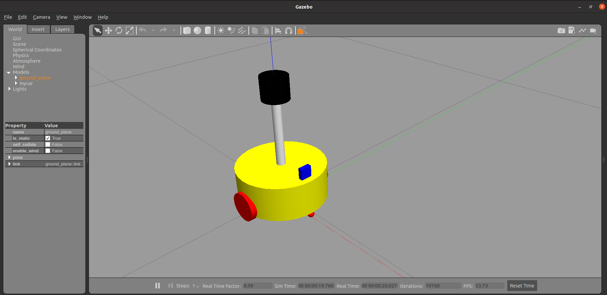

RDF 与 Gazebo 集成流程与 Rviz 实现类似，主要步骤如下:

1. 创建功能包，导入依赖项
2. 编写 URDF 或 Xacro 文件
3. 启动 Gazebo 并显示机器人模型    

# 01 Quick Start

## 2.1 创建功能包

创建新功能包，导入依赖包: urdf、xacro、gazebo_ros、gazebo_ros_control、gazebo_plugins

## 2.2 编写 URDF 文件

```xml
<!-- 
    创建一个机器人模型(盒状即可)，显示在 Gazebo 中 
-->

<robot name="mycar">
    <link name="base_link">
        <visual>
            <geometry>
                <box size="0.5 0.2 0.1" />
            </geometry>
            <origin xyz="0.0 0.0 0.0" rpy="0.0 0.0 0.0" />
            <material name="yellow">
                <color rgba="0.5 0.3 0.0 1" />
            </material>
        </visual>
        <collision>
            <geometry>
                <box size="0.5 0.2 0.1" />
            </geometry>
            <origin xyz="0.0 0.0 0.0" rpy="0.0 0.0 0.0" />
        </collision>
        <inertial>
            <origin xyz="0 0 0" />
            <mass value="6" />
            <inertia ixx="1" ixy="0" ixz="0" iyy="1" iyz="0" izz="1" />
        </inertial>
    </link>
    <gazebo reference="base_link">
        <material>Gazebo/Black</material>
    </gazebo>

</robot>
```

> [!attention] 
> 注意， 当 URDF 需要与 Gazebo 集成时，和 Rviz 有明显区别:
> 1. 必须使用 `collision` 标签，因为既然是仿真环境，那么必然涉及到碰撞检测，`collision` 提供碰撞检测的依据。
> 2. 必须使用 `inertial` 标签，此标签标注了当前机器人某个刚体部分的惯性矩阵，用于一些力学相关的仿真计算。
> 3. 颜色设置，也需要重新使用 gazebo 标签标注，因为之前的颜色设置为了方便调试包含透明度，仿真环境下没有此选项。

## 2.3 启动Gazebo并显示模型

```xml
<launch>

    <!-- 将 Urdf 文件的内容加载到参数服务器 -->
    <param name="robot_description" textfile="$(find gazebo_first)/urdf/robot.urdf" />

    <!-- 启动 gazebo -->
    <include file="$(find gazebo_ros)/launch/empty_world.launch" />

    <!-- 在 gazebo 中显示机器人模型 -->
    <node pkg="gazebo_ros" type="spawn_model" name="model" args="-urdf -model mycar -param robot_description"  />
</launch>
```

其中 : 

```xml
<include file="$(find gazebo_ros)/launch/empty_world.launch" />
<!-- 启动 Gazebo 的仿真环境，当前环境为空环境 -->
```

```xml
<node pkg="gazebo_ros" type="spawn_model" name="model" args="-urdf -model mycar -param robot_description"  />

<!-- 
    在 Gazebo 中加载一个机器人模型，该功能由 gazebo_ros 下的 spawn_model 提供:
    -urdf 加载的是 urdf 文件
    -model mycar 模型名称是 mycar
    -param robot_description 从参数 robot_description 中载入模型
    -x 模型载入的 x 坐标
    -y 模型载入的 y 坐标
    -z 模型载入的 z 坐标
-->
```

# 02 属性设置

较之于 rviz，gazebo在集成 URDF 时，需要做些许修改，比如:必须添加 `collision` 碰撞属性相关参数、必须添加 inertial 惯性矩阵相关参数，另外，如果直接移植 Rviz 中机器人的颜色设置是没有显示的，颜色设置也必须做相应的变更。

## 2.1 `collision` 

如果机器人link是标准的几何体形状，和link的 `visual` 属性设置一致即可。

## 2.2 `inertial` 

惯性矩阵的设置需要结合link的质量与外形参数动态生成，标准的球体、圆柱与立方体的惯性矩阵公式如下(已经封装为 xacro 实现):

### 2.2.1 Sphere

```xml
<!-- Macro for inertia matrix -->
<xacro:macro name="sphere_inertial_matrix" params="m r">
	<inertial>
		<mass value="${m}" />
		<inertia ixx="${2*m*r*r/5}" ixy="0" ixz="0"
			iyy="${2*m*r*r/5}" iyz="0" 
			izz="${2*m*r*r/5}" />
	</inertial>
</xacro:macro>
```

### 2.2.2 Cylinder

```xml
<xacro:macro name="cylinder_inertial_matrix" params="m r h">
        <inertial>
            <mass value="${m}" />
            <inertia ixx="${m*(3*r*r+h*h)/12}" ixy = "0" ixz = "0"
                iyy="${m*(3*r*r+h*h)/12}" iyz = "0"
                izz="${m*r*r/2}" /> 
        </inertial>
    </xacro:macro>
```

### 2.2.3 box

```xml
 <xacro:macro name="Box_inertial_matrix" params="m l w h">
   <inertial>
		   <mass value="${m}" />
		   <inertia ixx="${m*(h*h + l*l)/12}" ixy = "0" ixz = "0"
			   iyy="${m*(w*w + l*l)/12}" iyz= "0"
			   izz="${m*(w*w + h*h)/12}" />
   </inertial>
</xacro:macro>
```

需要注意的是，**原则上，除了 base_footprint 外，机器人的每个刚体部分都需要设置惯性矩阵，且惯性矩阵必须经计算得出，如果随意定义刚体部分的惯性矩阵，那么可能会导致机器人在 Gazebo 中出现抖动，移动等现象**。

## 2.3 颜色设置

在 gazebo 中显示 link 的颜色，必须要使用指定的标签:

```xml
<gazebo reference="link节点名称">
     <material>Gazebo/Blue</material>
</gazebo>
```

> `material` 标签中，设置的值区分大小写，颜色可以设置为 `Red` `Blue` `Green` `Black`

# 03 实例

**需求描述:**

将之前的机器人模型(xacro版)显示在 gazebo 中

**结果演示:**



**实现流程:**

1. 需要编写封装惯性矩阵算法的 xacro 文件
2. 为机器人模型中的每一个 link 添加 collision 和 inertial 标签，并且重置颜色属性
3. 在 launch 文件中启动 gazebo 并添加机器人模型

## 3.1 编写封装惯性矩阵算法的 `xacro` 

`inertial.xacro` : 

```xml
<robot name="inertial" xmlns:xacro="http://wiki.ros.org/xacro">
    <!-- Macro for inertia matrix -->
    <xacro:macro name="sphere_inertial_matrix" params="m r">
        <inertial>
            <mass value="${m}" />
            <inertia ixx="${2*m*r*r/5}" ixy="0" ixz="0"
                iyy="${2*m*r*r/5}" iyz="0" 
                izz="${2*m*r*r/5}" />
        </inertial>
    </xacro:macro>

    <xacro:macro name="cylinder_inertial_matrix" params="m r h">
        <inertial>
            <mass value="${m}" />
            <inertia ixx="${m*(3*r*r+h*h)/12}" ixy = "0" ixz = "0"
                iyy="${m*(3*r*r+h*h)/12}" iyz = "0"
                izz="${m*r*r/2}" /> 
        </inertial>
    </xacro:macro>

    <xacro:macro name="Box_inertial_matrix" params="m l w h">
       <inertial>
               <mass value="${m}" />
               <inertia ixx="${m*(h*h + l*l)/12}" ixy = "0" ixz = "0"
                   iyy="${m*(w*w + l*l)/12}" iyz= "0"
                   izz="${m*(w*w + h*h)/12}" />
       </inertial>
   </xacro:macro>
</robot>
```

## 3.2 其余 `xacro` 文件

### 3.2.1 底盘

```xml
<?xml version="1.0"?>
<robot xmlns:xacro="http://www.ros.org/wiki/xacro" name="my_base">
    <xacro:include filename="$(find gazebo_car)/urdf/inertial.xacro"/>
    
    <!-- 封装变量 -->
    <xacro:property name="PI" value="3.1415926"/>
    
    <!-- 宏：黑色设置 -->
    <material name="black">
        <color rgba="0.0 0.0 0.0 1.0" />
    </material>

    <!-- 底盘属性 -->
    <xacro:property name="base_footprint_radius" value="0.001"/>
    <xacro:property name="base_link_radius" value="0.1"/>
    <xacro:property name="base_link_length" value="0.08"/>
    <xacro:property name="earth_space" value="0.015"/>
    <xacro:property name="base_link_m" value="0.5"/>
    
    
    <!-- 设置底盘 -->
    <link name="base_footprint">
        <visual>
            <geometry>
                <sphere radius="${base_footprint_radius}"/>
            </geometry>
        </visual>
    </link>

    <link name="base_link">
        <visual>
            <geometry>
                <cylinder radius="${base_link_radius}" length="${base_link_length}"/>
            </geometry>
            <origin xyz="0.0 0.0 0.0" rpy="0.0 0.0 0.0"/>
            <material name="yellow">
                <color rgba="0.5 0.3 0.0 0.5"/>
            </material>
        </visual>
        <collision>
            <geometry>
                <cylinder radius="${base_link_radius}" length="${base_link_length}"/>
            </geometry>
            <origin xyz="0.0 0.0 0.0" rpy="0.0 0.0 0.0"/>
        </collision>
        <xacro:cylinder_intertial_matrix m="${base_link_m}" r="${base_link_radius}" h="${base_link_length}" />

    </link>

    <joint name="baselink2footprint" type="fixed">
        <parent link="base_footprint"/>
        <child link="base_link"/>
        <origin xyz="0 0 ${earth_space + base_link_length / 2}" rpy="0.0 0.0 0.0"/>
    </joint>
    <gazebo reference="base_link">
        <material>Gazebo/Yellow</material>
    </gazebo>
    
    <!-- 驱动轮 -->
    <xacro:property name="wheel_radius" value="0.0325"/>
    <xacro:property name="wheel_length" value="0.015"/>
    <xacro:property name="wheel_m" value="0.05"/>
    

    <xacro:macro name="add_wheels" params="name flag">
        <link name="${name}_wheel">
            <visual>
                <geometry>
                    <cylinder radius="${wheel_radius}" length="${wheel_length}"/>
                </geometry>
                <origin xyz="0.0 0.0 0.0" rpy="${PI / 2} 0.0 0.0"/>
                <material name="black" />
            </visual>
            <collision>
                <geometry>
                    <cylinder radius="${wheel_radius}" length="${wheel_length}"/>
                </geometry>
                <origin xyz="0.0 0.0 0.0" rpy="${PI / 2} 0.0 0.0"/>
            </collision>
            <xacro:cylinder_intertial_matrix m="${wheel_m}" r="${wheel_radius}" h="${wheel_length}" />
        </link>

        <joint name="${name}wheel2baselink" type="continuous">
            <parent link="base_link"/>
            <child link="${name}_wheel"/>
            <axis xyz="0 1 0"/>
            <origin xyz="0 ${flag * base_link_radius} ${-(earth_space + base_link_length / 2 - wheel_radius)}" rpy="0 0 0"/>
        </joint>
        <gazebo reference="${name}_wheel">
            <material>Gazebo/Red</material>
        </gazebo>
    </xacro:macro>

    <xacro:add_wheels name="left" flag="1" />
    <xacro:add_wheels name="right" flag="-1" />

    <!-- 支撑轮 -->
    <xacro:property name="support_wheel_radius" value="0.0075"/>
    <xacro:property name="support_wheel_m" value="0.03"/>

    <xacro:macro name="add_support_wheel" params="name flag">
        <link name="${name}_wheel">
            <visual>
                <geometry>
                    <sphere radius="${support_wheel_radius}"/>
                </geometry>
                <origin xyz="0.0 0.0 0.0" rpy="0.0 0.0 0.0"/>
                <material name="black" />
            </visual>
            <collision>
                <geometry>
                    <sphere radius="${support_wheel_radius}"/>
                </geometry>
                <origin xyz="0.0 0.0 0.0" rpy="0.0 0.0 0.0"/>
            </collision>
            <xacro:sphere_inertial_matrix m="${support_wheel_m}" r="${support_wheel_radius}" />
        </link>

        <joint name="${name}wheel2baselink" type="continuous">
            <parent link="base_link"/>
            <child link="${name}_wheel"/>
            <axis xyz="1 1 1"/>
            <origin xyz="${flag * (base_link_radius - support_wheel_radius)} 0 ${-(base_link_length / 2 + earth_space / 2)}" rpy="0 0 0"/>
        </joint>
        <gazebo reference="${name}_wheel">
            <material>Gazebo/Red</material>
        </gazebo>
    </xacro:macro>

    <xacro:add_support_wheel name="front" flag="1" />
    <xacro:add_support_wheel name="back" flag="-1" />
</robot>
```

### 3.2.2 摄像头

```xml
<?xml version="1.0"?>
<robot xmlns:xacro="http://www.ros.org/wiki/xacro" name="my_camera">
    <xacro:include filename="$(find gazebo_car)/urdf/inertial.xacro"/>

    <xacro:property name="camera_length" value="0.01"/>
    <xacro:property name="camera_width" value="0.025"/>
    <xacro:property name="camera_height" value="0.025"/>

    <!-- 摄像头安装位置 -->
    <xacro:property name="camera_x" value="0.08"/>
    <xacro:property name="camera_y" value="0.0"/>
    <xacro:property name="camera_z" value="${base_link_length / 2 + camera_height / 2}"/>
    
    <xacro:property name="camera_m" value="0.01"/>
    

    <xacro:macro name="add_camera" params="">
        <link name="camera">
            <visual>
                <geometry>
                    <box size="${camera_length} ${camera_width} ${camera_height}"/>
                </geometry>
                <origin xyz="0.0 0.0 0.0" rpy="0.0 0.0 0.0"/>
                <material name="black" />
            </visual>
            <collision>
                <geometry>
                    <box size="${camera_length} ${camera_width} ${camera_height}"/>
                </geometry>
                <origin xyz="0.0 0.0 0.0" rpy="0.0 0.0 0.0"/>
            </collision>
            <xacro:box_inertial_matrix m="${camera_m}" l="${camera_length}" w="${camera_width}" h="${camera_height}" />
        </link>

        <joint name="camera2baselink" type="fixed">
            <parent link="base_link"/>
            <child link="camera"/>
            <origin xyz="${camera_x} ${camera_y} ${camera_z}" rpy="0.0 0.0 0.0"/>
        </joint>

        <gazebo reference="camera">
            <material>Gazebo/Blue</material>
        </gazebo>
    </xacro:macro>

    <xacro:add_camera />
    
</robot>
```

### 3.2.3 雷达

```xml
<?xml version="1.0"?>
<robot xmlns:xacro="http://www.ros.org/wiki/xacro" name="rada">
    <xacro:include filename="$(find gazebo_car)/urdf/inertial.xacro"/>
    
    <!-- 雷达支架属性及安装位置 -->
    <xacro:property name="support_length" value="0.15"/>
    <xacro:property name="support_radius" value="0.01"/>
    <xacro:property name="support_x" value="0.0"/>
    <xacro:property name="support_y" value="0.0"/>
    <xacro:property name="support_z" value="${base_link_length / 2 + support_length / 2}"/>
    <xacro:property name="support_m" value="0.02"/>
    

    <xacro:macro name="add_rada_support" params="">
        <link name="support">
            <visual>
                <geometry>
                    <cylinder radius="${support_radius}" length="${support_length}"/>
                </geometry>
                <origin xyz="0.0 0.0 0.0" rpy="0.0 0.0 0.0"/>
                <material name="red">
                    <color rgba="0.8 0.2 0.0 0.8" />
                </material>
            </visual>
            <collision>
                <geometry>
                    <cylinder radius="${support_radius}" length="${support_length}"/>
                </geometry>
                <origin xyz="0.0 0.0 0.0" rpy="0.0 0.0 0.0"/>
            </collision>
            <xacro:cylinder_intertial_matrix m="${support_m}" r="${support_radius}" h="${support_length}" />

        </link>

        <joint name="support2baselink" type="fixed">
            <parent link="base_link"/>
            <child link="support"/>
            <origin xyz="${support_x} ${support_y} ${support_z}" rpy="0.0 0.0 0.0"/>
        </joint>

        <gazebo reference="support">
            <material>Gazebo/White</material>
        </gazebo>
    </xacro:macro>
    
    <!-- 雷达属性 -->
    <xacro:property name="rada_length" value="0.05"/>
    <xacro:property name="rada_radius" value="0.03"/>
    <xacro:property name="rada_x" value="0.0"/>
    <xacro:property name="rada_y" value="0.0"/>
    <xacro:property name="rada_z" value="${support_length / 2 + rada_length / 2}"/>
    <xacro:property name="rada_m" value="0.1"/>

    <xacro:macro name="add_rada" params="">
        <link name="rada">
            <visual>
                <geometry>
                    <cylinder radius="${rada_radius}" length="${rada_length}"/>
                </geometry>
                <origin xyz="0.0 0.0 0.0" rpy="0.0 0.0 0.0"/>
                <material name="black" />
            </visual>
            <collision>
                <geometry>
                    <cylinder radius="${rada_radius}" length="${rada_length}"/>
                </geometry>
                <origin xyz="0.0 0.0 0.0" rpy="0.0 0.0 0.0"/>
            </collision>
            <xacro:cylinder_intertial_matrix m="${rada_m}" r="${rada_radius}" h="${rada_length}" />
        </link>

        <joint name="rada2support" type="fixed">
            <parent link="support"/>
            <child link="rada"/>
            <origin xyz="${rada_x} ${rada_y} ${rada_z}" rpy="0.0 0.0 0.0"/>
        </joint>

        <gazebo reference="rada">
            <material>Gazebo/Black</material>
        </gazebo>
    </xacro:macro>

    <xacro:add_rada_support />
    <xacro:add_rada />
    
</robot>
```

### 3.2.4 组装

```xml
<?xml version="1.0"?>
<robot xmlns:xacro="http://www.ros.org/wiki/xacro" name="full_car">
    <xacro:include filename="$(find gazebo_car)/urdf/car.xacro"/>
    <xacro:include filename="$(find gazebo_car)/urdf/camera.xacro"/>
    <xacro:include filename="$(find gazebo_car)/urdf/rada.xacro"/>
    
</robot>
```

## 3.3 launch

```xml
<?xml version="1.0"?>
<launch>

    <param name="robot_description" command="$(find xacro)/xacro $(find gazebo_car)/urdf/robot.xacro"/>
    <include file="$(find gazebo_ros)/launch/empty_world.launch"/>
    <node name="model" pkg="gazebo_ros" type="spawn_model" output="screen" args="-urdf -model myrobot -param robot_description" />
    

</launch>
```


