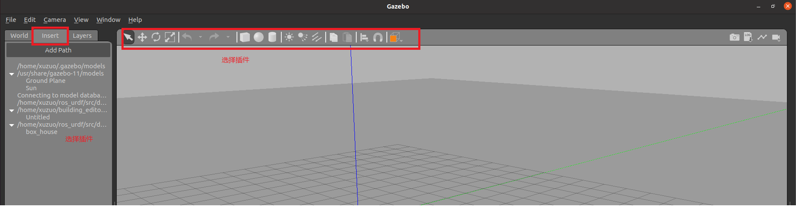
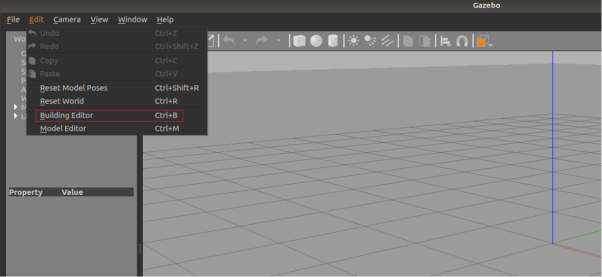

到目前为止，我们已经可以将机器人模型显示在 Gazebo 之中了，但是当前默认情况下，在 Gazebo 中机器人模型是在 empty world 中，并没有类似于房间、家具、道路、树木... 之类的仿真物，如何在 Gazebo 中创建仿真环境呢？

Gazebo 中创建仿真实现方式有两种:

- 方式1: 直接添加内置组件创建仿真环境
- 方式2: 手动绘制仿真环境(更为灵活)

也还可以直接下载使用官方或第三方提高的仿真环境插件。

# 01 添加内置组件创建仿真环境

## 1.1 启动 Gazebo 并添加组件



## 1.2 保存仿真环境

添加完毕后，选择 file ---> Save World as 选择保存路径(功能包下: worlds 目录)，文件名自定义，后缀名设置为 `.sdf` 

## 1.3 启动

```xml
<launch>

    <!-- 将 Urdf 文件的内容加载到参数服务器 -->
    <param name="robot_description" command="$(find xacro)/xacro $(find gazebo_myworld)/urdf/robot.xacro" />
    <!-- 启动 gazebo -->
    <include file="$(find gazebo_ros)/launch/empty_world.launch">
        <arg name="world_name" value="$(find gazebo_myworld)/worlds/myworld.sdf" />
    </include>

    <!-- 在 gazebo 中显示机器人模型 -->
    <node pkg="gazebo_ros" type="spawn_model" name="model" args="-urdf -model mycar -param robot_description"  />
</launch>
```

> 核心 : 启动 empty_world 后，再根据 `arg` 加载自定义的仿真环境

# 02 自定义仿真环境

## 2.1 绘制仿真环境



## 2.2 完成绘制

点击: 左上角 file ---> Save (保存路径功能包下的: models)

然后 file ---> Exit Building Editor

## 2.3 保存

同 [1.2](08%20Gazebo%20Env.md#1.2%20保存仿真环境) 一致

## 2.4 启动

同 [1.3](08%20Gazebo%20Env.md#1.3%20启动) 一致

