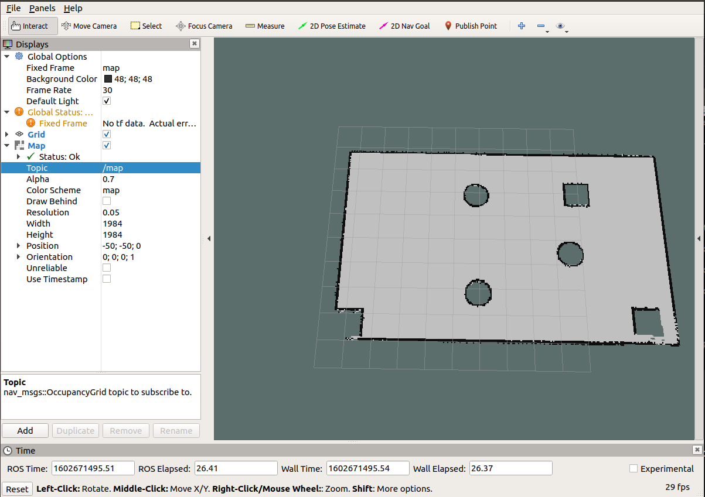

上一节我们已经实现通过 `gmapping` 的构建地图并在 `rviz` 中显示了地图，不过，上一节中地图数据是保存在内存中的，当节点关闭时，数据也会被一并释放，我们需要将栅格地图序列化到的磁盘以持久化存储，后期还要通过反序列化读取磁盘的地图数据再执行后续操作。在ROS中，**地图数据的序列化与反序列化可以通过 `map_server` 功能包实现** 。

# 01 `map_server` 简介

`map_server` 功能包中提供了两个节点 : `map_saver` 和 `map_server` ，**前者用于将栅格地图保存到磁盘**，**后者读取磁盘的栅格地图并以服务的方式提供出去** 。

# 02 保存地图
## 2.1 `map_saver`

**订阅的 Topic** : 

- `map(nav_msgs/OccupancyGrid)` - 订阅此话题用于生成地图文件。

## 2.2 launch

地图保存的语法比较简单，编写一个 `launch` 文件，内容如下 : 

```xml
<launch>
    <arg name="filename" value="$(find mycar_nav)/map/nav" />
    <node name="map_save" pkg="map_server" type="map_saver" args="-f $(arg filename)" />
</launch>
```

SLAM建图完毕后，执行该launch文件即可。

测试:

> 首先，参考上一节，依次启动仿真环境，键盘控制节点与SLAM节点；
> 
> 然后，通过键盘控制机器人运动并绘图；
> 
> 最后，通过上述地图保存方式保存地图。
> 
> 结果：在指定路径下会生成两个文件，xxx.pgm 与 xxx.yaml

## 2.3 保存文件

`xxx.pgm` 本质是一张图片，直接使用图片查看程序即可打开。

`xxx.yaml` 保存的是地图的元数据信息，用于描述图片，内容格式如下 : 

```yaml
image: /home/rosmelodic/ws02_nav/src/mycar_nav/map/nav.pgm
resolution: 0.050000
origin: [-50.000000, -50.000000, 0.000000]
negate: 0
occupied_thresh: 0.65
free_thresh: 0.196
```

- **`image`** - 被描述的图片资源路径，可以是绝对路径也可以是相对路径。
- **`resolution`** - 图片分片率(单位: m/像素)。
- **`origin`** - 地图中左下像素的二维姿势，为（x，y，偏航），偏航为逆时针旋转（偏航= 0表示无旋转）。
- **`occupied_thresh`** - 占用概率大于此阈值的像素被视为完全占用。
- **`free_thresh`** - 占用率小于此阈值的像素被视为完全空闲。
- **`negate`** - 是否应该颠倒白色/黑色自由/占用的语义。

# 03 地图服务

## 3.1 `map_server`

**发布的话题** : 

- `map_metadata (nav_msgs / MapMetaData)` - 发布地图元数据。

- `map (nav_msgs / OccupancyGrid)` - 地图数据。

**服务** : 

`static_map（nav_msgs / GetMap）` - 通过此服务获取地图。

**参数** : 

`~frame_id（字符串，默认值：“map”）` - 地图坐标系。

## 3.2 读取地图

通过 `map_server` 的 `map_server` 节点可以读取栅格地图数据，编写 `launch` 文件如下 : 

```xml
<launch>
    <!-- 设置地图的配置文件 -->
    <arg name="map" default="nav.yaml" />
    <!-- 运行地图服务器，并且加载设置的地图-->
    <node name="map_server" pkg="map_server" type="map_server" args="$(find mycar_nav)/map/$(arg map)"/>
</launch>
```

## 3.3 显示地图

在 rviz 中使用 map 组件可以显示栅格地图  : 

