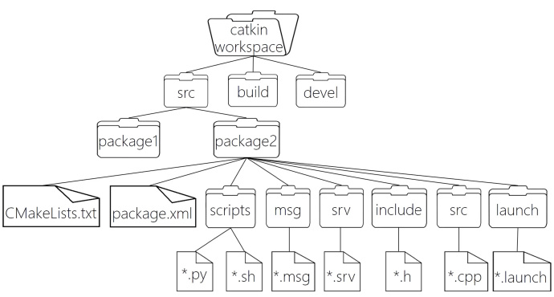

ROS 的项目架构有如下的组织形式 : 



```text
WorkSpace --- 自定义的工作空间
    |--- build/ 编译空间，用于存放CMake和catkin的缓存信息、配置信息和其他中间文件。
    |--- devel/ 开发空间，用于存放编译后生成的目标文件，包括头文件、动态&静态链接库、可执行文件等。
    |--- src/ 源码
        |-- package/ 功能包(ROS基本单元)包含多个节点、库与配置文件，包名所有字母小写，只能由字母、数字与下划线组成
            |-- CMakeLists.txt 配置编译规则，比如源文件、依赖项、目标文件
            |-- package.xml 包信息，比如:包名、版本、作者、依赖项...(以前版本是 manifest.xml)
            |-- scripts/ 存储python文件
            |-- src/ 存储C++源文件
            |-- include/ 头文件
            |-- msg/ 存放消息通信格式文件
            |-- srv/ 存放服务通信格式文件
            |-- action/ 存放动作格式文件
            |-- launch/ 可一次性运行多个节点 
            |-- config 配置信息
        |-- CMakeLists.txt: 编译的基本配置
```

# 01 `package.xml`

该文件定义有关软件包的属性，例如软件包名称，版本号，作者，维护者以及对其他catkin软件包的依赖性。请注意，该概念类似于旧版 rosbuild 构建系统中使用的 `manifest.xml` 文件。

```xml
​<?xml version="1.0"?>
<!-- 格式: 以前是 1，推荐使用格式 2 -->
<package format="2">
  <!-- 包名 -->
  <name>demo01_hello_vscode</name>
  <!-- 版本 -->
  <version>0.0.0</version>
  <!-- 描述信息 -->
  <description>The demo01_hello_vscode package</description>

  <!-- One maintainer tag required, multiple allowed, one person per tag -->
  <!-- Example:  -->
  <!-- <maintainer email="jane.doe@example.com">Jane Doe</maintainer> -->
  <!-- 维护人员 -->
  <maintainer email="2991151588@qq.com">blake-u</maintainer>


  <!-- One license tag required, multiple allowed, one license per tag -->
  <!-- Commonly used license strings: -->
  <!--   BSD, MIT, Boost Software License, GPLv2, GPLv3, LGPLv2.1, LGPLv3 -->
  <!-- 许可证信息，ROS核心组件默认 BSD -->
  <license>TODO</license>


  <!-- Url tags are optional, but multiple are allowed, one per tag -->
  <!-- Optional attribute type can be: website, bugtracker, or repository -->
  <!-- Example: -->
  <!-- <url type="website">http://wiki.ros.org/demo01_hello_vscode</url> -->


  <!-- Author tags are optional, multiple are allowed, one per tag -->
  <!-- Authors do not have to be maintainers, but could be -->
  <!-- Example: -->
  <!-- <author email="jane.doe@example.com">Jane Doe</author> -->


  <!-- The *depend tags are used to specify dependencies -->
  <!-- Dependencies can be catkin packages or system dependencies -->
  <!-- Examples: -->
  <!-- Use depend as a shortcut for packages that are both build and exec dependencies -->
  <!--   <depend>roscpp</depend> -->
  <!--   Note that this is equivalent to the following: -->
  <!--   <build_depend>roscpp</build_depend> -->
  <!--   <exec_depend>roscpp</exec_depend> -->
  <!-- Use build_depend for packages you need at compile time: -->
  <!--   <build_depend>message_generation</build_depend> -->
  <!-- Use build_export_depend for packages you need in order to build against this package: -->
  <!--   <build_export_depend>message_generation</build_export_depend> -->
  <!-- Use buildtool_depend for build tool packages: -->
  <!--   <buildtool_depend>catkin</buildtool_depend> -->
  <!-- Use exec_depend for packages you need at runtime: -->
  <!--   <exec_depend>message_runtime</exec_depend> -->
  <!-- Use test_depend for packages you need only for testing: -->
  <!--   <test_depend>gtest</test_depend> -->
  <!-- Use doc_depend for packages you need only for building documentation: -->
  <!--   <doc_depend>doxygen</doc_depend> -->
  <!-- 依赖的构建工具，这是必须的 -->
  <buildtool_depend>catkin</buildtool_depend>

  <!-- 指定构建此软件包所需的软件包 -->
  <build_depend>roscpp</build_depend>
  <build_depend>rospy</build_depend>
  <build_depend>std_msgs</build_depend>

  <!-- 指定根据这个包构建库所需要的包 -->
  <build_export_depend>roscpp</build_export_depend>
  <build_export_depend>rospy</build_export_depend>
  <build_export_depend>std_msgs</build_export_depend>

  <!-- 运行该程序包中的代码所需的程序包 -->  
  <exec_depend>roscpp</exec_depend>
  <exec_depend>rospy</exec_depend>
  <exec_depend>std_msgs</exec_depend>


  <!-- The export tag contains other, unspecified, tags -->
  <export>
    <!-- Other tools can request additional information be placed here -->

  </export>
</package>
```