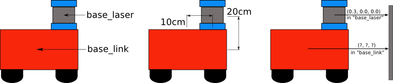
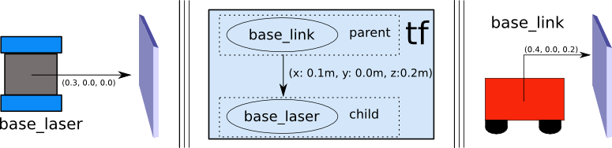
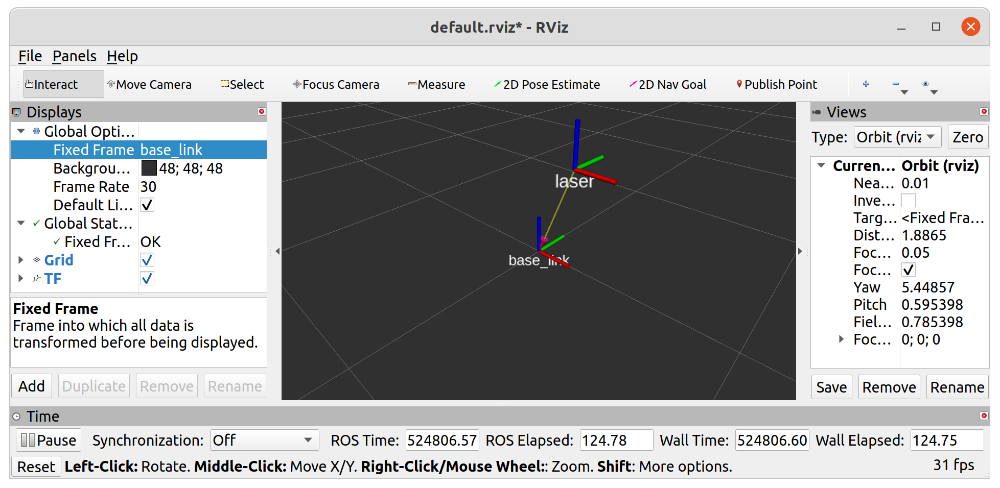
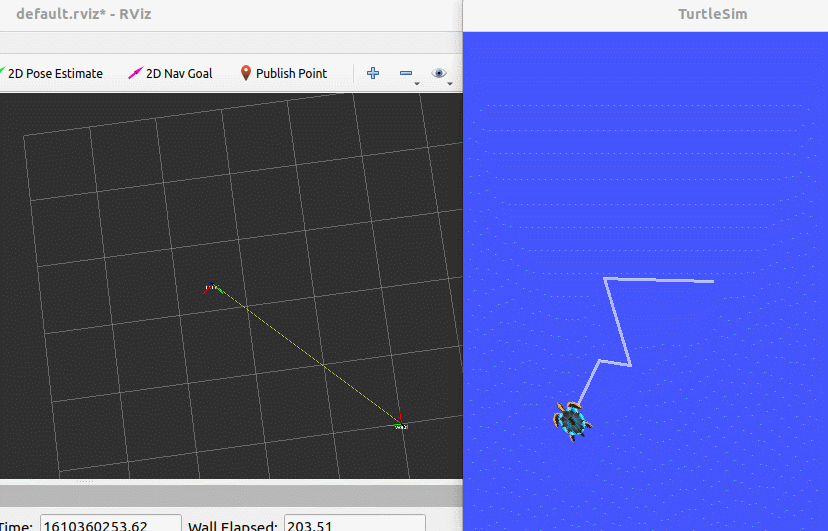
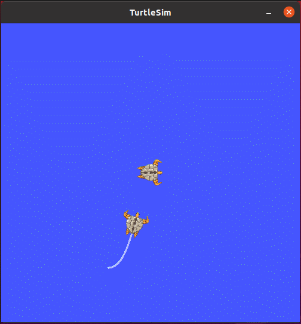

机器人系统上，有多个传感器，如激光雷达、摄像头等，有的传感器是可以感知机器人周边的物体方位(或者称之为:坐标，横向、纵向、高度的距离信息)的，以协助机器人定位障碍物，可以直接将物体相对该传感器的方位信息，等价于物体相对于机器人系统或机器人其它组件的方位信息吗？显示是不行的，这中间需要一个转换过程。更具体描述如下:

> 场景1:雷达与小车
> 
> 现有一移动式机器人底盘，在底盘上安装了一雷达，雷达相对于底盘的偏移量已知，现雷达检测到一障碍物信息，获取到坐标分别为(x,y,z)，该坐标是以雷达为参考系的，如何将这个坐标转换成以小车为参考系的坐标呢？





# 01 坐标 msg

订阅发布模型中数据载体 msg 是一个重要实现，首先需要了解一下，在坐标转换实现中常用的 msg : `geometry_msgs/TransformStamped` 和 `geometry_msgs/PointStamped` 

前者用于传输坐标系相关位置信息，后者用于传输某个坐标系内坐标点的信息。在坐标变换中，频繁的需要使用到坐标系的相对关系以及坐标点信息。

## 1.1 `geometry_msgs/TransformStamped`

命令行键入 : `rosmsg info geometry_msgs/TransformStamped`

```
std_msgs/Header header                     #头信息
  uint32 seq                                 #|-- 序列号
  time stamp                                 #|-- 时间戳
  string frame_id                            #|-- 父坐标 ID
string child_frame_id                    #坐标系的 id
geometry_msgs/Transform transform        #坐标信息
  geometry_msgs/Vector3 translation        #偏移量
    float64 x                                #|-- X 方向的偏移量
    float64 y                                #|-- Y 方向的偏移量
    float64 z                                #|-- Z 方向上的偏移量
  geometry_msgs/Quaternion rotation        #四元数
    float64 x                                
    float64 y                                
    float64 z                                
    float64 w
```

四元数用于表示坐标的相对姿态

## 1.2 `geometry_msgs/PointStamped` 

命令行键入 : `rosmsg info geometry_msgs/PointStamped`

```
std_msgs/Header header                    #头
  uint32 seq                                #|-- 序号
  time stamp                                #|-- 时间戳
  string frame_id                           #|-- 所属坐标系的 id
geometry_msgs/Point point                #点坐标
  float64 x                                 #|-- x y z 坐标
  float64 y
  float64 z
```

# 02 静态坐标变换

所谓静态坐标变换，是指两个坐标系之间的相对位置是固定的。

**需求描述:**

现有一机器人模型，核心构成包含主体与雷达，各对应一坐标系，坐标系的原点分别位于主体与雷达的物理中心，已知雷达原点相对于主体原点位移关系如下: `x : 0.2,  y: 0.0,  z: 0.5` 。当前雷达检测到一障碍物，在雷达坐标系中障碍物的坐标为 `(2.0, 3.0, 5.0)` ,请问，该障碍物相对于主体的坐标是多少？

**实现分析:**

1. 坐标系相对关系，可以通过发布方发布
2. 订阅方，订阅到发布的坐标系相对关系，再传入坐标点信息(可以写死)，然后借助于 tf 实现坐标变换，并将结果输出

## 2.1 package

```bash
mkdir static_tf/src -p
cd static_tf
catkin_make

cd src
catkin_create_pkg static_tf roscpp tf2 tf2_ros tf2_geometry_msgs std_msgs
```

## 2.2 Code

### 2.2.1 `transform.cpp`

通过 `tf2_ros::StaticTransformBroadcaster` 来广播两坐标系之间的相对关系。

```C++
#include <ros/ros.h>
#include <tf2_ros/static_transform_broadcaster.h>
#include <geometry_msgs/TransformStamped.h>
#include <tf2/LinearMath/Quaternion.h>


int main(int argc, char *argv[])
{
    ros::init(argc, argv, "static_broadcast");
    
    // create static frame transformation broadcaster
    tf2_ros::StaticTransformBroadcaster broadcaster;
    // create the frame information
    geometry_msgs::TransformStamped ts;
    
    //* set the header
    ts.header.seq = 100;
    ts.header.stamp = ros::Time();
    ts.header.frame_id = "base_link";

    //* set the children frame id
    ts.child_frame_id = "laser";

    //* set the translation
    ts.transform.translation.x = 0.2;
    ts.transform.translation.y = 0.0;
    ts.transform.translation.z = 0.5;

    //* set the quaternion from eular angle
    tf2::Quaternion qtn;
    qtn.setRPY(0, 0, 0);
    ts.transform.rotation.x = qtn.getX();
    ts.transform.rotation.y = qtn.getY();
    ts.transform.rotation.z = qtn.getZ();
    ts.transform.rotation.w = qtn.getW();

    // send the information by broadcast
    broadcaster.sendTransform(ts);
    ros::spin();

    return 0;
}
```

### 2.2.2 `get_transformation.cpp` 

通过 `tf2_ros::TransformListener` 来监听广播内容，并将其读入 `tf2_ros::Buffer` ，最后通过 `buffer.transform` 转换坐标。

```C++
#include <ros/ros.h>
#include <tf2_ros/transform_listener.h>
#include <tf2_ros/buffer.h>
#include <geometry_msgs/TransformStamped.h>
#include <tf2_geometry_msgs/tf2_geometry_msgs.h>


int main(int argc, char *argv[])
{
    ros::init(argc, argv, "tf_sub");
    ros::NodeHandle handler;

    // create TF subscription node
    //* tf2_ros::Buffer is used to store the data
    tf2_ros::Buffer buffer;
    tf2_ros::TransformListener listener(buffer);

    geometry_msgs::PointStamped point_laser;
    point_laser.header.frame_id = "laser";
    point_laser.header.stamp = ros::Time();
    point_laser.point.x = 1;
    point_laser.point.y = 2;
    point_laser.point.z = 7.3;

    // transform the frame
    auto timer_callback = 
    [&buffer, point_laser](const ros::TimerEvent& event) -> void
    {
        try
        {
            geometry_msgs::PointStamped point_base;
            point_base = buffer.transform(point_laser, "base_link");
            ROS_INFO(
                "After : (%.2f, %.2f, %.2f) in frame %s",
                point_base.point.x, point_base.point.y, point_base.point.z, point_base.header.frame_id.c_str()
            );
        }
        catch(const std::exception& e)
        {
            ROS_ERROR("ERROR !");
        }
    };

    ros::Timer timer = handler.createTimer(ros::Duration(3), timer_callback);

    ros::spin();
    ros::shutdown();
    
    return 0;
}
```

## 2.3 Visualization

我们可以通过 `rviz` 环境查看坐标转化的结果 : 

- 新建窗口输入命令 : `rviz` ;
- 在启动的 rviz 中设置 `Fixed Frame` 为 `base_link`;
- 点击左下的 `add` 按钮，在弹出的窗口中选择 `TF` 组件，即可显示坐标关系。



# 03 动态坐标转换

所谓动态坐标变换，是指两个坐标系之间的相对位置是变化的。

**需求描述:**

启动 turtlesim_node,该节点中窗体有一个世界坐标系(左下角为坐标系原点)，乌龟是另一个坐标系，键盘控制乌龟运动，将两个坐标系的相对位置动态发布。

**结果演示:**



## 3.1 Package

```bash
mkdir -p dynamic_tf/src
cd dynamic_tf
catkin_make

cd src
catkin_create_pkg dynamic_tf roscpp std_msgs tf2 tf2_ros tf2_geometry_msgs geometry_msgs turtlesim
```

# 3.2 Code

### 3.2.1 `tramsform.cpp` 

```C++
#include <ros/ros.h>
#include <turtlesim/Pose.h>
#include <tf2_ros/transform_broadcaster.h>
#include <tf2/LinearMath/Quaternion.h>
#include <geometry_msgs/TransformStamped.h>

void sub_callback(const turtlesim::Pose::ConstPtr& p)
{
    static tf2_ros::TransformBroadcaster broadcaster;
    geometry_msgs::TransformStamped tfs;
    
    // set the header
    tfs.header.frame_id = "world";
    tfs.header.stamp = ros::Time::now();

    // set child frame
    tfs.child_frame_id = "turtle1";

    // set the relative information
    tfs.transform.translation.x = p->x;
    tfs.transform.translation.y = p->y;
    tfs.transform.translation.z = 0.0;
    
    // set the quaternion
    tf2::Quaternion qtn;
    qtn.setRPY(0, 0, p->theta);
    tfs.transform.rotation.x = qtn.getX();
    tfs.transform.rotation.y = qtn.getY();
    tfs.transform.rotation.z = qtn.getZ();
    tfs.transform.rotation.w = qtn.getW();

    broadcaster.sendTransform(tfs);
}

int main(int argc, char *argv[])
{
    ros::init(argc, argv, "dynamic_tf_pub");
    ros::NodeHandle handler;

    ros::Subscriber sub = handler.subscribe<turtlesim::Pose>("/turtle1/pose", 10, sub_callback);
    
    ros::spin();

    return 0;
}
```

动态与静态的区别在于每次处理的数据不同，使用的广播器也不同。

### 3.2.2 `tf_sub.cpp` 

```C++
#include <ros/ros.h>
#include <geometry_msgs/TransformStamped.h>
#include <tf2_ros/buffer.h>
#include <tf2_ros/transform_listener.h>
#include <tf2_geometry_msgs/tf2_geometry_msgs.h>


int main(int argc, char *argv[])
{
    ros::init(argc, argv, "tf_sub");
    ros::NodeHandle handler;

    tf2_ros::Buffer buffer;
    tf2_ros::TransformListener listener(buffer);

    geometry_msgs::PointStamped point_turtle;
    point_turtle.header.frame_id = "turtle1";
    point_turtle.header.stamp = ros::Time();

    point_turtle.point.x = 1;
    point_turtle.point.y = 1;
    point_turtle.point.z = 0;

    auto timer_callback =
    [&buffer, point_turtle](const ros::TimerEvent& event) -> void
    {
        try
        {
            geometry_msgs::PointStamped point_base;
            point_base = buffer.transform(point_turtle, "world");
            ROS_INFO(
                "Before : (%.2f, %.2f, %.2f) in turtle frame\nAfter : (%.2f, %.2f, %.2f) in world frame",
                point_turtle.point.x, point_turtle.point.y, point_turtle.point.z, 
                point_base.point.x, point_base.point.y, point_base.point.z
            );
        }
        catch(const std::exception& e)
        {
            ROS_ERROR("ERROR !");
        }
        
    };

    ros::Timer timer = handler.createTimer(ros::Duration(3), timer_callback);
    ros::spin();
    ros::shutdown();
    
    return 0;
}
```

# 04 实操

**需求描述:**

程序启动之初: 产生两只乌龟，中间的乌龟(A) 和 左下乌龟(B), B 会自动运行至A的位置，并且键盘控制时，只是控制 A 的运动，但是 B 可以跟随 A 运行

**结果演示:**



**实现分析:**

乌龟跟随实现的核心，是乌龟A和B都要发布相对世界坐标系的坐标信息，然后，订阅到该信息需要转换获取A相对于B坐标系的信息，最后，再生成速度信息，并控制B运动。

1. 启动乌龟显示节点
2. 在乌龟显示窗体中生成一只新的乌龟(需要使用服务)
3. 编写两只乌龟发布坐标信息的节点
4. 编写订阅节点订阅坐标信息并生成新的相对关系生成速度信息

**准备工作:**

1. 了解如何创建第二只乌龟，且不受键盘控制

创建第二只乌龟需要使用 `rosservice` ,话题使用的是 `spawn` 

```bash
rosservice call /spawn "x: 1.0
y: 1.0
theta: 1.0
name: 'turtle_flow'" 
name: "turtle_flow"
```

2. 了解如何获取两只乌龟的坐标

是通过话题  `/turtle_flow/pose` 来获取的

```text
x: 1.0 //x坐标
y: 1.0 //y坐标
theta: -1.21437060833 //角度
linear_velocity: 0.0 //线速度
angular_velocity: 1.0 //角速度
```

## 4.1 创建功能包

```bash
mkdir -p turtle_follow/src
cd turtle_follow
catkin_make

cd src
catkin_create_pkg turtle_follow roscpp tf2 tf2_ros tf2_geometry_msgs geometry_msgs std_msgs turtlesim
```

## 4.2 服务客户端

我们将写一个客户端用于生成第二只乌龟 : 

```C++
#include <ros/ros.h>
#include <turtlesim/Spawn.h>


int main(int argc, char *argv[])
{
    ros::init(argc, argv, "create_turtle");
    ros::NodeHandle handler;

    ros::ServiceClient client = handler.serviceClient<turtlesim::Spawn>("/spawn");
    client.waitForExistence();
    
    turtlesim::Spawn spawn;
    spawn.request.name = "turtle2";
    spawn.request.x = 1.0;
    spawn.request.y = 2.0;
    spawn.request.theta = 3.1415926;

    if (client.call(spawn))
    {
        ROS_INFO("Create %s successfully !", spawn.response.name.c_str());
    }
    else
    {
        ROS_ERROR("Create %s failed !", spawn.request.name.c_str());
    }

    ros::spinOnce();
    
    return 0;
}
```

其中，我们通过请求 `/spawn` 服务来新增小乌龟。

## 4.3 发布方

我们还要写一个话题用来发布两只乌龟的位姿 : 

```C++
#include <ros/ros.h>
#include <tf2_ros/transform_broadcaster.h>
#include <geometry_msgs/TransformStamped.h>
#include <tf2/LinearMath/Quaternion.h>
#include <turtlesim/Pose.h>

static std::string turtle_name;

void sub_callback(const turtlesim::Pose::ConstPtr& p)
{
    static tf2_ros::TransformBroadcaster broadcaster;
    geometry_msgs::TransformStamped tfs;
    extern std::string turtle_name;
    tfs.header.frame_id = "world";
    tfs.header.stamp = ros::Time::now();
    tfs.child_frame_id = turtle_name;
    tfs.transform.translation.x = p->x;
    tfs.transform.translation.y = p->y;
    tfs.transform.translation.z = 0;
    tf2::Quaternion qtn;
    qtn.setRPY(0, 0, p->theta);
    tfs.transform.rotation.x = qtn.getX();
    tfs.transform.rotation.y = qtn.getY();
    tfs.transform.rotation.z = qtn.getZ();
    tfs.transform.rotation.w = qtn.getW();

    broadcaster.sendTransform(tfs);

}

int main(int argc, char *argv[])
{
    ros::init(argc, argv, "pub_coordination");
    if (argc != 2)
    {
	    ROS_ERROR("Please input the right args !");
		ROS_INFO_STREAM("Correct number of parameters : 2");
		ROS_INFO_STREAM("The number inputed : " << argc);;
		for (int i = 0; i < argc; i++)
		{
			ROS_INFO_STREAM(argv[i]);
		}
    }
    else
    {
        turtle_name = argv[1];
        ROS_INFO("start broadcast the coordination of %s", turtle_name.c_str());
    }

    ros::NodeHandle handler;
    ros::Subscriber sub = handler.subscribe<turtlesim::Pose>(turtle_name + "/pose", 10, sub_callback);
    
    ros::spin();

    return 0;
}
```

在发布方中，我们将使用外传参数的方法来设置目标小乌龟，但传入的参数数量应该是确定的 ：对于一个程序在运行的时候，其默认传递一个 **当前运行的程序名作为参数**，即 `$0` ，因此，我们人为传入的其余参数都是在这个参数之后，我们的第一个参数在列表中应该为 `argv[1]` 。

此外，在广播小乌龟的坐标时，我们应该将其 **父坐标** 设置为同一个坐标，这样在后续坐标转化的时候才有一个用于参考的坐标系，否则无法完成坐标转化。

> [!note] TransformStamped
> 这是一个用于描述坐标系之间的变换的数据类型
> 
> 在 `geometry_msgs/TransformStamped` 中，我们的 `header.frame_id` 应该是其父坐标系，而 `child_frame_id` 则是以自己为原点建立的坐标系的名称。并且 `transform` 中的所有参数都是用于 **描述该坐标系相对于父坐标系的位姿** 

## 4.4 订阅方

解析坐标信息并进行坐标变换 : 

```C++
#include <ros/ros.h>
#include <tf2_geometry_msgs/tf2_geometry_msgs.h>
#include <tf2_ros/buffer.h>
#include <tf2_ros/transform_listener.h>
#include <geometry_msgs/Twist.h>
#include <geometry_msgs/TransformStamped.h>


int main(int argc, char *argv[])
{
    ros::init(argc, argv, "turtle_follow");
    ros::NodeHandle handler;
    tf2_ros::Buffer buffer;
    tf2_ros::TransformListener listener(buffer);

    ros::Publisher pub = handler.advertise<geometry_msgs::Twist>("/turtle2/cmd_vel", 10);

    auto timer_callback = 
    [&buffer, pub](const ros::TimerEvent& event) -> void
    {
        try
        {
	        /** brief Get the transform between two frames by frame ID.
			* param target_frame - The frame to which data should be transformed
			* param source_frame - The frame where the data originated
			* param time - The time at which the value of the transform is desired. (0 will get the latest)
			* return The transform between the frames
			*/
            geometry_msgs::TransformStamped tfs = buffer.lookupTransform("turtle2", "turtle1", ros::Time(0));

            geometry_msgs::Twist twist;
            twist.linear.x = 0.5 * sqrt(pow(tfs.transform.translation.x, 2) + pow(tfs.transform.translation.y, 2));
            twist.angular.z = atan2(tfs.transform.translation.y, tfs.transform.translation.x);

            pub.publish(twist);
        }
        catch(const std::exception& e)
        {
            ROS_ERROR("ERROR : %s !", e.what());
        }
        
    };


    ros::Timer timer = handler.createTimer(ros::Duration(0.1), timer_callback);

    ros::spin();
    
    return 0;
}
```

其中，我们通过 `buffer.lookupTransform()` 来转换坐标 : 

- `target_frame` - 我们将数据转换到这个坐标系上
- `source_frame` - 要被转换的坐标系
- `time` - 要转换的坐标系所处的时间

## 4.5 launch

我们将通过一个 `.launch` 文件来管理我们的包运行 : 

```launch
<?xml version="1.0"?>
<launch>

    <node name="turtle1" pkg="turtlesim" type="turtlesim_node" output="screen"/>
    <node name="key_control" pkg="turtlesim" type="turtle_teleop_key" output="screen"/>
    <!-- 第二只乌龟节点 -->
    <node name="turtle2" pkg="turtle_follow" type="turtle_client" output="screen"/>
    <!-- 坐标发布节点 -->
    <node name="caster1" pkg="turtle_follow" type="coordination" output="screen" args="turtle1" />
    <node name="caster2" pkg="turtle_follow" type="coordination" output="screen" args="turtle2" />
    <!-- 坐标转换节点 -->
    <node name="turtle_transform" pkg="turtle_follow" type="turtle_transform" output="screen"/>
    
</launch>
```
