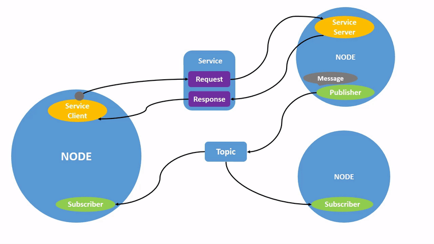

# 01 Node of ROS2

ROS2中 **每一个节点** 也是只 **负责一个单独的模块化的功能**（比如一个节点负责控制车轮转动，一个节点负责从激光雷达获取数据、一个节点负责处理激光雷达的数据、一个节点负责定位等等）。

# 02 Interaction between Nodes

上面举了一个激光雷达的例子，一个节点负责获取激光雷达的扫描数据，一个节点负责处理激光雷达数据，比如去除噪点。

那节点与节点之间就必须要通信了，那他们之间该如何通信呢？ROS2早已为你准备好了一共四种通信方式 : 

- 话题 - topics
- 服务 - services
- 动作 - Action
- 参数 - parameters



# 03 Start a Node

## 3.1 `ros2 run` 

命令 `ros2 run` 能够启动 **包 (package)** 中一个可执行文件 : 

```bash
ros2 run <package> <executable>
```

要运行 turtlesim，请打开一个新终端，然后输入以下命令 :

```bash
ros2 run turtlesim turtlesim_node
```

这样就启动了小乌龟的示例。

## 3.2 node list

我们可以通过 `rqt` 这个 GUI 界面来查看我们的 ros2 服务，也可以通过 `ros2 node list` 来返回正在运行的节点名称。

> [!note] 
> 如何安装 rqt ?
> 
> ```bash
> sudo apt install '~nros-rolling-rqt*'
> ```
> 
> 启动 rqt : 
> 
> ```bash
> rqt
> ```

当我们启动了 `turtlesim_node` 时， `ros2 node list` 就会返回节点名 : 

```text
/turtlesim
```


此时，我们打开另一个终端并启用键盘 : 

```bash
ros2 run turtlesim turtle_teleop_key
```

这时我们输入 `ros2 node list` 则会返回 : 

```text
/turtlesim
/teleop_turtle
```

## 3.3 node info

我们可以通过以下命令来获取关于一个节点更详细的信息 : 

```bash
ros2 node info <node_name>
```

我们查看 turtlesim 的节点信息 : 

```bash
ros2 node info /turtlesim
```

他会返回 : 

```text
/turtlesim
  Subscribers:
    /parameter_events: rcl_interfaces/msg/ParameterEvent
    /turtle1/cmd_vel: geometry_msgs/msg/Twist
  Publishers:
    /parameter_events: rcl_interfaces/msg/ParameterEvent
    /rosout: rcl_interfaces/msg/Log
    /turtle1/color_sensor: turtlesim/msg/Color
    /turtle1/pose: turtlesim/msg/Pose
  Service Servers:
    /clear: std_srvs/srv/Empty
    /kill: turtlesim/srv/Kill
    /reset: std_srvs/srv/Empty
    /spawn: turtlesim/srv/Spawn
    /turtle1/set_pen: turtlesim/srv/SetPen
    /turtle1/teleport_absolute: turtlesim/srv/TeleportAbsolute
    /turtle1/teleport_relative: turtlesim/srv/TeleportRelative
    /turtlesim/describe_parameters: rcl_interfaces/srv/DescribeParameters
    /turtlesim/get_parameter_types: rcl_interfaces/srv/GetParameterTypes
    /turtlesim/get_parameters: rcl_interfaces/srv/GetParameters
    /turtlesim/list_parameters: rcl_interfaces/srv/ListParameters
    /turtlesim/set_parameters: rcl_interfaces/srv/SetParameters
    /turtlesim/set_parameters_atomically: rcl_interfaces/srv/SetParametersAtomically
  Service Clients:

  Action Servers:
    /turtle1/rotate_absolute: turtlesim/action/RotateAbsolute
  Action Clients:
```

包括 **订阅者(subscriber)** ， **发布者(publisher)** ，节点的 **服务(Service)** 和 **动作(Action)** 等信息。