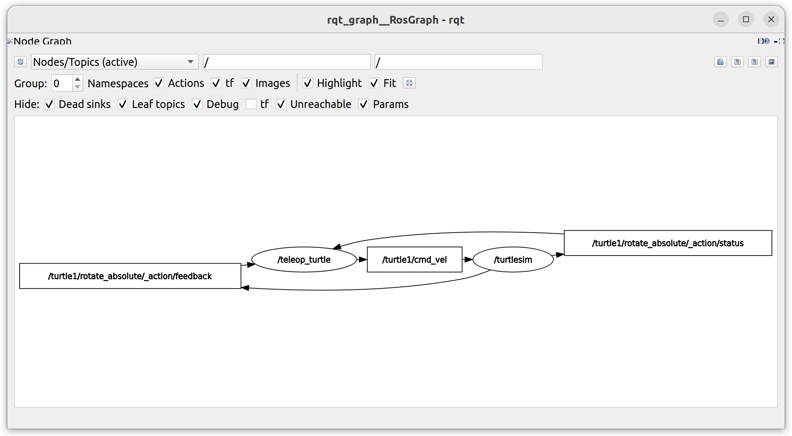
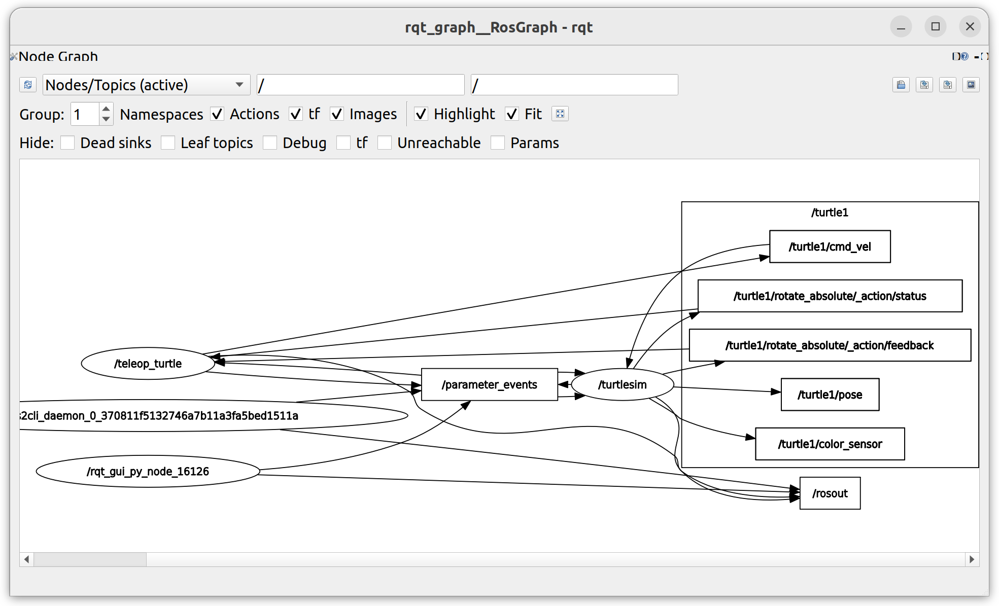
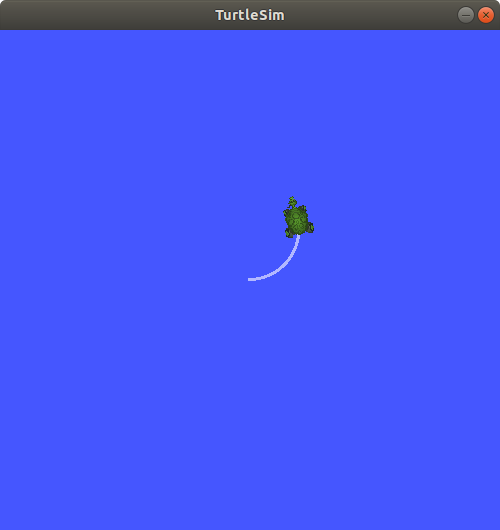

**话题(Topic)通信** 是 ros2 中一个 **用于数据通信** 的及其重要的方法。一个节点可以向任意多个话题发布(Publish)数据，也可以订阅(Subscribe)任意多个话题来接受数据。


# `rqt_graph`

`rqt_graph` 是一个用于可视化节点和话题的工具，可以清晰地展示出他们之间的联系，我们先运行一个节点 : 

```bash
# one
ros2 run turtlesim turtlesim_node

# another
ros2 run turtlesim turtle_teleop_key
```

在运行节点之后，我们了就可以直接通过 `rqt_graph` 来可视化 : 

```bash
rqt_graph
```



> [!attention] 
> 我们需要先选择激活的话题 `Nodes/Topics (active)` ，然后刷新，才能显示出话题通信的关系

> 此外，我们也可以在 rqt 中打开该视图 : `Plugins > Introspection > Node Graph` 

上图展示了 `/turtlesim` 和 `/teleop_turtle` 两个节点(圆形)之间如何通过话题(矩形)进行通信，如果你将鼠标移动到某个话题上，还能看到颜色高亮。 `/teleop_turtle` 发布 `/turtle1/cmd_vel` 话题， `/turtlesim` 订阅该话题，然后键盘控制的移动信息就通过该话题从 `/teleop_turtle` 传输到 `/turtlesim` 。

# `ros2 topic list` 

`ros2 topic list` 能够列出当前正在使用的话题，以 `/turtlesim` 和 `/teleop_turtle` 为例 : 

```text
/parameter_events
/rosout
/turtle1/cmd_vel
/turtle1/color_sensor
/turtle1/pose
```

`ros2 topic list -t` 则会将 **话题类别(topic type)** 在方括号中展示出来 : 

```text
/parameter_events [rcl_interfaces/msg/ParameterEvent]
/rosout [rcl_interfaces/msg/Log]
/turtle1/cmd_vel [geometry_msgs/msg/Twist]
/turtle1/color_sensor [turtlesim/msg/Color]
/turtle1/pose [turtlesim/msg/Pose]
```

在 rqt_graph 中，当我们将 `Hide` 的选项取消勾选是，就会展示出所有的话题 : 



# `ros2 topic echo` 

我们可以通过以下命令来查看被发布在话题上的数据 : 

```bash
ros2 topic echo <topic_name>
```

要查看 `/teleop_turtle` 发布在 `/turtle1/cmd_vel` 上控制乌龟移动的数据，我们可以 : 

```bash
ros2 topic echo /turtle1/cmd_vel
```

这样会打开一个交互的命令，但我们在 `/teleop_turtle` 中点击移动按键的时候，就会显示出发布的数据 : 

```text
~$ ros2 topic echo /turtle1/cmd_vel 
linear:
  x: 2.0
  y: 0.0
  z: 0.0
angular:
  x: 0.0
  y: 0.0
  z: 0.0
---
```

这时，我们回到 rqt_graph 中并取消勾选 `Debug` ，我们可以看到一个 `/_ros2cli_16822` 的节点被创建，并且 `/turtle1/cmv_vel` 话题指向该节点，这是我们 `echo` 名年创建的用于读取话题数据的节点。

# `ros2 topic info` 

我们可以通过以下命令来查看节点的发布及订阅情况 : 

```bash
ros2 topic info /turtle1/cmd_vel
```

这将会得到 : 

```text
Type: geometry_msgs/msg/Twist
Publisher count: 1
Subscription count: 2
```

该话题的两个订阅分别是 `/turtlesim` 和我们创建的 `/_ros2cli_16822` 。

# `ros2 interface show` 

节点通过 **消息(messages)** 向话题发布数据，发布者和订阅者必须 **使用相同类型的消息** 来发布和接受数据。我们可以看到， `/turtle1/cmd_vel` 通过 `geometry_msgs` 包中的 `msg` 消息的 `Twist` 类型来发布数据。

我们可以通过以下命令来查看这种消息类型的具体情况 : 

```bash
ros2 interface show <msg_type>
```

那么，我们查看 `/turtle1/cmd_vel` 话题的消息类型的信息应该使用 : 

```bash
ros2 interface show geometry_msgs/msg/Twist
```

这样会返回 : 

```text
# This expresses velocity in free space broken into its linear and angular parts.

Vector3  linear
	float64 x
	float64 y
	float64 z
Vector3  angular
	float64 x
	float64 y
	float64 z
```

这和我们上面监听到的数据类型是一致的。

# `ros2 topic pub` 

既然我们已经知道了消息的数据类型和目标话题，那么我们可以在命令行中手动发布数据 : 

```bash
ros2 topic pub <topic_name> <msg_type> '<args>'
```

其中 `'<args>'` 参数是我们要发布给某个话题的实际数据。该参数需要以 **YAML 格式** 进行传输，如 : 

```bash
ros2 topic pub --once /turtle1/cmd_vel geometry_msgs/msg/Twist \
	"{linear: {x: 2.0, y: 0.0, z: 0.0}, angular: {x: 0.0, y: 0.0, z: 1.8}}"
# --once 意味着发布一次消息之后就退出
```

这时，终端会返回 : 

```text
publisher: beginning loop
publishing #1: geometry_msgs.msg.Twist(linear=geometry_msgs.msg.Vector3(x=2.0, y=0.0, z=0.0), angular=geometry_msgs.msg.Vector3(x=0.0, y=0.0, z=1.8))
```

并且，小乌龟会进行移动 : 



除了一次性发布数据，我们还可以通过 `--rate` 参数来设置发布数据的频率 : 

```bash
ros2 topic pub --rate 1 /turtle1/cmd_vel geometry_msgs/msg/Twist "{linear: {x: 2.0, y: 0.0, z: 0.0}, angular: {x: 0.0, y: 0.0, z: 1.8}}"
```

以上命令将会以 1Hz (每秒一次) 的频率发布数据。

此时，若我们打开 rqt_graph 并刷新，我们能够找到一个新的节点 `/_ros2cli_18264` 向话题 `/turtle1/cmd_vel` 发布数据。

# `ros2 topic hz` 

我们还能通过以下命令来查看节点向某个话题发布数据的频率 : 

```bash
ros2 topic hz <topic_name>
```

在上面的 rqt_graph 中我们可以看到， `/turtlesim` 还向 `/turtle1/pose` 发布乌龟的姿态数据，我们可以查看这个频率 : 

```bash
ros2 topic hz /turtle1/pose
```

此时终端会不停地监视该话题，并返回数据发布的频率 : 

```text
average rate: 62.438
	min: 0.015s max: 0.017s std dev: 0.00048s window: 64
average rate: 62.473
	min: 0.015s max: 0.017s std dev: 0.00048s window: 127
average rate: 62.486
	min: 0.015s max: 0.018s std dev: 0.00052s window: 190
average rate: 62.486
	min: 0.015s max: 0.018s std dev: 0.00053s window: 253
```

> 我们也可以同时使用 `echo` 来监视数据的内容

