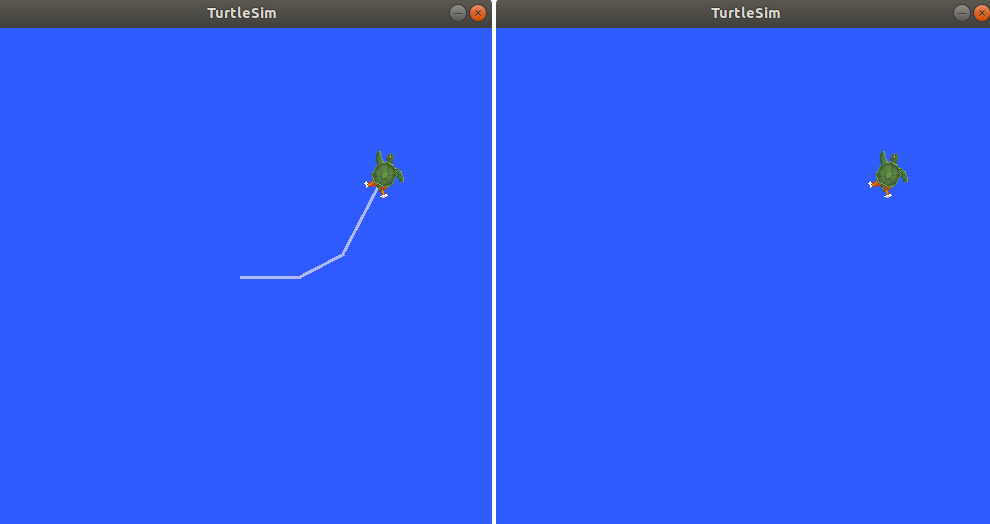
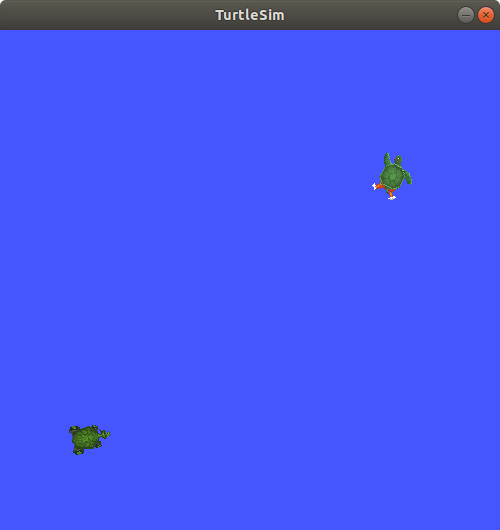

**服务(Service)** 是另一种常用的数据通信的方法。服务是基于 **请求(request)** 和 **响应(response)** 的通信方式。在服务通信的模型中，分为 **提供服务** 的 **服务器 (Service Server)** 和 **请求服务** 的 **客户端 (Service Client)** ，客户端可以通过向服务器请求服务，从而从服务器获取数据。


与话题通信不同的是 : 

- **服务通信是双向的**，只有当客户端请求服务的时候数据才会被传输；而 **话题通信是单向的**，只要发布者发布数据，订阅者就能接受数据，但订阅者不能主动向发布者请求数据
- 一个话题可以有多个发布者和订阅者；然而一个服务可以有 **多个客户端** ，却只能有 **一个服务器** 

# `ros2 service list` 

我们同样以 `/turtlesim` 和 `/teleop_turtle` 两个节点为例子。

在终端中输入 `ros2 service list` ，我们可以看到终端中会返回一系列正在使用的服务 : 

```test
/clear
/kill
/reset
/spawn
/teleop_turtle/describe_parameters
/teleop_turtle/get_parameter_types
/teleop_turtle/get_parameters
/teleop_turtle/list_parameters
/teleop_turtle/set_parameters
/teleop_turtle/set_parameters_atomically
/turtle1/set_pen
/turtle1/teleport_absolute
/turtle1/teleport_relative
/turtlesim/describe_parameters
/turtlesim/get_parameter_types
/turtlesim/get_parameters
/turtlesim/list_parameters
/turtlesim/set_parameters
/turtlesim/set_parameters_atomically
```

# `ros2 service type` 

和话题通信一样，发送请求和响应的数据也有自己的结构类型，不过，在服务模型中，数据类型分为**两个部分，一个部分是请求的结构，一个部分是响应的结构**，我们可以通过以下命令来查看服务的数据类型 : 

```bash
ros2 service type <service_name>
```

我们来看看 `/clear` 服务 : 

```bash
ros2 servive type /clear
```

这会在终端中返回 : 

```text
std_srvs/srv/Empty
```

`Empty` 类型意味着该服务在接收到请求的时候并不会发送任何数据，客户端不会接收到任何数据。

我们可以直接在 `ros2 service list` 后面接上 `-t` 选项来查看所有服务的类型 : 

```bash
ros2 service list -t
```

这会返回 : 

```text
/clear [std_srvs/srv/Empty]
/kill [turtlesim/srv/Kill]
/reset [std_srvs/srv/Empty]
/spawn [turtlesim/srv/Spawn]
/teleop_turtle/describe_parameters [rcl_interfaces/srv/DescribeParameters]
/teleop_turtle/get_parameter_types [rcl_interfaces/srv/GetParameterTypes]
/teleop_turtle/get_parameters [rcl_interfaces/srv/GetParameters]
/teleop_turtle/list_parameters [rcl_interfaces/srv/ListParameters]
/teleop_turtle/set_parameters [rcl_interfaces/srv/SetParameters]
/teleop_turtle/set_parameters_atomically [rcl_interfaces/srv/SetParametersAtomically]
/turtle1/set_pen [turtlesim/srv/SetPen]
/turtle1/teleport_absolute [turtlesim/srv/TeleportAbsolute]
/turtle1/teleport_relative [turtlesim/srv/TeleportRelative]
/turtlesim/describe_parameters [rcl_interfaces/srv/DescribeParameters]
/turtlesim/get_parameter_types [rcl_interfaces/srv/GetParameterTypes]
/turtlesim/get_parameters [rcl_interfaces/srv/GetParameters]
/turtlesim/list_parameters [rcl_interfaces/srv/ListParameters]
/turtlesim/set_parameters [rcl_interfaces/srv/SetParameters]
/turtlesim/set_parameters_atomically [rcl_interfaces/srv/SetParametersAtomically]
```

# `ros2 service info` 

我们可以通过以下命令来查看某个服务的信息 : 

```bash
ros2 service info <service_name>
```

这会返回服务的类型以及客户端和服务器的数量，我们以 `/clear` 为例 : 

```bash
ros2 service info /clear
```

结果是 : 

```text
Type: std_srvs/srv/Empty
Clients count: 0
Services count: 1
```

# `ros2 service find` 

我们可以通过以下命令来查找具有特殊类型的服务 : 

```bash
ros2 service find <type_name>
```

例如，我们可以查找所有类型为空的服务 : 

```bash
ros2 service find std_srvs/srv/Empty
```

结果是 : 

```text
/clear
/reset
```

# `ros2 interface show` 

我们仍然可以通过 `ros2 interface show` 来查看数据的类型，对于 `/clear` 服务的类型，其结果为 : 

```bash
ros2 interface show std_srvs/srv/Empty
```

```text
---
```

`---` 用于分隔 request 和 response 的数据结构，上方为 request 的结构，下方为 response 的结构，由于 `Empty` 是空的，所以没有任何结果，但是我们可以对其他具有特殊类型的服务进行查看 : 

```bash
ros2 interface show turtlesim/srv/Spawn
```

其结果是 : 

```text
float32 x
float32 y
float32 theta
string name # Optional.  A unique name will be created and returned if this is empty
---
string name
```

# `ros2 service call` 

在话题通信中，我们可以手动发布数据，在服务通信中，我们也能主动向服务器请求数据 : 

```bash
ros2 service call <service_name> <service_type> <args>
```

我们可以通过请求 `/clear` 服务来清理乌龟画出的线 : 

```bash
ros2 service call /clear std_srvs/srv/Empty
```



除了 `/clear` ，我们也能通过 `/spawn` 服务多增加一只小乌龟 : 

```bash
ros2 service call /spawn turtlesim/srv/Spawn "{x: 2, y: 2, theta: 0.2, name: ''}"
```

终端中会返回请求的信息和响应的信息 : 

```text
requester: making request: turtlesim.srv.Spawn_Request(x=2.0, y=2.0, theta=0.2, name='')

response:
turtlesim.srv.Spawn_Response(name='turtle2')
```

此时，屏幕中也会多出一直小乌龟 : 



# `ros2 service echo` 

同话题通信一样，我们也能通过 `echo` 监听并向终端输出服务器和客户端之间的通信 : 

```bash
ros2 service echo <service_name | service_type> <args>
```

这里我们以另一个节点为例子 : 

```bash
ros2 launch demo_nodes_cpp introspect_services_launch.py
```

```bash
ros2 param set /introspection_service service_configure_introspection contents
ros2 param set /introspection_client client_configure_introspection contents
```

然后，我们通过以下命令来监听 : 

```bash
ros2 service echo --flow-style /add_two_ints
```

其结果为 : 

```text
info:
  event_type: REQUEST_SENT
  stamp:
    sec: 1709408301
    nanosec: 423227292
  client_gid: [1, 15, 0, 18, 250, 205, 12, 100, 0, 0, 0, 0, 0, 0, 21, 3]
  sequence_number: 618
request: [{a: 2, b: 3}]
response: []
---
info:
  event_type: REQUEST_RECEIVED
  stamp:
    sec: 1709408301
    nanosec: 423601471
  client_gid: [1, 15, 0, 18, 250, 205, 12, 100, 0, 0, 0, 0, 0, 0, 20, 4]
  sequence_number: 618
request: [{a: 2, b: 3}]
response: []
---
info:
  event_type: RESPONSE_SENT
  stamp:
    sec: 1709408301
    nanosec: 423900744
  client_gid: [1, 15, 0, 18, 250, 205, 12, 100, 0, 0, 0, 0, 0, 0, 20, 4]
  sequence_number: 618
request: []
response: [{sum: 5}]
---
info:
  event_type: RESPONSE_RECEIVED
  stamp:
    sec: 1709408301
    nanosec: 424153133
  client_gid: [1, 15, 0, 18, 250, 205, 12, 100, 0, 0, 0, 0, 0, 0, 21, 3]
  sequence_number: 618
request: []
response: [{sum: 5}]
---
```

同样分为请求和响应的部分。

