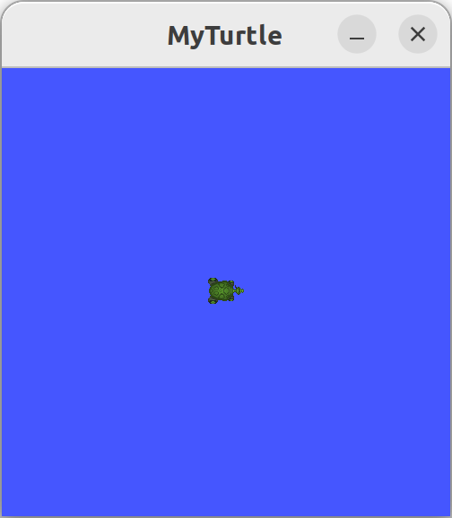

`colcon` 是对 ROS 构建工具 `catkin_make` , `catkin_make_isolated` , `catkin_tools` 和 `ament_tools` 的迭代。

ROS 工作区是具有 **特定结构的目录**。通常有一个 `src` 子目录。该子目录内是 ROS 包的 **源代码所在的位置**。通常，目录开始时为空。

`colcon` 执行源代码构建。默认情况下，它将在 `src` 的同级目录下创建以下目录 : 

- `build` 目录将是存储中间文件(编译文件)的位置。对于每个包，将创建一个子文件夹，例如在其中调用 CMake。
- `install` 目录是每个软件包的安装位置。默认情况下，每个包都将安装到单独的子目录中。
- `log` 目录包含有关每个 `colcon` 调用的各种日志记录信息。

# 01 Basic

## 1.1 Create a Workspace

我们需要自己选定一个目录作为工作区，并在其中设定好特定的目录结构 : 

```bash
mkdir -p ros2_ws_demo/src
cd ros2_ws_demo
```

我们将 `ros2_ws_demo` 作为我们的工作区，并向其中添加一个用于存放源文件的目录 `src` 。

## 1.2 Add some Sources

然后，我们向其中添加一些源代码，以 github 上的 [例子](https://github.com/ros2/examples) 为例 : 

```bash
git clone https://github.com/ros/ros_tutorials.git -b rolling
```

此时的目录结构为 : 

```text
ros2_ws_demo/
└── src/
	└── ros_tutorials
	    ├── CODEOWNERS
	    ├── turtlesim
	    └── turtlesim_msgs
```

## 1.3 Source an Underlay

我们已经有了安装的 ROS2 作为环境支持，这将为我们的工作区 **提供示例包所需的构建依赖项** ，通过 `source /opt/ros/rolling/setup.sh` 实现。我们将此环境称为 **underlay**。

而对于我们的工作区来说， `ros2_ws_demo` 则被称为 **overlay** ，意味着我们的工作区是 **基于现有的 ROS2 环境搭建的** 。

## 1.4 Build the Workspace

在工作区的根目录下，我们运行 `colcon build` 就能够构建我们的程序。而 `--symlink-install` 则允许安装文件能够随着 `source` 中的源文件(Python 文件或其他未编译源文件ian)的改变而改变，从而实现更快的迭代。

```bash
colcon build
```

运行完当前命令后，工作区中就会出现 `build/` , `install/` , `log/` 目录。

## 1.5 Source the Overlay

构建完成之后，我们就可以使用该工作区的环境作为我们的环境，然后运行代码 : 

```bash
source install/local_setup.bash
ros2 run turtlesim turtlesim_node
```

看上去似乎没有什么区别，体现不出我们自己创建的环境，但是我们可以修改代码的内容，让窗口的标题改变一下 : 将 `ros_tutorials/turtlesim/src/turtle_frame.cpp` 中的 `setWindowTitle("TurtleSim");` 修改为 `setWindowTitle("MyTurtle");` 。

此时，我们重新编译并运行之后，就会发现窗口的标题更改为 `MyTurtle` : 



