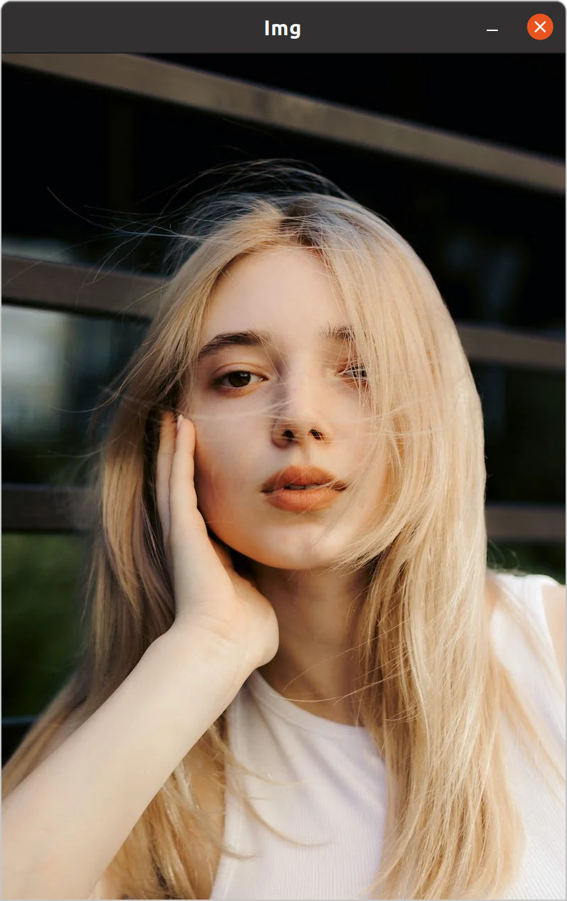

> Read the Images, Videos, and Get the Images from Webcams

# 1.1 How to Import the Packages ?

## 1.1.1 A `CMakeLists.txt` File

In C++, we need to write a `CMakeLists.txt` to **find the packages of OpenCV** , you can see [[CMake of OpenCV]] .

## 1.1.2 Proprocess Statement

Than, we can wirte the **preprocess statement** to import the packages : 

```
#include <opencv2/imgcodecs.hpp>
#include <opencv2/imgproc.hpp>
#include <opencv2/highgui.hpp>
```

In the codes above : 
- `imgcodecs.hpp` is the head file which includes **the function to encode the imgs** 
- `imgproc.hpp` is the head file which includes **the function to process the imgs** 
- `highgui.hpp` is the head file which includes **the function to use the GUI Windows to show what we want** 

## 1.1.3 Namespace

We need to declare **the namespace of `cv`** when we want to use the function or class in OpenCV Package

1. declare on the head : `using namespace cv;`
2. declare when needed : `cv::Mat img;`

# 1.2 Read the Images

We will use the **`cv::Mat` class** to declare a **variable with matrix type** to store the information of an image.

```C++
int main ()
{
	std::string path = "test.jpg"; // the path to the img
	cv::Mat img;
	img = cv::imread (path); // read the img from the path

	cv::imshow ("Img", img); // show the img
	if (cv::waitKey (0) == 27)
	{
		std::exit (0);
	}
	// if press the esc button, exit
	// 0 means wait forever, other numbers are in ms
}
```

In the code above : 
- `cv::imread ()` is the function we use to **read the img from the path** 
- `cv::imshow ()` is the function to **show the img we want** 
- `cv::watiKey ()` will **wait the particular $ms$ for the keys being press**
- `27` is the **ASCII code of `esc`**

Result : 



# 1.3 Read the Videos

We will use the **`cv::VideoCapture` class** to declare a videocapture to read the video.But all the videos are **stored as a set of imgs** , so we need to **read every img** from the capture and **show them frame by frame** . That is, we will show the video **in a loop**

```C++
int main ()
{
	std::string path = "test_video.mp4";
	cv::VideoCapture cap (path); // a video capture to store the video
	cv::Mat img;

	while (true)
	{
		cap.read (img); 
		// get one img from the capture, and remove it from the capture

		cv::imshow ("Video", img);
		if (cv::waitKey (20) == 27)
		{// after showing one img, we will stop for 20 ms
			break;
		}
	}
}
```

In the codes above : 
- `cv::VideoCapture` is the class to **deal with the videos** , we use this class to declare an instance `cap` 
- `cap.read (img);` will **get the img from the capture** 
- `cv::waitKey (20)` : a video should have the fps


# 1.4 Webcams

We will also use the `cv::VideoCapture` class to deal with a camera. It is like the video, but we will **set the port of camera to the instance instead of the path** 

```C++
int main ()
{
	cv::VideoCapture cap (0); // 0 is the port of the default camera
	cv::Mat img;

	while (true)
	{
		cap.read (img);

		cv::imshow ("Cam", img);
		if (cv::waitKey (20) == 27)
		{
			break;
		}
	}
}
```


# 1.5 The Detals of the Functions

## 1.5.1 `cv::imread ()` 

> **Loads an image from a file.**

 **Function Declaration :**
 - **cv::Mat cv::imread \(const cv::String &filename, int flags = 1\)**

**Parameters :** 
- `filename` – Name of file to be loaded.  
- `flags` – Flag that can take values of cv::ImreadModes

```ad-tip
The function determines the type of an image by the content, not by the file extension.

In the case of color images, the decoded images will have the channels stored in **B G R** order.

When using IMREAD_GRAYSCALE, the codec's internal grayscale conversion will be used, if available. Results may differ to the output of cvtColor() - On Microsoft Windows
```

## 1.5.2 `cv::imshow ()` 

> Displays an image **in the specified window**.
> 
> If the window was created with the **cv::WINDOW_AUTOSIZE** flag, the image is shown with its **original size** , however it is still limited by the screen resolution. 
> 
> **Otherwise, the image is scaled to fit the window** . The function may scale the image, depending on its depth: 
> - If the image is 8-bit unsigned, it is displayed as is. 
> - If the image is 16-bit unsigned, the pixels are divided by 256. That is, the value range \[0,255\)
> 
> And, the windows are **distinguished only by their name** , so if two imgs are shown in the same name windows, **the former one will be covered** .

**Function Declaration :** 
- **void cv::imshow \(const cv::String &winname, cv::InputArray mat\)**

**Parameters :**
- `winname` – Name of the window.  
- `mat` – Image to be shown.

```ad-tip
This function should be followed by a call to `cv::waitKey` or `cv::pollKey` to perform GUI housekeeping tasks that are necessary to actually show the given image and **make the window respond to mouse and keyboard events**.

Otherwise, it **won't display the image and the window might lock up** .

For example, **waitKey(0)** will display the window **infinitely** until any keypress (it is suitable for image display). **waitKey(25)** will display a frame and wait approximately 25 ms for a key press (suitable for displaying a video **frame-by-frame** ). To remove the window, use `cv::destroyWindow`.
```

## 1.5.3 `cv::waitKey ()` 

> **Waits for a pressed key** .

**Function Declaration :**
- **int cv::waitKey (int delay = 0)**

**Parameters :**
- `delay` – Delay in **milliseconds $ms$**. **0** is the special value that means "**forever**".

```ad-tip
The functions `waitKey` and `pollKey` are the **only methods in HighGUI** that can **fetch and handle GUI events** , so one of them needs to be called periodically for normal event processing unless HighGUI is used within an environment that takes care of event processing.  

The function **only works if there is at least one HighGUI window** created and the window is active. If there are several HighGUI windows, any of them can be active.
```
