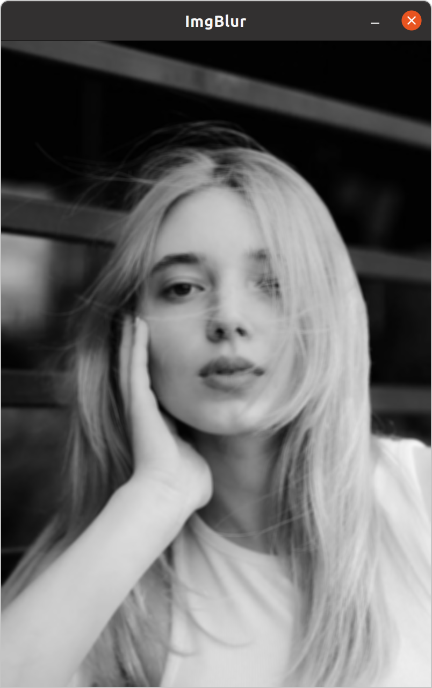
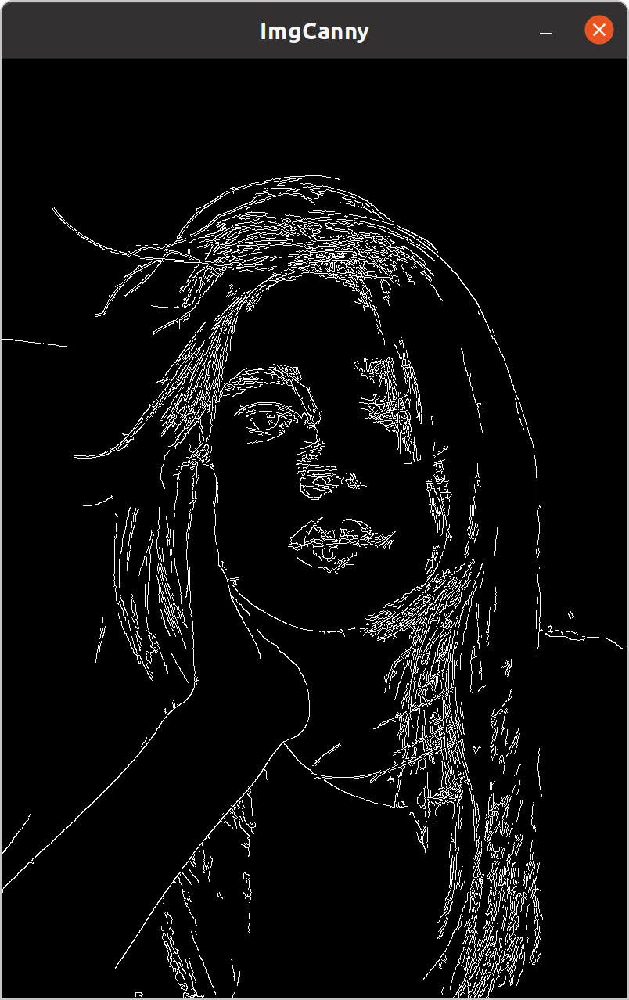
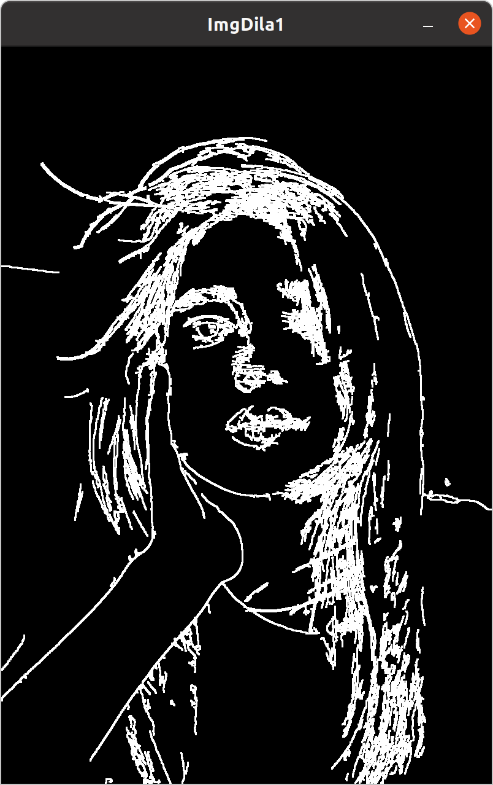
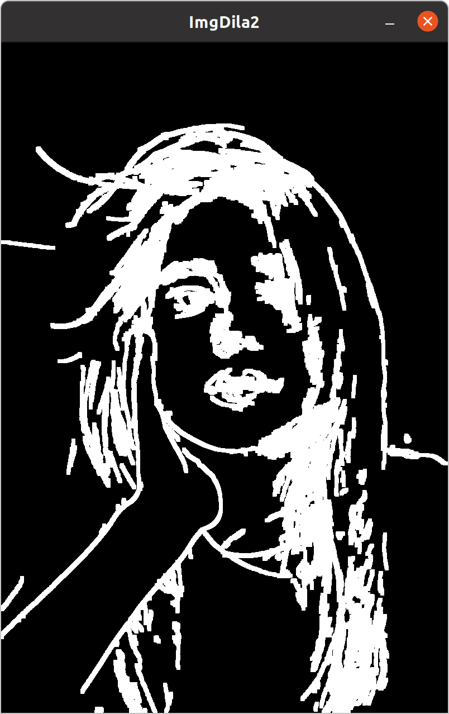
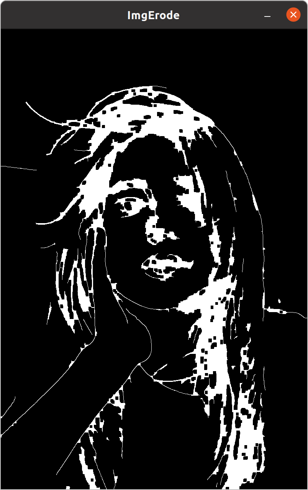

> Basic Process Functions

In the development, we usually need to process the images to meet the function request. In this chapter, we are going to learn : 
- How to **convert the img type** 
- How to apply **GaussianBlur** on the img
- How to use **Canny Edge Detector** 
- How to **Dilate and Erode the edge** 

# 2.1 Convert Color Scale

## 2.1.1 Solution

The imgs may have **BGR, RGB, GRAY, HSV** scales and so on. We can use the function `cv::cvtColor` to convert the color scale.

```C++
int main ()
{
	std::string path = "test.jpg";
	cv::Mat img = cv::imread (path), imgGray;

	cv::cvtColor (img, imgGray, cv::COLOR_BGR2GRAY);
	// convert the color from BGR to Gray and store the output in imgGray
}
```

Result : 


## 2.1.2 `cvtColor ()`

> **Converts an image from one color space to another.** 
> 
> In case of a transformation to-from RGB color space, the order of the channels should be specified explicitly (RGB or BGR). Note that the default color format in OpenCV is often referred to as RGB but it is **actually BGR** (the bytes are reversed).
> 
> So the first byte in a standard (24-bit) color image will be an 8-bit Blue component, the second byte will be Green, and the third byte will be Red. The fourth, fifth, and sixth bytes would then be the second pixel (Blue, then Green, then Red), and so on.
> 
> The conventional ranges for R, G, and B channel values are: 
> - 0 to 255 for CV_8U images 
> - 0 to 65535 for CV_16U images 
> - 0 to 1 for CV_32F images In case of linear transformations, the range does not matter.

**Function Declaration :**
- **void cv::cvtColor \(cv::InputArray src, cv::OutputArray dst, int code, int dstCn = 0\)**

**Parameters :**
- `src` – **input image**: 8-bit unsigned, 16-bit unsigned ( CV_16UC... ), or single-precision floating-point.  
- `dst` – **output image of the same size and depth as src**.  
- `code` – color space **conversion code**.  Here is some common code (Full Name)
	- `cv::COLOR_BGR2RGB` 
	- `cv::COLOR_BGR2GRAY` 
	- `cv::COLOR_BGR2HSV` 
	- `cv::COLOR_BGR2HLS` 
- `dstCn` – number of channels in the destination image; **if the parameter is 0**, the number of the channels is **derived automatically from src and code**.

# 2.2 GaussianBlur

## 2.2.1 Solution

```C++
int main ()
{
	std::string path = "test.jpg";
	cv::Mat img = cv::imread (path), imgBlur;

	cv::GaussianBlur (img, imgBlur, cv::Size (7, 7), 5, 0);
	// cv::Size (7, 7) defines the kernel size of the blur
}
```

Result : 



## 2.2.2 `GaussianBlur ()` 

> **Blurs an image** using a **Gaussian filter** . The function convolves the source image with the specified Gaussian kernel. In-place filtering is supported.

**Function Declaration :**
- **void cv::GaussianBlur \(cv::InputArray src, cv::OutputArray dst, cv::Size ksize, double sigmaX, double sigmaY = (0.0), int borderType = 4\)**

**Parameters :**
- `src` – input image; the image can have any number of channels, which are processed independently, but the depth should be **CV_8U, CV_16U, CV_16S, CV_32F or CV_64F** .
- `dst` – output image of the same size and type as src.  
- `ksize` – **Gaussian kernel size** . ksize.width and ksize.height can differ but they both **must be positive and odd** . Or, they can be zero's and then they are computed from sigma.  
- `sigmaX` – Gaussian kernel standard deviation in X direction.  
- `sigmaY` – Gaussian kernel standard deviation in Y direction; **if sigmaY is zero, it is set to be equal to sigmaX** , **if both sigmas are zeros, they are computed from ksize.width and ksize.height** , respectively; to fully control the result regardless of possible future modifications of all this semantics, **it is recommended to specify all of ksize, sigmaX, and sigmaY** .  
- `borderType` – pixel extrapolation method.

# 2.3 Canny Edge Detector

## 2.3.1 Solution

```C++
int main ()
{
	std::string path = "test.jpg";
	cv::Mat img = cv::imread (path), imgGray, imgBlur, imgCanny;

	cv::cvtColor (img, imgGray, cv::COLOR_BGR2GRAY);
	cv::GaussianBlur (img, imgBlur, cv::Size (7, 7), 5, 0);
	cv::Canny (img, imgCanny, 50, 150);
}
```

Result : 



## 2.3.2 `Canny ()` 

> **Finds edges** in an image using the Canny algorithm

**Function Declaration :**
- **void cv::Canny \(cv::InputArray image, cv::OutputArray edges, double threshold1, double threshold2, int apertureSize = 3, bool L2gradient = false\)**

**Parameters :**
- `image` – 8-bit input image.  
- `edges` – output edge map; **single channels** 8-bit image, which has the same size as image .  
- `threshold1` – first threshold for the hysteresis procedure.  
- `threshold2` – second threshold for the hysteresis procedure.  
- `apertureSize` – aperture size for the Sobel operator.  
- `L2gradient` – a flag, indicating whether a more accurate

```ad-tip
If you want to apply `cv::Canny ()` , you should first apply `cv::cvtColor ()` to convert the color scale into **Gray Scale** , then, apply `cv::GaussianBlur ()` to the img, in order to **reduce the noises and enhance the results of edge detecting**
```

# 2.4 Dilate and Erode

## 2.4.1 Solution

In the detecting step, the results will not always meet our demand. It may be too thin or too rough, so we can **dilate the edges or erode the edges** 

```C++
int main ()
{
	cv::Mat img, imgGray, imgBlur, imgCanny, imgDila1, imgDila2, imgErode;
	std::string path = "text.jpg";
	cv::Mat kernel1 = cv::getStructuringElement (cv::MORPH_DILATE, cv::Size (5, 5));
	cv::Mat kernel2 = cv::getStructuringElement (cv::MORPH_RECT, cv::Size (7, 7));
	// we define a Mat type variable kernel, and the value of the variable is got by cv::getStructingElement () with the size of cv::Size
	// MORPH means the structure can be changed
	// MORPH_RECT represent the structure of the variable is a rectangle like 
	// MORPH_DILATE is the structure for dilation
	// cv::Size should also be odd number
	
	img = cv::imread (path);
	cv::cvtColor (img, imgGray, cv::COLOR_BGR2GRAY);
	cv::GaussianBlur (imgGray, imgBlur, cv::Size (7, 7), 5, 0);
	cv::Canny (imgBlur, imgCanny, 50, 150);

	cv::dilate (imgCanny, imgDila1, kernel1);
	cv::dilate (imgCanny, imgDila2, kernel2);
	// we use the structuring variable to be the kernel size of the dilator

	cv::erode (imgDila2, imgErode, kernel2);
	
}
```

Result : 
- `imgDila1` 
	- 
- `imgDila2` 
	- 
- `imgErode` 
	- 

## 2.4.2 `getStructuringElement ()` 

> Returns a **structuring element** of the **specified size** and **shape** for morphological operations. The function constructs and returns the structuring element that can be further passed to `erode ()` , `dilate ()`  or `morphologyEx ()` . But you can also construct an arbitrary binary mask yourself and use it as the structuring element.

**Function Declaration :**
- **cv::Mat cv::getStructuringElement \(int shape, cv::Size ksize, cv::Point anchor = cv::Point(-1, -1)\)**

**Parameters :**
- `shape` – Element **shape** that could be one of `MorphShapes` 
	- `cv::MORPH_RECT` 
	- `cv::MORPH_CROSS` 
	- `cv::MORPH_ELLIPSE` 
	- `cv::MORPH_DILATE` 
	- `cv::MORPH_ERODE` 
- `ksize` – Size of the structuring element.  It should be **odd number** 
- `anchor` – Anchor position within the element. The default value

## 2.4.3 `dilate ()` 

> **Dilates an image** by using a **specific structuring element**. The function dilates the source image using the specified structuring element that determines the shape of a pixel neighborhood **over which the maximum is taken**

**Function Declaration :**
- **void cv::dilate \(cv::InputArray src, cv::OutputArray dst, cv::InputArray kernel, cv::Point anchor = cv::Point(-1, -1), int iterations = 1, int borderType = 0, const cv::Scalar &borderValue = morphologyDefaultBorderValue()\)**

**Parameters :**
- `src` – input image; the number of channels can be arbitrary, but the depth should be one of CV_8U, CV_16U, CV_16S, CV_32F or CV_64F.  
- `dst` – output image of the same size and type as src.  
- `kernel` – **structuring element used for dilation**; if (element == Mat()), a `3 x 3`  rectangular structuring element is used. Kernel can be created using `cv::getStructuringElement ()` 
- `anchor` – **position of the anchor** within the element; default value **`(-1, -1)` means that the anchor is at the element center**.  
- `iterations` – **number of times dilation is applied**.  
- `borderType` – pixel extrapolation method, see `cv::BorderTypes` .  
- `borderValue` – border value in case of a constant border

## 2.4.4 `erode ()` 

> **Erodes an image** by using a **specific structuring element**. The function erodes the source image using the specified structuring element that determines the shape of a pixel neighborhood **over which the minimum is taken**

**Function Declaration :**
- **void cv::erode \(cv::InputArray src, cv::OutputArray dst, cv::InputArray kernel, cv::Point anchor = cv::Point(-1, -1), int iterations = 1, int borderType = 0, const cv::Scalar &borderValue = morphologyDefaultBorderValue()\)**

**Parameters :**
- `src` – input image; the number of channels can be arbitrary, but the depth should be one of CV_8U, CV_16U, CV_16S, CV_32F or CV_64F.  
- `dst` – output image of the same size and type as src.  
- `kernel` – **structuring element used for erosion**; if (element == Mat()), a `3 x 3`  rectangular structuring element is used. Kernel can be created using `cv::getStructuringElement ()` 
- `anchor` – **position of the anchor** within the element; default value **`(-1, -1)` means that the anchor is at the element center**.  
- `iterations` – **number of times erosion is applied**.  
- `borderType` – pixel extrapolation method, see `cv::BorderTypes` .  
- `borderValue` – border value in case of a constant border

## 2.4.5 The Principle of the Dilation and Erosion

[Look](https://blog.csdn.net/luolaihua2018/article/details/111712087) 

