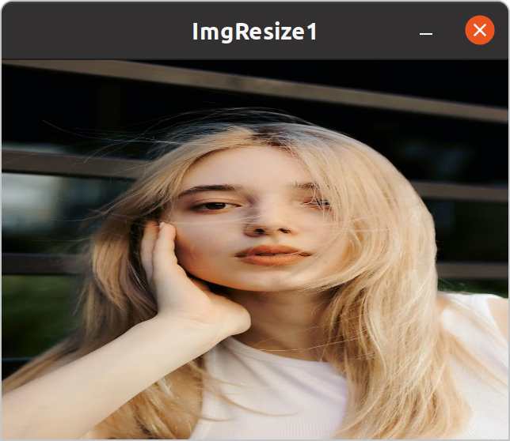
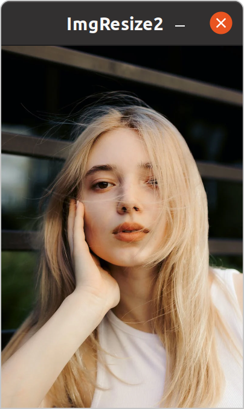
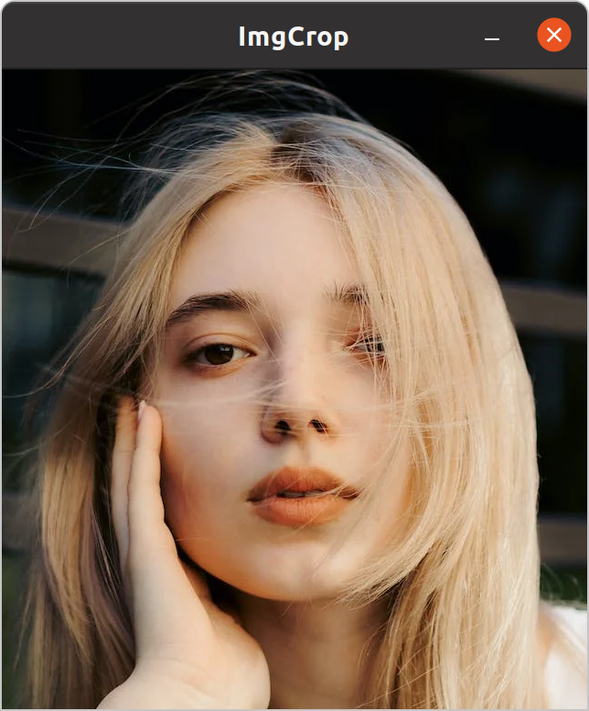
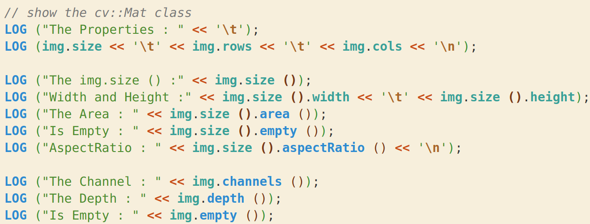
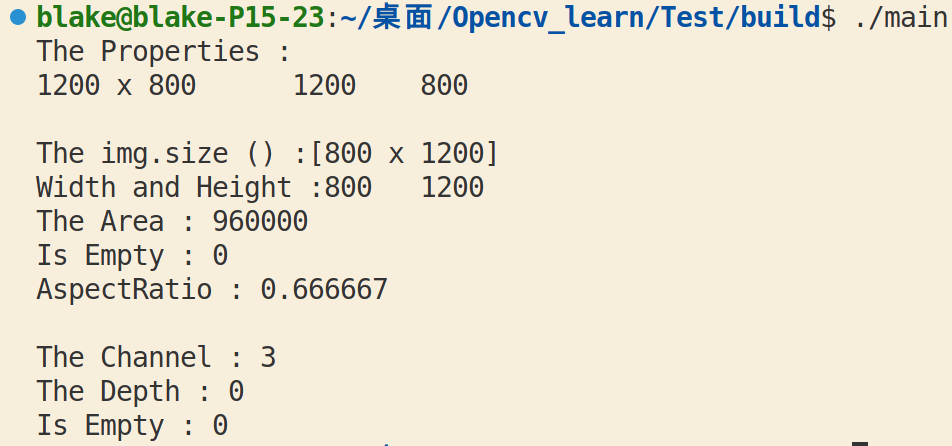

> Resize and Crop the imgs

In this chapter, we are going to learn how to resize an image and crop it.

# 3.1 Resize

## 3.1.2 Solution

We will use `cv::resize ()` to resize the image to the **specific size** .

```C++
int main ()
{
	std::string path = "test.jpg";
	cv::Mat img, imgResize1, imgResize2;
	img = cv::imread (path);
	// the img is (1920 * 1080)

	cv::resize (img, imgResize1, cv::Size (640, 480));
	// resize the img to (640 * 480)

	cv::resize (img, imgResize2, cv::Size (), 0.5, 0.5);
	// resize the img to half of the origin
}
```

Result : 
- Resize1 : 
	- 
- Resize2 : 
	- 

## 3.1.2 `cv::resize ()` 

> Resizes an image. The function `cv::resize ()` resizes the image src down to or up to the **specified size** . Note that the initial dst type or size are **not taken into account** . Instead, the size and type are derived from the `src`,`dsize`,`fx`, and `fy`. If you want to resize src so that it fits the pre-created dst, you may call the function as follows: **explicitly specify dsize=dst.size(); fx and fy will be computed from that** . resize(src, dst, dst.size(), 0, 0, interpolation); If you want to decimate the image by factor of 2 in each direction, you can call the function this way: **specify fx and fy and let the function compute the destination image size** . resize(src, dst, Size(), 0.5, 0.5, interpolation).

**Function Declaration :**
- **void cv::resize \(cv::InputArray src, cv::OutputArray dst, cv::Size dsize, double fx = (0.0), double fy = (0.0), int interpolation = 1\)** 

**Parameters :**
- `src` – input image.  
- `dst` – output image; it **has the size dsize** (when it is non-zero) or **the size computed from src.size(), fx, and fy** ; the type of dst is the same as of src.  
- `dsize` – output image size; if it equals zero (`None` in Python), it is computed as : 
	- cv::Size ( $src.size ().width * fx$ , $src.size ().height * fy$ )
- `fx` – scale factor along the horizontal axis.
- `fy` – scale factor along the vertical axis. 
- `interpolation` – interpolation method.

# 3.2 Crop

## 3.2.1 Solution

We will use the **overload operator `()`** and **a specific parameter with the type of `cv::Rect`** to complete the resize work.

```C++
int main ()
{
	std::string path = "test.jpg";
	cv::Mat img, imgCrop;
	cv::Rect roi = (100, 150, 640, 700);
	// define a rectangle to help to finish the resize
	// roi (x, y, width, height)
	img = cv::imread (path);

	imgCrop = img (roi);
	// the overload operator () will return a cv::Mat type data
}
```

Result : 



## 3.2.2 `()` 

> One of the overload can **crop the img by `cv::Rect` passed to it** .

**Declaration :**
 - **inline cv::Mat cv::Mat::operator() \(const cv::Rect &roi\) const** 

**Parameter :**
- `roi` – Extracted submatrix specified as a rectangle.

## 3.2.3 `cv::Mat` 

> A class that can use to store an image. There are many functions and properties can tell you what the image like.

We can use `cv::Mat img;` to create an instance.

### 1. Some Properties

1. `img.size` : the **size** of the img by **`height * width`** 
	- Declaration : `cv::MatSize cv::Mat::size`
2. `img.rows` : **the number of the rows** of the img, that is, the **width of the img** 
	- Declaration : `int cv::Mat::rows` 
3. `img.cols` : **the number of the columns** of the img, that is, the **height of the img** 
	- Declaration : `int cv::Mat::cols` 

> the properties `rows` and `cols` is the number of rows and columns or **(-1, -1) when the matrix has more than 2 dimensions** 

### 2. Some Functions : 

1. `img.size ()` : the function is actually **the overload of the operator `()`** , which will **return a instance of `cv::Size`** . When `img.size ()` is passed to the `std::cout` , the result will be `[width * height]`
	- **Declaration** : 
		- `inline cv::Size cv::MatSize::operator()() const` 
	1. The Properties of the instance : 
		- `img.size ().width` : the **width of the img** 
		- `img.size ().height` : the **height of the img** 
	2. The Functions of the instance : 
		- `img.size ().area ()` : returns **the area of the img computed by `width * height`** 
			- **Declaration** : `inline int cv::Size2i::area() const` 

		- `img.size ().empty ()` : returns **true if empty** 
			- **Declaration** : `inline bool cv::Size2i::empty() const` 

		- `img.size ().aspectRatio ()` : returns **the ratio of `width / height`** 
			- **Declaration** : `inline double cv::Size2i::aspectRatio() const`

2. `img.channel ()` : returns the number of matrix channels.
	- **Declaration** : `inline int cv::Mat::channels() const` 

3. `img.empty ()` : returns **true if the array has no elements** .
	- **Declaration** : `bool cv::Mat::empty() const` 

4. `img.depth ()` : Returns** the depth of a matrix element**. The method returns the identifier of the matrix element depth (the type of each individual channel). For example, for a 16-bit signed element array, the method returns CV_16S . A complete list of matrix types contains the following values: - CV_8U - 8-bit unsigned integers ( 0..255 ) - CV_8S - 8-bit signed integers ( -128..127 ) - CV_16U - 16-bit unsigned integers ( 0..65535 ) - CV_16S - 16-bit signed integers ( -32768..32767 ) - CV_32S - 32-bit signed integers ( -2147483648..2147483647 ) - CV_32F - 32-bit floating-point numbers ( -FLT_MAX..FLT_MAX, INF, NAN ) - CV_64F - 64-bit floating-point numbers ( -DBL_MAX..DBL_MAX, INF, NAN )
	- **Declaration** : `inline int cv::Mat::depth() const` 

5. `img.type ()` : returns **the type of a matrix element** . This is an identifier compatible with the CvMat type system, **like CV_16SC3 or 16-bit signed 3-channel array**, and so on.
	- **Declaration** : `inline int cv::Mat::type() const` 

6. `img.create ()` : **Allocates new array data** if needed. This is one of the key Mat methods. **Most new-style OpenCV functions and methods that produce arrays call this method for each output array**.
	- **Declaration** : 
		- `void cv::Mat::create \(cv::Size size, int type\)` 
		- `void create \(const std::vector<int> &sizes, int type\)` 
		- `void create(int rows, int cols, int type)` 
	- **Parameters** :
		- `size` – Alternative new matrix size specification: Size(cols, rows)  
		- `type` – New matrix type.

7. `img.copyTo ()` : **Copies the matrix to another one** . The method copies the matrix data to another matrix. Before copying the data, the method **invokes : `m.create(this->size(), this->type())`** ; so that **the destination matrix is reallocated if needed**. While m.copyTo(m); works flawlessly, the function does not handle the case of a partial overlap between the source and the destination matrices. When the operation mask is specified, if the Mat::create call shown above reallocates the matrix, the newly allocated matrix is initialized with all zeros before copying the data.
	- **Declaration** : `void cv::Mat::copyTo(cv::OutputArray m) const` 
	- **Parameters** : `m` – Destination matrix. If it does not have a proper size or type before the operation, it is reallocated.

### 3. The Example

The code : 



The result :


