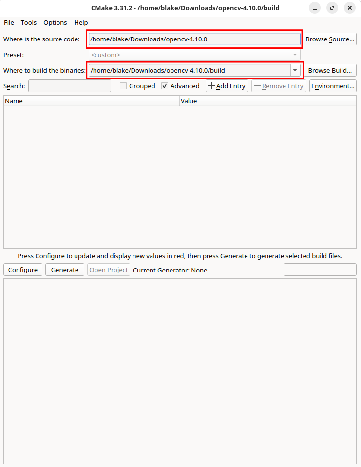
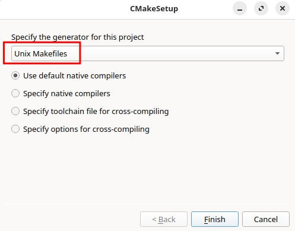
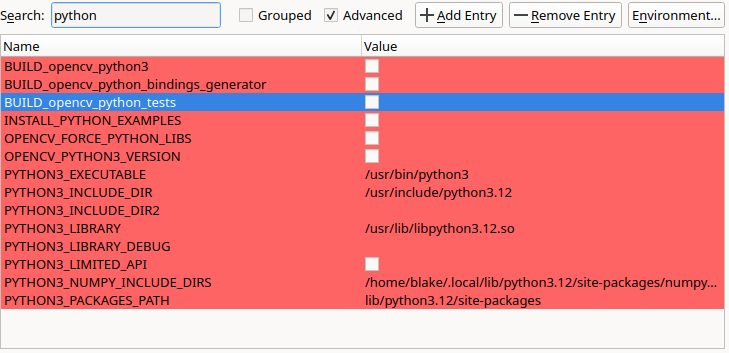
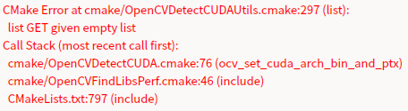
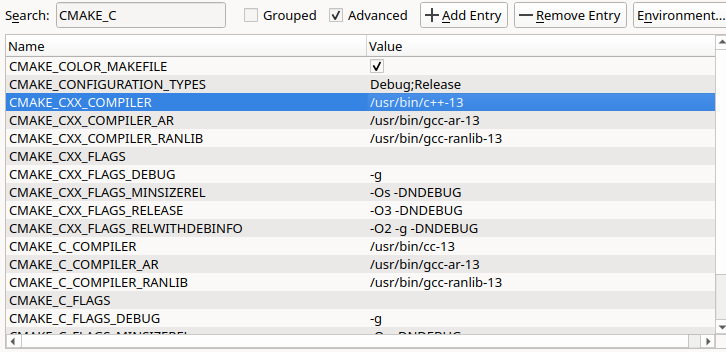

OpenCV 主流使用有 C++ 和 Python 两个版本，这两个版本的安装稍有不同。我们可以选择 **直接安装库** ，但是我们如果需要定制 OpenCV 的内容，如选择特定版本，构建特定内容，就需要通过源码自己编译。

# 01 C++

## 1.1 直接安装库文件

### 1.1.1 Ubuntu

我们可以直接下载 `libopencv-dev` 来安装 OpenCV，但是由于 Ubuntu 系统的限制，我们只能安装它给定的版本 : 

```bash
sudo apt install libopencv-dev
```

> 而且，我们无法通过这种方法来安装 OpenCV 中 DNN 的 CUDA 支持！

### 1.1.2 Arch

我们可以直接下载 `opencv` 或 `opencv-cuda` 软件包来一键安装最新版本的 OpenCV : 

```bash
sudo pacman -S opencv 
# or
sudo pacman -S opencv-cuda
```

## 1.2 Build From Source

我们也可以通过源码编译 OpenCV ，以此来定制 OpenCV 的一些功能，如 CUDA 支持，NON-FREE 算法， FAST-MATH 等等。

OpenCV 的源码存放于 [Github-OpenCV](https://github.com/opencv/opencv) 仓库中，我们可以通过下载压缩包或者通过克隆来获取源码 : 

```bash
git clone https://github.com/opencv/opencv.git
```

在开始编译之前，我们需要先为 OpenCV 安装依赖

### 1.2.1 Normal

#### Configure

对于普通的编译，不需要额外模块的支持，Ubuntu 和 Arch 的编译方式都是一样的。

我们将在 `opencv/` 根目录下新建一个 `build/` 目录用于构建目标，推荐使用 `cmake-gui` 来配置 OpenCV ，因为其可供配置的选项特别多，我们通过可视化方法来快速配置 : 

```bash
cd opencv
mkdir build
cd build
cmake-gui ..
```

打开了 `cmake-gui` 界面后，我们首先检查 **源文件目录** 及 **构建目录是否正确** :



然后，我们直接点击 `Configure` 进行初始化配置，并选择 `Unix Makefiles` 作为我们的生成器



然后，我们等待它初始化完成。在它第一次配置完成之后，会在中间一栏中显示许多 **红色** 信息，这展示了我们在上一次配置中 **变更** 或是 **新增** 的的配置。

> 注意，在 `cmake-gui` 界面中，无论是 `Warning` 还是 `Error` 都是红色输出，因此，只要没有报错停止配置，最后成功输出 `Configuring done` ，那就代表配置成功。

然后，我们可以在这些配置中选择我们需要的配置，参考 [00 Introduction](C++/Notes/00%20Introduction.md#0.2%20How%20to%20install%20the%20opencv%20?) 中命令行配置，我们需要配置 : 

- 关闭编译 `Python` ，取消勾选相应选项
	- `BUILD_opencv_python3` 
	- `BUILD_opencv_python_bindings_generator` 
	- `BUILD_opencv_python_tests` 
	
	

- 关闭编译 `Java` 以及 `js` ，同 `Python` 一样操作
	- `BUILD_JAVA` 
	- `BUILD_opencv_java_bindings_generator` 
	- `BUILD_opencv_js` 
	- `BUILD_opencv_js_bindings_generator` 

- 设置编译一些算法，开启选项
	- `ENABLE_FAST_MATH` 
	- `OPENCV_ENABLE_NONFREE` 

> [!attention] 
> 我们此次编译的是动态库 ！不关闭 `BUILD_SHARED_LIBS` 

然后，我们再次点击 `Configure` ，进行配置，这次配置完成之后， **红色** 选项会消失， `cmake` 认为我们已经全部看完并配置好上一次标红的选项了，这个时候，我们就可以点击 `Generate` 生成编译文件 `Makefile` 。

#### Build

在生成好编译文件之后，关闭 `cmake-gui` ，我们在 `build/` 目录下进行 OpenCV 的编译 : 

```bash
nproc
# 查看 CPU 线程
make -j16
# or
make -j$nproc
# 通过 -j[n] 选项指定编译时的线程数，加快编译速度
```

#### Install

在全部文件编译完成之后我们就可以将 OpenCV 安装到我们计算机当中 : 

```bash
sudo make install
```

#### Check and Uninstall

我们可以通过 `opencv_version` 命令来检查安装是否成功以及安装的版本。

此外，若想要卸载 OpenCV ，我们只需要在 `build/` 目录下执行 : 

```bash
sudo make uninstall
```

> [!attention] 
> 在完成编译并安装后千万不要修改 `build/` 目录下的内容，其中保存编译及安装的信息，更改后无法正常卸载 OpenCV。
> 
> OpenCV 的安装位置在 `/usr/local/` 目录下，库文件位于 `/usr/local/lib/` ，头文件位于 `/usr/local/include` ，因此我们也可以手动卸载。

### 1.2.2 With Cuda

在 Ubuntu 中，我们想要使用 CUDA 作为 DNN 模块的后端，就需要自己编译，Arch 也可以选择自己编译 CUDA 支持，但是没必要。

#### Requirements

我们在编译 CUDA 支持时，需要注意系统中已经安装了 `Nvidia` , `Cuda Toolkit` ，并可以选择安装 `Cudnn` （推荐）以及 `Nvidia Video Codec SDK` 。

有关其安装，Ubuntu 系统可以见 [2.Nvidia](../03%20Linux/Ubuntu/2.Nvidia.md) ， Arch 系统可见 [1.2 Arch](../11%20Model%20Deploy/TensorRT/TensorRT.md#1.2%20Arch) 。

#### opencv_contrib

想要编译 CUDA 支持，我们还需要额外编译 `opencv_contrib` 模块，其源码位于 [Github-Opencv-Contrib](https://github.com/opencv/opencv_contrb) 中。

我们选择将 `opencv_contrib/` 放置在 `opencv/3rdparty/` 目录下 : 

```bash
cd 3rdparty
git clone https://github.com/opencv/opencv_contrib.git
```

#### Configure

我们同样使用 `cmake-gui` 进行配置，但这次配置要更加复杂。在完成 [1.2.1 Normal](Installation.md#1.2.1%20Normal) 中的配置后，我们先 : 

- 指定 `opencv_contrib` 目录，设定 `OPENCV_EXTRA_MODULES_PATH` 为 `opencv_contrib/modules` 所在目录
- 开启 CUDA ，勾选 `WITH_CUDA` , `OPENCV_DNN_CUDA` 

然后点击 `Configure` 再次进行配置，这次配置需要的时间较长，而且需要下载一些模块的源码，因此建议采用较为科学的方法。

这次配置可能会保存，提示 : #bug #solved 



这是由于 CUDA 没能帮你检测你 GPU 的架构以及算力，我们在这里需要设置 `CUDA_ARCH_BIN` 为你 GPU 实际的 `Compute Capability` ，具体可以参照 [GPU Compute Capability](https://developer.nvidia.com/cuda-gpus) ，我使用的是 `GeForce RTX 4060` ，其算力为 8.9，因此我将 `CUDA_ARCH_BIN` 设置为 `8.9` 。

至于 `CUDA_ARCH_PTX` 可以不用设置。

此外，可能还会出现找不到 Nvidia Video Codec SDK 的问题，这个问题有两种解决方法 : #bug #solved 

- 取消勾选 `WITH_NVCUVENC` , `WITH_NVCUVID` 
- 安装 `Nvidia Video Codec SDK` 
	- 在 [官网](https://developer.nvidia.com/video-codec-sdk) 中下载 **full Video Codec 12.2 package** 
	- 解压后将 `Interface/` 目录下的头文件放到 CUDA 安装目录下的 `include` 目录中，但是更推荐系统目录 `/usr/include/` 
	- 将 `Lib/linux/stubs/x86_64` （对应架构）下的库文件放到 CUDA 安装目录下的 `lib` 目录中，但是仍然更推荐系统目录 `/usr/lib` 

然后，我们再次点击 `Configure` 进行配置，就可以完成配置了。

> [!tip] 
> 在配置过程中，提示缺什么就去安装什么包，如果是自己下载的，那要注意安装的库路径是否在 `PATH` , `LD_LIBRARY_PATH` , `LIBRARY_PATH` 中

在完成配置后，点击 `Generate` 生成 `Makefile` 

#### Build

配置完成后，就可以开始编译 : 

```bash
make -j$nproc
```

在编译过程中，可能会遇到 : #bug #solved #arch 

```text
/usr/include/c++/14.2.1/x86_64-pc-linux-gnu/bits/c++config.h(827): error: user-defined literal operator not found
    typedef __decltype(0.0bf16) __bfloat16_t;
                       ^

/usr/include/c++/14.2.1/type_traits(529): error: type name is not allowed
      : public __bool_constant<__is_array(_Tp)>
                                          ^
...
...
CMake Error at cuda_compile_1_generated_gpu_mat.cu.o.Release.cmake:280 (message):
  Error generating file
  /home/blake/Downloads/opencv-4.10.0/build/modules/core/CMakeFiles/cuda_compile_1.dir/src/cuda/./cuda_compile_1_generated_gpu_mat.cu.o
```

这是由于你的 `gcc` 版本不匹配，CUDA 不支持的原因，通常出现在 Arch 中， Ubuntu 由于其保守的版本设定往往能逃过一劫。

参照 [官网](https://docs.nvidia.com/cuda/cuda-installation-guide-linux/index.html#host-compiler-support-policy) 的信息，CUDA 支持的编译器为 : 

| Distribution | GCC        | Clang      | NVHPC | XLC | ArmC/C++ | ICC    |
| ------------ | ---------- | ---------- | ----- | --- | -------- | ------ |
| x86_64       | 6.x - 13.2 | 7.x - 18.0 | 24.5  | No  | No       | 2021.7 |
| Arm64 sbsa   | 6.x - 13.2 | 7.x - 18.0 | 24.5  | No  | 24.04    | No     |

其中 `GCC` 从 `6.x - 13.2` ， `Clang` 从 `7.x - 18.0` ，而在上面的报错中， `gcc` 的版本为 `14.2.1` ，因此并不支持编译。于是我们就需要更换合适的编译器进行编译。

在 Arch 中，我们可以选择将现有的 `gcc` 卸载，并安装 `clang` 来编译，这样最省力，但是我们在这里选择使用 `gcc-13` 来编译。

```bash
sudo pacman -S gcc13 gcc13-libs gcc13-fortran
```

然后，在使用 `cmake-gui` 配置时，勾选 `Advanced` ，我们指定使用的编译器为 `cc-13` 以及 `c++-13` （即为 `gcc-13` 和 `g++-13`）:

- 设定 `CMAKE_C_COMPILER` 为 `/usr/bin/cc-13` ， `CMAKE_CXX_COMPILER` 为 `/usr/bin/c++-13` 
- 设定 `CMAKE_C_COMPILER_AR` 以及 `CMAKE_CXX_COMPILER_AR` 为 `/usr/bin/gcc-ar-13` 
- 设定 `CMAKE_C_COMPILER_RANLIB` 以及 `CMAKE_CXX_COMPILER_RANLIB` 为 `/usr/bin/gcc-ranlib-13` 
	
	

再次配置后，就可以重新编译。不过，在重新编译前需要将原本的编译文件清除，否则可能还会报错 : 

```bash
make clean
make -j16
```

我们在编译完成后安装即可。

# 02 Python

我们直接通过 `pip` 安装就好 : 

```bash
pip install opencv-python
```

> 建议使用 `conda` 来配置 `Python` 环境

若要自己编译，在上述过程中将编译 `Python` 的选项打开即可。