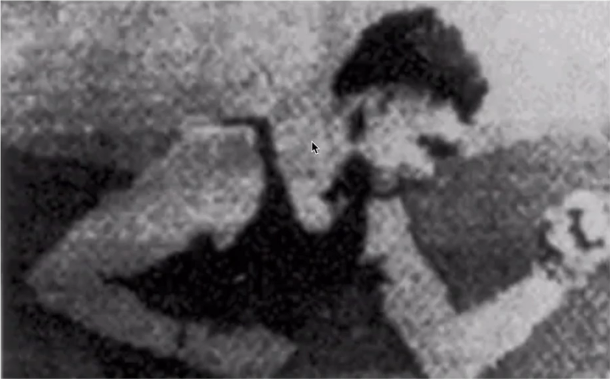
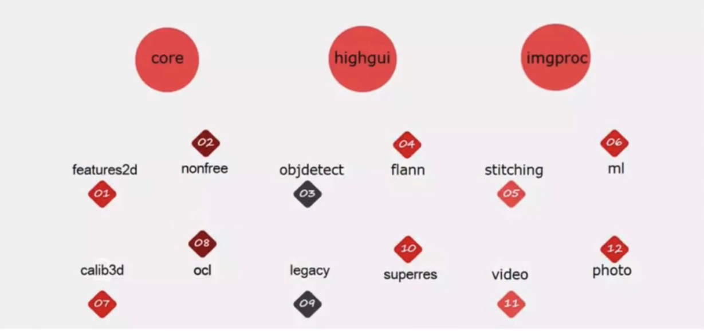

# 01 OpenCV

OpenCV是应用广泛的 **开源图像处理库**，我们以其为基础，介绍相关的图像处理方法：包括基本的图像处理方法：几何变换，**形态学变换**，图像平滑，直方图操作，模板医配，霍夫变换等；**特征提取** 和描述方法：理解 **角点特征**，**Harris和Shi-Tomas算法**，**SIFT/SURF算法**，**Fast算法**，**ORB算法**等；还有OpenCV在视频操作中的应用，最后的案例是使用OpenCV进行人脸检测。

# 02 安装 OpenCV

我们使用 `Anaconda` 来配置 `opencv-python` 环境。

## 2.1 安装 `Anaconda` 

### 2.1.1 Windows

在官网下载安装软件，无脑下一步。

### 2.1.2 Linux

在官网下载安装脚本，然后运行，然后无脑下一步。

最后 `echo "export PATH=/opt/anaconda3/bin:$PATH" >> ~/.bashrc` ，然后运行 `source ~/.bashrc` ，接着重新启动终端，运行 `conda init` ，再重启终端。

> [!note] 
> 如果在启动终端后 **自动进入 `base` 环境** ，那么我们可以运行 `conda config --set_auto_activate_base false` ，再重启终端就可以了。

## 2.2 创建环境

```bash
conda create -n opencv python=3.10
conda activate opencv
pip3 install opencv-python
```

> [!note] 
> 如果要使用 **SIFT和SURF等进行特征提取** ，还需要安装：
> `pip3 install opencv-conrtib-python` 

## 2.3 激活环境

在 `VSCode` 中，我们可以选择当前工作区的环境，然后运行时就会自动使用该环境。

在终端中，我们可以运行 `conda activate opencv` 来激活环境，然后可以运行 `python main.py` 来运行我们的程序。

# 03 图像

## 3.1 是什么？

> 图像是人类视觉的基础，是自然景物的 **客观反映**，是人类认识世界和人类本身的重要源泉。“图”是物 **体反射或透射光的分布**，“像“是人的视觉系统所接受的 图在人脑中所形成的印象或认识，照片、绘画、剪贴画、地图、书法作品、手写汉学、传真、卫星云图、影视画面、X光片、脑电图、心电图等都是图像。
> 
> ——姚敏.数字图像处理：机械工业出版社，2014年。

## 3.2 模拟图像和数字图像

### 3.2.1 模拟图像

图像起源于1826年前后法国科学家JosephNicéphoreNiepce发明的第一张可永久保存的照片，属于模拟图像。模拟图像又称 **连续图像**，它通过 **某种物理量（如光、电等）的强弱变化来记录图像亮度信息**，所以是连续变换的。模拟信号的特点是 **容易受干扰**，如今已经基本 **全面被数字图像替代**。

### 3.2.2 数字图像

在第一次世界大战后，1921年美国科学家发明了BartlaneSystem，并从伦敦传到纽约传输了第一幅数字图像，其 **亮度用离散数值表示**，将图片编码成5个灰度级，在发送端图片被编码并使用打孔带记录，通过系统传输后在接收方使用特殊的打印机恢复成图像。

> 第一幅数字图像
> 

1950年左右，计算机发明，数字图像处理学科正式诞生。

## 3.3 数字图像的表示

### 3.3.1 位数 (bit)

数字图像使用的是 `0/1` 来记录信息，我们日常使用的一般是8位图像，具有256 ( $0 \rightarrow 2^{8} - 1$)个灰度阶梯，从 `0` 到 `255` ，其中 `0` 代表最黑， `255` 代表最白。

> 人眼对灰度更敏感一些，在16位到32位之间。

### 3.3.2 图像的分类

#### 1. 二值图

一幅二值图像的二维矩阵 **仅由0、1两个值构成**，“0"代表黑色，“1”代白色。由于每一像素（矩阵中每一元素）取值仅有0、1两种可能，所以计算机中二值图像的数据类型通常为1个二进制位。二值图像通常用于 **文字**、 **线条图** 的扫描识别（**OCR**）和 **掩膜图像** 的存储。

#### 2. 灰度图

每个像素只有一个采样颜色的图像，这类图像通常显示为 **从最暗黑色到最亮的白色的灰度**，尽管理论上这个采样可以是任何 **颜色的不同深浅**，甚至可以是不同亮度上的不同颜色。灰度图像与黑白图像不同，在计算机图像领域中黑白图像只有黑色与白色两种颜色；但是，灰度图像在黑色与白色之间还有许多级的颜色深度。灰度图像经常是在单个电磁波频谱如可见光内测量每个像素的亮度得到的，用于显示的灰度图像通常用每个采样像素8位的非线性尺度来保存，这样可以有256级灰度（如果用16位，则有65536级）。

### 3. 彩色图

每个像素通常是由 **红（R）、绿（G）、蓝（B）** 三个分量来表示的，分量介于（0，255）。RGB图像与索引图像一样都可以用来表示彩色图像。与索引图像一样，它分别用红（R）、绿（G）、蓝（B）三原色的组合来表示每个像素的颜色。但与索引图像不同的是，RGB图像每一个像素的颜色值（由RGB三原色表示）直接存放在 **图像矩阵** 中，由于每一像素的颜色需由R、G、B三个分量来表示，M、N分别表示图像的行列数，三个MxN的二维矩阵分别表示各个像素的R、G、B三个颜色分量。RGB图像的 **数据类型一般为8位无符号整形**，通常用于表示和存放真彩色图像。

# 04 OpenCV 基本模块



其中 `core` ， `highgui` ， `imgproc` 是最基础的模块：

- `core` 模块实现了最核心的数据结构及其基本运算，如绘图函数、数组操作相关函数等。
- `highgui` 模块实现了视频与图像的读取、显示、存储等接口。
- `imgproc` 模块实现了图像处理的基础方法，包括图像滤波、图像的几何变换、平滑、阈值分割、形态学处理、边缘检测、目标检测、运动分析和对象跟踪等。

对于图像处理其他更高层次的方向及应用，OpenCV也有相关的模块实现：

- `features2d` 模块用于 **提取图像特征以及特征匹配**
- `nonfree` 模块实现了一些专利算法，如sift特征
- `objdetect` 模块实现了一些 **目标检测** 的功能，经典的基于Haar、LBP特征的人脸检测，基于HOG的行人、汽车等目标检测，分类器使用CascadeClassification（级联分类）和LatentSVM等
- `stitching` 模块实现了图像拼接功能
- `FLANN` 模块（FastLibraryforApproximateNearestNeighbors），包含快速近似最近邻搜索FLANN和聚类Clustering算法
- `ml` 模块机器学习模块（SVM，决策树，Boosting等等）
- `photo` 模块包含图像修复和图像去噪两部分
- `video` 模块针对视频处理，如背景分离，前景检测、对象跟踪等
- `calib3d` 模块即Calibration（校准）3D，这个模块主要是相机校准和三维重建相关的内容。包含了基本的多视角几何算法，单个立体摄像头标定，物体姿态估计，立体相似性算法，3D信息的重建等等
- `G-APi` 模块包含超高效的图像处理pipeline引l擎

