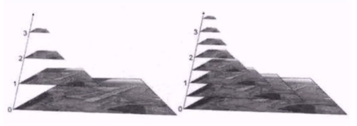

# 1 图像的缩放

图像的缩放可以使用函数 `cv2.resize ()` ，来调整图像的大小。

```python
cv2.resize ()
```

**Declaration :** 

```python
(function)  
def resize(  
	src: MatLike,  
	dsize: Size | None,  
	dst: MatLike | None = ...,  
	fx: float = ...,  
	fy: float = ...,  
	interpolation: int = ...  
) -> MatLike: ...
```

**Parameters :** 
- `dsize` : the destination size `(width, height)`
- `fx` : if `dsize` is `None`, it will calculate the scale percentage on horizontal direction by `fx` 
- `fy` : vertical percentage to scale the img
- `interpolation` : 指定 **插值方法** 
	- `cv2.INTER_LINEAR` : 双线性插值法
	- `cv2.INTER_NEAREST` : 最近邻插值
	- `cv2.INTER_AREA` : 像素区域重采样，
	- `cv2.INTER_CUBIC` : 双三次插值

# 2 图像的平移

```python
cv2.warpAffine ()
```

**Declaration :** 

```python
(function)  
def warpAffine(  
	src: MatLike,  
	M: MatLike,  
	dsize: Size,  
	dst: MatLike | None = ...,  
	flags: int = ...,  
	borderMode: int = ...,  
	borderValue: Scalar = ...  
) -> MatLike: ...
```

**Parameters :**
- `M` : the **linear transformation matrix to be apply to the img** 
	- the type of the matrix should be `np.float32` 
- `dsize` : the **output img** size

## 2.1 How to get the Matrix ?

For one pixel tansformation in the img, we can get the linear transfomation by a matrix. It is

$$
\begin{bmatrix}x^{'}\\y^{'}\\1\end{bmatrix} = \mathrm{M} \times \begin{bmatrix}x\\y\\1\end{bmatrix}
$$
Since the transformation matrix is timed on **left** , so it is perform by rows :

$$
\begin{bmatrix}x^{'}\\y^{'}\\1\end{bmatrix} = 
\begin{bmatrix}
row1\ of\ M  \times SRC\\
row2\ of\ M\ \times SRC\\
row3\ of\ M\ \times SRC
\end{bmatrix}
$$
And we know : 

$$
\begin{array}{l}
x^{'} = x + dx\\
y^{'} = y + dy
\end{array}
$$
So we can easily get the target matrix : 

$$
\begin{bmatrix}
1 & 0 & dx \\
0 & 1 & dy \\
0 & 0 & 1
\end{bmatrix}
$$
That is :

$$
\begin{bmatrix}x^{'}\\y^{'}\\1\end{bmatrix} = 
\begin{bmatrix}
1 & 0 & dx \\
0 & 1 & dy \\
0 & 0 & 1
\end{bmatrix}
\times \begin{bmatrix}x\\y\\1\end{bmatrix}
$$

## 2.2 How to apply the matrix on the img ?

```python
import cv2
import numpy as np

# create a pure color img
img = np.ones ((512, 512, 3), np.uint8)
img[:, :, 0] = 255
img[:, :, 1] = 255

cv2.imshow ("Img", img)

# get the original size
width, height = img.shape[:2]

# get the transformation matrix
M = np.float32 ([[1, 0, 100], [0, 1, 150]])

# apply the transformation
imgTrans = cv2.warpAffine (img, M, (width, height))
cv2.imshow ("Trans", imgTrans)

if (cv2.waitKey (0) == 27) :

    exit ()
```

Result : 


# 3 图像的旋转

图像的旋转同样对应着一种 **线性变换** 。

## 3.1 Transformation Matrix

### 3.1.1 Rotate


From $(x, y)$ to $(x', y')$ , there is a transformation :

$$
\begin{bmatrix} x' \\ y' \\ 1 \end{bmatrix} = \mathrm{M} \times
\begin{bmatrix} x \\ y \\ 1 \end{bmatrix} 
$$
Since we have : 

$$
\left\{
\begin{array}{l}
x = r\cos{\alpha}\\
y = r\sin{\alpha}
\end{array}
\right.
\Rightarrow
r = \dfrac{x}{\cos{\alpha}} = \dfrac{y}{\sin{\alpha}}
\tag{1}
$$
And :

$$
\left\{
\begin{array}{l}
x' = r\cos{(\alpha - \theta)} = r\cos{\alpha}\cos{\theta} + r\sin{\alpha}\sin{\theta} \\
y' = r\sin{(\alpha - \theta)} = r\sin{\alpha}\cos{\theta} - r\cos{\alpha}\sin{\theta}
\end{array}
\right.
\tag{2}
$$

Substitute $(1)$ into $(2)$ , we can get : 

$$
\left\{
\begin{array}{l}
x' =\ \  x\cos{\theta} + y\sin{\theta} \\
y' = - x\sin{\theta} + y\cos{\theta}
\end{array}
\right.
$$

So we will have the matirx : 

$$
\begin{bmatrix} x' \\ y' \\ 1 \end{bmatrix} = 
\begin{bmatrix}
\cos{\theta} & \sin{\theta} & 0 \\
-\sin{\theta} & \cos{\theta} & 0 \\
0 & 0 & 1
\end{bmatrix}
\begin{bmatrix}
x \\ y \\ 1
\end{bmatrix}
$$

### 3.1.2 Transformation

In the above tansformation, we use a **specific rotae center / origin** to describe the transformation, if we want to put it into OpenCV, we need to relocate the position of the origin to the top-left corner.

#### 1. Keep it as whole


Because : 
$$
\left\{
\begin{array}{l}
\cos{\alpha} = \dfrac{width}{2} / \ r \\
\sin{\alpha} = \dfrac{height}{2} / \ r
\end{array}
\right.
$$
$$
\left\{
\begin{array}{l}
x_0 = - r\cos{(\alpha - \theta)} \\
y_0 = r\sin{(\alpha + \theta)}
\end{array}
\right.
$$
$$r = \sqrt{\left(\dfrac{width}{2}\right)^2 + \left(\dfrac{height}{2}\right)^2}$$

So, 
$$
\begin{bmatrix}
x' \\ y' \\ 1
\end{bmatrix} = 
\overbrace{\begin{bmatrix}
1 & 0 & 0 \\
0 & -1 & 0 \\
0 & 0 & 1
\end{bmatrix}}^{A}
\underbrace{\begin{bmatrix}
1 & 0 & x_0 \\
0 & 1 & y_0 \\
0 & 0 & 1
\end{bmatrix}}_{B}
\overbrace{\begin{bmatrix}
\cos{\theta} & \sin{\theta} & 0 \\
-\sin{\theta} & \cos{\theta} & 0 \\
0 & 0 & 1
\end{bmatrix}}^C
\begin{bmatrix}
x \\ y \\ 1
\end{bmatrix}
$$

In the equation above, $C$ do the rotation in the original frame, $B$ move the origin to the top left corner, $A$ do the vertical clip. So $x'$ , $y'$ are under the red frame while $x$ , $y$ are under the black frame.

#### 2. Show only the original size


Since 

$$
\left\{
\begin{array}{l}
x_0 = - \dfrac{width}{2} \\
y_0 = \dfrac{height}{2}
\end{array}
\right.
$$
So

$$
\begin{bmatrix}
x' \\ y' \\ 1
\end{bmatrix} = 
\begin{bmatrix}
1 & 0 & 0 \\
0 & -1 & 0 \\
0 & 0 & 1
\end{bmatrix}
\begin{bmatrix}
1 & 0 & x_0 \\
0 & 1 & y_0 \\
0 & 0 & 1
\end{bmatrix}
\begin{bmatrix}
\cos{\theta} & \sin{\theta} & 0 \\
-\sin{\theta} & \cos{\theta} & 0 \\
0 & 0 & 1
\end{bmatrix}
\begin{bmatrix}
x \\ y \\ 1
\end{bmatrix}
$$

## 3.2 实现方式

### 3.2.1 获取变换矩形

我们可以直接利用 OpenCV 里的函数 `cv2.getRotationMatrix2D ()` 来获取用于旋转变换的矩形。

```python
cv2.getRotationMatrix2D ()
```

**Declaration :** 

```python
(function) def getRotationMatrix2D(  
	center: Point2f,  
	angle: float,  
	scale: float  
) -> MatLike
```

**Parameters :**
- `center` : the rotation center
- `angle` : the rotation angle
	- the positive angle is the **counterclockwise** 
- `scale` : the scale percentage

### 3.2.1 实现变换

`cv2.warpAffine ()` 并不只能用于平移，只要能通过构造矩阵产生的 **线性变化** ，都能通过该函数进行变换。

```python
import cv2
import numpy as np

# create a pure color img
img = np.ones ((512, 512, 3), np.uint8)
img[:, :, 0] = 255
img[:, :, 1] = 255
img[200:300, :, 2] = 200
cv2.imshow ("Img", img)

# get the transformation matrix
M = cv2.getRotationMatrix2D ((img.shape[0] / 2, img.shape[1] / 2), 60, 1)

# apply the transformation
imgTrans = cv2.warpAffine (img, M, (512, 512))
cv2.imshow ("Trans", imgTrans)

if (cv2.waitKey (0) == 27) :

    exit ()
```

Result : 

- Before Rotation
- After Rotation

# 4 仿射变换

图像的 **仿射变换** 涉及到图像的 **形状，位置，角度的变化**，是深度学习预处理中常到的功能，仿射变换主要是对图像的 **缩放，旋转，翻转和平移** 等操作的组合。

那什么是图像的仿射变换？如下图所示，图1中的点1，2和3与图二中三个点 **一一映射** ，仍然形成三角形，但形状已经大大改变，通过这样 **两组三点（感兴趣点）求出仿射变换**，接下来我们就能 **把仿射变换应用到图像中所有的点中**，就完成了图像的仿射变换。


仿射变换最大的特点便是 **不会改变线之间的平行关系** ，即不改变二维图像的 **平直性** 。

## 4.1 Matrix

仿射变换的矩阵一般由一个代表线性变换的矩阵和一个代表平移的矩阵组成，可以表示为：

$$M = \begin{bmatrix}A & B \end{bmatrix} = 
\begin{bmatrix}
a_{00} & a_{01} & b_0\\
a_{10} & a_{11} & b_1\\
\end{bmatrix}
$$

对一组向量作仿射变换可以表示为：

$$
T = A \begin{bmatrix}x \\ y \end{bmatrix} + B = 
\begin{bmatrix}
a_{00}x + a_{01}y + b_0 \\
a_{10}x + a_{11}y +b_1
\end{bmatrix}
$$

如果写成一个矩阵乘积的形式，看成一整个线性变换，则是：

$$
T = \begin{bmatrix}x' \\ y' \\ 1\end{bmatrix} =
\underbrace{
\begin{bmatrix}
1 & 0 & dx \\
0 & 1 & dy \\
0 & 0 & 1
\end{bmatrix}
}_{Translation}
\overbrace{
\begin{bmatrix}
a_{00} & a_{01} & 0 \\
a_{10} & a_{11} & 0 \\
0 & 0 & 1
\end{bmatrix}
}^{Other\ Tansformation}
\begin{bmatrix}x \\ y \\ 1\end{bmatrix}=
\begin{bmatrix}
a_{00} & a_{01} & dx \\
a_{10} & a_{11} & dy \\
0 & 0 & 1
\end{bmatrix}
\begin{bmatrix}x \\ y \\ 1\end{bmatrix}
$$

## 4.2 实现方式

### 4.2.1 获取用于变换的点(感兴趣点)

```python
src = np.float32 ([[10, 10], [300, 300], [10, 300]])
dst = np.float32 ([20, 20], [250, 200], [30, 400])
```

### 4.2.2 获取仿射变换的矩阵

我们可以使用 `cv2.getAffineTransform ()` 来获取仿射变换所需要的变换矩阵。

```python
cv2.getAffineTransform ()
```

**Declaration :** 

```python
(function)  
def getAffineTransform(  
	src: MatLike,  
	dst: MatLike  
) -> MatLike: ...
```

**Parameters :**
- `src` : the source points set
- `dst` : the destination points set

### 4.2.2 实现变换

```python
import cv2
import numpy as np

# create a pure color img
img = np.ones ((512, 512, 3), np.uint8)
img[:, :, 0] = 255
img[:, :, 1] = 255
img[200:300, :, 2] = 200
cv2.imshow ("Img", img)

# get the points set to calculate the matrix
src = np.float32 ([[10, 10], [300, 300], [10, 300]])
dst = np.float32 ([[50, 50], [250, 200], [30, 400]])

# get the transformation matrix
M = cv2.getAffineTransform (src, dst)

# apply the transformation
imgTrans = cv2.warpAffine (img, M, (512, 512))
cv2.imshow ("Trans", imgTrans)

if (cv2.waitKey (0) == 27) :
    exit ()
```

Result :
- Before
> 
- After
> 

可以看到，对于仿射变换而言，线与线之间的平行性是不会被改变的。

# 5 透射变换(透视变换)

**透射变换** 是 **视角变化的结果**，是指利用 **透视中心、像点、目标点三点共线** 的条件，按透视旋转定律使承影面（透视面）绕迹线（透视轴）旋转某一角度，破坏原有的投影光线束，仍能保持承影面上投影几何图形不变的变换。

其本质上就是将图像 **投影到一个新的视平面** 。即将二维的图片投影到一个三维视平面上，然后再转换为二维坐标下。即从 **二维 -> 三维 -> 二维** 的过程。

由于转换为三维平面，则需要引入一个新的维度。

## 5.1 Matrix

从二维到三维的变换可以通过以下矩阵来描述：

$$
\begin{bmatrix} X \\ Y \\ Z \end{bmatrix} = 
\begin{bmatrix}
a_1 & b_1 & c_1 \\
a_2 & b_2 & c_2 \\
a_3 & b_3 & c_3
\end{bmatrix}
\begin{bmatrix}x \\ y \\ 1 \end{bmatrix} = 
\begin{bmatrix}
a_1x + b_1y + c_1 \\
a_2x + b_2y + c_2 \\
a_3x + b_3y + c_3
\end{bmatrix}
$$

其中 ， $\begin{bmatrix}a_1 & b_1 \\ a_2 & b_2 \end{bmatrix}$ 表示 **线性变换** ， $\begin{bmatrix} a_3 & b_3 \end{bmatrix}$ 表示 **透视变换** ， 而其余代表 **平移** 。而现在的到的坐标是三维视平面下的坐标，我们需要将其转换为二维视平面的坐标，则需要对 $x, y$ 轴 除以 $z$ 轴来得到新的坐标。

$$
\begin{array}{l}
x^{'} = \dfrac{X}{Z} = \dfrac{a_1x + b_1y + c_1}{a_3x + b_3y + c_3} \\\\
y^{'} = \dfrac{Y}{Z} = \dfrac{a_2x + b_2y + c_2}{a_3x + b_3y + c_3}
\end{array}
$$

则得到的新坐标的矩阵形式为：

$$
\begin{bmatrix} x^{'} \\ y^{'} \\ 1 \end{bmatrix} = 
\begin{bmatrix}
a_{00} & a_{01} & dx \\
a_{10} & a_{11} & dy \\
b_1 & b_2 & b_3
\end{bmatrix}
\begin{bmatrix}
x \\ y \\ 1
\end{bmatrix}
$$

## 5.2 实现方式

### 5.2.1 获取用于变换的点 (感兴趣点) 

```python
src = np.float32 ([[20, 20], [400, 20], [20, 400], [400, 400]])
dst = np.float32 ([[40, 40], [500, 5], [40, 300], [500, 415]])
```

### 5.2.2 获取变换矩阵

与仿射变换类似，我们可以通过函数 `cv2.getPerspectiveTransform ()` 来获得我们需要的变换矩阵。

```python
cv2.getPerspectiveTransform ()
```

**Declaration :** 

```python
(function)  
def getPerspectiveTransform(  
	src: MatLike,  
	dst: MatLike,  
	solveMethod: int = ...  
) -> MatLike: ...
```

**Parameters :**
- `src` : input points set
- `dst` : the destination of the points set

### 5.2.3 实现变换

```python
import cv2
import numpy as np

# create a pure color img
img = np.ones ((512, 512, 3), np.uint8)
img[:, :, 0] = 255
img[:, :, 1] = 255
img[200:300, :, 2] = 200
cv2.imshow ("Img", img)

# get the points set to calculate the matrix
src = np.float32 ([[20, 20], [400, 20], [20, 400], [400, 400]])
dst = np.float32 ([[40, 40], [500, 5], [40, 300], [500, 415]])

# get the transformation matrix
M = cv2.getPerspectiveTransform (src, dst)

# apply the transformation
imgTrans = cv2.warpPerspective (img, M, (512, 512))

cv2.imshow ("Trans", imgTrans)
if (cv2.waitKey (0) == 27) :
    exit ()
```

Result : 
- before : 
> 
- after : 
> 

# 6 图像金字塔

图像金字塔是图像多尺度表达的一种，最主要 **用于图像的分割**，是一种以多分辨率来解释图像的有效但概念简单的结构。

图像金字塔用于 **机器视觉和图像压缩**，一幅图像的金字塔是一系列以金字塔形状排列的 **分辨率逐步降低**，且来源于同一张原始图的图像集合。其通过 **梯次向下采样获得**，直到达到某个终止条件才停止采样。

金字塔的底部是待处理图像的高分辨率表示，而顶部是低分辨率的近似，**层级越高，图像越小，分辨率越低**。



通过 **下采样** ，可以获得 **分辨率逐步降低** 的图像，通过 **上采样** ，可以获得 **分辨率逐步增大** 的图像。

我们可以通过 `cv2.pyrUp ()` 和 `cv2.pyrDown ()` 来对图像进行 **上/下采样** 

**Declaration :** 

```python
(function) def pyrUp(  
	src: MatLike,  
	dst: MatLike | None = ...,  
	dstsize: Size = ...,  
	borderType: int = ...  
) -> MatLike

(function) def pyrDown(  
	src: MatLike,  
	dst: MatLike | None = ...,  
	dstsize: Size = ...,  
	borderType: int = ...  
) -> MatLike
```

**Parameters :** 
- `dstsize` : the output img size after the process

```python
import cv2

img = cv2.imread ("test.jpg")
img = cv2.resize (img, (512, 256))
cv2.imshow ("Origin", img)

u_img = cv2.pyrUp (img)
d_img = cv2.pyrDown (img)
cv2.imshow ("Up", u_img)
cv2.imshow ("Down", d_img)
if cv2.waitKey (0) == 27 :
    exit ()
```

Result : 
- before : 
- up : 
- down : 

