# 6.1 什么是TIM定时器 ？

TIM 是 **Timer** 的缩写，可以对输入的时钟进行计时，并在数值达到设定值时触发中断。在72MHz的时钟下可以实现最大59.65s的定时。除了基本的定时中断功能，还包含内外时钟源选择、输入捕获、输出比较、编码器接口、主从触发模式等多种功能

## 6.1.1  定时器的类型

| 类型    | 编号                     | 总线   | 功能                                                 |
| ----- | :--------------------- | ---- | -------------------------------------------------- |
| 高级定时器 | TIM1, TIM8             | APB2 | 拥有通用定时器全部功能，并额外具有重复计数器、死区生成、互补输出、刹车输入等功能           |
| 通用定时器 | TIM2, TIM3, TIM4, TIM5 | APB1 | 拥有基本定时器全部功能，并额外具有内外时钟源选择、输入捕获、输出比较、编码器接口、主从触发模式等功能 |
| 基本定时器 | TIM6, TIM7             | APB1 | 拥有定时中断、主模式触发DAC的功能                                 |

> [!attention] 
> **STM32f103C8T6** 的定时资源 **只有 TIM1, TIM2, TIM3, TIM4** 

## 6.1.2 定时器结构

### 0. 计数模式

 - **向上计数** - 从 **0** 开始向上自增，计数到设定的 **重装值**，然后清零申请中断，并开始下一轮计数
 - **向下计数** - 从 **重装值** 开始向下自减，直到 **0** 
 - **中央对齐** - 从 **0** 开始向上自增，计数到设定的 **重装值** ，申请中断，然后从 **重装值** 开始自减，直到 **0** ，再次申请中断，然后开始下一轮计数

> [!note] 
> 对于 **基本定时器**，**只有向上计数一种计数模式**，而通用定时器和高级定时器三种计数模式都有。一般情况下我们会采用向上计数。

### 1. 基本定时器

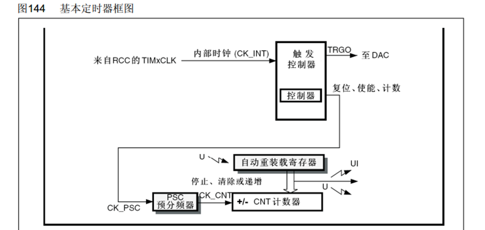

预分频器用于将输入的时钟（内部时钟一般为72MHz）进行分频，实际分频值为预分频设定值加一。

- UI 代表触发更新中断(update interrupt)
- U 代表触发更新事件
	- 可以将其映射到TRGO来自动触发DAC

### 2. 通用定时器

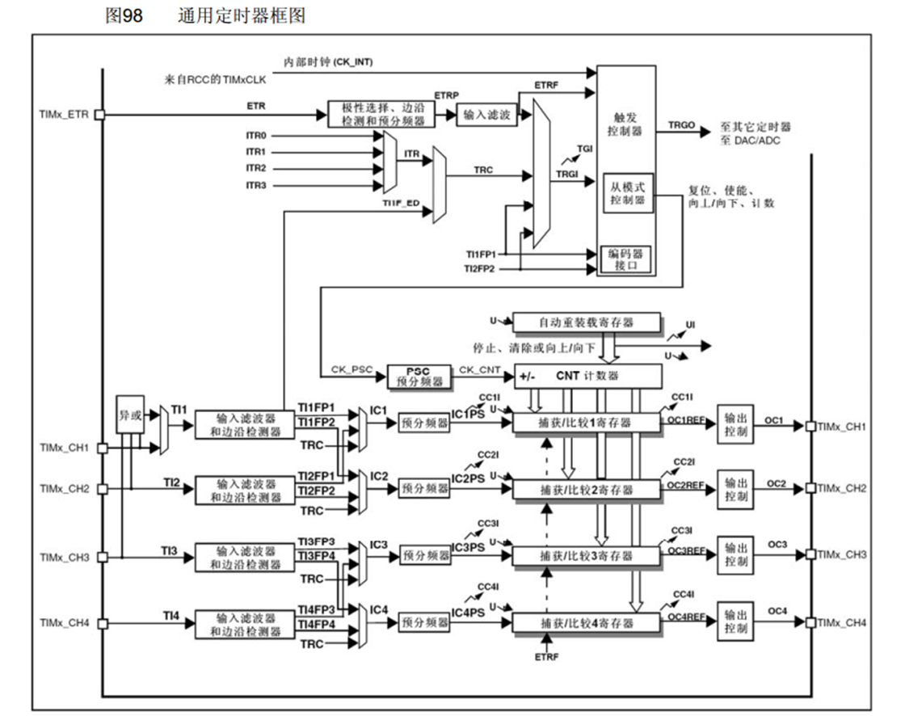

### 3. 高级定时器

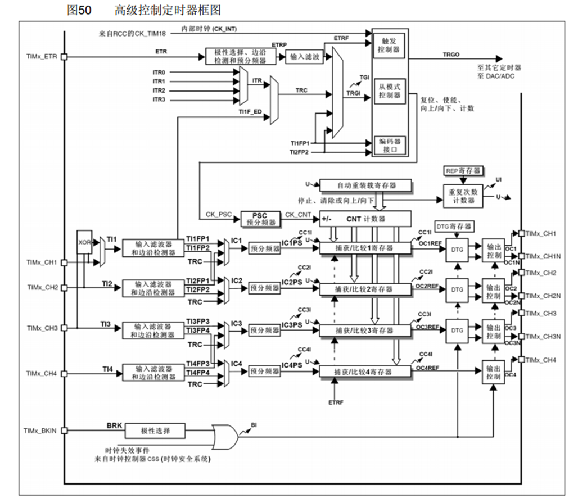

## 6.1.3 定时中断的基本结构

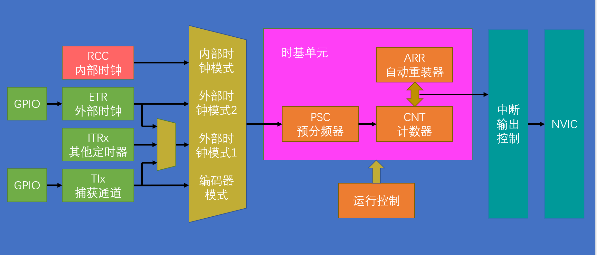

## 6.1.4 预分频时序

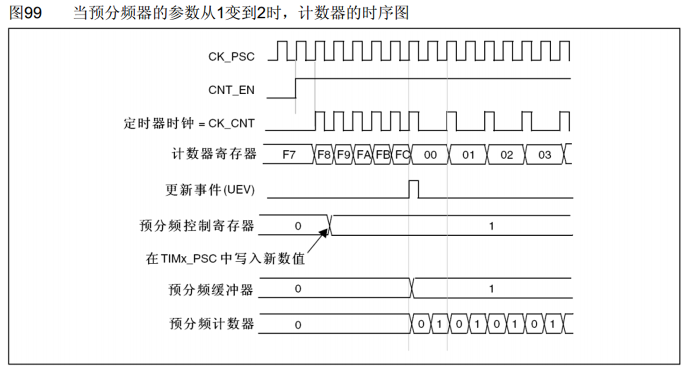

计数器计数频率 : 
- CK_CNT = CK_PSC / (PSC + 1)
	- CK_CNT 是计数的频率
	- CK_PSC 是输入预分频器的时钟频率
	- PSC 是设定的预分频值

## 6.1.5 计数器时序

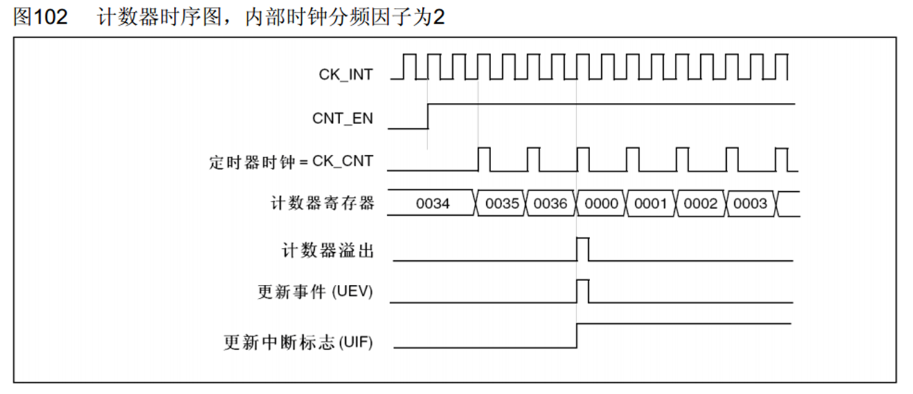

计数器溢出频率：
- CK_CNT_OV = CK_CNT / (ARR + 1)
			= CK_PSC / (PSC + 1) / (ARR + 1)
	- CK_CNT_OV 是计数器溢出频率
	- ARR 是自动重装器设定值

### 1. 无预装时序

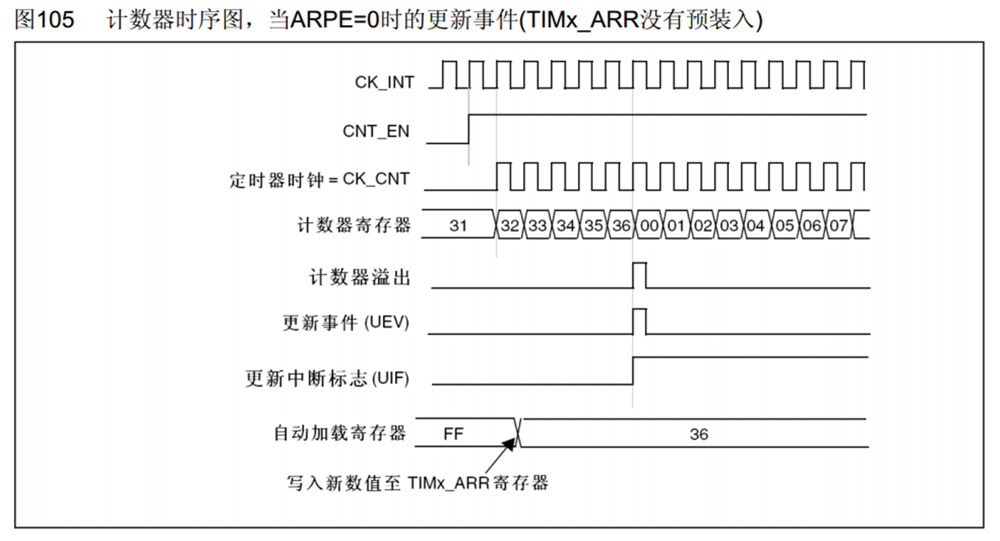

在没有预装时序的时候，没有 **自动加载影子寄存器** ，因此，在重新设置 ARR，即重新设定自动重装器的时候，会直接更改其值。

### 2. 有预装时序

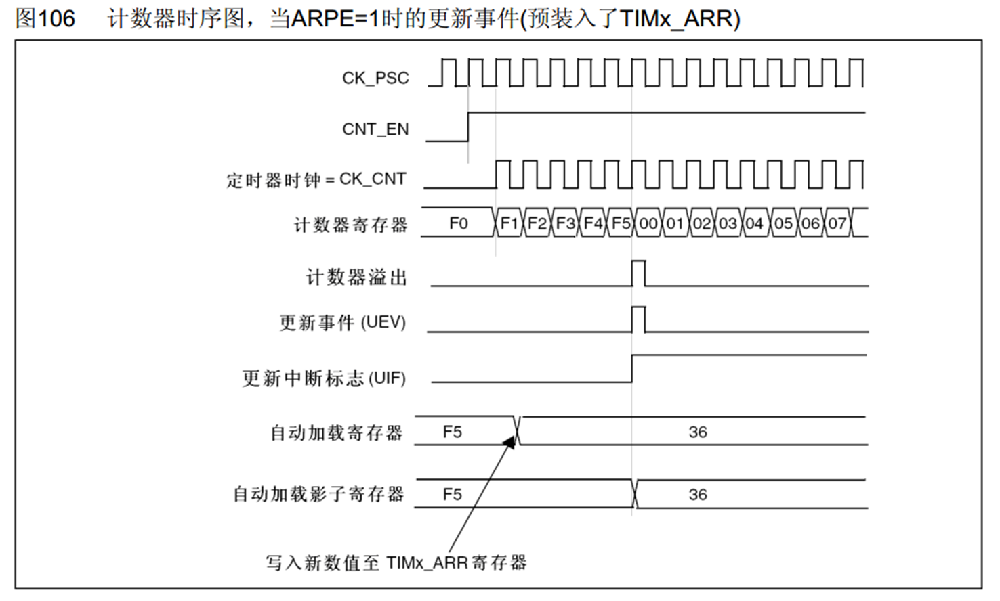

而有预装时序的时候，有 **自动加载影子寄存器** ，能够在当前计数完成之后才重新设定 ARR ，开始下一轮新的计时。

## 6.1.6 RCC 时钟树

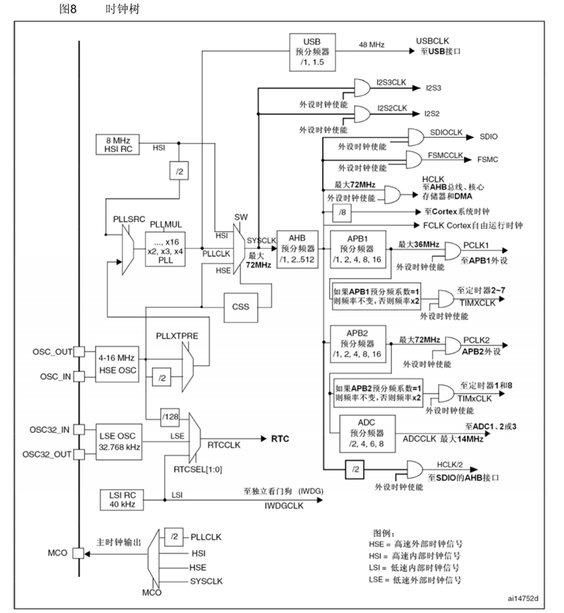

# 6.2 定时器定时中断

## 6.2.1 内部时钟

我们可以通过 
一图来配置我们需要的 TIM : 

- 选择时钟：内部时钟或外部时钟
- 配置时基单元
- 配置定时中断
- 配置 NVIC

对于 `timer.c` : 

```C
#include "timer.h"

void Timer_Init ()
{
    // RCC 外部时钟使能
    RCC_APB1PeriphClockCmd(RCC_APB1Periph_TIM2, ENABLE);

    // 选择时基单元的时钟
    TIM_InternalClockConfig(TIM2);

    // 配置时基单元
    TIM_TimeBaseInitTypeDef TIM_TimeBaseInitStruct;
    TIM_TimeBaseStructInit(&TIM_TimeBaseInitStruct);
    TIM_TimeBaseInitStruct.TIM_ClockDivision = TIM_CKD_DIV1;
    TIM_TimeBaseInitStruct.TIM_CounterMode = TIM_CounterMode_Up;
    // 定时 1s ，即定时频率为 1Hz
    // CK_CNT_OV = CK_PSC / (PSC + 1) / (ARR + 1)
    TIM_TimeBaseInitStruct.TIM_Period = 10000 - 1;      // ARR
    TIM_TimeBaseInitStruct.TIM_Prescaler = 7200 - 1;    // PSC
    //！ PSC 和 ARR 都应该在 0 - 65535 之间取值
    TIM_TimeBaseInitStruct.TIM_RepetitionCounter = 0;
    TIM_TimeBaseInit(TIM2, &TIM_TimeBaseInitStruct);

    // 配置中断
    TIM_ITConfig(TIM2, TIM_IT_Update, ENABLE);
    
    // 配置 NVIC
    NVIC_PriorityGroupConfig(NVIC_PriorityGroup_2);
    NVIC_InitTypeDef NVIC_InitStruct;
    NVIC_InitStruct.NVIC_IRQChannel = TIM2_IRQn;
    NVIC_InitStruct.NVIC_IRQChannelCmd = ENABLE;
    NVIC_InitStruct.NVIC_IRQChannelPreemptionPriority = 2;
    NVIC_InitStruct.NVIC_IRQChannelSubPriority = 1;
    NVIC_Init(&NVIC_InitStruct);

    // 启动定时器
    TIM_Cmd(TIM2, ENABLE);
}

void TIM2_IRQHandler(void)
{
    if (TIM_GetITStatus(TIM2, TIM_IT_Update) == SET)
    {
        extern uint16_t num;
        num++;
        TIM_ClearITPendingBit(TIM2, TIM_IT_Update);
    }
    
}
```

## 6.2.2 外部时钟

在 STM32C8T6 中，TIM2定时器的CH1可以设置为外部时钟读取，通过 **GPIO** 进行输入，其复用接口为 **PA0** 。

对于 `timer.c` : 

```C
#include "timer.h"

void Timer_Init ()
{
    // RCC 外设时钟使能
    RCC_APB1PeriphClockCmd(RCC_APB1Periph_TIM2, ENABLE);
    RCC_APB2PeriphClockCmd(RCC_APB2Periph_GPIOA, ENABLE);

    // 选择时基单元的时钟
    TIM_ETRClockMode2Config(TIM2, TIM_ExtTRGPSC_OFF, TIM_ExtTRGPolarity_NonInverted, 0x00);

    // 配置外部时钟的 GPIO
    GPIO_InitTypeDef GPIO_InitStruct;
    GPIO_InitStruct.GPIO_Mode = GPIO_Mode_IPU;
    GPIO_InitStruct.GPIO_Pin = GPIO_Pin_0;
    GPIO_InitStruct.GPIO_Speed = GPIO_Speed_50MHz;
    GPIO_Init(GPIOA, &GPIO_InitStruct);
    

    // 配置时基单元
    TIM_TimeBaseInitTypeDef TIM_TimeBaseInitStruct;
    TIM_TimeBaseStructInit(&TIM_TimeBaseInitStruct);
    TIM_TimeBaseInitStruct.TIM_ClockDivision = TIM_CKD_DIV1;
    TIM_TimeBaseInitStruct.TIM_CounterMode = TIM_CounterMode_Up;
    // 定时 1s ，即定时频率为 1Hz
    // CK_CNT_OV = CK_PSC / (PSC + 1) / (ARR + 1)
    TIM_TimeBaseInitStruct.TIM_Period = 10000 - 1;      // ARR
    TIM_TimeBaseInitStruct.TIM_Prescaler = 7200 - 1;    // PSC
    //！ PSC 和 ARR 都应该在 0 - 65535 之间取值
    TIM_TimeBaseInitStruct.TIM_RepetitionCounter = 0;
    TIM_TimeBaseInit(TIM2, &TIM_TimeBaseInitStruct);

    // 配置中断
    TIM_ITConfig(TIM2, TIM_IT_Update, ENABLE);
    
    // 配置 NVIC
    NVIC_PriorityGroupConfig(NVIC_PriorityGroup_2);
    NVIC_InitTypeDef NVIC_InitStruct;
    NVIC_InitStruct.NVIC_IRQChannel = TIM2_IRQn;
    NVIC_InitStruct.NVIC_IRQChannelCmd = ENABLE;
    NVIC_InitStruct.NVIC_IRQChannelPreemptionPriority = 2;
    NVIC_InitStruct.NVIC_IRQChannelSubPriority = 1;
    NVIC_Init(&NVIC_InitStruct);

    // 启动定时器
    TIM_Cmd(TIM2, ENABLE);
}

void TIM2_IRQHandler(void)
{
    if (TIM_GetITStatus(TIM2, TIM_IT_Update) == SET)
    {
        extern uint16_t num;
        num++;
        TIM_ClearITPendingBit(TIM2, TIM_IT_Update);
    }
    
}
```

# 6.3 TIM 输出比较

## 6.3.1 输出比较

### 1. 介绍

**OC（Output Compare）输出比较** ，可以通过比较 CNT 与 CCR 寄存器值的关系，来对输出电平进行置1、置0或翻转的操作，用于输出一定频率和占空比的PWM波形。每个高级定时器和通用定时器都拥有 **4个输出比较通道**，高级定时器的前3个通道额外拥有死区生成和互补输出的功能。实现输出比较需要使用 **CCR (Capture/Compare Register)** ，输入捕获和输出比较都通过该寄存器实现。

### 2. 结构图

.png)

CNT与CCR1进行比较，然后输出 oc1ref，ref 是 reference，是参考信号的意思，将 ref 输出到使能电路。在这个过程中有个 CC1P，用于极性选择，当给该寄存器写0时，就会往上走，仍然输出0，当给该寄存器写1时，就会往下走，输出1，实现高低电平的反转。

输出模式控制器用来控制 ref 的电平，其功能如下所示：
 
| 模式       | 描述                                                                                             |
| -------- | ---------------------------------------------------------------------------------------------- |
| 冻结       | CNT=CCR时，REF保持为原状态                                                                             |
| 匹配时置有效电平 | CNT=CCR时，REF置有效电平(高电平)                                                                         |
| 匹配时置无效电平 | CNT=CCR时，REF置无效电平(低电平)                                                                         |
| 匹配时电平翻转  | CNT=CCR时，REF电平翻转                                                                               |
| 强制为无效电平  | CNT与CCR无效，REF强制为无效电平                                                                           |
| 强制为有效电平  | CNT与CCR无效，REF强制为有效电平                                                                           |
| PWM模式1   | 向上计数：CNT<CCR时，REF置有效电平(高电平)，CNT≥CCR时，REF置无效电平<br>向下计数：CNT>CCR时，REF置无效电平(低电平)，CNT≤CCR时，REF置有效电平 |
| PWM模式2   | 向上计数：CNT<CCR时，REF置无效电平(低电平)，CNT≥CCR时，REF置有效电平<br>向下计数：CNT>CCR时，REF置有效电平(高电平)，CNT≤CCR时，REF置无效电平 |
> PWM模式1 和 PWM模式2 可以用于输出频率和占空比可调的PWM波形

## 6.3.2 PWM

### 1. 介绍

**PWM（Pulse Width Modulation）脉冲宽度调制** ，在具有惯性的系统中，可以通过对一系列脉冲的宽度进行调制，来 **等效地获得所需要的模拟参量**，常应用于 **电机控速** 等领域

- PWM参数：
	- 频率 = 1 / T_S
	- 占空比 = T_ON / T_S
	- 分辨率 = 占空比变化步距

### 2. 基本结构

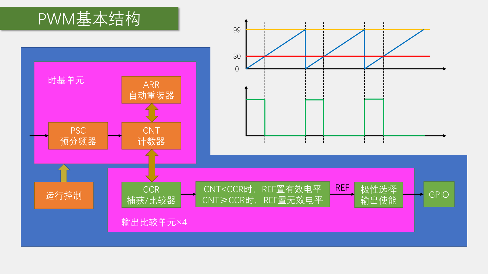

在配置好定时器之后，CNT不断自增，同时CCR将其与设定值进行比较，然后像GPIO设置高低电平，在右上的图像中，黄线为CNT设定值，红线为CCR设定值，蓝线为CNT的计数值，当CNT小于CCR时，输出高电平(此时为PWM模式1)，当CNT大于CRR时，输出低电平，然后当CNT达到ARR时，会重装清零，重新开始计时。参数的计算如下：

- PWM频率：  Freq = CK_PSC / (PSC + 1) / (ARR + 1)
- PWM占空比：  Duty = CCR / (ARR + 1)
- PWM分辨率：  Reso = 1 / (ARR + 1)

## 6.3.3 PWM可以控制的外设

### 1. 舵机

舵机根据输入的PWM信号占空比来控制输出角度的装置，要求输入的PWM信号 **周期为20ms** ，**高电平的宽度为 0.5ms - 2.5ms** 。

### 2. 直流电机

电机需要通过驱动芯片来控制，常见的驱动有 TB6612, DRV8833, L9110, L298N 等，我们来看看 TB6612。

TB6612的电路图如下：

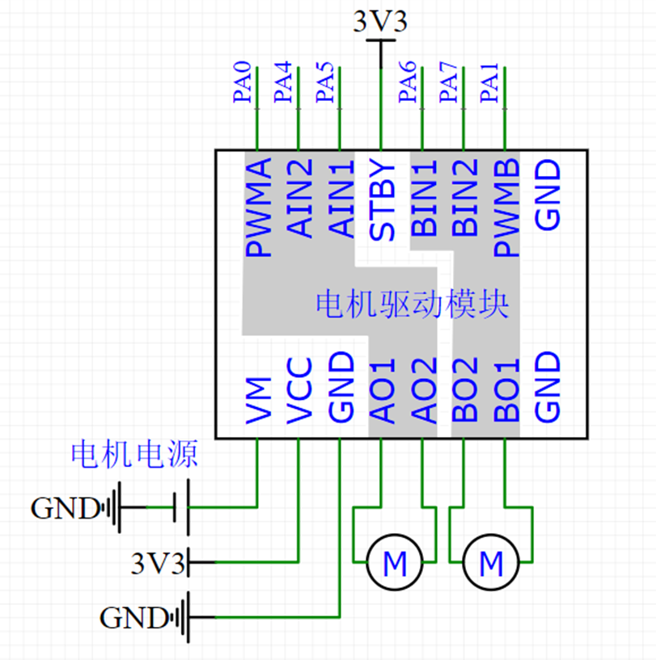

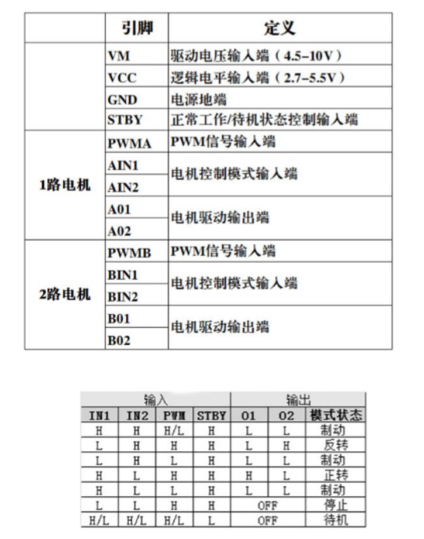

## 6.3.4 Led呼吸灯

`timer.c` : 

```C
#include "timer.h"
#include "stm32f10x.h"

void PWM_Init ()
{
    // 开启时钟
    RCC_APB1PeriphClockCmd(RCC_APB1Periph_TIM2, ENABLE);
    RCC_APB2PeriphClockCmd(RCC_APB2Periph_GPIOA, ENABLE);

    GPIO_InitTypeDef GPIO_InitStruct;
    GPIO_InitStruct.GPIO_Mode = GPIO_Mode_AF_PP;
    GPIO_InitStruct.GPIO_Pin = GPIO_Pin_0;
    GPIO_InitStruct.GPIO_Speed = GPIO_Speed_50MHz;
    GPIO_Init(GPIOA, &GPIO_InitStruct);

    // 配置内部时钟
    TIM_InternalClockConfig(TIM2);

    // 配置时基单元
    TIM_TimeBaseInitTypeDef TIM_TimeBaseInitStruct;
    TIM_TimeBaseInitStruct.TIM_ClockDivision = TIM_CKD_DIV1;
    TIM_TimeBaseInitStruct.TIM_CounterMode = TIM_CounterMode_Up;
    TIM_TimeBaseInitStruct.TIM_Period = 100 - 1;
    TIM_TimeBaseInitStruct.TIM_Prescaler = 720 - 1;
    TIM_TimeBaseInitStruct.TIM_RepetitionCounter = 0;
    TIM_TimeBaseInit(TIM2, &TIM_TimeBaseInitStruct);

    TIM_OCInitTypeDef TIM_OCInitStruct;
    TIM_OCStructInit(&TIM_OCInitStruct);
    
    TIM_OCInitStruct.TIM_OCMode = TIM_OCMode_PWM1;              // OutputCompare 模式
    TIM_OCInitStruct.TIM_OCPolarity = TIM_OCPolarity_High;      // 极性选择
    TIM_OCInitStruct.TIM_OutputState = TIM_OutputState_Enable;  // 输出使能
    TIM_OCInitStruct.TIM_Pulse = 50;                             // CCR的值
    TIM_OC1Init(TIM2, &TIM_OCInitStruct);

    TIM_Cmd(TIM2, ENABLE);
}
```

## 6.3.5 舵机

`Servo.h` :

```C
#ifndef __SERVO_H
#define __SERVO_H

#define MIN_Compare 500
#define MAX_Compare 2500
#define MIN_Angle 0.f
#define MAX_Angle 180.f
#define cpa (MAX_Compare - MIN_Compare) / (MAX_Angle - MIN_Angle)

void Servo_Init();
void SetServo_Angle(float angle);

#endif
```

`Servo.c` : 

```C
#include "Servo.h"
#include "stm32f10x.h"

void Servo_Init()
{
    RCC_APB1PeriphClockCmd(RCC_APB1Periph_TIM2, ENABLE);
    RCC_APB2PeriphClockCmd(RCC_APB2Periph_GPIOA, ENABLE);

    GPIO_InitTypeDef GPIO_InitStruct;
    GPIO_InitStruct.GPIO_Mode = GPIO_Mode_AF_PP;
    GPIO_InitStruct.GPIO_Pin = GPIO_Pin_1;
    GPIO_InitStruct.GPIO_Speed = GPIO_Speed_50MHz;
    GPIO_Init(GPIOA, &GPIO_InitStruct);

    TIM_InternalClockConfig(TIM2);
    TIM_TimeBaseInitTypeDef TimeBaseInitStruct;
    TimeBaseInitStruct.TIM_ClockDivision = TIM_CKD_DIV1;
    TimeBaseInitStruct.TIM_CounterMode = TIM_CounterMode_Up;
    TimeBaseInitStruct.TIM_Period = 20000 - 1;
    TimeBaseInitStruct.TIM_Prescaler = 72 - 1;
    TimeBaseInitStruct.TIM_RepetitionCounter = 0;
    TIM_TimeBaseInit(TIM2, &TimeBaseInitStruct);

    TIM_OCInitTypeDef OCInitStruct;
    TIM_OCStructInit(&OCInitStruct);
    OCInitStruct.TIM_OCMode = TIM_OCMode_PWM1;
    OCInitStruct.TIM_OCPolarity = TIM_OCPolarity_High;
    OCInitStruct.TIM_OutputState = ENABLE;
    OCInitStruct.TIM_Pulse = 1000;
    TIM_OC2Init(TIM2, &OCInitStruct);

    TIM_Cmd(TIM2, ENABLE);
}

void SetServo_Angle(float angle)
{
    uint16_t ccr = angle * cpa + MIN_Compare;
    TIM_SetCompare2(TIM2, ccr);
}
```

# 6.4 输入捕获

## 6.4.1 介绍

**IC (Input Capture) 输入捕获** ：输入捕获模式下，当通道 **输入引脚出现指定电平跳变时**，**当前CNT的值将被锁存到CCR中**，可用于测量PWM波形的频率、占空比、脉冲间隔、电平持续时间等参数，**每个高级定时器和通用定时器都拥有4个输入捕获通道**，可配置为PWMI模式，同时测量频率和占空比，可配合主从触发模式，实现硬件全自动测量

## 6.4.2 频率测量

频率测量主要有如下方法 : 

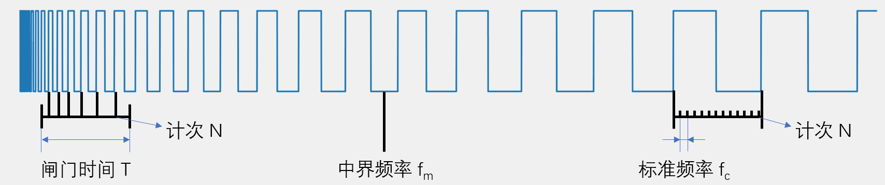

- **测频法** - 在闸门时间 T 内，对上升/下降沿计次，得到次数 N，则频率 $f = N / T$ 
- **测周法** - 在信号的两个上升/下降沿之间使用标准计时器进行计次，其标准频率为 $f_c$，得到次数 N，则频率 $f = f_c / N$ 
- **中界频率** - 测频法和测周法都有可能在计次的末端产生+1或-1的误差，因此，我们定义测频法和测周法误差相等的频率点为中界频率 $f_m = \sqrt{f_c / T}$ 

> [!attention] 
> 测频法适合用于测量比较大的频率，而测周法适合用于测量比较小的频率，这样能使得计次N尽量大一点，减少计数的误差。**当待测频率大于中界频率时，适合使用测周法，当待测频率小于中界频率时，适合使用测频法**。

## 6.4.3 输入捕获通道结构

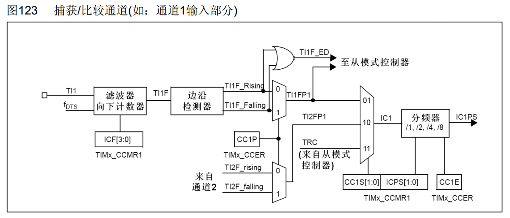

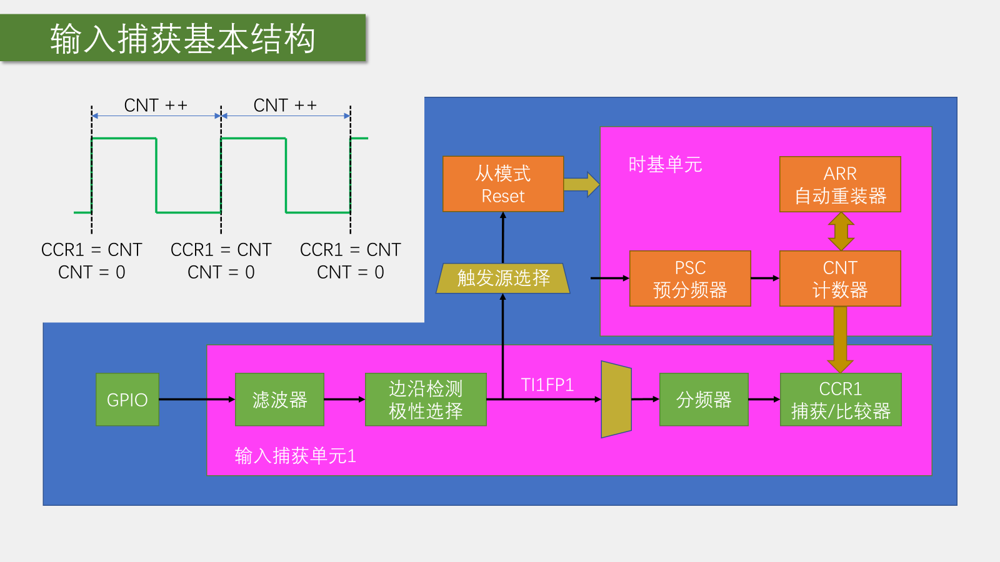

## 6.4.4 PWMI模式的基本结构

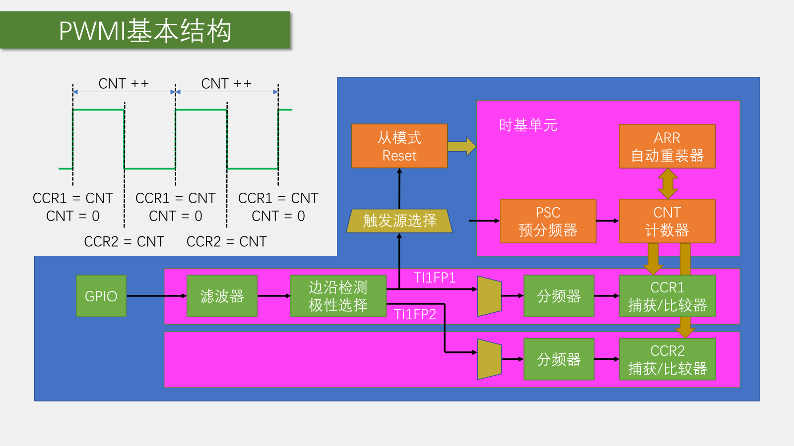

# 6.5 编码器接口

**Encoder Interface 编码器接口** ，编码器接口可接收增量（正交）编码器的信号，根据编码器旋转产生的正交信号脉冲，自动控制CNT自增或自减，从而指示编码器的位置、旋转方向和旋转速度，每个高级定时器和通用定时器都拥有1个编码器接口，两个输入引脚借用了输入捕获的通道1和通道2。

## 6.5.1 正交编码器

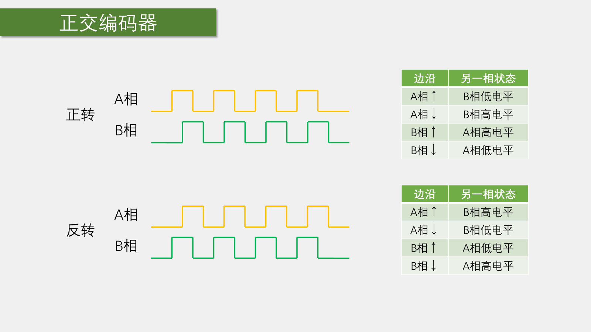

## 6.5.2 编码器接口的基本结构

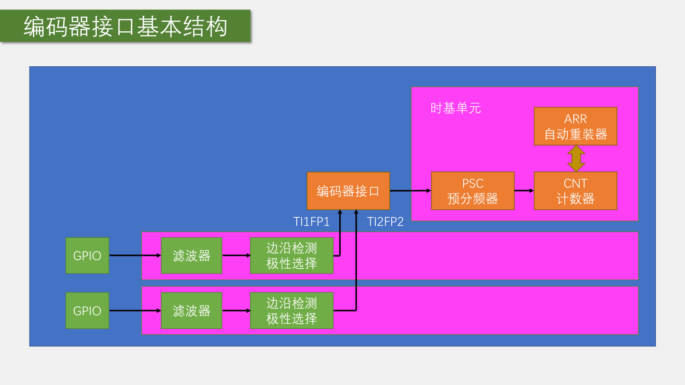