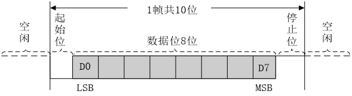
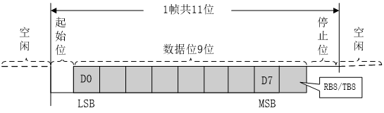
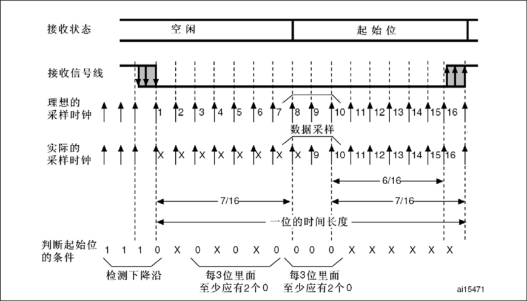
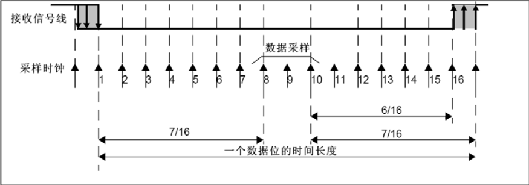
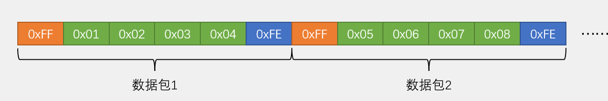
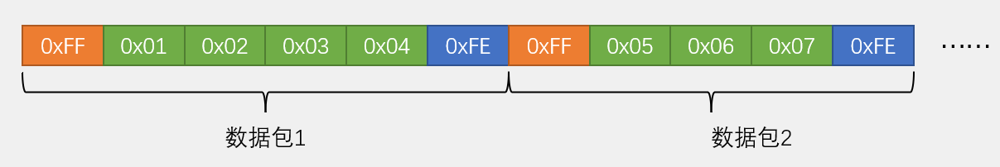
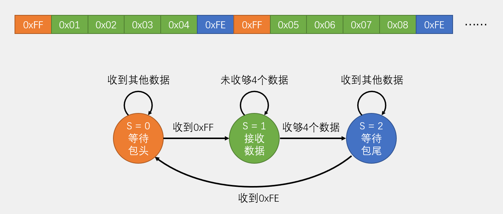
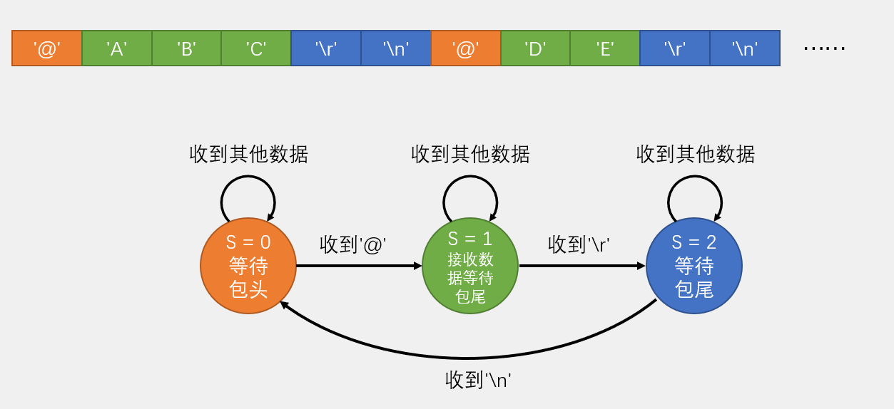

****
通过 **TX** 引脚发送数据， **RX** 引脚接收数据。

# 9.1 串口参数及时序

下图展示了基本的参数：

## 9.1.1 波特率

串口通信的 **速率** ，要传输和接收数据就必须设置好传输和接收的速率。
- 如果接收速率 **小于** 串口发送速率，那么就会 **遗漏信息**
- 如果接收速率 **大于** 串口发送速率，那么就会 **重复接收相同的信息**

例如，如果规定波特率为 `1000 bps` ，那么意味着每一秒要发送 `1000 bit` 的数据，即每隔 `1ms` 会发送 `1 bit` 数据。

## 9.1.2 起始位

起始位标志一个 **数据帧的开始** ，固定为 **低电平** 。

在 **没有** 进行数据传输的时候，是 **高电平** ，表示 **空闲状态** ，如上图，在需要进行数据传输的时候，**必须先发送一个起始位** ，这个起始位打破空闲状态的高电平状态，产生 **下降沿** ，由此告诉接收设备数据传输开始。

## 9.1.3 停止位

停止位用于 **数据帧间隔** ，固定为 **高电平** 。

停止位告诉设备 **目前一帧** 数据传输结束，同时停止位为下一个起始位作准备，使得能够起始位产生 **下降沿** ，如果接下来没有数据继续传输，则进入 **高电平的空闲状态** ，如上图。

## 9.1.4 数据位

数据位是 **数据帧的有效载荷** ， `1` 为高电平， `0` 为低电平， **低位先行** 。

例如，如果想要发送 `0x0F` ，则需要先将 **16进制** 的数据转化成 **2进制** 数据，即 `0000 1111` ，此时根据 **低位先行** ，产生的波形如下图：

## 9.1.5 校验位

校验位用于 **数据验证** ，常见的验证方法有 **奇偶校验法** ， **海明校验法** ， **CRC校验法**  ，而奇偶校验由分为奇校验和偶校验。
- **奇校验** 会在数据位后 **补充一位数据** 以此来保证 **数据位连同校验位的 `1` 为奇数个** 
	- 例如，发送 `0000 1111` ，奇校验就会在数据位后补 `1` ，使得 `1` 共有 5个
	- 发送 `0000 0111` ，奇校验就会在数据位后补 `0` ，使得 `1` 共有3个
- **偶校验** 则保证 **`1` 为偶数个** 

接收方则会校验接收到的数据中 `1` 的个数是否和约定的一致，**不一致** 则说明传输数据的过程中数据发生了变化，需要重新传输或接收。

> 注意：
> 奇偶校验法的检出率并不是很高，如果传输数据的过程中有 **两位数据同时出错** ，则使得 **奇偶性不变** ，无法判断数据是否正确。

## 9.1.6 串口时序

串口时序指的是 **发送和接收(采集) 高低电平的时间** ，因为发送时的 **波形是连续的** ，但是我们要读取 **分立的高低电平作为数据的每一位** ，因此，我们要约定好 **每隔多久采集一次数据** 。

# 9.2 USART

> Universal Synchronous/Asynchronous Receiver/Transmitter

## 9.2.1 什么是 USART

USART 是 STM32 内部集成的硬件外设，可以根据数据寄存器的一个字节数据 **自动生成数据帧时序** ，从 TX 引脚发送；也可以 **自动接收** RX 引脚的数据帧时序，拼接为一个字节数据，存放在数据寄存器里。

USART 特点：
1. 自带 **波特率发生器** ，最高达 `45 Mbits/s` 
2. 可以配置 **数据位长度(8/9)** ， **停止位长度(0.5/1/1.5/2)** 
3. 可以选择 **校验位** ，支持 **奇偶校验法** 

在 `STM32F103C8T6` 中，共有 `USART1` , `USART2` , `USART3` 三个 USART 资源，其中
- `USART1` 是挂载在 `APB2` 总线上的设备
- `USART2` 和 `USART3` 是挂载在 `APB1` 总线上的设备

## 9.2.2 USART 的电路结构

在程序中，USART 由同一个寄存器模块的函数来控制，而在实际硬件中，读和写分为四个寄存器来实现，如下图：

### 1. 发送数据

当你向 **TDR** 写入数据 `0x55` ，即 `0101 0101` ，此时 TDR 会检查 **发送移位寄存器** 是否有数据正在移位。

如果当前发送移位寄存器没有正在移位的数据，则TDR会将数据 **全部写入发送移位寄存器** ，并 **置一个标志位 `TXE (TX Empty)`** ，用来表示 TDR 是否为空。

如果 `TXE` 为 `1` 则说明此时 TDR 中没有数据，你可以继续向里面写入数据，如果为 `0` 则证明 TDR 中存有数据，不能继续向其中写入数据。

> [!attention] 
> 当 `TXE` 为 `1` 时，数据其实 **还没有发送出去** ，只是从 TDR 转移到 发送移位寄存器中。

接着，在发送器控制的驱动下，发送移位寄存器中的数据会 **向右移位** ，一位一位地发送出去，与串口协议规定的 **低位先行** 一致。

### 2. 接收数据

在接收器控制的驱动下，**接收移位寄存器** 从 RX 中一位一位地读取数据，仍是 **向右移位** ，移位 8次 之后，便能接收一个字节。

当 接收移位寄存器 接收完一个字节地数据后，就会将数据全部转移到 **RDR** 中，**同时置一个标志位 `RXNE(RX NOT Empty)`** 用来表示 RDR 是否为空。

当 `RXNE` 为 `1` 时，证明 RDR 中存放了完整的一个字节的数据，就可以把数据读走。

## 3. 流控

在收发数据的时候，若发送数据太快，则会 **漏掉数据**，或者会 **覆盖掉正在接收的数据** ，这时，我们就需要一个流控的硬件来完成这个过程。

要使用流控，首先需要 **另外一个支持流控的串口** ，其结构如下所示：

#### 接收数据

当接收移位寄存器能接收数据的时候，硬件数据流控的 `nRTS(not Request To Send)` 就置 **低电平**，则意味着 `Request To Send` ，而支持流控的串口的 `CTS(Clear To Send)` 接收到 **低电平的信号时** ，就 **不会清空发送** ，即支持流控的串口就会通过 TX 一直发送数据，编解码模块就会通过 RX 一直接收数据。

当不能接收数据时， `nRTS` 就 **置高电平** ，意味着 `not Request To Send` ， `CTS` 接收到信号时，就清空发送，那么 TX 就不会向 RX 发送数据。

#### 发送数据

同理，当发送数据的时候，对方的 `RTS` 接在 `nCTS` 上， `RX` 接在 `TX` 上，当对方无法接收数据的时候， `RTS` 置 **低电平** ， `nCTS` 接收到信号，就会 **清空发送** ；当对方可以接收数据时， `RTS` 置 **高电平** ， `nCTS` 就 **不会清空发送** 。

### 4. 挂载多设备

串口一般是点对点的通信，只有两个设备进行通信。而多设备一般是在 **一条总线上** 接入多个 **从设备** ，并且为每个设备 **分配地址** 。这样要实现多设备通信，就可以通过设备地址， **先寻址，再通信** 。

**唤醒单元** 接收不同串口的 **地址** ，来 **唤醒相应地址的设备** 。

### 5. 波特率发生器

我们需要选定时钟频率，因为波特率发生器 **本质上是一个时钟分频器** 。我们首先 **将时钟频率除以分频系数 `USARTDIV`** ，该分频系数最高支持 **4位小数** ，因为一些波特率用 72 MHz 除以一个整数是 **除不尽的** ，所以为了使分频更加精确，分频系数支持小数。

然后，我们再 **把分频完的数据 除以16** ，得到 **`发送器时钟`** 和 **`接收器时钟`** ，通向控制部分。

在波特率发生器内部，若 `TE (TX ENABLE)` 为 `1` ，即 **发送器使能** ，那么发送部分的波特率有效；如果 `RE (RX ENABLE)` 为 `1` ，即 **接收器使能** ，那么接收部分的波特率有效。

#### 波特率和分频系数的关系

$$波特率 = \dfrac{f_{PCLKx}}{16 \times DIV}$$
其中， $f_{PCLKx}$ 为 **时钟频率** ， $x$ 可取 `1/2` ， $DIV$ 为 **分频系数** 。

至于为什么需要额外除以16，后续 [输入采样](09%20USART.md#9.2.4%20输入采样) 会给出答案。

> [!note] 
> `USART1` 挂载在 `APB2` 总线上，时钟为 `PCLK2` ，时钟频率为 `72 MHz` 
> 而 `USART2` 和 `USART3` 挂载在 `APB1` 总线上，时钟为 `PCLK1` ，时钟频率为 `36 MHz` 

## 9.2.3 USART 引脚复用

要使用 USART 进行串口通信，引脚必须是规定的可复用引脚。

### USART2

- `TX` -> `PA2` 
- `RX` -> `PA3` 

### USART3

- `TX` -> `PB10` 
- `RX` -> `PB11` 

### USART1

#### 基本引脚
- `TX` -> `PA9` 
- `RX` -> `PA10` 

#### 重映射引脚
- `TX` -> `PB6` 
- `RX` -> `PB7` 

## 9.2.4 输入采样

STM32 设计的电路有一套用于检测 **噪点** 以及 **采样对齐** 的电路结构，采样的示意图如下：

对于 **每一位数据，都有进行 `16` 次采样的机会** 。

### 1. 起始位侦测

当检测到下降沿时，就开始读取 **起始位的数据** ，在这一位的时长中进行 `16` 次采样，如果是没有噪声的电路且传入起始位，那么这16次采样的结构都为 `0` ，但是实际电路中可能存在一定的噪声，而且时钟采样也 **并非每一次都进行** 。

在实际电路中，分别会对 **第3次，第5次，第7次** 进行一批采样，再对 **第8次，第9次，第10次** 进行一批采样。并且，在这两批采样中要求 **每三位至少要有两个0** 。
- 如果这一批采样中出现 **两个0，一个1** ，那么会在 **状态寄存器中置一个噪声标志位 `NE (Noise Error)`** ，用于提醒寄存器这批数据有噪声，谨慎使用。
- 如果这一批采样中出现 **两个1** ，那么就不算检测到了起始位，认为前面的下降沿是噪声导致的。此时电路会忽略前面的数据， **重新开始捕捉下降沿** 。

如果通过了起始位侦测，那么接收状态就会由空闲转化为起始位，并且第8次，第9次，第10次的采样位置 **对应着起始位的正中间** ，在之后接收数据位时，都在16次采样机会中的8，9，10次进行采样，保证 **所有数据位的采样对准正中间** 。

### 2. 数据采样

通过了起始位侦测的数据会在第8，9，10次的位置进行采样，由于前面侦测时已经将这三位对其数据中间，则可以放心采样。

为了保证数据的可靠性，在没有噪声的理想情况下，这三次采样全部为 0 或 1。如果有噪声，那么电路会按照 `2:1` 的规律进行判断，并且会对噪声标志位 `NE` 置 `1` 。

## 9.2.5 配置 USART 的基本思路

## 9.2.6 USART 中断

配置USART中断比普通的引脚中断思路更简单，当配置好 USART 之后，我们只需要：
1. 拨线，配置 AFIO，这里使用的是 `USART_ITConfig` 来配置中断选择
2. 配置 NVIC ，分组并初始化 NVIC

# 9.3 数据包的收发

## 9.3.1 什么是数据包

数据包是一组数据的打包，用于发送多字节数据。例如，陀螺仪通常需要发送一组包含 x, y, z 轴的数据，如果是普通的数据，则无法判断数据的起始位置，不知道要从哪开始收发，而利用数据包，我们可以认为一组数据中第一个数据为x轴数据，紧跟着y, z轴的数据。

而用于分割数据包的方法有很多，我们最常用的方法一般是 **添加包头包尾** 。而对于一个数据包，既可以是 **固定包长** ，也可以是 **可变包长** 。当接收到指定的包头时，就认为一整组数据开始接收，直到接收到包尾。

> [!question] 
> **如果我们要发送的数据本身是包头包尾的内容呢**？
> 1. 在发送的时候对数据进行限幅
> 2. 使用固定包长
> 3. 增加包头包尾的数量，并呈现出载荷数据不含有的情况
> 
> **如何选择固定包长还是可变包长**？
> 当要传输的数据中可能会与包头包尾 **重复时** ，尽量选择固定包长。
> 
> **复杂数据如何转化为字节流**？
> 当我们想要发送 `int` , `double` , `float` , `struct` , `[]` 等数据类型时，我们可以设置一个指针指向数据，然后顺着内存发送，直到该数据结束。

### Hex数据包

在 **Hex数据包** 中，数据都是以原本的 **字节数据呈现的** 。其优点是 ：

- 传输数据 **直接** 
- 解析数据 **简单** 

适合于一些 **传感器** 模块直接发送测量得到的数据。而其缺点是：

- 灵活性不足
- 载荷容易与包头包尾重复

### 文本数据包

在 **文本数据包** 中，数据经过一层编码和译码，但是其实每个文本都对应一个 Hex数据。而由于文本数据包的内容十分丰富，我们可以轻易找到不会与载荷数据重复的包头包尾。其优点是：

- 数据 **直观易理解**
- 数据内容 **丰富** ， **灵活** 

适合用于发送一些 **人机交互** 的指令。其缺点是：

- 解析 **效率低** 

## 9.3.2 数据包的收发流程

### 发送

数据的发送自主可控，十分简单。

### 接收

在使用中断接收数据的时候，每次进入中断接收 **一个字节数据** 后，就会退出中断，这样得到的数据是 **孤立的，不连续的** ，而一个数据包最重要的便是数据之间的 **关联性** ，要如何将分立的数据整合成一整组数据？

接收到的数据分为包头，有效数据，包尾，在程序设计的时候，我们需要一个能判断 **不同状态的机制** ，在不同状态下执行 **不同的操作** ，同时，我们还要进行状态之间 **合理的转移** 。因此，我们需要设置 **标志** 来判断接收到的数据和目前所在的状态。这种程序设计思维，叫做 **状态机** 。

#### 1. 接收固定包长的Hex数据包

我们可以根据一下状态图来设计程序：

在程序最开始， `S = 0` ，当接收到一个数据之后，进入中断，根据 `S = 0` ，进入接收的第一个状态：

1. 判断接收到的数据是否为 **包头** ，如果是，则 **置 `S = 1`** ，然后再退出中断。

这样就能在下次进入中断的时候进入程序的第二个状态：接收有效数据。如果在第一个状态中，接收到的数据不是包头，那我们就应该等待包头的出现。当包头出现之后，进入第二个状态：

2. 接收有效数据，并将数据存放于数组中。此时我们需要一个 **额外的变量** 用于 **判断是否收齐特定个数的数据** ，并用于 **数组的索引** 。当数据接收完毕，就可以置 `S = 2` ，等待下一次中断进入第三个状态。

最后一个状态就是等待包尾：

3. 当 **接收到包尾时** ，我们才 **置 `S = 0`** ，用于下一组数据包的接收。如果没有接收到包尾，我们就不应该开始下一组数据的接收，这样更能有效避免数据错误。

#### 2. 接收不定包长的文本数据包

对于不定长度的文本数据，我们需要在 **接收数据的同时判断该数据是否为包尾数据** 。因此，由两个字符组成的包尾比单个字符的包尾 **更具有容错率** ，分两步判断这个数据包是不是真正结束了。