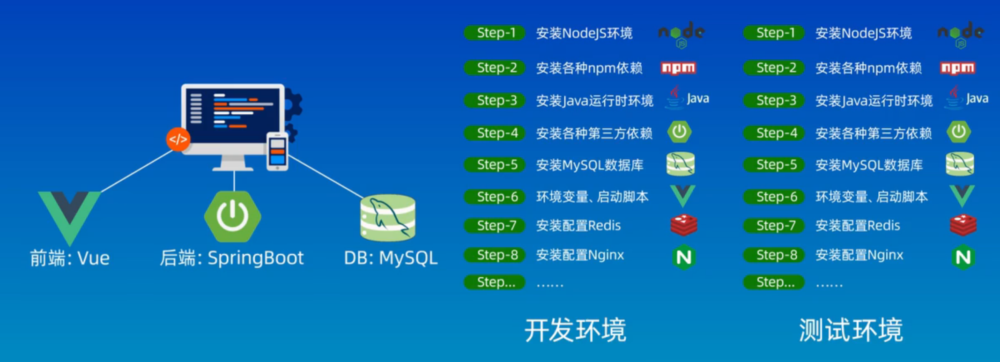
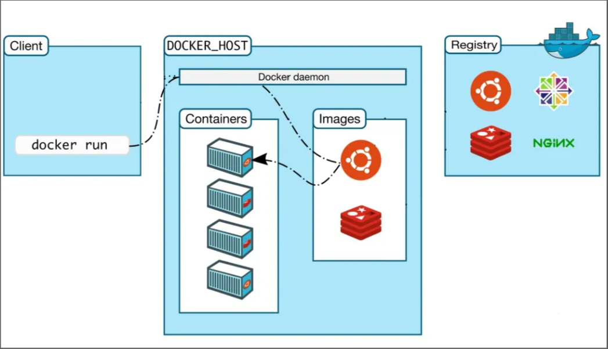
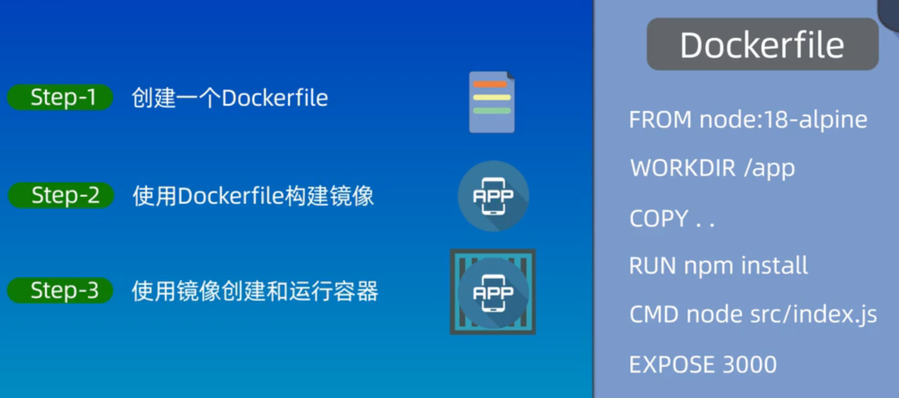

# What is  Docker ?

Docker is an open **platform** for **developing, shipping, and running applications**. Docker enables you to separate your applications from your infrastructure so you can **deliver software quickly**.

# Docker 为什么出现？

一款产品需要经历 **开发** 和 **上线** 两套环境。在没有 Docker 以前，我们需要重新配置环境。而环境配置是十分麻烦的，对每一台机器都需要从零开始部署环境。因此是十分 **费时费力** 的，而且有的时候一些 **环境是无法跨平台的** ，这就导致了开发与上线有着极大的难度。

> 程序员B : 怎么这个程序跑不了？
> 程序员A : 这个程序在我的电脑上没问题啊？？？

而 Docker 则帮我们将 **软件** 和 **运行环境** 打包在一起，我们可以在任意机器上执行我们的一整套项目。因此，我们这个时候就有一种新的开发流程

> 程序 + 环境 -> 打包整个项目（镜像） -> 上传镜像到仓库 -> 下载镜像后直接运行

# Docker 能干什么？

## 虚拟机技术

虚拟机通过模拟出整个物理系统，从内核到环境/库再到应用都在虚拟机中，如下图 : 

所以虚拟机有着不少缺点 : 
- 占用资源多
- 启动速度很慢
- 结构繁复

## 容器化技术

容器化技术并不模拟完整的操作系统！

容器和虚拟机的差异 : 
- 虚拟机模拟出整个硬件，运行一个完成的操作系统，具有操作系统内核
- 而容器则是在宿主机的上运行，但是使用独立的库，没有操作系统内核，也没有虚拟硬件

优点 : 
- 轻便，只有必要的内容
- 每个容器之间都是隔离的，互不影响
- **可以极大地利用系统的资源**
	- 在一个物理机上，我们可以运行大量的容器
- **更快速地升级和扩容**/**缩容**
- **更简单地系统运维**

> [!attention] 
> **容器** 与 **Docker** 并不是同一个东西！
> 
> - 容器是一种虚拟化技术，提供了一个可以运行程序的独立环境
> - 而 Docker 是容器的一种实现方法和平台

> [!note] 
> 但是我们 **不能依赖于 Docker 提供的便捷环境** ！
> 因为我们使用 Docker 是为了让某个应用更快速地 **交付和部署** ，并 **不是为了让我们逃课** ！
> 对于一个新知识，我们还是需要从头开始一步一步地从配置环境开始学习。

# Docker 结构

Docker 的基本结构如下 : 

## Docker daemon

The Docker daemon (`dockerd`) **listens for Docker API requests and manages Docker objects** such as images, containers, networks, and volumes. A daemon can also **communicate with other daemons to manage Docker services**.

## Docker Client

The Docker client (`docker`) is **the primary way that many Docker users interact with Docker**. When you use commands such as `docker run`, the client sends these commands to `dockerd`, which carries them out. The `docker` command uses the Docker API. The Docker client can communicate with more than one daemon.

## 镜像 image : 

Docker 的镜像就好比一个模板，可以通过这个模板来创建 **容器服务** 。 `image => run => container`

## 容器 container

Docker 利用容器技术，独立运行一个或者一组应用，容器可以通过镜像来创建。即应用在容器中运行，与外界物理机隔离开。

## 仓库 repository

仓库是用于存放镜像的地方，分为公有和私有仓库。在国内访问仓库通常需要用镜像来加速。

> 这里说的镜像并不是指同一个东西。前者是属于 **Docker 概念中的镜像**，后者则是我们通常在使用的 **镜像站**

# Dockerfile

**Dockerfile** 是一个用于描述如何构建镜像的文件，我们可以通过这个文件来构建我们需要/程序运行所需要的镜像，然后就可以通过这个镜像来运行一个容器 : 

