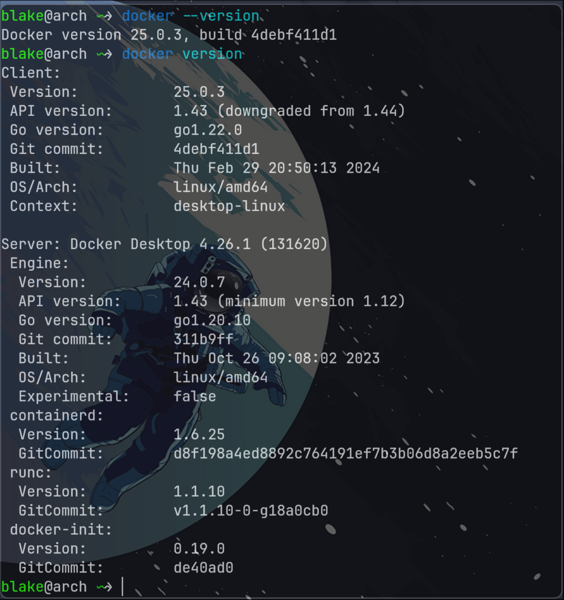
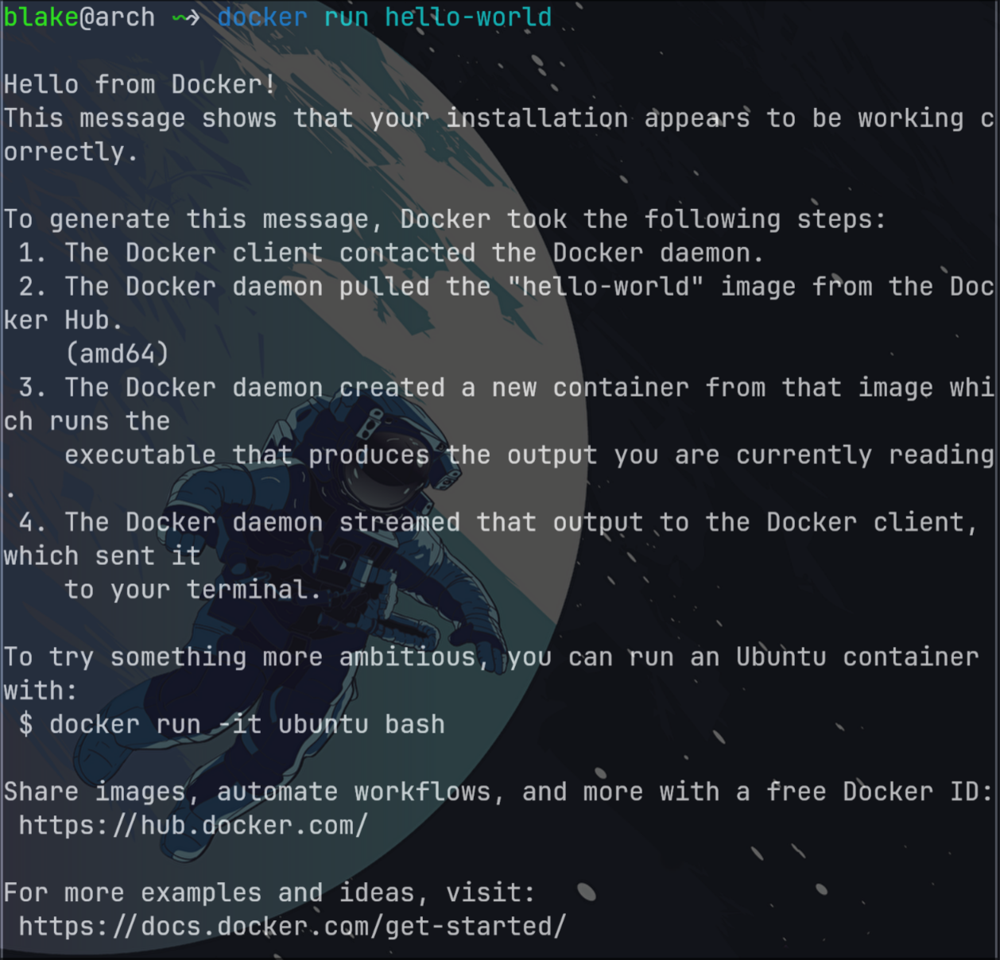
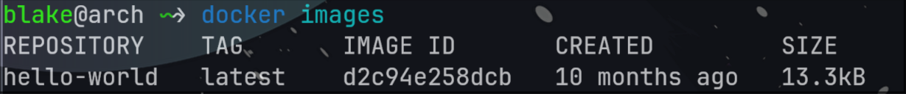

# 1 Install

此次安装的环境 : 
- OS : Arch Linux x86_64
- Kernel : 6.7.4-arch1-1
- DE : Hyprland

## 1.1 Prerequisites

~~For non-Gnome Desktop environments, `gnome-terminal` **must be installed** : ~~

```bash
sudo pacman -S gnome-terminal
```

> [!Note]
> Now, this is not the necessity


## 1.2 Install Docker Desktop

We can use the AUR package to install the package, so it requires `yay` or `paru` etc. [See Also](../03%20Linux/Arch/01%20基本安装.md#3.6.4%20Yay)

```bash
yay -S docker-desktop
```

> [!note] 
> Or alternatively ,we can only install the docker server : 
> `sudo pacman -S docker` 

## 1.3 Launch Docker Service

To start Docker Desktop for Linux, search **Docker Desktop** on the **Applications** menu and open it. This launches the Docker menu icon and opens the Docker Dashboard, reporting the status of Docker Desktop.

Alternatively, open a terminal and run : 

```bash
systemctl --user start docker-desktop
```

If we only install the docker server, we need to start the service and add the user to the group `docker` : 

```bash
sudo usermod -aG docker blake
# add the user to the docker group
sudo systemctl enable docker
# start the docker service
```

## 1.4 Check Installation

```bash
docker compose version
# you need to additionally install docker-compose

docker --version
# show the minimum information

docker version
# show the detailed informations
```



To enable Docker Desktop to start on sign in, from the Docker menu, select **Settings** > **General** > **Start Docker Desktop when you sign in to your computer**.

Alternatively, open a terminal and run :

```bash
systemctl --user stop docker-desktop
```

## 1.5 Test Run

```bash
docker run hello-world
```
 
 

We can also check the image we have pulled from the repository by : 

```bash
docker images
```



# 2 Uninstall

```bash
yay -R docker-desktop

# or you can

rm -rf /var/lib/docker /opt/docker-desktop
```

# 3 设置镜像加速

1. 创建文件夹

```bash
sudo mkdir -p /etc/docker
```

2. 编辑 `/etc/docker/daemon.json` 

```json
{
	"registry-mirrors": [ "https://registry.docker-cn.com" ]
}
```

3. 重新启动 docker 服务

```bash
sudo systemctl daemon-reload
sudo systemctl restart docker
```

# 4 A Quick Start for Docker

[Quick hands-on guides](https://docs.docker.com/guides/walkthroughs/what-is-a-container/)
