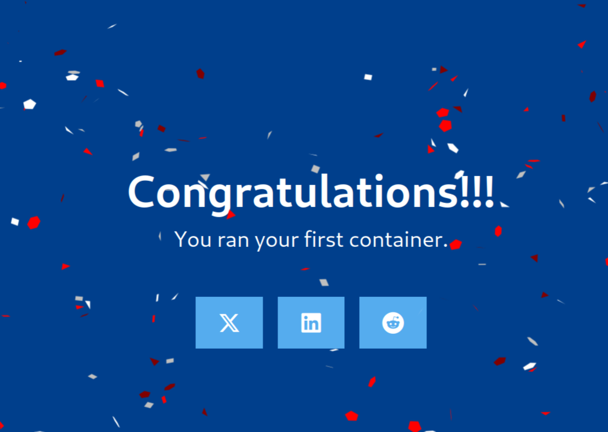
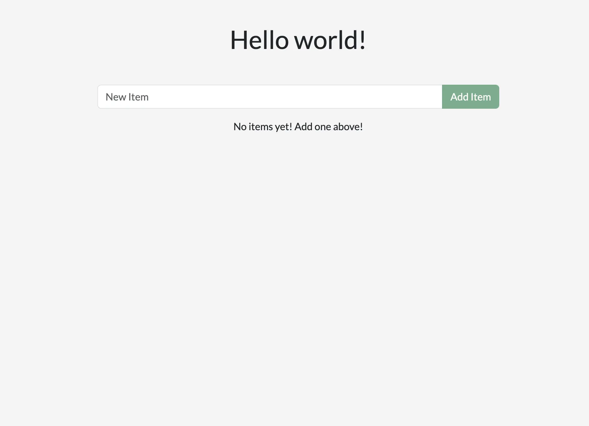
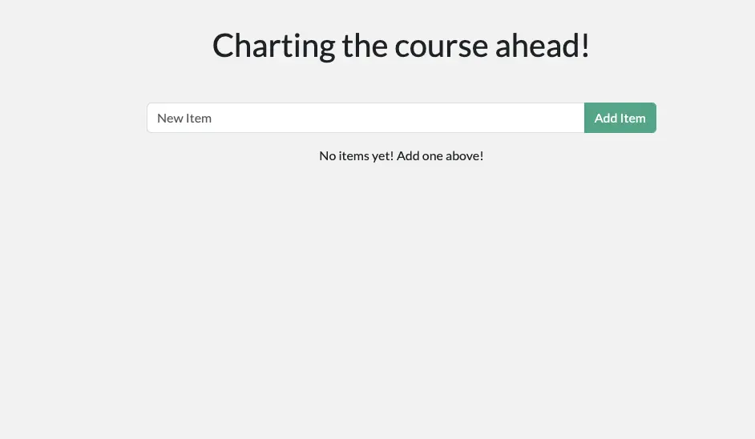
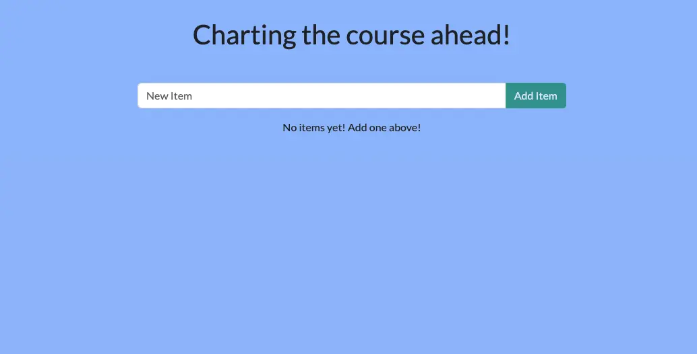

# Run the first Container

You can run the following command in the terminal : 

```bash
docker run -d -p 8080:80 docker/welcome-to-docker
```

For this container, the frontend is accessible on port `8080`. To open the website, visit [http://localhost:8080](http://localhost:8080/) in your browser. Then you will see the container you runned : 



# Develop with Container

Now that you have Docker Desktop installed, you are ready to do some application development. Specifically, you will do the following:

1. Clone and start a development project
2. Make changes to the backend and frontend
3. See the changes immediately

## Start Project

We will clone the project from github : 

```bash
git clone https://github.com/docker/getting-started-todo-app
```

Once you have the project, start the development environment using **Docker Compose**.

To start the project using the CLI, run the following command :

```bash
cd getting-started-todo-app
docker compose watch
```

You will see an output that shows container images being pulled down, containers starting, and more. Don't worry if you don't understand it all at this point. But, within a moment or two, things should stabilize and finish.

Open your browser to [http://localhost](http://localhost/) to see the application up and running. It may take a few minutes for the app to run. The app is a simple to-do application, so feel free to add an item or two, mark some as done, or even delete an item.



## The Env

Now that the environment is up and running, what's actually in it? At a high-level, **there are several containers** (or processes) that each serve a specific need for the application:

- React frontend - a Node container that's running the React dev server, using [Vite](https://vitejs.dev/).
- Node backend - the backend provides an API that provides the ability to retrieve, create, and delete to-do items.
- MySQL database - a database to store the list of the items.
- phpMyAdmin - a web-based interface to interact with the database that is accessible at [http://db.localhost](http://db.localhost/).
- Traefik proxy - [Traefik](https://traefik.io/traefik/) is an application proxy that routes requests to the right service. It sends all requests for `localhost/api/*` to the backend, requests for `localhost/*` to the frontend, and then requests for `db.localhost` to phpMyAdmin. This provides the ability to access all applications using port 80 (instead of different ports for each service).

## Make Changes

With this environment up and running, you’re ready to make a few changes to the application and see how Docker helps provide a fast feedback loop.

### Change the Greeting

The greeting at the top of the page is populated by an API call at `/api/greeting`. Currently, it always returns "Hello world!". You’ll now modify it to return one of three randomized messages (that you'll get to choose).

1. Open the `backend/src/routes/getGreeting.js` file in a text editor. This file provides the handler for the API endpoint.
    
2. Modify the variable at the top to an array of greetings. Feel free to use the following modifications or customize it to your own liking. Also, update the endpoint to send a random greeting from this list.

```js
const GREETINGS = [
	"Whalecome!",
	"All hands on deck!",
	"Charting the course ahead!",
];

module.exports = async (req, res) => {
	res.send({
		greeting: GREETINGS[ Math.floor( Math.random() * GREETINGS.length )],
	});
};
```

If you haven't done so yet, save the file. If you refresh your browser, you should see a new greeting. If you keep refreshing, you should see all of the messages appear.



### Change the Background Color

Before you consider the application finalized, you need to make the colors better.

1. Open the `client/src/index.scss` file.
    
2. Adjust the `background-color` attribute to any color you'd like. The provided snippet is a soft blue to go along with Docker's nautical theme.

If you're using an IDE, you can pick a color using the integrated color pickers. Otherwise, feel free to use an online [Color Picker](https://www.w3schools.com/colors/colors_picker.asp).

```js
body {
    background-color: #99bbff;
    margin-top: 50px;
    font-family: 'Lato';
}
```

Each save should let you see the change immediately in the browser. Keep adjusting it until it's the perfect setup for you.



# Build and Push Your Image

Now that you've updated the [to-do list app](https://docs.docker.com/get-started/introduction/develop-with-containers/), you’re ready to create a container image for the application and share it on Docker Hub. To do so, you will need to do the following:

1. Sign in with your Docker account
2. Create an image repository on Docker Hub
3. Build the container image
4. Push the image to Docker Hub

## Container Image

If you’re new to container images, think of them as a standardized package that **contains everything needed to run an application**, including its files, configuration, and dependencies. These packages can then be distributed and shared with others.

## Docker Hub

To **share your Docker images**, you need a place to store them. This is where registries come in. While there are many registries, Docker Hub is the default and go-to registry for images. Docker Hub provides both a place for you to store your own images and to find images from others to either run or use as the bases for your own images.

In [03 Quick Start](03%20Quick%20Start.md#Develop%20with%20Container), you used the following images that came from Docker Hub, each of which are [Docker Official Images](https://docs.docker.com/docker-hub/image-library/trusted-content/#docker-official-images):

- [node](https://hub.docker.com/_/node) - provides a Node environment and is used as the base of your development efforts. This image is also used as the base for the final application image.
- [mysql](https://hub.docker.com/_/mysql) - provides a MySQL database to store the to-do list items
- [phpmyadmin](https://hub.docker.com/_/phpmyadmin) - provides phpMyAdmin, a web-based interface to the MySQL database
- [traefik](https://hub.docker.com/_/traefik) - provides Traefik, a modern HTTP reverse proxy and load balancer that routes requests to the appropriate container based on routing rules

Explore the full catalog of [Docker Official Images](https://hub.docker.com/search?image_filter=official&q=), [Docker Verified Publishers](https://hub.docker.com/search?q=&image_filter=store), and [Docker Sponsored Open Source Software](https://hub.docker.com/search?q=&image_filter=open_source) images to see more of what there is to run and build on.

## Build

An important note is that the image you are building extends the Node image, meaning you don't need to install or configure Node, yarn, etc. You can simply focus on what makes your application unique.

> **What is an image/Dockerfile?**
> 
> Without going too deep yet, think of a container image as a single package that contains everything needed to run a process. In this case, it will contain a Node environment, the backend code, and the compiled React code.
> 
> Any machine that runs a container using the image, will then be able to run the application as it was built without needing anything else pre-installed on the machine.
> 
> A `Dockerfile` is a text-based script that **provides the instruction set on how to build the image**. For this quick start, the repository already contains the Dockerfile.

1. To get started, either clone or [download the project as a ZIP file](https://github.com/docker/getting-started-todo-app/archive/refs/heads/main.zip) to your local machine.
    
```console
$ git clone https://github.com/docker/getting-started-todo-app
```
    
    And after the project is cloned, navigate into the new directory created by the clone:
    
```console
$ cd getting-started-todo-app
```
    
2. Build the project by running the following command, swapping out `DOCKER_USERNAME` with your username.
    
```console
$ docker build -t DOCKER_USERNAME/getting-started-todo-app .
```
    
    For example, if your Docker username was `mobydock`, you would run the following:
    
```console
$ docker build -t mobydock/getting-started-todo-app .
```
    
3. To verify the image exists locally, you can use the `docker image ls` command:
    
```console
$ docker image ls
```
    
    You will see output similar to the following:
    
```console
REPOSITORY                          TAG       IMAGE ID       CREATED          SIZE
mobydock/getting-started-todo-app   latest    1543656c9290   2 minutes ago    1.12GB
...
```
    
4. To push the image, use the `docker push` command. Be sure to replace `DOCKER_USERNAME` with your username:
    
```console
$ docker push DOCKER_USERNAME/getting-started-todo-app
```
    
Depending on your upload speeds, this may take a moment to push.

# Deploy MySQL

通过 Docker 我们可以很轻易地部署 MySQL 数据库，你只需要一行命令 : 

```bash
docker run -d\
	--name mysql \
	-p 3306:3306 \
	-e TZ=Asia/Shanghai \
	-e MYSQL_ROOT_PASSWORD=123 \ 
	mysql
```

然后 drink a cup of coffee ，等待程序运行结束，MySQL 就已经部署并启动了。

- `docker run` - 创建并运行一个容器，
- `-d` - Run as a daemon，让程序后台运行
- `--name mysql` - 为容器命名，容器的名字必须 **唯一** 
- `-p 3306:3306` - 配置 **端口映射** 
	- 第一个端口为 **宿主机** 的端口，即运行该容器的机器的端口
	- 第二个端口为 **容器** 的端口
	- 通过端口映射，我们可以访问容器中开放的端口
- `-e KEY=VALUE` - 用于设置环境变量
- `mysql` - 指定运行的镜像的名字
	- 镜像名字一般又两个部分组成 `ImageName:[Tag]` 
	- `ImageName` - 镜像的名字
	- `Tag` - 指定镜像的版本，若缺省，则默认使用 `latest` ，表示最新版本

