# Introduction

Docker 中有许许多多的命令，其中 **最常见的命令就是有关镜像与容器操作** 的命令，这些命令之间的关系如下所示 : 

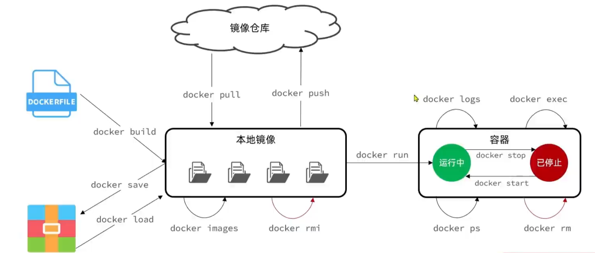

对于镜像，我们可以通过 `docker pull` 从仓库中获取，在获取完成之后，我们就能通过 `docker run` 在该镜像中创建容器。我们可以通过 `docker images` 来查看本地的镜像，并通过 `docker rmi` 来删除某个镜像。如果我们想要自己构建镜像，就需要编写相应的 `Dockerfile` 并通过 `docker build` 命令来构建镜像。等我们自己的镜像构建好之后，我们可以通过 `docker save` 将镜像保存为压缩文件，后续可以通过 `docker load` 加载该文件。当然，我们也可以通过 `docker push` 将镜像上传到仓库，这样就可以通过 `docker pull` 直接获取镜像了。

`docker image` 命令实现对镜像的操作，如 `rm` , `build` , `pull` , `push` , `ls` , `save` 等等。需要注意的是， Docker 为常用的命令提供专门的使用方法，如通过 `docker images` 可以查看本地的镜像，等价于 `docker image ls` ；通过 `docker build` 来构建镜像，等价于 `docker image build` ； `docker rmi` 等价于 `docker image rm` 。

另一类常用命令就是对容器的操作。如上所述，我们可以通过 `docker run` 来 **创建并运行一个容器** 。 在容器运行的过程中我们可以通过 `docker ps` 来查看当前的容器进程及服务，通过 `docker logs` 来查看容器运行过程中的日志。如果我们想对运行中的容器进行操作，我们可以通过 `docker exec` 在一个运行的容器中执行某一些命令。要停止一个容器，我们可以使用 `docker stop` ，而重新启动一个容器则可以使用 `docker start` 。最后，我们可以通过 `docker rm` 来删除某了容器。

> 注意， `docker run` 和 `docker start` 有区别，前者是 **创建并运行一个容器** ，而后者则是 **启动一个已经存在但未在运行的容器** 。

Docker 也提供了 `docker container` 命令来实现对容器的一系列操作。

> [!seealso] 
> 如果不知道某个命令，我们可以通过 `--help` 选项来查看帮助，也可以在 [官方文档](https://docs.docker.com/reference/) 中寻求帮助

# Example

接下来，我们通过一个简单的例子来演示 Docker 的常用命令。

## Get Image

我们首先需要去 [Docker Hub](https://hub.docker.com/) 上搜索我们需要的镜像，这里以 [NGINX](https://hub.docker.com/_/nginx) 为例，在镜像页面，官方提供了详细的镜像使用说明。

我们可以通过 `docker pull` 来获取镜像 : 

```bash
docker pull nginx
```

> 在未指定 tag 的情况下，默认使用 `latest` ，拉取最新的镜像

等待一段时间后，就会提示你获取成功，通过 `docker images` ，我们可以查看我们下载的镜像 : 

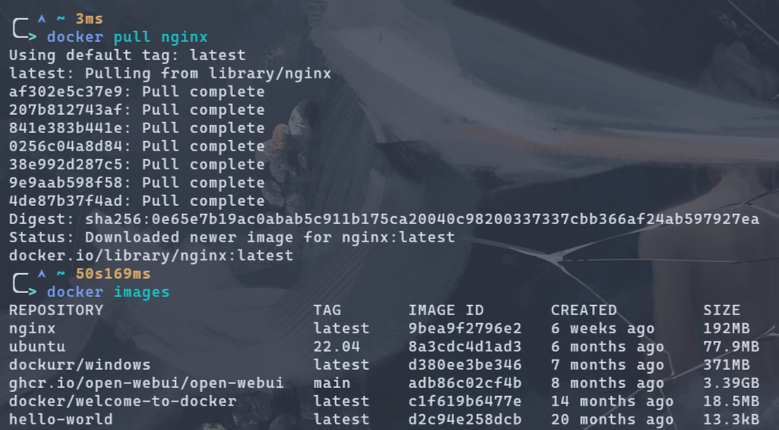

在图中，每一个镜像都有一个独一无二的 ID ，代表着特定的镜像，不同版本的镜像具有的 ID 也不一样，而最后一栏则显示了镜像的大小。

## Save Image

我们可以通过 `docker save` 命令来保存镜像，该命令接受一个 `-o` 的参数，表示输出的文件，我们可以指定输出文件的位置名称等，如下所示，我们成功将 nginx 的镜像保存在 `nginx.tar.gz` 压缩文件中。

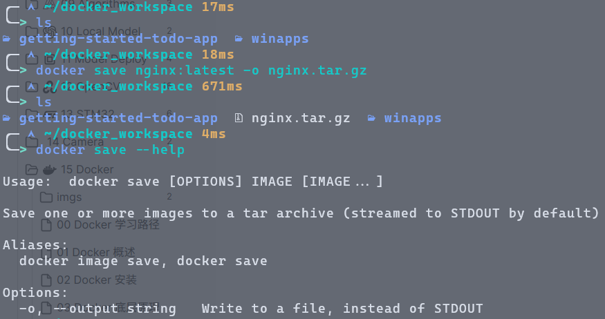

## Delete Image

我们可以通过 `docker rmi` 或 `docker image rm` 来删除某个镜像，可以使用该镜像的名字，也可以使用该镜像的 ID : 

```bash
docker rmi nginx:latest
```

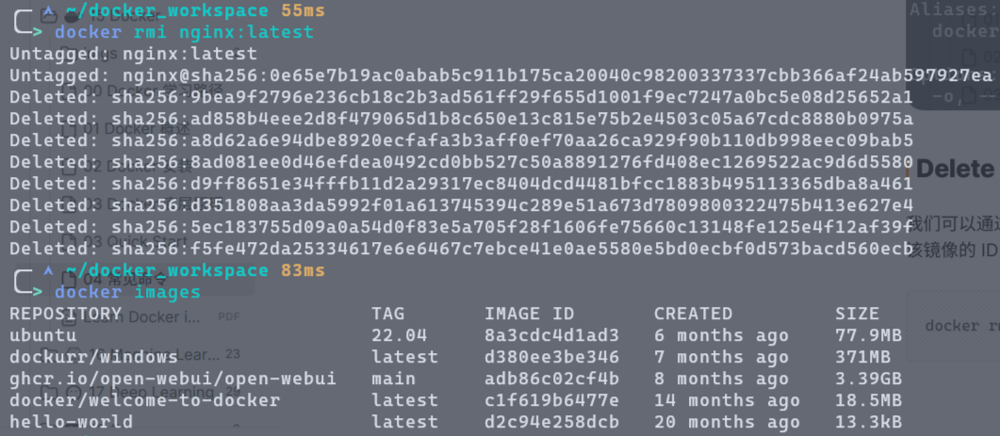

再次查看镜像，我们会发现镜像确实被我们删除了。

## Load Image

删除镜像后，我们可以通过刚刚保存的 `nginx.tar.gz` 文件重新加载镜像 : 

```bash
docker load -i nginx.tar.gz
```

其中， `-i` 选项用于指定输入的文件。再次查看镜像，我们会发现 nginx 确实被加载进来了。

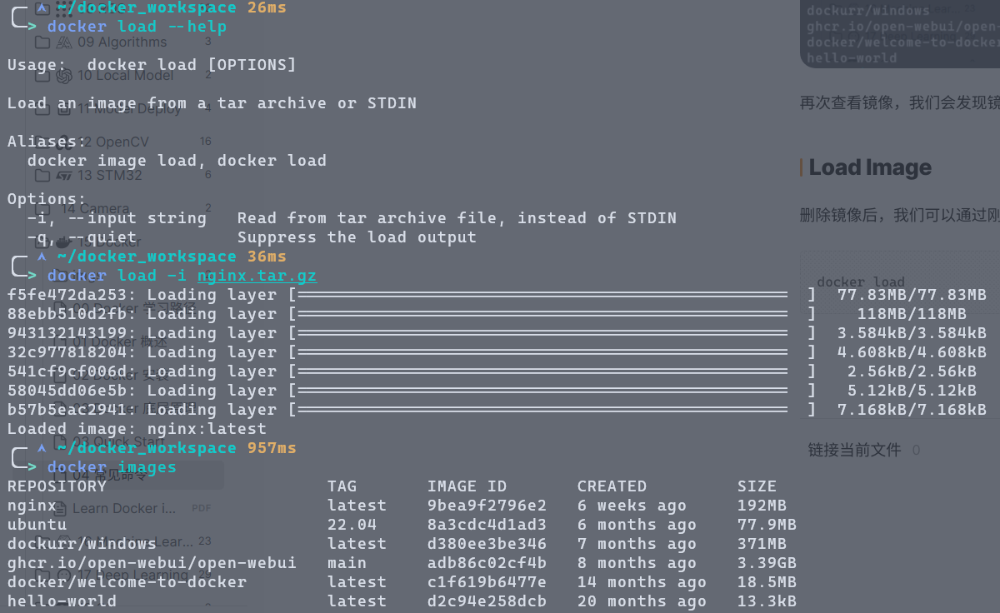

## Run a Container

接下来，我们可以通过 nginx 镜像来运行一个容器，启动 nginx 服务 : 

```bash
docker run -d --name mynginx -p 8080:80 nginx:latest
```

其中， `-d` 表示后台运行， `--name` 为该容器指定名称， `-p` 设置端口映射，这里将容器中的 `80` 端口映射到主机中的 `8080` 端口，最后的 `nginx:latest` 则是使用的镜像名，指定使用哪个镜像。

运行后，我们可以通过访问 `https://localhost:8080` 来访问 nginx 服务，如下所示。

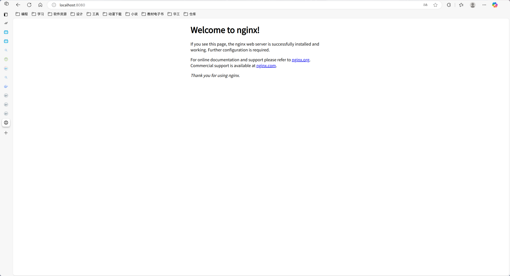

## Check Containers

我们运行了这个容器之后，可以通过 `docker ps` 或 `docker container ls` 来查看当前正在运行的容器。

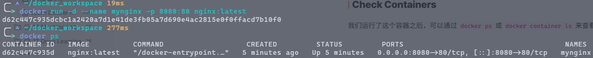

可以看到，每个容器也有属于自己的 ID ，不同的容器 ID 都不同，即使你用同一个镜像来创建。其中也展示出了端口的映射。

## Stop a Container

接下来，我们可以通过 `docker stop` 来停止一个正在运行的容器 : 

```bash
docker stop mynginx
```

此时再去访问 `localhost:8080` ，就会发现连接被拒绝 :

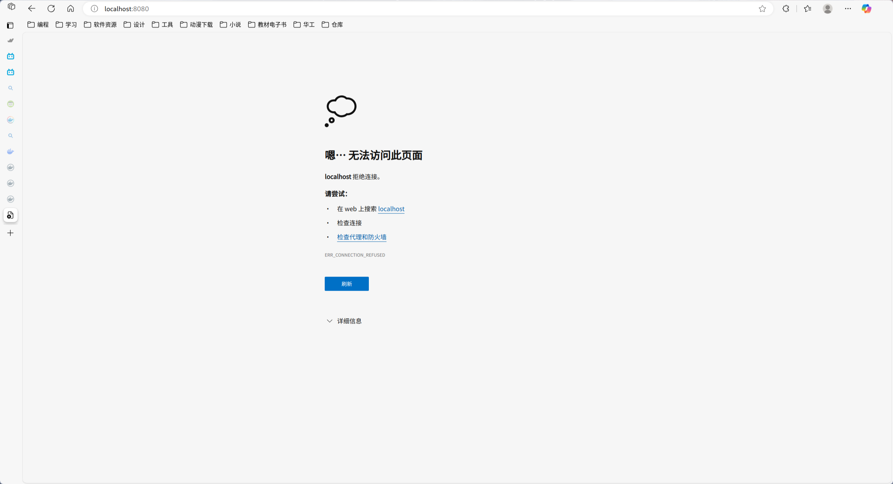

## Start a Container

停止运行的容器并非被删除了，仍然存在系统中，我们可以对查看容器的命令添加一个 `-a` 选项，表示列出所有的容器，就可以看到被停止的容器 : 

```bash
docker ps -a
# or
docker container ls -a
```

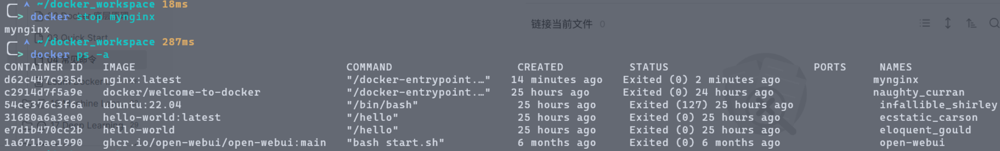

通过 `docker start` ，我们就可以重新启动这个容器 : 

```bash
docker start mynginx
```

再次访问 `localhost:8080` ，我们就能连接到 nginx 服务了

## Check Logs

我们可以通过 `docker logs` 命令来查看某个容器的输出 : 

```bash
docker logs mynginx
```

此时，终端就会输出容器的一段输出 : 

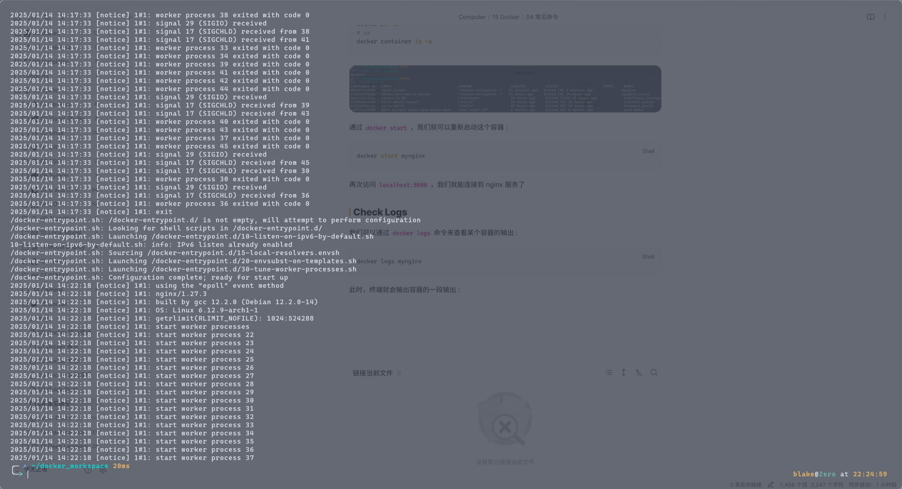

而如果我们想要持续跟踪容器的输出，就可以加上 `-f/--follow` 选项，表示跟随的意思，在终端中持续输出容器的日志，此项多用于调试容器 : 

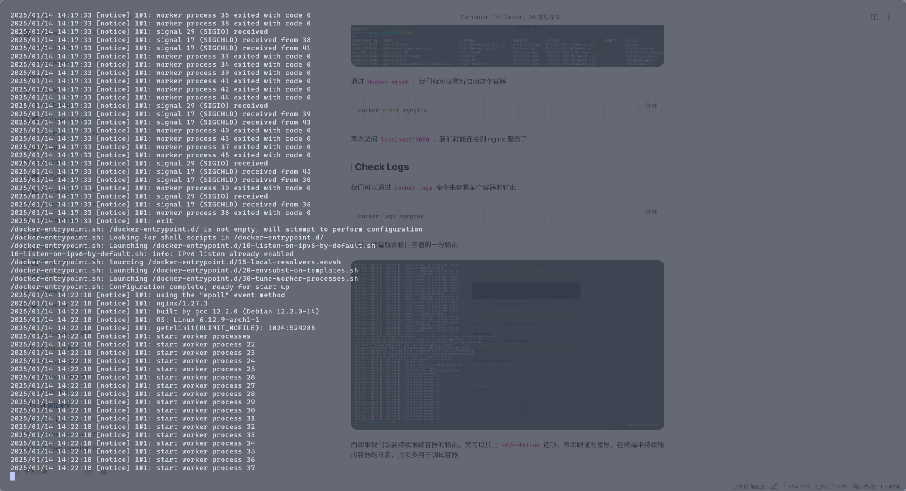

## Exec Commands/Interact with a Container

我们可以通过 `docker exec` 在容器中执行某个命令，其用法如下 : 

```text
Usage:  docker exec [OPTIONS] CONTAINER COMMAND [ARG...]

Execute a command in a running container

Aliases:
  docker container exec, docker exec

Options:
  -d, --detach               Detached mode: run command in the background
      --detach-keys string   Override the key sequence for detaching a container
  -e, --env list             Set environment variables
      --env-file list        Read in a file of environment variables
  -i, --interactive          Keep STDIN open even if not attached
      --privileged           Give extended privileges to the command
  -t, --tty                  Allocate a pseudo-TTY
  -u, --user string          Username or UID (format: "<name|uid>[:<group|gid>]")
  -w, --workdir string       Working directory inside the container
```

主要由 `docker exec [options] <container> <command>` 构成，其中，我们最常用到的选项主要是 : 

- `-i` - 表示和容器进行交互，能过对容器进行输入
- `-t` - 表示分配一个终端，我们可以通过这个终端来执行各种操作

而 `<container>` 指定我们要操作的容器， `<command>` 则表示要在该容器中运行的命令。

> `tty` 并不完全是终端，但我们可以将其理解为终端

因此，我们可以通过在 `mynginx` 容器中运行一个 `bash` ，这样就能在 `bash` 中对该容器进行各种操作 : 

```bash
docker exec -it mynginx bash
```

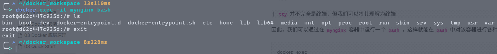

## Delete a Container

如果我们不再使用某个容器，我们就可以通过 `docker rm` 或 `docker container rm` 将其删除，不过注意的是，我们不能删除一个正在运行的容器，除非我们加上 `-f` 选项，表示强制删除 : 

```bash
docker stop mynginx
docker rm mynginx
```

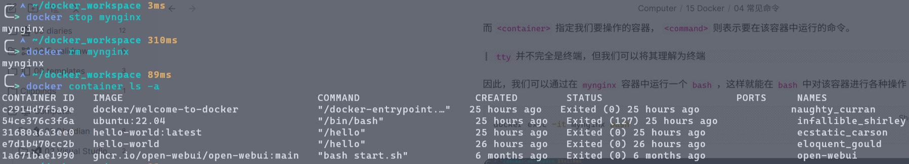

我们可以看到， mynginx 容器已经被删除。