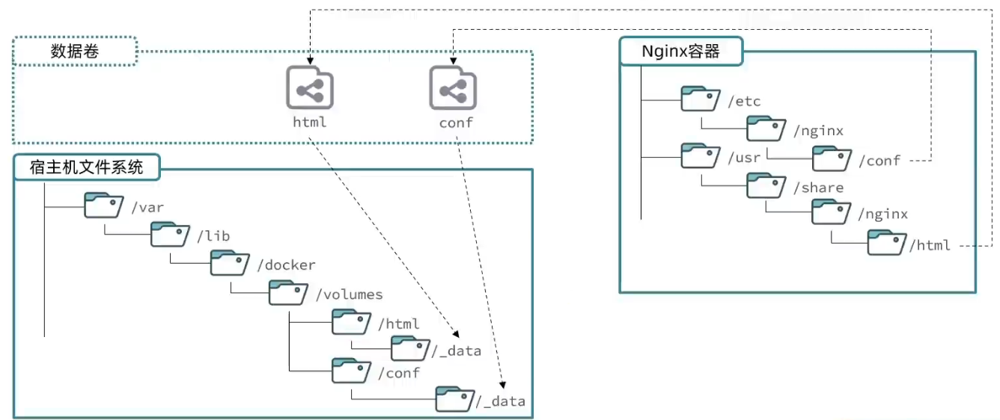
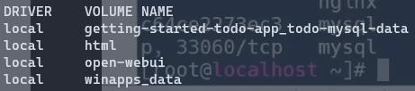

# 01 数据卷

**数据卷(volume)**  是一个 **虚拟目录** ，是 **容器内目录与主机目录之间的映射桥梁** 。

我们每创建一个数据卷，就会在主机的 `/var/lib/docker/volumes/` 下建立相应的目录，完成数据卷在主机上的挂载，而如果我们将容器中的目录与数据卷相关联，即将容器目录映射到数据卷上，那么我们就实现了容器与主机之间的沟通，进行了目录之间的**双向映射**，其结构图如下 : 



> 双向映射代表着一方修改另一方会跟着变化

# 02 Command

在 docker 中，我们通过 `volume` 命令来操作数据卷 : 

```text
Usage:  docker volume COMMAND

Manage volumes

Commands:
  create      Create a volume
  inspect     Display detailed information on one or more volumes
  ls          List volumes
  prune       Remove unused local volumes
  rm          Remove one or more volumes

Run 'docker volume COMMAND --help' for more information on a command.
```

## 2.1 创建并挂载数据卷

我们可以通过 `create` 命令来创建数据卷，但是我们只能在 **创建容器的时候挂载数据卷** 。因此 `create` 命令并不常用，反而我们常在创建并运行容器的时候使用 `-v` 选项来创建并挂载数据卷。

> [!tip] 
> 在创建容器时，如果我们要挂载的数据卷不存在，那么系统会自动创建数据卷

我们在创建容器的时候，可以通过 `-v` 来挂载数据卷 : 

```bash
docker run -d --name <my_container> -p <port_projection-target:source> -v <volume_projection-volume:directory_in_container> <image_name>

docker run -d --name mynginx -p 8080:80 -v html:/usr/share/nginx/html nginx
```

我们可以通过 `docker volume ls` 来查看创建的数据卷，也可以到系统目录 `/var/lib/docker/volumes/` 中查看。



可以看到，我们成功创建了 `html` 数据卷。

## 2.2 查看数据卷的详细信息

我们可以通过 `docker volume inspect` 命令来检查数据卷 : 

```bash
docker volume inspect html
```

该命令会输出具体的数据卷结构 : 

```text
[
    {
        "CreatedAt": "2025-01-27T15:27:51+08:00",
        "Driver": "local",
        "Labels": null,
        "Mountpoint": "/var/lib/docker/volumes/html/_data",
        "Name": "html",
        "Options": null,
        "Scope": "local"
    }
]
```

从上述的结果中，我们可以查看数据卷的 **创建时间** ， **盘名** ， **标签** ， **挂载点** ， 以及 **卷名** 等等。