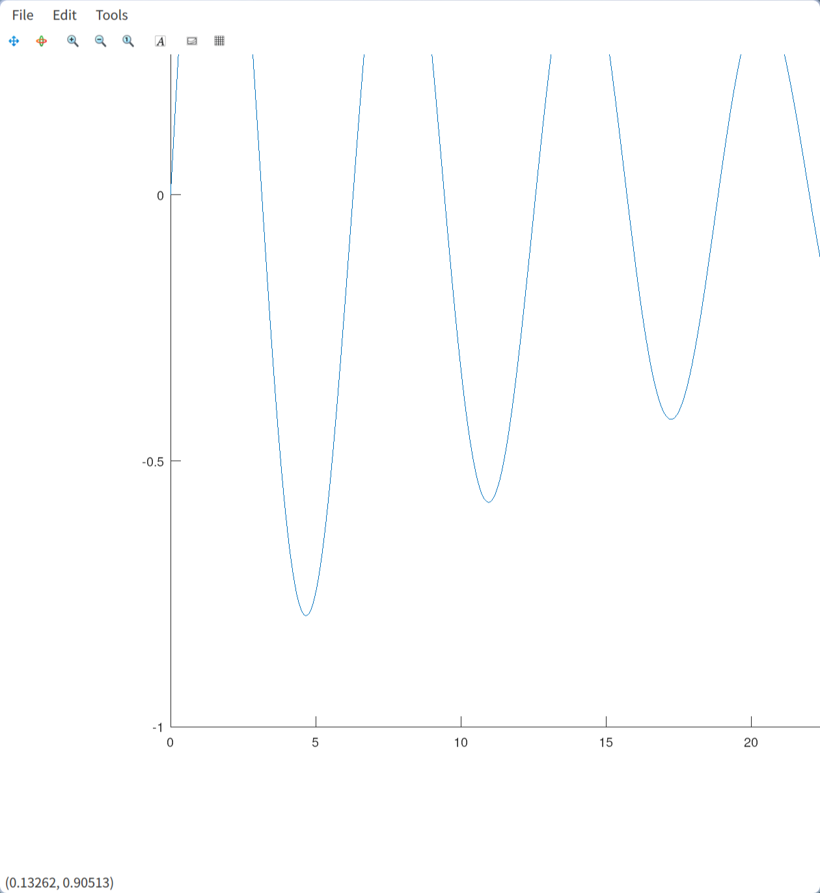
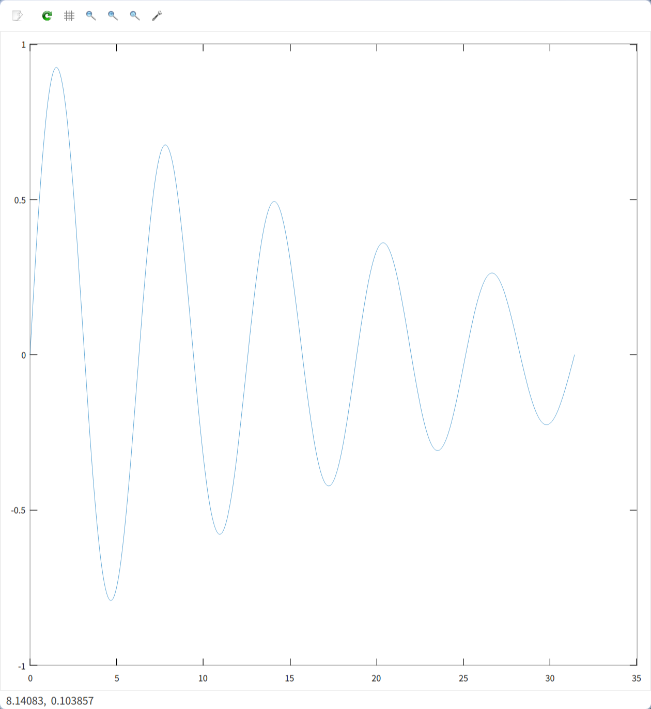

# 01 图像绘制

## 1.1 `plot` 图像显示不全 #solved #bug 

**descriptions :** 

在使用 octave 进行绘图的时候，会有图像显示不全的情况出现。



这个问题主要是由于 octave 使用的图像展示工具有bug导致的。在新版 octave 中，默认使用 `qt` 作为支持，来展示图像，但是该支持仍有问题。因此我们需要更换用于显示图像的工具。

**Solution : ** 

我们只需要通过 `graphics_toolkit()` 函数将展示工具替换成 `gnuplot` 即可 : 

```octave
>> graphics_toolkit("gnuplot")
```

若显示计算机中没有 `gnuplot` 可以使用，就去下载 :

```bash
sudo pacman -S gnuplot
```

设置好工具之后(新安装的 `gnuplot` 可能需要重启一下 octave 才能找到)，我们重新绘图，就可以发现问题已经解决了 : 



# 02 函数

## 2.1 函数与文件名不匹配 #solved #problem 

### information

```text
warning: function name 'draw_rect' does not agree with function filename 'D:\oc
tave\chapter1\fibonacci_visualization.m'
error: 'point' undefined near line 4, column 9
error: called from
    fibonacci_visualization at line 4 column 7
```

这个错误信息表明你在 Octave 中遇到了两个问题：

1. **函数名与文件名不匹配**：
   - 错误信息 `warning: function name 'draw_rect' does not agree with function filename 'D:\octave\chapter1\fibonacci_visualization.m'` 表示你定义了一个名为 `draw_rect` 的函数，但该函数所在的文件名是 `fibonacci_visualization.m`。在 Octave 中，如果一个文件包含一个函数，那么文件名应该与函数名一致。

2. **未定义的变量**：
   - 错误信息 `error: 'point' undefined near line 4, column 9` 表示在代码的第 4 行，尝试使用了一个未定义的变量 `point`。

### 解决方法

#### 1. 修复函数名与文件名不匹配的问题
- 如果你有一个名为 `draw_rect` 的函数，那么应该将文件名改为 `draw_rect.m`。
- 如果你希望文件 `fibonacci_visualization.m` 包含多个函数，那么可以将 `draw_rect` 定义为该文件中的一个子函数或私有函数。

#### 2. 修复未定义的变量问题
- 检查代码中第 4 行使用 `point` 变量的地方，确保在使用它之前已经正确定义了该变量。

### 示例修复

假设你的 `fibonacci_visualization.m` 文件中包含一个主函数和一个子函数 `draw_rect`，以下是可能的修复方式：

```octave
% fibonacci_visualization.m

% 主函数
function fibonacci_visualization()
    % 定义变量 point
    point = [0, 0];  % 示例定义，根据实际需求修改
    
    % 调用子函数 draw_rect
    draw_rect(point);
endfunction

% 子函数 draw_rect
function draw_rect(point)
    % 使用 point 变量绘制矩形
    % 示例代码，根据实际需求修改
    rectangle('Position', [point(1), point(2), 1, 1], 'EdgeColor', 'r');
endfunction
```

### 总结
- 确保函数名与文件名一致。
- 在使用变量之前正确定义它。
- 如果有多个函数，可以将它们定义在同一个文件中，其中一个是主函数，其他是子函数。

通过以上修复，应该可以解决你遇到的错误。

# 03 Matlab

## 3.0 Runtime Error
#bug #solved 

在安装 MATLAB 的时候可能会遇到无法打开安装界面，出现 `runtime_error` 的情况：

```test
terminate called after throwing an instance of 'std::runtime_error' 
what(): Unable to launch the MATLABWindow application Aborted
./bin/glnxa64/MATLABWindow: /home/eric1/Downloads/matlab_R2024a_Linux/bin/glnxa64/libstdc++.so.6: version `GLIBCXX_3.4.29' not found (required by /lib/x86_64-linux-gnu/libgallium-24.2.1 - kisak-mesa PPA.so)
```

首先我们需要检查依赖是否安装好：

```test
alsa-lib.x86_64 cairo.x86_64 cairo-gobject.x86_64 cups-libs.x86_64 gdk-pixbuf2.x86_64 glib2.x86_64 glibc.x86_64 glibc-langpack-en.x86_64 glibc-locale-source.x86_64 gtk3.x86_64 libICE.x86_64 libXcomposite.x86_64 libXcursor.x86_64 libXdamage.x86_64 libXfixes.x86_64 libXft.x86_64 libXinerama.x86_64 libXrandr.x86_64 libXt.x86_64 libXtst.x86_64 libXxf86vm.x86_64 libcap.x86_64 libdrm.x86_64 libglvnd-glx.x86_64 libsndfile.x86_64 libtool-ltdl.x86_64 libuuid.x86_64 libwayland-client.x86_64 make.x86_64 mesa-libgbm.x86_64 net-tools.x86_64 nspr.x86_64 nss.x86_64 nss-util.x86_64 pam.x86_64 pango.x86_64 procps-ng.x86_64 sudo.x86_64 unzip.x86_64 which.x86_64 zlib.x86_64
```

其次是因为 MATLAB 自带的 `libstdc++` 无法满足使用条件，我们需要使用系统的库：

```bash
mkdir <Matlab_Source>/bin/glnxa64/exclude
mkdir <Matlab_Source>/sys/os/glnxa64/exclude
mv <Matlab_Source>/bin/glnxa64/libstdc++* ./bin/glnxa64/exclude
mv <Matlab_Source>/sys/os/glnxa64/libstdc++* ./sys/os/glnxa64/exclude
```

## 3.1 Linux 上界面太小 
#solved 

我们只需要调节 Matlab 的缩放即可 : 

```Matlab
s = settings; s.matlab.desktop.DisplayScaleFactor; s.matlab.desktop.DisplayScaleFactor.PersonalValue = 2.0;
```

## 3.2 com.jogamp.opengl.GLException 
#bug #solved 

当我们使用matlab的时候可能出现以下问题：

```text
com.jogamp.opengl.GLException: X11GLXDrawableFactory - Could not initialize shared resources for X11GraphicsDevice[type .x11, connection :1, unitID 0, handle 0x0, owner false, ResourceToolkitLock[obj 0x6b5989d6, isOwner false, <652fa7d3, 293db4b8>[count 0, qsz 0, owner <NULL>]]]
	at jogamp.opengl.x11.glx.X11GLXDrawableFactory$SharedResourceImplementation.createSharedResource(X11GLXDrawableFactory.java:326)
	at jogamp.opengl.SharedResourceRunner.run(SharedResourceRunner.java:297)
	at java.lang.Thread.run(Thread.java:748)
Caused by: java.lang.NullPointerException
	at jogamp.opengl.GLContextImpl.makeCurrent(GLContextImpl.java:688)
	at jogamp.opengl.GLContextImpl.makeCurrent(GLContextImpl.java:580)
	at jogamp.opengl.x11.glx.X11GLXDrawableFactory$SharedResourceImplementation.createSharedResource(X11GLXDrawableFactory.java:297)
	... 2 more
```

这个是因为安装的版本无法使用硬件加速，我们只需要选择使用软件加速即可：

```matlab
opengl('save', 'software')
```

## 3.3 Unable to Open Files
#bug #solved 

当我们想要打开 `.m` 文件的时候，可能会遇到提示：

```text
unable to open this file in the current system configuration
```

这与安装的时候遇到的 `runtime_error` 是同一个问题，我们需要将 matlab 自带的 `libstdc++` 删掉，使用系统的库：

```bash
sudo mkdir /usr/local/MATLAB/R2024a/sys/os/glnxa64/exclude
sudo mv /usr/local/MATLAB/R2024a/sys/os/glnxa64/libstdc++* /usr/local/MATLAB/R2024a/sys/os/glnxa64/exclude
```

