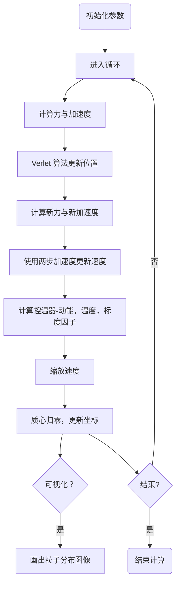

# 04 分子动力学
##  4.1 热浴算法

### 4.1.1 为什么需要热浴？

在分子动力学（MD）模拟中，**微正则系综（NVE）** 虽严格遵循牛顿力学，但实验体系多为**正则系综（NVT）**——系统与恒温热源接触，动能存在涨落。Berendsen热浴通过**弱耦合**思想，使模拟体系温和地趋近目标温度，**避免NVE中因数值误差导致的温度漂移**。

### 4.1.2 核心思想：指数弛豫

Berendsen热浴假设系统温度 $T(t)$ 以指数形式**弛豫至目标温度** $T_{\rm target}$：
$$
\frac{dT(t)}{dt} = \frac{1}{\tau}(T_{\rm target} - T(t))
$$
其中 $\tau$ 为**弛豫时间常数**，**控制耦合强度**。该一阶微分方程的解为：
$$
T(t) = T_{\rm target} + (T_0 - T_{\rm target})\exp(-t/\tau)
$$

### 4.1.3 从温度到动能

已经有了控制温度的思想，那么温度在模拟过程中如何计算？

系统**瞬时温度由动能定义**（二维系统为例）：
$$
T(t) = \frac{2E_k(t)}{N_{\rm dof}k_B} = \frac{1}{N_{\rm dof}k_B}\sum_{i=1}^N m_i(v_i^x(t)^2 + v_i^y(t)^2)
$$
其中 $N_{\rm dof} = 2N - 2$ 为系统的总自由度数目（扣除质心运动自由度），$E_{k}(t) = \dfrac{1}{2}\sum_{i=1}^{N}m(v_{x}^{2} + v_{y}^{2})$ 为系统的总动能。在模拟中，我们通过控制动能的平均值来控制系统温度。热浴算法器的目标就是 **通过调节粒子的速度**，使得系统温度平均值等于设定的目标温度 $T_{target}$。

### 4.1.4 离散化温度更新与速度缩放

将温度变化的微分方程写成差分形式，在时间步长 $\Delta t$ 内，温度变化量：
$$
\Delta T = T(t+\Delta t) - T(t) \approx \frac{\Delta t}{\tau}(T_{\rm target} - T(t))
$$

由于我们通过控制速度来调整温度，假设速度整体缩放 $\lambda$ 倍：$\vec{v}' = \lambda \vec{v}$，又温度由动能定义，则 **由速度变化引起的温度变化为**：
$$
T' = \lambda^2 T \quad \Rightarrow \quad \lambda^2 T - T = \frac{\Delta t}{\tau}(T_{\rm target} - T)
$$
解得 **标度因子**：
$$
\lambda = \sqrt{1 + \frac{\Delta t}{\tau}\left(\frac{T_{\rm target}}{T(t)} - 1\right)}
$$
在计算时我们只需要在每次模拟后 **将速度乘上这个标度因子即可** 。

**关键特性**：
- **温和调控**：$\Delta t/\tau \ll 1$ 时，$\lambda \approx 1 + \frac{\Delta t}{2\tau}\left(\frac{T_{\rm target}}{T(t)} - 1\right)$ （泰勒展开）
- **负反馈**：当 $T(t) > T_{\rm target}$ 时 $\lambda < 1$，降温；反之升温
- **稳定性**：标度因子恒为正，避免数值发散
### 4.1.5 代码讲解

#### 1. 框架

```
初始化粒子位置 r(0), 速度 v(0)
计算初始动能 E_k(0) 与温度 T(0)
设置目标温度 T_target, 弛豫时间 tau

for 每个时间步 n:
    # 1. 计算力 F(n) → 加速度 a(n)
    a(n) = F(r(n)) / m
    
    # 2. Verlet更新位置
    r(n+1) = r(n) + v(n)Δt + 0.5a(n)Δt²
    
    # 3. 计算新力 F(n+1)
    a(n+1) = F(r(n+1)) / m
    
    # 4. 更新速度（半步）
    v(n+1) = v(n) + 0.5[a(n) + a(n+1)]Δt
    
    # 5. Berendsen控温
    E_k(n+1) = 0.5Σ m_i v_i(n+1)²
    T(n+1) = 2E_k(n+1) / (N_dof k_B)
    λ = sqrt(1 + Δt/tau * (T_target/T(n+1) - 1))
    v(n+1) = λ * v(n+1)  # 关键标度步骤
    
    # 6. 质心归零（防漂移）
    v_com = Σ m_i v_i(n+1) / Σ m_i
    v(n+1) = v(n+1) - v_com
    
    # 输出与监控
    记录 T(n+1), E_k(n+1), E_p(n+1)
end
```



#### MATLAB

```Matlab
function [x, y, vx, vy, T_history] = md_berendsen_2d()
    % 参数设置
    N = 36;           % 粒子数 (6×6晶格)
    T_target = 2.0;   % 目标温度 (LJ单位)
    tau = 0.5;        % 弛豫时间
    dt = 0.01;        % 时间步长
    steps = 5000;     % 总步数
    
    % 初始化位置（正方晶格）
    L = 6;            % 晶格边长
    [X, Y] = meshgrid(1:L, 1:L);
    x = X(:); y = Y(:);
    
    % 初始化速度（高斯分布）
    vx = randn(N, 1); vy = randn(N, 1);
    
    % 预分配历史数组
    T_history = zeros(steps, 1);
    
    % 主循环
    for n = 1:steps
        % 计算力矩阵
        dx = repmat(x, 1, N) - repmat(x', N, 1);
        dy = repmat(y, 1, N) - repmat(y', N, 1);
        r = sqrt(dx.^2 + dy.^2) + eye(N);  % +eye防除零
        
        % Lennard-Jones力
        f = 12 * (1./r.^14 - 1./r.^8);
        fx = sum(f .* dx, 2);
        fy = sum(f .* dy, 2);
        
        % Verlet更新位置
        if n == 1
            x_old = x; y_old = y;  % 初始前一步位置
        end
        x_new = 2*x - x_old + fx * dt^2;
        y_new = 2*y - y_old + fy * dt^2;
        
        % 计算新力
        dx_new = repmat(x_new, 1, N) - repmat(x_new', N, 1);
        dy_new = repmat(y_new, 1, N) - repmat(y_new', N, 1);
        r_new = sqrt(dx_new.^2 + dy_new.^2) + eye(N);
        f_new = 12 * (1./r_new.^14 - 1./r_new.^8);
        fx_new = sum(f_new .* dx_new, 2);
        fy_new = sum(f_new .* dy_new, 2);
        
        % 更新速度
        vx = (x_new - x_old) / (2*dt);
        vy = (y_new - y_old) / (2*dt);
        
        % ===== Berendsen控温核心 =====
        E_k = 0.5 * sum(vx.^2 + vy.^2);  % LJ单位 m=1
        T_inst = 2*E_k / (2*N - 2);       % 二维温度
        lambda = sqrt(1 + dt/tau * (T_target/T_inst - 1));
        
        % 速度标度
        vx = lambda * vx;
        vy = lambda * vy;
        % =================================
        
        % 质心归零
        vx = vx - mean(vx);
        vy = vy - mean(vy);
        
        % 更新历史
        x_old = x; y_old = y;
        x = x_new; y = y_new;
        T_history(n) = T_inst;
        
        % 可视化（每100步）
        if mod(n, 100) == 0
            clf; scatter(x, y, 50, sqrt(vx.^2+vy.^2), 'filled');
            colorbar; title(sprintf('Step %d, T=%.2f', n, T_inst));
            axis equal; pause(0.01);
        end
    end
end
```

在上述代码中，将速度减去其平均值是为了让质心的速度归零，**这是因为温度仅由相对动能决定** 。

#### 关键参数调试

| 参数 | 推荐值 | 物理意义 | 过大影响 | 过小影响 |
|------|--------|----------|----------|----------|
| $\tau$ | 10-100 × $\Delta t$ | 耦合强度 | 响应慢，温度漂移 | 抑制涨落，非物理 |
| $\Delta t$ | 0.001-0.01 (LJ) | 时间分辨率 | 能量不守恒 | 计算成本高 |
| $T_{\rm target}$ | 相图对应温度 | 热力学状态 | 系统崩溃（过热） | 冻结（过冷） |

**经验法则**：$\tau = 0.5$ ps 对应温和耦合，适合平衡模拟；$\tau = 0.05$ ps 用于快速淬火。

程序运行结果如下：

![[imgs/berendsen_result.png]]

图像中的颜色代表粒子此时的速度，可以明显看出，越靠近中心的粒子速度越小。

### 4.1.6 算法特性与对比分析

#### 1. Berendsen热浴的优缺点

**优点**：

1. **实现简单**：仅标度速度，无需额外自由度
2. **计算高效**：每步仅增加 $O(N)$ 操作
3. **稳定性强**：温和调控，不易振荡
4. **快速平衡**：适合**预平衡**阶段快速降温

**缺点**：

1. **系综不正则**：动能分布不正确，抑制涨落 $\langle \Delta T^2 \rangle$
2. **动力学失真**：速度自关联函数衰减过快
3. **体积效应**：系统越大，偏离越严重

#### 2. 与Nosé-Hoover热浴对比

| 特性 | Berendsen | Nosé-Hoover |
|------|-----------|-------------|
| **理论基础** | 弱耦合近似 | 扩展哈密顿量（严格） |
| **系综** | 非正则 | 正则系综 |
| **涨落** | 抑制 | 正确 |
| **实现复杂度** | 低 | 中（需积分摩擦系数） |
| **适用场景** | 预平衡、快速模拟 | 平衡性质、动力学分析 |

**混合策略**：先用Berendsen快速平衡至目标温度附近，再切换Nosé-Hoover进行生产模拟。