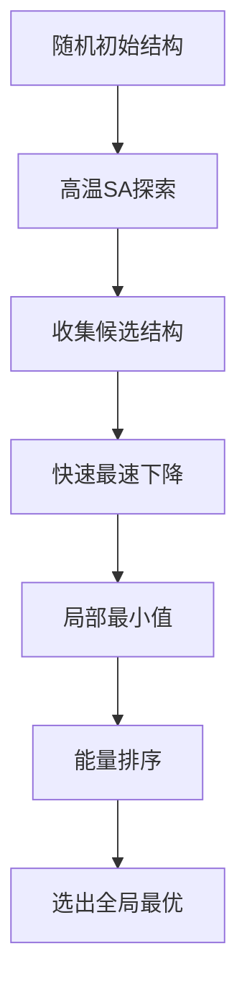

# 模拟退火算法详解

## 一、算法起源与物理隐喻

### 1.1 退火过程的启示

模拟退火（Simulated Annealing, SA）算法由Kirkpatrick等人于1983年提出，其灵感源于**金属热处理**中的退火工艺：

1. **高温加热**：原子获得高动能，脱离局部晶格位置，可以自由移动
2. **缓慢冷却**：原子逐步失去动能，有足够时间重新排列，最终形成能量最低的稳定晶格结构（全局最优）

**核心洞察**：热激发使系统能够**越过能量势垒**，逃离局部极小值。

### 1.2 与分子动力学的联系

在分子动力学中，**温度**是控制体系探索能力的关键参数：
- **高温（T=50）**：体系接近气体，粒子自由运动，可跨越势垒
- **低温（T=1）**：体系接近固体，粒子被限制在势阱中

模拟退火正是利用这一特性，**主动调控温度**，引导体系从任意初始状态向全局能量最低点演化。

---

## 二、核心原理与数学模型

### 2.1 Metropolis准则

模拟退火的灵魂是**概率性接受准则**，基于统计力学中的玻尔兹曼分布：

$$
P(\Delta E) = \begin{cases}
1, & \Delta E \leq 0 \quad (\text{能量降低，必然接受}) \\
\exp\left(-\frac{\Delta E}{k_B T}\right), & \Delta E > 0 \quad (\text{能量升高，概率接受})
\end{cases}
$$

其中：
- $\Delta E = E_{new} - E_{old}$：能量变化
- $k_B$：玻尔兹曼常数（通常设为1）
- $T$：当前温度

**物理意义**：在温度T下，系统接受高能状态的概率服从玻尔兹曼分布。温度越高，接受概率越大。

### 2.2 算法流程伪代码

```python
def simulated_annealing(initial_state, T_max, T_min, cooling_rate):
    current = initial_state
    T = T_max
    
    while T > T_min:
        for i in range(iterations_per_T):
            # 1. 产生新状态（随机扰动）
            candidate = perturb(current)
            
            # 2. 计算能量差
            delta_E = energy(candidate) - energy(current)
            
            # 3. Metropolis判断
            if delta_E < 0 or random() < exp(-delta_E / T):
                current = candidate  # 接受新状态
        
        # 4. 降温
        T = T * cooling_rate
    
    return current
```

**关键步骤**：
1. **扰动（Perturbation）**：在当前结构附近随机生成新候选结构
2. **评估（Evaluation）**：计算新状态的能量/目标函数值
3. **决策（Decision）**：基于Metropolis准则接受或拒绝
4. **退火（Annealing）**：逐步降低温度，减少接受概率

---

## 三、代码实现细节（基于文档示例）

### 3.1 分子动力学中的温度控制

在文档的局域优化代码中，通过以下语句实现模拟退火：

```matlab
T0 = 5 * abs(sin(i/600 * pi));
```

**参数解析**：
- **振幅5**：温度波动的最大幅度，决定体系能越过的势垒高度
- **周期600**：温度变化的周期步数，控制退火速度
- **abs(sin)**：产生**周期性振荡**的温度曲线，非单调降温

**与标准SA的区别**：
- 标准SA：单调降温（如T = T₀ × 0.95^i）
- 此代码：**振荡降温**，周期性"再加热"，帮助体系反复逃离浅势阱

### 3.2 完整实现框架

结合文档的多粒子优化代码，SA的完整实现应包含：

```matlab
% 初始化
str = [];  % 粒子位置
for i = 8:13
    for j = 8:13
        str = [str; i + (rand - 0.5)/10, j + (rand - 0.5)/10];
    end
end
x = str(:,1); y = str(:,2); N = size(str,1);

% 主循环（带温度控制）
for step = 1:3000
    % 1. 计算当前受力（梯度）
    [fx, fy, pot] = calculate_forces(x, y);  % 自定义函数
    
    % 2. 确定步长（与温度相关）
    T = 5 * abs(sin(step/600 * pi));
    alpha = 0.01 * T / sqrt(max(fx.^2 + fy.^2));  % 温度越高步长越大
    
    % 3. 更新位置（引入热扰动）
    dx = fx * alpha + sqrt(T) * randn(N,1);  % 梯度+随机热运动
    dy = fy * alpha + sqrt(T) * randn(N,1);
    
    % 4. Metropolis判断
    new_pot = calculate_potential(x+dx, y+dy);
    delta_E = new_pot - pot;
    
    if delta_E < 0 || rand() < exp(-delta_E / T)
        x = x + dx;
        y = y + dy;
        pot = new_pot;  % 接受新状态
    end
    
    % 记录轨迹
    save_trajectory(x, y, pot, step);
end
```

**关键增强**：
- **随机扰动项**：`sqrt(T) * randn()` 模拟热运动
- **Metropolis判断**：显式实现概率接受
- **自适应步长**：温度越高，步长和扰动越大

---

## 四、参数选择策略

### 4.1 核心参数体系

| 参数 | 物理意义 | 选择原则 | 典型值 |
|------|----------|----------|--------|
| **T_max** | 初始最高温度 | 需高于体系"熔点" | 5-10（LJ体系） |
| **T_min** | 终止温度 | 接近0，冻结结构 | 0.01-0.1 |
| **cooling_rate** | 降温速率 | 越慢越易找到全局最优 | 0.9-0.99 |
| **iterations_per_T** | 恒温步数 | 保证热平衡 | 100-1000步 |
| **perturbation_size** | 扰动幅度 | 与温度正相关 | 0.1σ-1.0σ |

### 4.2 退火进度表（Annealing Schedule）

#### **（1）指数降温（最常用）**
$$
T_k = T_0 \cdot \lambda^k, \quad \lambda \in (0,1)
$$
- **优点**：简单，收敛快
- **缺点**：可能过快陷入局部最优

#### **（2）线性降温**
$$
T_k = T_0 - k \cdot \Delta T
$$
- **优点**：步长均匀
- **缺点**：后期降温过慢

#### **（3）对数降温（理论最优）**
$$
T_k = \frac{T_0}{\ln(k+1)}
$$
- **优点**：保证渐近收敛到全局最优
- **缺点**：实际计算中退火过慢

#### **（4）周期性振荡（文档方法）**
$$
T_k = T_{amp} \cdot |\sin(\omega k)|
$$
- **优点**：多次"再加热"，探索能力强
- **缺点**：收敛判定困难

**选择建议**：
- **初步搜索**：指数降温 + T_max较高
- **精细优化**：对数降温 + T_max较低
- **复杂势能面**：周期性振荡

---

## 五、与最速下降法的本质区别

| 特性 | **最速下降法** | **模拟退火** |
|------|----------------|--------------|
| **搜索策略** | 确定性，仅接受下降 | 随机性，概率接受上升 |
| **收敛目标** | 局部极小值 | 全局最优解（概率保证） |
| **温度角色** | 无 | 核心控制参数 |
| **步长** | 自适应调整 | 与温度耦合 |
| **计算成本** | 低 | 高（需大量采样） |
| **适用性** | 凸函数、局部优化 | 非凸函数、全局搜索 |

**关键区别**：
- **最速下降法**：贪心策略，"目光短浅"，快速收敛到最近极小值
- **模拟退火**：探索策略，"着眼全局"，允许暂时后退以寻找更优解

**结合使用**：文档的`basin-hopping`算法正是将两者结合：
1. **SA负责跳跃**：跳出当前盆地
2. **最速下降法负责局部优化**：快速收敛到盆地底部

---

## 六、优缺点深入分析

### 6.1 优点

1. **全局搜索能力**：理论上可找到全局最优解（满足特定退火条件）
2. **通用性强**：只需目标函数值，不需梯度信息（可处理离散问题）
3. **实现简单**：核心代码仅几十行
4. **鲁棒性好**：对初始条件不敏感

### 6.2 缺点

1. **计算昂贵**：需要极多迭代次数，尤其高维问题
2. **参数敏感**：退火进度、扰动幅度需经验调整
3. **收敛慢**：后期温度低时，几乎随机游走
4. **无确定保证**：实际应用中不一定找到全局最优

### 6.3 性能提升策略

**（1）并行退火（Parallel Tempering）**
- 同时运行多个不同温度的副本
- 定期交换相邻温度体系的状态
- 加速高温区的探索向低温区传递

**（2）自适应扰动**
```python
# 根据接受率调整扰动幅度
if accept_rate > 0.5:
    perturbation *= 1.1  # 接受率高，增大探索范围
else:
    perturbation *= 0.9  # 接受率低，减小步长
```

**（3）混合算法**
- SA + 最速下降法 = Basin-Hopping
- SA + 遗传算法 = 遗传退火
- SA + 机器学习 = 加速势能面预测

---

## 七、实际应用案例

### 7.1 原子团簇结构预测

**问题**：寻找Lennard-Jones团簇（13个原子）的全局最优结构——二十面体。

**实现**：
```python
# 伪代码
coords = random_initial_positions(13)
for T in logspace(1, -2, 100):  # T从10到0.01
    for _ in range(500):
        # 随机移动一个原子
        i = randint(13)
        delta = gaussian(0, T)  # 扰动幅度∝温度
        
        new_coords = coords.copy()
        new_coords[i] += delta
        
        # 计算势能差
        dE = LJ_energy(new_coords) - LJ_energy(coords)
        
        if dE < 0 or random() < exp(-dE/T):
            coords = new_coords
```

**结果**：在T≈1时，体系会自发从随机分布重排为二十面体结构。

### 7.2 旅行商问题（TSP）

**状态表示**：城市访问顺序的排列

**扰动操作**：交换两个城市的顺序

```python
def perturb(route):
    i, j = random_two_indices()
    route[i], route[j] = route[j], route[i]
    return route

# SA主循环同上
```

### 7.3 蛋白质折叠

**能量函数**：Rosetta、AMBER等力场

**扰动操作**：
- 二面角旋转
- 片段替换
- 侧链重排

**应用**：AlphaFold之前的结构预测主要依赖SA类算法。

---

## 八、参数调试实战指南

### 8.1 调试步骤

**第1步：高温测试**
```matlab
T = 10;  % 高温
for step = 1:1000
    % 仅随机扰动，无梯度
    x_new = x + sqrt(T)*randn(size(x));
    if energy(x_new) < energy(x) || rand < 0.5
        x = x_new;
    end
end
```
**目标**：观察体系是否充分探索构型空间

**第2步：降温速率测试**
```matlab
cooling_rates = [0.9, 0.95, 0.99];
for lambda in cooling_rates
    % 运行SA，记录能量历史
    plot(energy_history)
end
```
**目标**：找到能量平稳下降且不陷入早熟的速率

**第3步：扰动幅度标定**
```matlab
perturb_sizes = [0.01, 0.1, 1.0];
for size in perturb_sizes
    acceptance = []
    % 统计恒温下接受率
end
```
**目标**：接受率在0.3-0.7之间最佳

### 8.2 常见问题诊断

| 问题现象 | 可能原因 | 解决方案 |
|----------|----------|----------|
| 能量快速下降后停滞 | 降温过快，陷入局部最优 | 降低cooling_rate，增大T_max |
| 能量剧烈震荡不收敛 | 扰动过大或T_max过高 | 减小perturbation_size，降低T_max |
| 接受率接近0 | 温度过低或扰动过小 | 提高T_min，增大扰动幅度 |
| 收敛极慢 | 降温过慢或迭代过多 | 提高cooling_rate，减少iter_per_T |

---

## 九、总结与最佳实践

### 9.1 核心原则

1. **高温充分探索**：T_max需高于体系"相变点"
2. **缓慢退火**：降温速率越慢，全局最优概率越高
3. **平衡采样**：每个温度下足够迭代，达到热平衡
4. **自适应调整**：根据接受率动态调节扰动幅度

### 9.2 适用场景

**推荐使用SA的情况**：
- 势能面复杂，局部极小很多
- 梯度信息不可用或计算昂贵
- 需要全局最优而非局部最优
- 维度中等（<100维）

**不推荐的情况**：
- 凸优化问题（用最速下降或牛顿法）
- 需要快速局部优化
- 维度极高（>1000维，计算量不可接受）

### 9.3 典型工作流



**实际应用**：先用SA找到有希望的区域，再用最速下降法快速收敛，兼顾全局性与效率。

---

模拟退火是连接**统计物理**与**计算优化**的桥梁，它教会我们：**有时需要暂时后退，才能走得更远**。这一思想在机器学习（逃离局部最优）、强化学习（探索-利用权衡）等领域均有深刻体现。