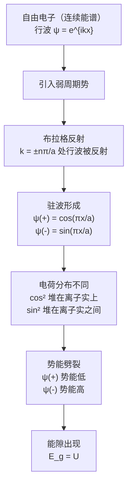

# 07 Energy Bands

# Nearly Free Electron Model

> [!quote] F. Bloch
> By straight Fourier analysis I found to my delight that the wave differed from the plane wave of free electrons only by a periodic modulation.

## 一、为什么需要这个模型？

[[自由电子模型]]（第六章）成功解释了金属的热容、热导、电导等性质，但它无法区分导体和绝缘体。自由电子的能量是连续谱：

$$
\epsilon_{\mathbf{k}} = \frac{\hbar^2}{2m}(k_x^2 + k_y^2 + k_z^2)
$$

所有能量值都可取，电子总能找到空态响应外电场，那所有固体都应该是导体。这与事实完全不符。金属电阻率可低至 $10^{-10}\;\Omega\cdot\text{cm}$（1 K），绝缘体可高达 $10^{22}\;\Omega\cdot\text{cm}$，差距 **32 个数量级**。

![[imgs/continuous_energy.png]]

**NFEM 的出发点**：将晶格周期势 $U(\mathbf{r})$ 作为一个**弱微扰**叠加在自由电子上。电子行为接近自由电子，但在某些特殊波矢处，周期势产生关键影响——把连续谱劈裂成**能带**和**能隙**。

![[imgs/energy_gap.png]]

> [!keypoint] 核心思想
> 哪怕周期势很弱，也会在布里渊区边界处打开**能量禁区**（energy gap）。能隙的存在是区分导体与绝缘体的根本原因。

---

## 二、布拉格反射

晶体中波传播的典型特征是**布拉格反射**。在布拉格反射对应的波矢处，布洛赫波不存在——这些能量恰好就是能隙的位置。

**一维情况**下，布拉格条件 $(\mathbf{k}+\mathbf{G})^2 = k^2$ 变为：

$$
k = \pm\frac{1}{2}G = \pm\frac{n\pi}{a}
$$

其中 $G = 2\pi n/a$ 为倒格矢，$n$ 为整数。

**第一个能隙**出现在 $k = \pm\pi/a$，这正是**第一布里渊区**的边界。更高阶能隙出现在 $\pm 2\pi/a$、$\pm 3\pi/a$、……

---

## 三、驻波的形成

在自由电子模型中，波函数为行波 $\psi_k(x) = e^{ikx}$，携带动量 $\hbar k$，朝一个方向传播。

但在 $k = \pi/a$ 处，向右传播的行波 $e^{i\pi x/a}$ 被布拉格反射成向左传播的 $e^{-i\pi x/a}$，来回反射的结果是：**电子不再朝任何方向传播，形成驻波**。

由两个行波构造两个独立的驻波：

$$
\psi(+) = e^{i\pi x/a} + e^{-i\pi x/a} = 2\cos(\pi x/a)
$$

$$
\psi(-) = e^{i\pi x/a} - e^{-i\pi x/a} = 2i\sin(\pi x/a)
$$

$\psi(+)$ 是偶函数，$\psi(-)$ 是奇函数。两者都是实函数（至多差一个常数因子），**没有净电流**。

> [!important]
> 驻波意味着电子在布里渊区边界处"停下来"了。每个后续布拉格反射都反转波的传播方向，最终形成既不向左也不向右的定态。

---

## 四、能隙的起源（核心物理图像）

> [!keypoint] 能隙的起源
> 两个驻波把电子电荷"堆"在晶格中**不同的位置**，从而感受到不同的静电势能，能量劈裂为上下两条，中间形成禁带。

晶格中有带正电的离子实。电子在正离子实附近势能低（吸引），在离子实之间势能高。

![[imgs/lattice_potential.png]]

**$\psi(+) \propto \cos(\pi x/a)$ 的电荷密度：**

$$
\rho(+) = |\psi(+)|^2 \propto \cos^2(\pi x/a)
$$

峰值在 $x = 0, a, 2a, \dots$，**恰好是正离子实的位置**。电子被"堆"在正离子实上，充分感受吸引，**势能降低**。

**$\psi(-) \propto \sin(\pi x/a)$ 的电荷密度：**

$$
\rho(-) = |\psi(-)|^2 \propto \sin^2(\pi x/a)
$$

峰值在 $x = a/2, 3a/2, \dots$，**恰好是离子实之间的中点**。电子被推离正离子实，**势能升高**。

![[imgs/wave_in_lp.png]]

**行波** $e^{ikx}$ 的电荷密度 $\rho = 1$ 均匀分布，势能取中间值。

| 波函数 | 电荷分布 | 势能 | 位置 |
|--------|----------|------|------|
| $\psi(+) \propto \cos(\pi x/a)$ | 堆积在离子实上 | **低** | 能隙下方（A点） |
| 行波 | 均匀分布 | 中间 | — |
| $\psi(-) \propto \sin(\pi x/a)$ | 堆积在离子实之间 | **高** | 能隙上方（B点） |

---

## 五、能隙大小的计算

设周期势为：

$$
U(x) = U\cos(2\pi x/a)
$$

在布里渊区边界 $k = \pi/a$ 处，归一化波函数为 $\sqrt{2}\cos(\pi x/a)$ 和 $\sqrt{2}\sin(\pi x/a)$。能隙宽度为两个驻态势能之差：

$$
E_g = \int_0^1 dx \; U(x)\left[|\psi(+)|^2 - |\psi(-)|^2\right]
$$

代入 $|\psi(+)|^2 = 2\cos^2(\pi x)$，$|\psi(-)|^2 = 2\sin^2(\pi x)$：

$$
E_g = \int_0^1 dx \; U\cos(2\pi x) \cdot \left[2\cos^2(\pi x) - 2\sin^2(\pi x)\right]
$$

提取常数：

$$
= 2U \int_0^1 dx \; \cos(2\pi x)\left[\cos^2(\pi x) - \sin^2(\pi x)\right]
$$

利用 $\cos^2\theta - \sin^2\theta = \cos 2\theta$：

$$
= 2U \int_0^1 dx \; \cos^2(2\pi x)
$$

利用 $\cos^2\theta = \frac{1+\cos 2\theta}{2}$：

$$
= 2U \int_0^1 dx \; \frac{1+\cos(4\pi x)}{2} = U\int_0^1 dx \;\left[1 + \cos(4\pi x)\right]
$$

振荡项在一个周期内积分为零：

$$
= U\left[1 + 0\right]
$$

$$
\boxed{E_g = U}
$$

> [!keypoint] 核心结论
> **能隙宽度等于周期势的傅里叶分量**。周期势越强（$U$ 越大），能隙越宽；$U \to 0$ 时能隙闭合，回归自由电子连续谱。

---

## 六、完整物理图像

> [!summary]
> NFEM 的核心逻辑：**布拉格反射**迫使电子形成**驻波**，不同驻波把电子电荷"堆"在晶格中**不同的位置**，从而感受到不同的静电势能，能量劈裂为上下两条，中间形成**禁带**。能隙大小等于周期势的傅里叶分量 $|U_\mathbf{G}|$。

---

# Bloch Functions

> [!quote] F. Bloch
> By straight Fourier analysis I found to my delight that the wave differed from the plane wave of free electrons only by a periodic modulation.

## 一、定理的陈述

Bloch 证明：**在周期势中，薛定谔方程的解一定具有如下形式**：

$$
\psi_{\mathbf{k}}(\mathbf{r}) = u_{\mathbf{k}}(\mathbf{r}) \, e^{i\mathbf{k}\cdot\mathbf{r}} \tag{7}
$$

其中 $u_{\mathbf{k}}(\mathbf{r})$ 具有晶格的周期性：

$$
u_{\mathbf{k}}(\mathbf{r}) = u_{\mathbf{k}}(\mathbf{r} + \mathbf{T})
$$

$\mathbf{T}$ 是晶格的任意平移矢量（格矢）。

> [!keypoint]
> 周期势中的电子波函数 = **平面波**（巡游性）× **周期函数**（晶格调制）

---

## 二、两种等价表述

Bloch 定理有两种完全等价的表述。

### 表述一：平移性质

$$
\psi(\mathbf{r} + \mathbf{R}) = e^{i\mathbf{k}\cdot\mathbf{R}} \, \psi(\mathbf{r})
$$

坐标平移一个格矢 $\mathbf{R}$，波函数只差一个**相位因子**。物理状态不变（$|\psi|^2$ 不变）。

### 表述二：乘积形式

$$
\psi_{\mathbf{k}}(\mathbf{r}) = e^{i\mathbf{k}\cdot\mathbf{r}} \, u_{\mathbf{k}}(\mathbf{r})
$$

波函数分解为平面波与周期函数的乘积。

### 等价性证明

从表述一到表述二，在 $\psi(\mathbf{r}+\mathbf{R}) = e^{i\mathbf{k}\cdot\mathbf{R}}\psi(\mathbf{r})$ 两边同乘 $e^{-i\mathbf{k}\cdot(\mathbf{r}+\mathbf{R})}$：

$$
e^{-i\mathbf{k}\cdot(\mathbf{r}+\mathbf{R})} \psi(\mathbf{r}+\mathbf{R}) = e^{-i\mathbf{k}\cdot\mathbf{r}} \psi(\mathbf{r})
$$

令 $u(\mathbf{r}) \equiv e^{-i\mathbf{k}\cdot\mathbf{r}} \psi(\mathbf{r})$，则 $u(\mathbf{r}+\mathbf{R}) = u(\mathbf{r})$，即 $u$ 是周期的。所以 $\psi = e^{i\mathbf{k}\cdot\mathbf{r}} u(\mathbf{r})$。

反过来，从表述二到表述一：

$$
\psi(\mathbf{r}+\mathbf{R}) = e^{i\mathbf{k}\cdot(\mathbf{r}+\mathbf{R})} u(\mathbf{r}+\mathbf{R}) = e^{i\mathbf{k}\cdot\mathbf{R}} e^{i\mathbf{k}\cdot\mathbf{r}} u(\mathbf{r}) = e^{i\mathbf{k}\cdot\mathbf{R}} \psi(\mathbf{r})
$$

两种表述完全等价。

---

## 三、物理根源：平移对称性

Bloch 定理的深刻根源在于**晶格平移对称性**。

周期势满足 $U(\mathbf{r}) = U(\mathbf{r}+\mathbf{R})$，定义平移算符 $\hat{T}_\mathbf{R}$：

$$
\hat{T}_\mathbf{R} \, f(\mathbf{r}) = f(\mathbf{r} + \mathbf{R})
$$

由于势能和动能都在平移下不变：

$$
[\hat{T}_\mathbf{R}, \hat{H}] = 0
$$

平移算符与哈密顿量**对易**，因此它们有共同本征态。设 $\psi$ 为共同本征态：

$$
\hat{T}_\mathbf{R} \, \psi(\mathbf{r}) = \psi(\mathbf{r}+\mathbf{R}) = \lambda_\mathbf{R} \, \psi(\mathbf{r})
$$

由归一化 $|\lambda_\mathbf{R}|^2 = 1$，且平移算符的群性质 $\hat{T}_{\mathbf{R}'}\hat{T}_\mathbf{R} = \hat{T}_{\mathbf{R}+\mathbf{R}'}$ 要求 $\lambda_\mathbf{R}$ 是 $\mathbf{R}$ 的线性指数函数，即：

$$
\lambda_\mathbf{R} = e^{i\mathbf{k}\cdot\mathbf{R}}
$$

这就从对称性严格导出了 Bloch 定理。

---

## 四、$\psi_\mathbf{k}$ 的平移对称性分析

| 函数 | 平移性质 | 是否有晶格平移对称性 |
|------|----------|---------------------|
| $u_\mathbf{k}(\mathbf{r})$ | $u_\mathbf{k}(\mathbf{r}+\mathbf{T}) = u_\mathbf{k}(\mathbf{r})$ | **有** |
| $\psi_\mathbf{k}(\mathbf{r})$ | $\psi_\mathbf{k}(\mathbf{r}+\mathbf{T}) = e^{i\mathbf{k}\cdot\mathbf{T}} \psi_\mathbf{k}(\mathbf{r})$ | **没有** |
| $|\psi_\mathbf{k}(\mathbf{r})|^2$ | $|\psi_\mathbf{k}(\mathbf{r}+\mathbf{T})|^2 = |\psi_\mathbf{k}(\mathbf{r})|^2$ | **有** |

$\psi_\mathbf{k}$ 本身**不具有**晶格平移对称性。平移后多了一个相位因子 $e^{i\mathbf{k}\cdot\mathbf{T}}$，这个相位因子是电子**巡游性**的数学体现。如果 $\psi$ 本身就有平移对称性（相位因子恒为 1），电子就完全局域在一个原胞内了，不可能导电。

但**概率密度** $|\psi|^2$ 严格周期，电子在每个原胞中被找到的概率分布完全相同。

---

## 五、能量在 k 空间的平移对称性

虽然 $\psi_\mathbf{k}$ 在实空间没有平移对称性，但**能量** $\epsilon_n(\mathbf{k})$ 在 k 空间具有以倒格矢为周期的平移对称性：

> [!keypoint]
> $$\epsilon_n(\mathbf{k}+\mathbf{G}) = \epsilon_n(\mathbf{k})$$

**证明思路**：中心方程

$$
(\lambda_k - \epsilon)C(k) + \sum_G U_G \, C(k-G) = 0
$$

将 $k \to k+G_0$ 代入，重新标记求和指标后，方程的**解集**不变。因此能量本征值满足 $\epsilon_n(k+G_0) = \epsilon_n(k)$。

注意：中心方程的**形式**在 $k \to k+G$ 下会改变（因为 $\lambda_k = \hbar^2 k^2/2m$ 变了），但**能谱**（所有能量本征值的集合）不变。

| 物理量 | k 空间平移对称性 |
|--------|-----------------|
| 中心方程的形式 | **没有**（$\lambda_k$ 变了） |
| 能量 $\epsilon_n(\mathbf{k})$ | **有**，$\epsilon_n(\mathbf{k}+\mathbf{G}) = \epsilon_n(\mathbf{k})$ |
| 能谱（解集） | **有** |

这正是**简约区方案**（reduced zone scheme）的基础：因为 $\epsilon(k)$ 以 $\mathbf{G}$ 为周期，我们可以把所有 $k$ 约化到第一布里渊区内绘图。

---

## 六、Crystal Momentum（晶体动量）

波矢 $\mathbf{k}$ 被称为电子的**晶体动量**（crystal momentum），但 $\hbar\mathbf{k}$ **不是**电子的真实动量。

**为什么不是真实动量？**

动量算符 $-i\hbar\nabla$ 作用在 Bloch 函数上：

$$
(-i\hbar\nabla)\psi_\mathbf{k} = \hbar\mathbf{k}\,\psi_\mathbf{k} + e^{i\mathbf{k}\cdot\mathbf{r}}(-i\hbar\nabla u_\mathbf{k})
$$

第二项一般不为零，所以 $\psi_\mathbf{k}$ **不是**动量算符的本征态。

**为什么还叫"动量"？** 因为 $\hbar\mathbf{k}$ 在三方面表现得像动量：

1. **自由电子极限**：$U \to 0$ 时，$u_\mathbf{k}$ 退化为常数，$\hbar\mathbf{k}$ 就是真实动量。

2. **外场中的运动**：弱外场中，$\hbar\dot{\mathbf{k}} = -e(\mathbf{E} + \mathbf{v}\times\mathbf{B})$，形式上完全类似洛伦兹力方程。

3. **碰撞守恒律**：电子吸收/发射声子时，选择定则为 $\mathbf{k} + \mathbf{q} = \mathbf{k}' + \mathbf{G}$，$\hbar\mathbf{k}$ 在碰撞中"守恒"（允许差一个 $\hbar\mathbf{G}$）。

### $\mathbf{k}$ 的不唯一性

$\mathbf{k}$ 和 $\mathbf{k}+\mathbf{G}$ 标记的是**同一个物理状态**：

$$
\psi_{\mathbf{k}+\mathbf{G}}(\mathbf{r}) = e^{i\mathbf{k}\cdot\mathbf{r}} \underbrace{\left(e^{i\mathbf{G}\cdot\mathbf{r}} u_{\mathbf{k}+\mathbf{G}}(\mathbf{r})\right)}_{\text{仍是周期函数}}
$$

因此 $\mathbf{k}$ 可以约化到第一布里渊区，即**简约波矢**。

---

## 七、Bloch 定理的另一种证明（通过中心方程）

将波函数展开为平面波的傅里叶级数：

$$
\psi(x) = \sum_k C(k) e^{ikx}
$$

代入薛定谔方程得到中心方程后，求解得到系数 $C(k-G)$，波函数可重写为：

$$
\psi_k(x) = \sum_G C(k-G)\, e^{i(k-G)x} = e^{ikx} \underbrace{\left(\sum_G C(k-G)\, e^{-iGx}\right)}_{u_k(x)}
$$

括号内是倒格矢的傅里叶级数，显然是周期的。这直接**构造**出了 Bloch 形式，且对简并态也成立。

> [!important] 两种证明的关系
> - **对称性证明**：简洁优美，限于非简并情况
> - **中心方程证明**：更一般，对所有态适用，且给出了 $u_k(x)$ 的具体构造

---

## 八、Bloch 函数与波包

单个 Bloch 函数延展在整个晶体中，不是局域电子。要描述**局域传播的电子**，需叠加不同 $\mathbf{k}$ 的 Bloch 函数构成**波包**：

$$
\Psi(\mathbf{r}, t) = \sum_\mathbf{k} g(\mathbf{k}) \, \psi_\mathbf{k}(\mathbf{r}) \, e^{-i\epsilon_\mathbf{k}t/\hbar}
$$

波包中心以**群速度**运动：

$$
\mathbf{v}_g = \frac{1}{\hbar}\nabla_\mathbf{k} \epsilon_\mathbf{k}
$$

---

## 九、总结

> [!summary]
> - **Bloch 定理**：$\psi_\mathbf{k}(\mathbf{r}) = e^{i\mathbf{k}\cdot\mathbf{r}}u_\mathbf{k}(\mathbf{r})$，根源是晶格平移对称性
> - $\psi_\mathbf{k}$ 本身**没有**晶格平移对称性（差一个相位因子），但 $|\psi_\mathbf{k}|^2$ **有**
> - $\epsilon_n(\mathbf{k})$ 在 k 空间具有倒格矢的平移对称性：$\epsilon_n(\mathbf{k}+\mathbf{G}) = \epsilon_n(\mathbf{k})$
> - $\hbar\mathbf{k}$ 是"准动量"，不是真实动量，但在外场运动和碰撞守恒中充当动量角色
> - $\mathbf{k}$ 和 $\mathbf{k}+\mathbf{G}$ 等价，可约化到第一布里渊区
