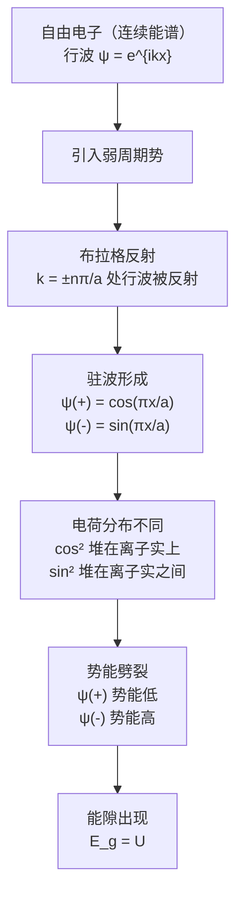

# Nearly Free Electron Model

> [!quote] F. Bloch
> By straight Fourier analysis I found to my delight that the wave differed from the plane wave of free electrons only by a periodic modulation.

## 一、为什么需要这个模型？

[[自由电子模型]]（第六章）成功解释了金属的热容、热导、电导等性质，但它无法区分导体和绝缘体。自由电子的能量是连续谱：

$$
\epsilon_{\mathbf{k}} = \frac{\hbar^2}{2m}(k_x^2 + k_y^2 + k_z^2)
$$

所有能量值都可取，电子总能找到空态响应外电场，那所有固体都应该是导体。这与事实完全不符。金属电阻率可低至 $10^{-10}\;\Omega\cdot\text{cm}$（1 K），绝缘体可高达 $10^{22}\;\Omega\cdot\text{cm}$，差距 **32 个数量级**。

**NFEM 的出发点**：将晶格周期势 $U(\mathbf{r})$ 作为一个**弱微扰**叠加在自由电子上。电子行为接近自由电子，但在某些特殊波矢处，周期势产生关键影响——把连续谱劈裂成**能带**和**能隙**。

> [!keypoint] 核心思想
> 哪怕周期势很弱，也会在布里渊区边界处打开**能量禁区**（energy gap）。能隙的存在是区分导体与绝缘体的根本原因。

---

## 二、布拉格反射

晶体中波传播的典型特征是**布拉格反射**。在布拉格反射对应的波矢处，布洛赫波不存在——这些能量恰好就是能隙的位置。

**一维情况**下，布拉格条件 $(\mathbf{k}+\mathbf{G})^2 = k^2$ 变为：

$$
k = \pm\frac{1}{2}G = \pm\frac{n\pi}{a}
$$

其中 $G = 2\pi n/a$ 为倒格矢，$n$ 为整数。

**第一个能隙**出现在 $k = \pm\pi/a$，这正是**第一布里渊区**的边界。更高阶能隙出现在 $\pm 2\pi/a$、$\pm 3\pi/a$、……

---

## 三、驻波的形成

在自由电子模型中，波函数为行波 $\psi_k(x) = e^{ikx}$，携带动量 $\hbar k$，朝一个方向传播。

但在 $k = \pi/a$ 处，向右传播的行波 $e^{i\pi x/a}$ 被布拉格反射成向左传播的 $e^{-i\pi x/a}$，来回反射的结果是：**电子不再朝任何方向传播，形成驻波**。

由两个行波构造两个独立的驻波：

$$
\psi(+) = e^{i\pi x/a} + e^{-i\pi x/a} = 2\cos(\pi x/a)
$$

$$
\psi(-) = e^{i\pi x/a} - e^{-i\pi x/a} = 2i\sin(\pi x/a)
$$

$\psi(+)$ 是偶函数，$\psi(-)$ 是奇函数。两者都是实函数（至多差一个常数因子），**没有净电流**。

> [!important]
> 驻波意味着电子在布里渊区边界处"停下来"了。每个后续布拉格反射都反转波的传播方向，最终形成既不向左也不向右的定态。

---

## 四、能隙的起源（核心物理图像）

> [!keypoint] 能隙的起源
> 两个驻波把电子电荷"堆"在晶格中**不同的位置**，从而感受到不同的静电势能，能量劈裂为上下两条，中间形成禁带。

晶格中有带正电的离子实。电子在正离子实附近势能低（吸引），在离子实之间势能高。

**$\psi(+) \propto \cos(\pi x/a)$ 的电荷密度：**

$$
\rho(+) = |\psi(+)|^2 \propto \cos^2(\pi x/a)
$$

峰值在 $x = 0, a, 2a, \dots$，**恰好是正离子实的位置**。电子被"堆"在正离子实上，充分感受吸引，**势能降低**。

**$\psi(-) \propto \sin(\pi x/a)$ 的电荷密度：**

$$
\rho(-) = |\psi(-)|^2 \propto \sin^2(\pi x/a)
$$

峰值在 $x = a/2, 3a/2, \dots$，**恰好是离子实之间的中点**。电子被推离正离子实，**势能升高**。

**行波** $e^{ikx}$ 的电荷密度 $\rho = 1$ 均匀分布，势能取中间值。

| 波函数 | 电荷分布 | 势能 | 位置 |
|--------|----------|------|------|
| $\psi(+) \propto \cos(\pi x/a)$ | 堆积在离子实上 | **低** | 能隙下方（A点） |
| 行波 | 均匀分布 | 中间 | — |
| $\psi(-) \propto \sin(\pi x/a)$ | 堆积在离子实之间 | **高** | 能隙上方（B点） |

---

## 五、能隙大小的计算

设周期势为：

$$
U(x) = U\cos(2\pi x/a)
$$

在布里渊区边界 $k = \pi/a$ 处，归一化波函数为 $\sqrt{2}\cos(\pi x/a)$ 和 $\sqrt{2}\sin(\pi x/a)$。能隙宽度为两个驻态势能之差：

$$
E_g = \int_0^1 dx \; U(x)\left[|\psi(+)|^2 - |\psi(-)|^2\right]
$$

代入 $|\psi(+)|^2 = 2\cos^2(\pi x)$，$|\psi(-)|^2 = 2\sin^2(\pi x)$：

$$
E_g = \int_0^1 dx \; U\cos(2\pi x) \cdot \left[2\cos^2(\pi x) - 2\sin^2(\pi x)\right]
$$

提取常数：

$$
= 2U \int_0^1 dx \; \cos(2\pi x)\left[\cos^2(\pi x) - \sin^2(\pi x)\right]
$$

利用 $\cos^2\theta - \sin^2\theta = \cos 2\theta$：

$$
= 2U \int_0^1 dx \; \cos^2(2\pi x)
$$

利用 $\cos^2\theta = \frac{1+\cos 2\theta}{2}$：

$$
= 2U \int_0^1 dx \; \frac{1+\cos(4\pi x)}{2} = U\int_0^1 dx \;\left[1 + \cos(4\pi x)\right]
$$

振荡项在一个周期内积分为零：

$$
= U\left[1 + 0\right]
$$

$$
\boxed{E_g = U}
$$

> [!keypoint] 核心结论
> **能隙宽度等于周期势的傅里叶分量**。周期势越强（$U$ 越大），能隙越宽；$U \to 0$ 时能隙闭合，回归自由电子连续谱。

---

## 六、完整物理图像

> [!summary]
> NFEM 的核心逻辑：**布拉格反射**迫使电子形成**驻波**，不同驻波把电子电荷"堆"在晶格中**不同的位置**，从而感受到不同的静电势能，能量劈裂为上下两条，中间形成**禁带**。能隙大小等于周期势的傅里叶分量 $|U_\mathbf{G}|$。
