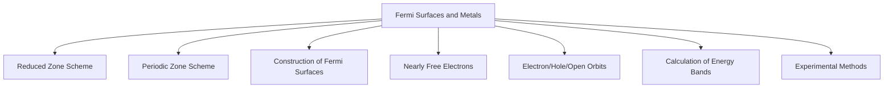
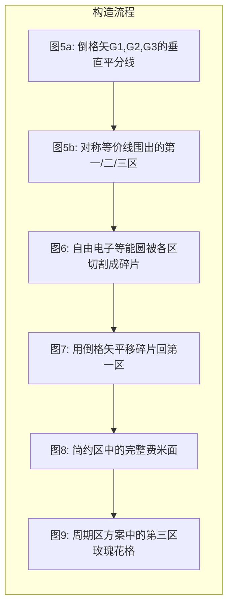
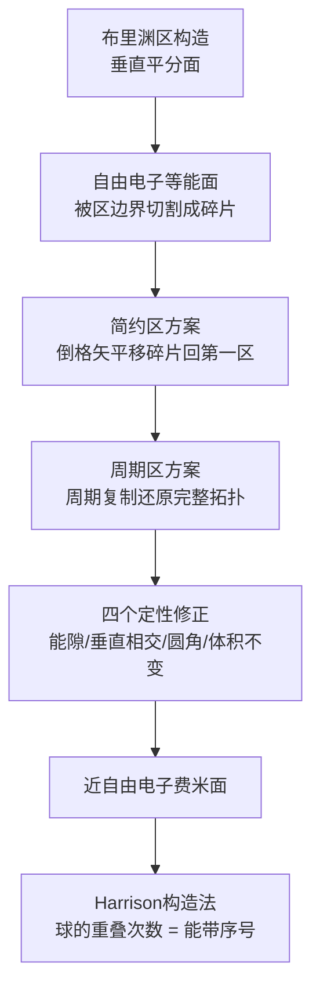
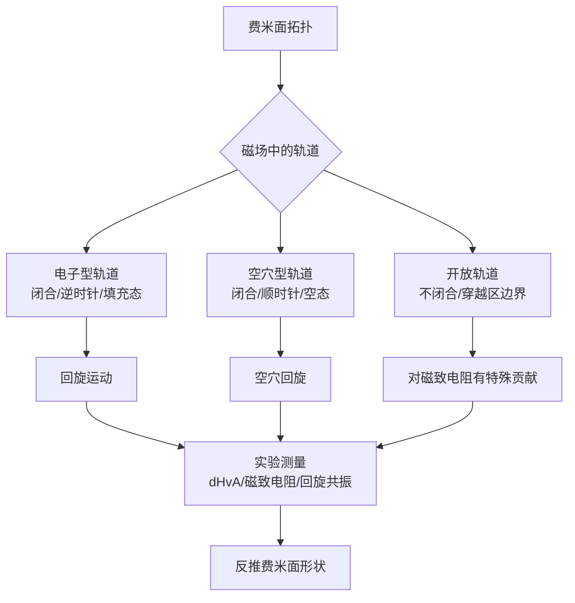
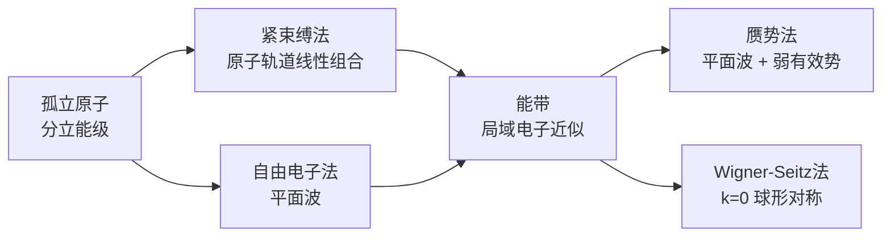
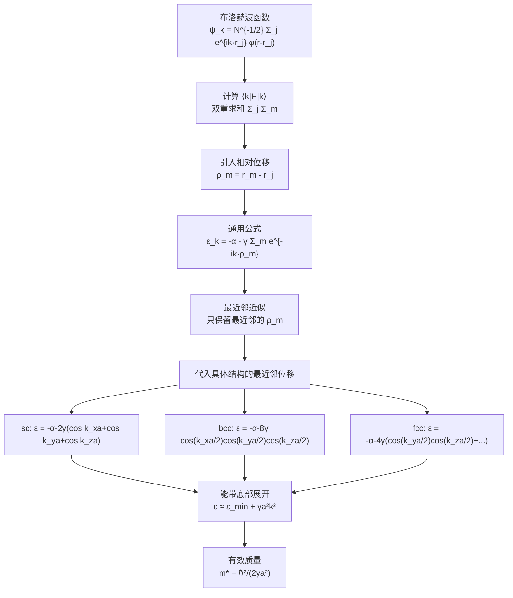

# 09 Fermi Surfaces and Metals

> [!quote] A. R. Mackintosh
> "Few people would define a metal as 'a solid with a Fermi surface.' This may nevertheless be the most meaningful definition of a metal one can give today."

## 00 引言

### 一、费米面 (Fermi Surface)

#### 定义

**费米面是 k 空间中能量等于费米能 $\epsilon_F$ 的等能面。**

在绝对零度下，费米面将 k 空间分为两个区域：
- **内部**：被电子填充的态
- **外部**：未被填充的态

#### 为什么费米面如此重要？

金属的**电学性质由费米面的体积和形状决定**。电流的产生源于外场对费米面附近态占据情况的改变。如果能确定费米面的形状，就能理解金属的导电性、磁学性质、光学响应等核心物理性质。

> [!important] 核心认识
> 费米面是连接微观量子态宏观可测量物理量的桥梁。

#### 自由电子费米面

对于自由电子气，费米面是一个**球面**，半径 $k_F$ 由价电子浓度决定：

$$k_F = (3\pi^2 n)^{1/3}$$

其中 $n$ 是电子浓度。

#### 实际金属中的费米面

实际金属中，晶格势会变形费米面。教材图1给出了两种 fcc 金属的自由电子费米面：

| 金属 | 价电子数/原胞 | 费米面特征 |
|------|:---:|------|
| **Cu (铜)** | 1 | 费米球完全在第一布里渊区内，受晶格势作用变形 |
| **Al (铝)** | 3 | 费米球很大，已超出第一区，第二区接近半满 |

> [!tip] 关键问题
> 如何从自由电子的球面出发，构造出真实金属的费米面？—— 这需要**简约区方案**和**周期区方案**作为工具。

---

### 二、简约区方案 (Reduced Zone Scheme)

#### 核心思想

**将所有布洛赫波的波矢 k 都折叠到第一布里ouin区内。**

#### 数学操作

对于一个波矢 $\mathbf{k}'$ 在第一区之外的布洛赫函数：

$$\psi_{\mathbf{k}'}(\mathbf{r}) = e^{i\mathbf{k}' \cdot \mathbf{r}} u_{\mathbf{k}'}(\mathbf{r})$$

总可以找到一个倒格矢 $\mathbf{G}$，使得 $\mathbf{k} = \mathbf{k}' + \mathbf{G}$ 落在第一布里ouin区内。将其改写：

$$\psi_{\mathbf{k}'}(\mathbf{r}) = e^{i\mathbf{k} \cdot \mathbf{r}} \underbrace{(e^{-i\mathbf{G} \cdot \mathbf{r}} u_{\mathbf{k}'}(\mathbf{r}))}_{u_{\mathbf{k}}(\mathbf{r})}$$

由于 $e^{-i\mathbf{G} \cdot \mathbf{r}}$ 和 $u_{\mathbf{k}'}(\mathbf{r})$ 都是晶格周期的，所以 $u_{\mathbf{k}}(\mathbf{r})$ 也是晶格周期的，$\psi_{\mathbf{k}}(\mathbf{r})$ 仍为布洛赫函数形式。

> [!note] 物理意义
> 同一个晶体状态，可以用不同的 $(\mathbf{k}', \mathbf{G})$ 组合来标记。简约区方案选择让 $\mathbf{k}$ 落在第一区内的那一种标记。

#### 核心结果

1. **同一个 k 可以对应多个不同的能量** —— 每个不同能量就是一条不同的**能带 (energy band)**。
2. 只需在第一布里ouin区内求解能量，对每条能带分别处理。
3. 能量 $\epsilon_{\mathbf{k}'}$ （$\mathbf{k}'$ 在第一区外）等于 $\epsilon_{\mathbf{k}}$（$\mathbf{k}$ 在第一区内），其中 $\mathbf{k} = \mathbf{k}' + \mathbf{G}$。

#### 能带指数的引入

不同能带在同一个 k 处的波函数，其平面波展开系数 $C(\mathbf{k} + \mathbf{G})$ 的取值不同。因此需要引入**能带指数 $n$**：

$$\psi_{n,\mathbf{k}} = e^{i\mathbf{k} \cdot \mathbf{r}} u_{n,\mathbf{k}}(\mathbf{r}) = \sum_{\mathbf{G}} C_n(\mathbf{k} + \mathbf{G}) \, e^{i(\mathbf{k} + \mathbf{G}) \cdot \mathbf{r}}$$

#### 自由电子在简约区中的图像

对于自由电子 $\epsilon_k = \hbar^2 k^2 / 2m$，在简约区方案中：

- 原本是一条简单的抛物线，折叠后变成多条分支
- 每条分支是一条能带
- 加入晶格势 $U(x)$ 后，在布里渊区边界处打开**能带隙 (band gap)**
- 这个构造能给出晶体能带结构的大致全貌

> [!example] 图3解读
> 一维自由电子的简约区图：AC 分支向左平移 $-2\pi/a$ 得到负 k 方向的自由电子曲线；AC 分支向右平移 $+2\pi/a$ 得到正 k 方向的自由电子曲线。晶格势在 A、A'（区边界）和 C（区中心）处引入能隙。

---

### 三、周期区方案 (Periodic Zone Scheme)

#### 核心思想

**将第一布里ouin区周期性复制到整个 k 空间。**

#### 数学表述

在周期区方案中，能量是 k 空间的**周期函数**：

$$\epsilon_{\mathbf{k}} = \epsilon_{\mathbf{k} + \mathbf{G}} \tag{2}$$

这里 $\epsilon_{\mathbf{k}+\mathbf{G}}$ 和 $\epsilon_{\mathbf{k}}$ 指的是**同一条能带**。

#### 物理理解

以简单立方晶格紧束缚近似为例：

$$\epsilon_{\mathbf{k}} = -\alpha - 2\gamma(\cos k_x a + \cos k_y a + \cos k_z a) \tag{3}$$

倒格矢 $\mathbf{G} = (2\pi/a)\hat{\mathbf{x}}$，当 $k_x \to k_x + 2\pi/a$ 时：

$$\cos(k_x a) \to \cos(k_x a + 2\pi) = \cos k_x a$$

能量完全不变。这说明能量在倒格子空间具有周期性。

#### 周期区方案的特征

- **每条能带在所有布里ouin区中都出现**
- 你在第一区看到的能带图案，在第二区、第三区……完全重复
- 这是构造费米面的关键工具

---

### 四、三种区方案对比

教材图4用一维晶格的三条能带展示了三种方案：

| 方案 | 画法 | 用途 |
|:---|:---|:---|
| **扩展区 (Extended Zone)** | 不同能带画在不同的布里ouin区中 | 最直观，接近自由电子图像 |
| **简约区 (Reduced Zone)** | 所有能带都折叠进第一布里ouin区 | 方便处理晶格势微扰，揭示能带结构 |
| **周期区 (Periodic Zone)** | 每条能带在所有布里ouin区中重复 | 展示能量周期性，构造费米面的关键工具 |

> [!note] 本质
> 三种方案是**同一个物理的数学等价表述**，就像同一个地球可以用地球仪、墨卡托投影、展开图来呈现。不同场景选择不同工具。

#### 从自由电子到实际费米面的构造流程

三种区方案在费米面构造中各司其职：

---

### 五、关键概念速查

#### 费米面
- k 空间中 $\epsilon = \epsilon_F$ 的等能面
- 绝对零度下分隔填充态与未填充态
- 决定金属的电学性质

#### 简约区方案
- 所有 $\mathbf{k}$ 折叠到第一布里ouin区
- 同一 $\mathbf{k}$ 可有多条能带（不同能量）
- 布洛赫函数改写：$\psi_{n,\mathbf{k}} = \sum_G C_n(\mathbf{k}+\mathbf{G})e^{i(\mathbf{k}+\mathbf{G})\cdot\mathbf{r}}$

#### 周期区方案
- 第一区周期性复制到整个 k 空间
- $\epsilon_{\mathbf{k}} = \epsilon_{\mathbf{k}+\mathbf{G}}$（同一条能带）
- 每条能带在所有区中重复出现

#### 三种方案关系
- 扩展区：能带分离 → 直观
- 简约区：能带折叠 → 便于微扰计算
- 周期区：能带重复 → 便于构造费米面

---

## 01 CONSTRUCTION OF FERMI SURFACES

> [!abstract] 本节任务
> 给定晶格和自由电子浓度，确定费米面在 k 空间中的形状。以二维方格子为例，展示从布里渊区构造到费米面拼合的完整流程。

### 一、布里渊区的构造

#### 布里渊区边界方程

布里渊区边界由倒格矢 $\mathbf{G}$ 决定，边界方程为：

$$2\mathbf{k} \cdot \mathbf{G} + G^2 = 0$$

**几何意义**：边界是垂直于 $\mathbf{G}$ 且通过 $\mathbf{G}$ 中点的平面（三维）或直线（二维），即 $\mathbf{G}$ 的**垂直平分面**。

#### 第一布里ouin区

二维方格子（晶格常数 $a$）的最短倒格矢组：

$$\mathbf{G}_1: \quad \pm\frac{2\pi}{a}\hat{k}_x, \quad \pm\frac{2\pi}{a}\hat{k}_y$$

共 4 个（含对称等价）。第一布里渊区是这 4 个倒格矢的垂直平分线围成的**中心正方形**（图5a）。

#### 第二、第三布里ouin区

- **第二区**：由次短倒格矢 $\mathbf{G}_2$ 及其对称等价矢量的垂直平分线构成，在图5b中是围绕第一区的 4 个梯形区域。
- **第三区**：由更长倒格矢构成。其边界往往需要同时考虑**多个不等价的倒格矢**。例如区域 $3_a$ 的边界由三个倒格矢共同决定：

$$\frac{2\pi}{a}\hat{k}_x; \quad \frac{4\pi}{a}\hat{k}_y; \quad \frac{2\pi}{a}(\hat{k}_x + \hat{k}_y)$$

> [!note] 高阶布里渊区的复杂性
> 第 $n$ 个布里渊区不是简单地由"第 $n$ 短的倒格矢"决定。高阶区的边界往往需要同时考虑多个不等价的倒格矢。各区在 k 空间中交错分布，像拼图一样填满整个空间。

#### 图示对应关系

---

### 二、自由电子费米面的"碎片化"

#### 图6：扩展区中的费米面

在扩展区方案中，自由电子的等能圆（即费米面）被各阶布里渊区的边界切割成多块：

- 圆在第一区内的部分 → 属于**第一能带**的费米面
- 圆在第二区内的碎片（三角形 $2_a, 2_b, 2_c, 2_d$） → 属于**第二能带**的费米面
- 圆在第三区内的碎片 → 属于**第三能带**的费米面

> [!important] 核心问题
> 同一个能带的费米面碎片散布在不同区域中，看起来是"碎片化"的。这不方便分析。需要把这些碎片重新拼合。

#### 一个重要定理

> **k 空间中填充区域的总面积只取决于电子浓度，与电子和晶格的相互作用无关。**

不管晶格势有多强，费米面所包围的 k 空间体积（由电子浓度决定）不变。晶格势只能改变费米面的**形状**，不能改变其**体积**。这是 Luttinger 定理的体现。

---

### 三、简约区方案中的费米面拼合

#### 图7：把碎片移回第一区

修复"碎片化"的方法：**简约区方案**，即用倒格矢平移把散布在各区的碎片全部移回第一布里ouin区。

具体操作示例：三角形 $2_a$ 用倒格矢 $\mathbf{G} = -(2\pi/a)\hat{k}_x$ 平移，回到第一区范围内。其他三角形 $2_b, 2_c, 2_d$ 各自需要**不同的倒格矢**来平移。

> [!tip] 操作要点
> 每个碎片需要**不同的倒格矢**来平移。每个碎片在 k 空间中的位置不同，把它们移回第一区所需的"位移"也不同。

#### 图8：简约区中的完整费米面

所有碎片移回第一区后的结果：

- **第一区**：完全被电子填满（第一能带全满，图中阴影区域）
- **第二区**：费米面碎片拼合成一个**连通的方形**（第二能带的费米面）
- **第三区**：碎片也拼合在一起，但在简约区中**仍然不连通**

第三区的碎片在简约区中为什么不连通？因为第三能带的费米面在简约区中被折叠了多次，仅靠简约区的"单次折叠"还不够把它拼合完整。

#### 图9：周期区方案中的第三区费米面

切换到**周期区方案**：把图8中的第三区图案周期性复制到整个 k 空间。结果如图9，费米面形成**"玫瑰花格" (lattice of rosettes)**。

> [!example] 三种方案在费米面构造中的角色
> - **扩展区**：费米面被切割 → 看到碎片的来源
> - **简约区**：碎片被平移拼合 → 看到各能带的填充情况
> - **周期区**：图案被周期复制 → 看到费米面的完整拓扑形状

---

### 四、从自由电子到近自由电子：四个定性事实

以上构造的是自由电子费米面。真实金属中电子受到晶格势作用（虽然对碱金属很弱），如何过渡到近自由电子费米面？

#### 四个定性事实

| # | 事实 | 物理含义 |
|:---:|------|------|
| 1 | 晶格势在布里渊区边界处产生**能隙** | 近自由电子模型的核心结论 |
| 2 | 费米面几乎总是**垂直于布里渊区边界**相交 | 边界处电子受布拉格反射，等能面弯向边界直到垂直 |
| 3 | 晶格势会**磨去费米面上的尖角** | 自由电子费米面的切割拼接处有尖角，晶格势使其圆滑 |
| 4 | 费米面所围**体积不变** | Luttinger 定理：体积只取决于电子浓度 |

#### 图10：近自由电子费米面的定性图像

根据以上四条，自由电子费米面（图8）在加入晶格势后变为图10：

- **第二区费米面**：能量增加方向指向图形**内部**（填充区域在内侧）→ **空穴型 (holelike)**
- **第三区费米面**：能量增加方向指向图形**外部**（填充区域在外侧）→ **电子型 (electronlike)**

> [!important] 电子型 vs 空穴型
> - **电子型费米面**：包围的是填充态，能量向外增加（越往外能量越高）
> - **空穴型费米面**：包围的是空态（几乎填满的带顶部的空穴），能量向内增加

这可以从有效质量的角度理解：在能带底部，有效质量为正，电子型；在能带顶部，有效质量为负，等价于带正电荷的空穴。

---

### 五、Harrison 构造法

图11展示了系统构造自由电子费米面的 **Harrison 方法**：

**步骤：**
1. 确定所有倒格点
2. 以每个倒格点为中心，画半径为 $k_F$ 的自由电子球
3. k 空间中落在**至少一个球内**的点 → 第一区填充态
4. 落在**至少两个球内**的点 → 第二区填充态
5. 落在**三个或更多球内**的点 → 第三区填充态
6. 依此类推

> [!tip] 物理图像
> 球的交叠区域对应高阶能带的填充。球越多重叠，对应的能带越高。这个方法把"在不同能带中的填充区域"转化为了"球的重叠次数"。

---

### 六、实际金属的费米面

#### 碱金属（一价：Na, K, Cs 等）

- 每个原子 1 个价电子，费米球只填充第一布里渊区体积的**一半**
- 费米面离布里渊区边界很远 → 晶格势影响微弱
- **Na**：费米面几乎是完美球面
- **Cs**：偏离球面约 10%

#### 碱土金属（二价：Be, Mg）

- 每个原子 2 个价电子，费米面所围体积是碱金属的**两倍**
- 费米面体积恰好等于一个完整布里渊区体积
- 但球面形的费米面必然**伸出第一区，进入第二区**

> [!example] 对比

| 金属 | 价电子数 | 费米面体积 | 费米面特征 |
|------|:---:|:---:|------|
| Na | 1 | 半区体积 | 几乎完全球面，完全在第一区内 |
| Cs | 1 | 半区体积 | 偏离球面 ~10% |
| Be, Mg | 2 | 整个区体积 | 球面，但伸出第一区进入第二区 |

---

### 七、本节逻辑总结

> [!abstract] 核心要点
> 1. 布里渊区的构造本质是"倒格矢的垂直平分面围成的区域"
> 2. 费米面的**拓扑结构**（连通性、电子型/空穴型）由晶格对称性和电子浓度决定
> 3. 晶格势只修正费米面的**细节形状**，不改变其包围的**体积**
> 4. 从自由电子到近自由电子的过渡可通过四个定性事实近似描述

---

## 02 ELECTRON ORBITS, HOLE ORBITS, AND OPEN ORBITS

> [!abstract] 本节任务
> 讨论磁场中费米面上电子的轨道类型，以及轨道类型与费米面拓扑之间的关系。三种轨道（电子型、空穴型、开放型）是连接费米面几何与宏观可测量物理量的桥梁。

### 一、磁场中电子运动的基本方程

#### 半经典运动方程

在静磁场 $\mathbf{B}$ 中，电子的半经典运动方程（第8章 Eq. 8.7）给出：

$$\hbar \dot{\mathbf{k}} = -e \, \mathbf{v} \times \mathbf{B}$$

其中 $\mathbf{v} = \frac{1}{\hbar}\nabla_k \epsilon$ 是电子的群速度。

#### 关键推论

1. 电子在 k 空间中沿**等能面**与**垂直于 B 的平面**的交线运动
2. 由于费米面本身就是等能面（$\epsilon = \epsilon_F$），**电子沿费米面上的曲线运动**
3. 在垂直于 $\mathbf{B}$ 的平面上截取费米面，得到的交线就是电子的**轨道 (orbit)**

> [!note] 物理图像
> 磁场不改变电子的能量（洛伦兹力不做功），只改变电子在 k 空间中的运动方向。电子被限制在费面上，同时被限制在垂直于 B 的平面内，两者的交线就是轨道。

---

### 二、三种轨道类型

教材图12展示了三种基本轨道类型：

#### 1. 电子型轨道 (Electronlike Orbit) — 图12(b)

**特征**：
- 轨道是**闭合的**
- 波矢 $\mathbf{k}$ 沿轨道**逆时针**方向运动
- 这是自由电子（电荷 $-e$）在磁场中应有的旋转方向

**物理图像**：
- 能量较低的态在轨道**内部**（$\nabla_k \epsilon$ 指向外）
- 被电子填充的态在轨道内侧
- 有效质量为正

> [!tip] 判断方法
> 对于电子型轨道，$\nabla_k \epsilon$（能量梯度）从轨道内侧指向外侧。电子填充了轨道内部的态。

#### 2. 空穴型轨道 (Holelike Orbit) — 图12(a)

**特征**：
- 轨道是**闭合的**
- 波矢 $\mathbf{k}$ 沿轨道**顺时针**方向运动
- 与电子型轨道的旋转方向**相反**

**物理图像**：
- 能量较低的态在轨道**外部**（$\nabla_k \epsilon$ 指向内）
- 轨道内部是**空的**（几乎填满的带顶部缺少电子 = 空穴）
- 电子在这个轨道中运动时，表现得**像带正电荷 $+e$ 的粒子**

> [!important] 空穴的本质
> 空穴型轨道并不意味着"有一个正电荷粒子在运动"。它描述的是：在几乎填满的能带中，少量空态（空穴）的集体行为等价于一个带正电荷的粒子。电子在空穴型轨道上的运动方向与电子型相反，这正是空穴带正电这一物理图像的 k 空间体现。

#### 3. 开放轨道 (Open Orbit) — 图12(c)

**特征**：
- 轨道**不闭合**
- 电子从布里渊区边界上的 A 点到达后，被"折叠"到等价点 B（因为 A 和 B 通过倒格矢相连）
- 在周期区方案中，电子连续穿越多个布里ouin区，永不回到起点

**物理图像**：
- 在简约区方案中，电子从一边进、从另一边出
- 在周期区方案中，电子沿一条无限长的曲线路径运动
- 拓扑上介于电子型和空穴型之间

> [!example] 图12(c) 的解读
> 在矩形布里渊区的周期区方案中，电子从 A 点到达区边界后，由于 A 和 B 由倒格矢连接（它们是 k 空间中的等价点），电子瞬间从 A 跳到 B，然后继续运动。这种"跳跃"在周期区方案中是连续的——电子只是穿过了区的边界。

---

### 三、三种轨道的总结

| 轨道类型 | 闭合性 | 旋转方向 | 包围区域 | 有效电荷 |
|:---|:---:|:---:|:---:|:---:|
| **电子型** | 闭合 | 逆时针 | 填充态 | $-e$ |
| **空穴型** | 闭合 | 顺时针 | 空态 | $+e$ |
| **开放型** | 不闭合 | — | — | — |

> [!note] 定义法则
> - 包围**填充态**的闭合轨道 → 电子轨道
> - 包围**空态**的闭合轨道 → 空穴轨道
> - 不闭合、穿越布里渊区边界的轨道 → 开放轨道

---

### 四、空穴轨道的进一步理解

#### 图13：几乎填满的带中的空穴

图13(a) 展示了简约区方案中一个几乎填满的带，在布里渊区角落处有少量空白区域（空态）。这些空态就是空穴。

在简约区方案中，这些空态出现在多个角落，看起来是分离的。但在周期区方案中（图13(b)），它们是**连通的**，形成一系列圆形的空穴轨道。

> [!important] 等价性
> 图13(b) 中不同圆形轨道上的空态是完全等价的（由倒格矢连接），它们的态密度等价于单个圆的态密度。

#### 图14：与图12(a)的等价

图14 展示了二维晶体中几乎填满的带顶部附近的空态，这与图12(a) 的拓扑结构完全等价。空穴在磁场中沿这些空态形成的轨道运动，表现为带正电荷的载流子。

---

### 五、三维情况：图15

图15 展示了简单立方晶格中紧束缚近似下的等能面：

$$\epsilon_k = -\alpha - 2\gamma(\cos k_x a + \cos k_y a + \cos k_z a)$$

- **图15(a)**：$\epsilon = -\alpha$ 的等能面，填充体积对应每个原胞1个电子
- **图15(b)**：同一等能面在周期区方案中的展示，可以清楚地看到轨道的连通性

> [!example] 思考题
> 在 $\mathbf{B} = B\hat{z}$ 磁场中，电子在垂直于 B 的平面（$k_z = \text{const}$）上运动。对于图15(b) 中的等能面，你能找到电子型、空穴型和开放型轨道吗？
>
> 提示：在不同 $k_z$ 值处截取等能面，截面形状会变化。某些 $k_z$ 值处截面是闭合曲线（电子型或空穴型），另一些处可能是开放曲线。

---

### 六、开放轨道的物理后果

开放轨道对**磁致电阻 (magnetoresistance)** 有重要影响。

在磁场中，闭合轨道的电子做回旋运动，对电导率的贡献可以用经典的 Drude 模型描述。但开放轨道的电子在 k 空间中持续"漂移"，不会被限制在一个小区域内，它们对电导率的贡献与闭合轨道截然不同。

> [!important] 磁致电阻
> 开放轨道的存在使得金属的电阻随磁场的变化关系变得复杂。在某些情况下，开放轨道可以导致电阻随磁场增大而增大（正磁致电阻），这是研究费米面拓扑的重要实验手段之一。

---

### 七、从轨道到费米面研究

这三种轨道的分类是理解后续实验方法（de Haas-van Alphen 效应、磁致电阻等）的基础。通过测量磁场中电子的轨道行为，可以反推费米面的形状。

> [!abstract] 本节核心
> 费米面的拓扑结构决定了磁场中电子轨道的类型。三种轨道（电子型、空穴型、开放型）对应三种不同的物理行为，是连接费米面几何与宏观可测量物理量的桥梁。

---

## 03 CALCULATION OF ENERGY BANDS — 紧束缚方法详解

> [!abstract] 本节深入展开紧束缚方法（Tight Binding Method），从双原子模型出发，完整推导能量色散关系，并分析具体晶体结构（sc/bcc/fcc）的结果。

### 0 方法概览

Kittel 本章介绍了三种能带计算方法：

| 方法 | 出发点 | 最适用 |
|:---|:---|:---|
| **紧束缚法 (Tight Binding)** | 孤立原子轨道的线性组合 | 过渡金属 d 带、窄带 |
| **Wigner-Seitz 法** | k=0 的球形对称解 | 碱金属价电子 |
| **赝势法 (Pseudopotential)** | 用弱有效势替代强离子势 | 简单金属、半导体 |

### 一、从双原子分子出发：成键与反键

#### 1.1 两个氢原子的模型

想象两个氢原子 A 和 B，各有一个 1s 电子。当它们相距很远（$\rho \to \infty$）时，每个原子的基态波函数就是氢原子 1s 轨道，能量为：

$$E_{1s} = -\frac{me^4}{2\hbar^2} = -13.6 \text{ eV}$$

波函数分别为 $\psi_A$ 和 $\psi_B$，在空间上几乎没有重叠。

#### 1.2 原子靠近时波函数的重叠

当两个原子被拉到一起形成 H$_2$ 时，电子不再只属于某一个原子。根据对称性（交换 A 和 B 给出等价物理态），有两种自然的组合方式：

$$\psi_+ = \psi_A + \psi_B \quad (\text{成键态, bonding})$$
$$\psi_- = \psi_A - \psi_B \quad (\text{反键态, antibonding})$$

#### 1.3 能量分裂的物理机制

**成键态 $\psi_+$**：
- 电子在两个原子核之间的区域有**显著的概率密度**
- 在这个区域，电子**同时感受到两个原子核的库仑吸引**
- 额外的吸引势意味着更强的结合 → **能量降低**
- 图16(b) 显示波函数在核间区域是"鼓起来"的

**反键态 $\psi_-$**：
- 电子在两个原子核之间的区域有**节点**（概率为零）
- 电子无法同时从两个核获得吸引 → 没有额外结合
- 节点意味着更大的曲率（动能更高）→ **能量升高**
- 图16(c) 显示波函数在核间区域有一个节点

> [!important] 能量分裂的大小取决于波函数重叠的程度。重叠越大（原子越近），分裂越宽。当原子无限远离时，分裂消失，两个能级简并回到孤立原子的能量。

#### 1.4 推广到 N 个原子：能带的形成

对于 N 个原子组成的晶体，每个原子的 1s 能级将分裂为 N 个能级，形成**能带 (energy band)**。图17展示了20个氢原子环中 1s 能级形成的能带。

**关键结论**：每个孤立原子的能级，在晶体中**展宽为一个能带**。能带的宽度正于相邻原子之间的重叠相互作用强度。

> [!note] 能带中态的数量
> 对于 N 个原子的晶体，每个非简并原子轨道对应的能带包含 2N 个态（计入自旋）。推导：简约区体积为 $8\pi^3/a^3$（sc），k 空间中单位体积的态数为 $V/4\pi^3$（计入自旋），总态数为 $2V/a^3 = 2N$。

---

### 二、数学框架：LCAO 近似

#### 2.1 布洛赫函数的构造

如果每个原胞只有一个原子，晶格中单电子的近似波函数可以写成：

$$\psi_{\mathbf{k}}(\mathbf{r}) = \sum_j C_{\mathbf{k}j} \, \varphi(\mathbf{r} - \mathbf{r}_j) \tag{4}$$

其中 $\varphi(\mathbf{r})$ 是孤立原子的基态波函数（例如 s 态），求和遍历所有格点 $\mathbf{r}_j$。

为了使 $\psi_{\mathbf{k}}$ 满足布洛赫定理，需要：

$$C_{\mathbf{k}j} = N^{-1/2} e^{i\mathbf{k}\cdot\mathbf{r}_j}$$

代入后得到：

$$\boxed{\psi_{\mathbf{k}}(\mathbf{r}) = N^{-1/2} \sum_j e^{i\mathbf{k}\cdot\mathbf{r}_j} \, \varphi(\mathbf{r} - \mathbf{r}_j)} \tag{5}$$

#### 2.2 布洛赫条件的验证

对晶格平移 $\mathbf{T}$（连接两个格点）：

$$\begin{aligned}
\psi_{\mathbf{k}}(\mathbf{r}+\mathbf{T}) &= N^{-1/2} \sum_j e^{i\mathbf{k}\cdot\mathbf{r}_j} \varphi(\mathbf{r}+\mathbf{T}-\mathbf{r}_j) \\
&= e^{i\mathbf{k}\cdot\mathbf{T}} \cdot N^{-1/2} \sum_{j'} e^{i\mathbf{k}\cdot\mathbf{r}_{j'}} \varphi(\mathbf{r}-\mathbf{r}_{j'}) \\
&= e^{i\mathbf{k}\cdot\mathbf{T}} \psi_{\mathbf{k}}(\mathbf{r})
\end{aligned}$$

其中第二步用到了 $\mathbf{r}_j - \mathbf{T}$ 仍然是格点（重标号为 $j'$）。这正是布洛赫条件。

> [!note] 物理含义
> 布洛赫波函数是大量原子轨道的相干叠加。相位因子 $e^{i\mathbf{k}\cdot\mathbf{r}_j}$ 给每个格点上的原子轨道一个特定的相位，使得叠加后的波函数具有晶格平移对称性。

---

### 三、能量色散关系的推导

#### 3.1 哈密顿量矩阵元：双重求和

晶体的哈密顿量为 $H = -\frac{\hbar^2}{2m}\nabla^2 + U_{\text{crystal}}(\mathbf{r})$。能量的一级近似为：

$$\epsilon_{\mathbf{k}} = \langle \psi_{\mathbf{k}} | H | \psi_{\mathbf{k}} \rangle$$

代入波函数 (5)：

$$\boxed{\epsilon_{\mathbf{k}} = N^{-1} \sum_j \sum_m e^{i\mathbf{k}\cdot(\mathbf{r}_j - \mathbf{r}_m)} \langle \varphi_m | H | \varphi_j \rangle} \tag{7}$$

> [!important] 为什么是双重求和？
> 每个布洛赫波函数本身是 $N$ 个原子轨道的叠加。计算期望值时，左边的 $N$ 个分量与右边的 $N$ 个分量两两配对，自然产生 $N \times N$ 的双重求和。

#### 3.2 引入相对位移

令 $\boldsymbol{\rho}_m = \mathbf{r}_m - \mathbf{r}_j$（从格点 $j$ 指向格点 $m$），则：

$$\langle \mathbf{k} | H | \mathbf{k} \rangle = \sum_m e^{-i\mathbf{k}\cdot\boldsymbol{\rho}_m} \int dV \, \varphi^*(\mathbf{r} - \boldsymbol{\rho}_m) H \varphi(\mathbf{r}) \tag{8}$$

> [!tip] 因子 N 去哪了？
> 步骤(7)中有 $N^{-1} \sum_j \sum_m$。在改写为相对位移后，对 $j$ 的求和给出因子 $N$（因为对于每个 $m$，$j$ 遍历所有 $N$ 个格点），与 $N^{-1}$ 抵消。最终只剩下对 $m$ 的求和。

#### 3.3 最近邻近似

在公式 (8) 的无穷求和中，只保留两类：

**同一原子**（$\boldsymbol{\rho} = 0$）：

$$\int dV \, \varphi^*(\mathbf{r}) H \varphi(\mathbf{r}) = -\alpha \tag{9a}$$

**最近邻**（$\boldsymbol{\rho} = \boldsymbol{\rho}_{\text{nn}}$）：

$$\int dV \, \varphi^*(\mathbf{r}-\boldsymbol{\rho}) H \varphi(\mathbf{r}) = -\gamma \tag{9b}$$

> [!important] $\alpha$ 和 $\gamma$ 的物理含义
> - **$\alpha > 0$（原子自能）**：电子在格点 $j$ 的原子轨道上时，通过整个晶格哈密顿量获得的能量。它不等于孤立原子的能级，因为 $H$ 包含了其他所有原子核的势场。
> - **$\gamma > 0$（重叠积分/跃迁积分）**：衡量电子从格点 $j$ "跳跃"到最近邻格点 $m$ 的能力。$\gamma > 0$ 意味着电子跳跃到相邻原子时，能量降低（成键）。
>
> $\gamma$ 随原子间距 $\rho$ 指数衰减（对氢原子 1s 态）：
> $$\gamma(\text{Ry}) = 2\left(1 + \frac{\rho}{a_0}\right) \exp\left(-\frac{\rho}{a_0}\right) \tag{11}$$
>
> 这保证了最近邻近似的自洽性：次近邻的 $\gamma$ 远小于最近邻。

#### 3.4 通用能量公式

在保留最近邻近似后：

$$\boxed{\epsilon_{\mathbf{k}} = -\alpha - \gamma \sum_m e^{-i\mathbf{k}\cdot\boldsymbol{\rho}_m}} \tag{10}$$

其中求和只遍历最近邻格点。这是紧束缚法的**通用结果**，不同晶体结构只影响 $\boldsymbol{\rho}_m$ 的具体形式。

---

### 四、具体晶体结构的色散关系

#### 4.1 简单立方 (sc)

最近邻6个：$(\pm a, 0, 0)$、$(0, \pm a, 0)$、$(0, 0, \pm a)$

$$\begin{aligned}
\epsilon_{\mathbf{k}} &= -\alpha - \gamma\left(e^{-ik_x a} + e^{ik_x a} + e^{-ik_y a} + e^{ik_y a} + e^{-ik_z a} + e^{ik_z a}\right) \\
&= -\alpha - 2\gamma\left(\cos k_x a + \cos k_y a + \cos k_z a\right)
\end{aligned}$$

$$\boxed{\epsilon_{\mathbf{k}}^{\text{(sc)}} = -\alpha - 2\gamma(\cos k_x a + \cos k_y a + \cos k_z a)} \tag{13}$$

- **能带宽度**：$12\gamma$
- **最小值**：$\epsilon_{\text{min}} = -\alpha - 6\gamma$（在 $\mathbf{k}=0$）
- **最大值**：$\epsilon_{\text{max}} = -\alpha + 6\gamma$（在 $\mathbf{k}=(\pi/a)^3$）

#### 4.2 体心立方 (bcc)

最近邻8个：$(\pm a/2, \pm a/2, \pm a/2)$ 的所有组合

$$\boxed{\epsilon_{\mathbf{k}}^{\text{(bcc)}} = -\alpha - 8\gamma\cos\frac{k_x a}{2}\cos\frac{k_y a}{2}\cos\frac{k_z a}{2}} \tag{14}$$

- **能带宽度**：$16\gamma$
- **最小值**：$-\alpha - 8\gamma$（在 $\mathbf{k}=0$）
- **最大值**：$-\alpha + 8\gamma$（在 $\mathbf{k}=(\pi/a)^3$）

#### 4.3 面心立方 (fcc)

最近邻12个：$(\pm a/2, \pm a/2, 0)$ 及其排列组合

$$\boxed{\epsilon_{\mathbf{k}}^{\text{(fcc)}} = -\alpha - 4\gamma\left(\cos\frac{k_y a}{2}\cos\frac{k_z a}{2} + \cos\frac{k_z a}{2}\cos\frac{k_x a}{2} + \cos\frac{k_x a}{2}\cos\frac{k_y a}{2}\right)} \tag{15}$$

图18展示了 fcc 结构中 $\epsilon = -\alpha + 2|\gamma|$ 的等能面。

> [!example] 三种结构的统一对比

| 结构 | 配位数 | 最近邻距离 | 能带宽度 | 色散关系 |
|:---:|:---:|:---:|:---:|:---|
| sc | 6 | $a$ | $12\gamma$ | $-\alpha - 2\gamma(\cos k_x a + \cos k_y a + \cos k_z a)$ |
| bcc | 8 | $\sqrt{3}a/2$ | $16\gamma$ | $-\alpha - 8\gamma\cos\frac{k_x a}{2}\cos\frac{k_y a}{2}\cos\frac{k_z a}{2}$ |
| fcc | 12 | $\sqrt{2}a/2$ | 变宽度 | $-\alpha - 4\gamma(\cos\frac{k_y a}{2}\cos\frac{k_z a}{2} + \cdots)$ |

> 配位数越高 → 最近邻越多 → 能带越宽 → 电子越离域。

---

### 五、能带底部与有效质量

#### 5.1 在能带底部展开

以简单立方为例，在 $\mathbf{k} = 0$ 附近（$k a \ll 1$）：

$$\cos(k_x a) \approx 1 - \frac{(k_x a)^2}{2}$$

$$\epsilon_{\mathbf{k}} \approx -\alpha - 6\gamma + \gamma a^2(k_x^2 + k_y^2 + k_z^2) = \epsilon_{\text{min}} + \gamma a^2 k^2$$

与自由电子色散 $\epsilon = \epsilon_0 + \frac{\hbar^2 k^2}{2m^*}$ 比较：

$$\boxed{m^* = \frac{\hbar^2}{2\gamma a^2}}$$

#### 5.2 有效质量的物理含义

| 参数变化 | 有效质量 | 物理效果 |
|:---|:---:|:---|
| $\gamma$ 小（弱重叠） | $m^*$ 大 | 电子难以加速，局域性强 |
| $\gamma$ 大（强重叠） | $m^*$ 小 | 电子容易加速，离域性强 |
| $a$ 大（稀疏晶格） | $m^*$ 大 | 原子离得远，隧穿困难 |
| $a$ 小（致密晶格） | $m^*$ 小 | 原子离得近，隧穿容易 |

> [!important] 有效质量的微观起源
> 有效质量不是一个"真实的质量"，而是描述了电子在晶格周期势中的响应。$m^*$ 大意味着电子对外场的响应迟钝，本质上是电子被晶格势"困住"了。紧束缚法给出 $m^* \propto 1/\gamma$：重叠越小，电子越局域，有效质量越大。

#### 5.3 能带顶部的有效质量

在能带顶部（sc 的 $\mathbf{k} = (\pi/a, \pi/a, \pi/a)$ 附近），令 $\mathbf{k} = (\pi/a)^3 + \delta\mathbf{k}$：

$$\cos k_x a = \cos(\pi + \delta k_x a) \approx -1 + \frac{(\delta k_x a)^2}{2}$$

$$\epsilon_{\mathbf{k}} \approx -\alpha + 6\gamma - \gamma a^2 (\delta k)^2 = \epsilon_{\text{max}} - \gamma a^2 (\delta k)^2$$

与 $\epsilon = \epsilon_{\text{max}} - \frac{\hbar^2 (\delta k)^2}{2m^*}$ 比较：

$$m^* = -\frac{\hbar^2}{2\gamma a^2}$$

**能带顶部的有效质量为负值。**

> [!tip] 负有效质量的物理
> 在能带顶部，电子在外场中的加速方向与自由电子相反。这等价于一个带正电荷的粒子（空穴）的行为。这就是为什么几乎填满的带可以用少量空穴来描述。

---

### 六、能带的普遍性质

#### 6.1 周期性

所有三个色散关系都满足 $\epsilon_{\mathbf{k}} = \epsilon_{\mathbf{k}+\mathbf{G}}$（$\mathbf{G}$ 为任意倒格矢）。这是因为 $e^{-i\mathbf{G}\cdot\boldsymbol{\rho}_m} = 1$（$\mathbf{G}\cdot\boldsymbol{\rho}_m = 2\pi \times \text{整数}$）。能量在 k 空间中周期，只需在第一布里渊区内描述。

#### 6.2 反演对称性

$$\epsilon_{\mathbf{k}} = \epsilon_{-\mathbf{k}}$$

每个最近邻 $\boldsymbol{\rho}$ 都有一个对应的 $-\boldsymbol{\rho}$，$e^{-i\mathbf{k}\cdot\boldsymbol{\rho}} + e^{i\mathbf{k}\cdot\boldsymbol{\rho}} = 2\cos(\mathbf{k}\cdot\boldsymbol{\rho})$ 是实数且偶函数。

#### 6.3 fcc 的各向异性

fcc 的色散关系在不同方向上形式不同：

- **沿 [100] 方向**（$k_x = k, k_y = k_z = 0$）：$\epsilon = -\alpha - 4\gamma(1 + 2\cos(ka/2))$
- **沿 [111] 方向**（$k_x = k_y = k_z = k/\sqrt{3}$）：$\epsilon = -\alpha - 12\gamma\cos^2(ka/2\sqrt{3})$

---

### 七、重叠积分的具体形式

对于两个氢原子 1s 态，重叠积分 $\gamma$ 随原子间距 $\rho$ 的变化可以精确计算。在里德伯能量单位（$Ry = me^4/2\hbar^2 = 13.6$ eV）下：

$$\boxed{\gamma(\text{Ry}) = 2\left(1 + \frac{\rho}{a_0}\right) \exp\left(-\frac{\rho}{a_0}\right)} \tag{11}$$

其中 $a_0 = \hbar^2/me^2 = 0.529$ Å 是玻尔半径。

| 间距 $\rho$ | $\gamma$ 值 | 物理状态 |
|:---:|:---:|:---|
| $\rho \to \infty$ | $\gamma \to 0$（指数衰减） | 孤立原子，能级不分裂 |
| $\rho = a_0$ | $\gamma \approx 1.48$ Ry | 强重叠，宽带 |
| $\rho = 2a_0$ | $\gamma \approx 0.36$ Ry | 中等重叠 |
| $\rho = 4a_0$ | $\gamma \approx 0.013$ Ry | 弱重叠，窄带 |

> [!tip] 指数衰减的物理根源
> 氢原子 1s 波函数 $\varphi(r) \propto e^{-r/a_0}$ 在远离原子核处指数衰减。两个波函数的重叠积分自然也随间距指数衰减。这意味着紧束缚近似对波函数衰减较快的轨道（如内层电子）特别有效。

---

### 八、紧束缚法的适用范围与局限性

#### 8.1 适用范围

| 体系 | 适用性 | 原因 |
|:---|:---:|:---|
| **内层电子** | 非常好 | 波函数高度局域在原子核附近 |
| **过渡金属 d 带** | 较好 | d 轨道较局域，但比内层电子宽 |
| **金刚石/惰性气体价带** | 可用 | sp 杂化轨道有一定局域性 |
| **简单金属传导电子** | 不好 | 传导电子高度离域，更像自由电子 |

#### 8.2 局限性

1. **只保留最近邻近似**：对于波函数衰减慢的轨道（如碱金属的 s 态），次近邻贡献不可忽略
2. **基函数选择**：只用一个原子轨道作为基函数，对于复杂的多电子原子不够
3. **k 独立性假设**：紧束缚波函数中的 $u_{\mathbf{k}}(\mathbf{r})$ 实际上近似为与 k 无关的 $\varphi(\mathbf{r}-\mathbf{r}_j)$。在 k 较大时这不准确
4. **不能处理强关联电子**：对于电子-电子相互作用很强的体系（如 Mott 绝缘体），紧束缚法需要扩展为 Hubbard 模型

#### 8.3 与其他方法的联系

紧束缚法和自由电子法是能带理论的两个极端：
- **紧束缚法**：从孤立原子出发，考虑原子之间的弱耦合
- **自由电子法**：从自由电子出发，考虑晶格势的弱微扰

两者在中间区域（近自由电子）汇合，而赝势法则提供了一种系统的方法来处理这个中间区域。

---

### 九、推导流程的完整总结

> [!abstract] 紧束缚法核心要点
>
> 1. **出发点**：孤立原子的量子态（已知精确解）
> 2. **核心机制**：相邻原子轨道的重叠导致能级分裂，形成能带
> 3. **关键参数**：$\alpha$（原子自能）和 $\gamma$（最近邻重叠积分）
> 4. **能量色散**：$\epsilon_{\mathbf{k}} = -\alpha - \gamma \sum_{\text{nn}} e^{-i\mathbf{k}\cdot\boldsymbol{\rho}_m}$
> 5. **能带宽度**：正比于配位数 $Z$ 和重叠积分 $\gamma$
> 6. **有效质量**：$m^* = \hbar^2/(2\gamma a^2)$，与重叠积分成反比
> 7. **紧束缚法的本质**：电子在晶格中的离域来源于原子轨道之间的量子力学隧穿（重叠积分 $\gamma$）。没有隧穿就没有能带，电子就只能在孤立原子的能级上。

---
