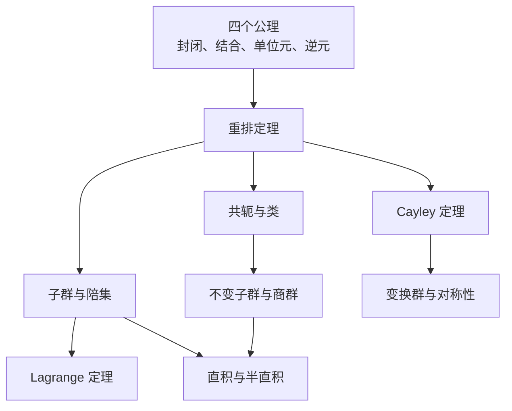

# 1.1 群

> [!abstract] 本节核心
> 群是什么？——不是"一堆元素的集合"，而是**操作 + 复合规则 + 四条公理**构成的代数系统。本节通过四个典型例子让抽象定义落地，并以重排定理作为全章的结构性基石。

---

## 一、群的定义

> [!note] 定义 1.1（群）
> 设 $G$ 是一些元素（操作）的集合，$G = \{\cdots, g, \cdots\}$，在 $G$ 中定义了乘法运算。如果满足以下四个条件，则称 $G$ 为一个**群**：
>
> 1. **封闭性**：$\forall f, g \in G$，$fg \in G$
> 2. **结合律**：$\forall f, g, h \in G$，$(fg)h = f(gh)$
> 3. **单位元**：$\exists! \, e \in G$，使得 $\forall f \in G$，$ef = fe = f$
> 4. **逆元**：$\forall f \in G$，$\exists! \, f^{-1} \in G$，使得 $f^{-1}f = ff^{-1} = e$

> [!warning] "乘法"≠ 数乘
> 这里的"乘法"是**操作的复合**（先做右边，再做左边），不是数的相乘。这个区别在例 1.4 中会看到：整数在加法下构成群，但在数乘下不构成群（0 没有逆元）。

### 四条公理的物理直觉

| 公理 | 物理含义 |
|------|---------|
| 封闭性 | 连续做两个对称操作，结果仍然是一个对称操作 |
| 结合律 | 三个操作连续做，先绑前两个还是后两个效果一样（但注意：交换律不要求！） |
| 单位元 | 存在一个"什么都不做"的操作 |
| 逆元 | 每个操作都可以被"撤销" |

**为什么要这四条？** 因为物理中的"对称操作"天然满足这些条件。转一个角度再转一个角度，还是在对称操作集合里（封闭）；操作的复合天然满足结合律；不动就是单位元；每个操作都可以逆过来做。群论就是把这些直觉公理化了。

---

## 二、四个典型例子

教材的四个例子有层次递进的设计意图：从最抽象的代数结构 → 离散排列 → 几何操作 → 数的运算。

### 例 1.1 空间反演群 $C_i = \{E, I\}$

最简单的非平庸群，只有两个元素：

- $E$：恒等操作，$\vec{r} \to \vec{r}$
- $I$：空间反演，$\vec{r} \to -\vec{r}$

乘法表：

| | $E$ | $I$ |
|---|---|---|
| $E$ | $E$ | $I$ |
| $I$ | $I$ | $E$ |

$I \cdot I = E$：反演两次回到原状态。

> [!important] 物理意义
> $C_i$ 描述的是**空间反演对称性**（宇称）。如果系统的哈密顿量满足 $\hat{H}(-\vec{r}) = \hat{H}(\vec{r})$，则系统具有 $C_i$ 对称性。这将决定波函数的宇称（奇偶性），是第四章选择定则中宇称互补规则的来源。

### 例 1.2 $n$ 阶置换群 $S_n$

把 $1, 2, \cdots, n$ 一对一地重新排列到自身上的操作集合，共有 $n!$ 个元素。

置换的记号：

$$P = \begin{pmatrix} 1 & 2 & \cdots & n \\ m_1 & m_2 & \cdots & m_n \end{pmatrix}$$

上面是原编号，下面是映射后的结果。

> [!tip] 乘法规则
> $P_1 P_2$ 表示**先做 $P_2$，再做 $P_1$**（从右往左）。这是操作复合的自然顺序。
>
> 例子：若 $P_3$ 把 1 变为 2，$P_2$ 把 2 变为 3，$P_1$ 把 3 变为 4，则 $(P_1 P_2) P_3$ 和 $P_1 (P_2 P_3)$ 都把 1 变为 4——结合律成立。

逆元就是"倒过来"：

$$\begin{pmatrix} 1 & 2 & \cdots & n \\ m_1 & m_2 & \cdots & m_n \end{pmatrix}^{-1} = \begin{pmatrix} m_1 & m_2 & \cdots & m_n \\ 1 & 2 & \cdots & n \end{pmatrix}$$

> [!important] 物理意义
> 置换群在**全同粒子体系**中至关重要。交换两个全同粒子，系统状态不变（至多差一个相位）。$S_n$ 的不可约表示直接决定了多粒子量子态的分类：玻色子对应对称表示（恒等表示），费米子对应反对称表示（一维符号表示）。

### 例 1.3 $D_3$ 群：正三角形的纯转动对称

三维空间中正三角形（顶点 $A, B, C$）的六个纯转动操作：

| 操作 | 描述 |
|------|------|
| $e$ | 不动（恒等操作） |
| $d$ | 绕 $z$ 轴（过三角形中心、垂直于平面）转 $2\pi/3$ |
| $f$ | 绕 $z$ 轴转 $4\pi/3$（即 $d^2$） |
| $a$ | 绕通过顶点 $A$ 和边 $BC$ 中点的轴（记为 1 轴）转 $\pi$ |
| $b$ | 绕 2 轴转 $\pi$ |
| $c$ | 绕 3 轴转 $\pi$ |

> [!note] 与 $S_3$ 的对应
> 这六个操作本质上就是把 $(A, B, C)$ 重新排列，与三阶置换群 $S_3$ 的六个元素一一对应。因此 $D_3 \cong S_3$（同构）。

#### 乘法表的推导

通过置换对应关系可以推导乘法。比如 $d$ 把 $(A, B, C) \to (B, C, A)$，$a$ 把 $(A, B, C) \to (A, C, B)$：

$$d \cdot a = \begin{pmatrix} A & B & C \\ B & C & A \end{pmatrix} \begin{pmatrix} A & B & C \\ A & C & B \end{pmatrix} = \begin{pmatrix} A & B & C \\ B & A & C \end{pmatrix} = c$$

完整的乘法表：

| | $e$ | $d$ | $f$ | $a$ | $b$ | $c$ |
|---|---|---|---|---|---|---|
| $e$ | $e$ | $d$ | $f$ | $a$ | $b$ | $c$ |
| $d$ | $d$ | $f$ | $e$ | $c$ | $a$ | $b$ |
| $f$ | $f$ | $e$ | $d$ | $b$ | $c$ | $a$ |
| $a$ | $a$ | $b$ | $c$ | $e$ | $d$ | $f$ |
| $b$ | $b$ | $c$ | $a$ | $f$ | $e$ | $d$ |
| $c$ | $c$ | $a$ | $b$ | $d$ | $f$ | $e$ |

> [!warning] 非 Abel 群
> 注意 $d \cdot a = c$ 但 $a \cdot d = b$，所以 $da \neq ad$。$D_3$ **不是 Abel 群**。物理上这意味着：**两个对称操作的先后顺序不可随意交换**。先绕 $z$ 轴转 $120^\circ$ 再绕 1 轴转 $180^\circ$，和先绕 1 轴转 $180^\circ$ 再绕 $z$ 轴转 $120^\circ$，结果不同。

### 例 1.4 数的加法群

- 整数 $\mathbb{Z}$ 在加法下构成群：单位元是 0，$n$ 的逆是 $-n$
- 实数 $\mathbb{R}$、复数 $\mathbb{C}$ 同样在加法下构成群

> [!warning] 数乘不构成群
> 如果把"乘法"改成数乘，就不构成群了。因为单位元只能是 1，而 0 没有逆元（不存在 $0^{-1}$ 使得 $0 \times 0^{-1} = 1$）。
>
> **教训**：同一个集合，定义不同的"乘法"，得到的代数结构可以完全不同。物理中我们关心的是操作的复合，不是数的相乘。

---

## 三、群的阶与 Abel 群

> [!note] 定义 1.2（群的阶）
> 群内元素的个数称为群的**阶**，记为 $|G|$。阶有限的群称为**有限群**，否则称为**无限群**。
>
> 本书主要讨论有限群。

> [!note] 定义 1.3（Abel 群）
> 若 $\forall a, b \in G$，$ab = ba$，则称 $G$ 为 **Abel 群**（交换群）。
>
> Abel 群的乘法表关于对角线对称。

**哪些是 Abel 群？** $C_i$（二阶群必 Abel）、$S_2$、数的加法群、循环群。

**哪些不是？** $D_3 \cong S_3$、$S_n (n \geq 3)$。物理中的非 Abel 群远比 Abel 群丰富。

> [!tip] 物理中的有限群与无限群
> 分子对称性（$C_{2v}$、$D_{\infty h}$ 等）大多涉及有限群。三维纯转动群 $SO(3)$ 是无限群。晶体对称性涉及空间群（无限群，但平移部分是离散的）。

---

## 四、重排定理：群论大厦的第一块基石

> [!important] 定理 1.1（重排定理）
> 设 $G = \{g_\alpha\}$，$\forall u \in G$，当 $g_\alpha$ 取遍 $G$ 中所有元素时，$ug_\alpha$ 给出 $G$ 中所有元素，且每个元素**恰好给出一次**。

### 证明

**存在性**：对任意 $g_\beta \in G$，取 $g_\alpha = u^{-1}g_\beta \in G$（逆元存在且唯一），则 $ug_\alpha = u(u^{-1}g_\beta) = g_\beta$。所以 $G$ 中任何元素都能被 $ug_\alpha$ 给出。

**唯一性**：假设 $ug_\alpha = ug_{\alpha'}$，两边左乘 $u^{-1}$ 得 $g_\alpha = g_{\alpha'}$。所以不会重复。$\square$

### 物理直觉

想象 $n$ 个全同粒子排成一排，用一个对称操作 $u$（比如循环平移）作用上去。每个粒子都移到了新的位置，没有两个粒子挤到同一个位置，也没有位置空出来。**重排定理说的就是这个事：对称操作不会"制造"或"消灭"任何状态。**

### 重排定理的重要性

这个定理的证明很简洁，但它是后续几乎所有重要结论的共同源头：

- **陪集定理**（两个陪集要么相同要么不相交）→ 陪集分解 → Lagrange 定理
- **共轭类的性质**（类中元素个数整除群的阶）
- **Cayley 定理**（每个群都同构于某个置换群的子群）
- **商群的构造**

> [!quote]
> 重排定理是群论的"第一性原理"之一。它只用了群的四个公理，却蕴含了整个群结构理论的种子。

---

## 五、1.1 节在整体框架中的位置

本节建立的是群论的"宪法"。四个公理看起来简单，但它们蕴含了后续所有结构：

从下一节（1.2 子群与陪集）开始，我们就会看到这些公理如何一层层地揭示群的结构。
