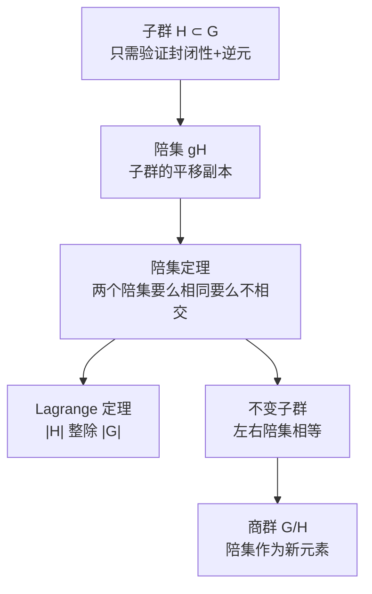

# 1.2 子群与陪集

> [!abstract] 本节核心
> 从研究群本身转向研究群的**内部结构**。以子群为工具，通过陪集分解把群无重叠地切割，引出 Lagrange 定理；进而讨论不变子群与商群，实现群的"粗粒化"。

---

## 一、子群：群中的子结构

> [!note] 定义 1.4（子群）
> 设 $H$ 是群 $G$ 的一个子集，若对群 $G$ 的乘法运算，$H$ 也构成一个群，则称 $H$ 为 $G$ 的**子群**。

### 证明子群的简化

原则上需要验证四个条件，但因为 $H \subseteq G$，**结合律自然继承**。而且如果逆元条件满足（$f \in H \Rightarrow f^{-1} \in H$），封闭性又保证 $f f^{-1} = e \in H$，所以**单位元自动存在**。

> [!tip] 结论
> 证明子群只需验证**两个条件**：**封闭性** + **逆元存在**。

### 平庸子群 vs. 固有子群

- $\{e\}$ 和 $G$ 本身一定是 $G$ 的子群，叫**平庸子群**（显然子群）
- 非平庸的子群叫**固有子群**，这是我们真正关心的

### 三个典型例子

**例 1.5 循环群**：由 $\{a, a^2, \cdots, a^{n-1}, a^n = e\}$ 组成，是 Abel 群。以 6 阶循环群 $G = \{a, a^2, a^3, a^4, a^5, e\}$ 为例：

- 平庸子群：$\{e\}$，$G$
- 固有子群：$\{e, a^2, a^4\}$（3 阶），$\{e, a^3\}$（2 阶）

> [!tip] 规律
> 6 的因子是 1, 2, 3, 6——子群的阶恰好都是 6 的因子。这不是巧合，后面 Lagrange 定理会解释。

**例 1.6**：整数加法群 $\mathbb{Z}$ 是实数加法群 $\mathbb{R}$ 的子群。

**例 1.7**：绕固定轴 $k$ 的转动群 $\{C_k(\Psi)\}$ 是 $SO(3)$（绕过某一点的所有轴的三维转动）的子群。

> [!important] 物理意义
> 子群对应的是**对称性的降低**。$SO(3)$ 是球对称（最高对称性），绕固定轴转动是轴对称（较低对称性）。物理上加一个外场（比如电场沿 $z$ 轴），对称性就从 $SO(3)$ 降到 $SO(2)$（绕 $z$ 轴的转动群）。子群关系 $SO(2) \subset SO(3)$ 正是这个对称性降低的数学表达。

---

## 二、群元的阶与循环子群

> [!note] 定义 1.5（群元的阶）
> 对有限群 $G$ 中元素 $a$，满足 $a^k = e$ 的最小正整数 $k$ 称为 $a$ 的**阶**。
>
> 由 $a$ 生成的循环子群 $Z_k = \{a, a^2, \cdots, a^{k-1}, a^k = e\}$ 的阶就是 $k$。

### 为什么有限群中一定存在循环子群？

这个论证很精巧，教材原文逐层展开：

- 若 $a = e$，则 $Z_1 = \{e\}$，成立
- 若 $a \neq e$，则 $a^2 \neq a$（否则 $a = e$）
- 若 $a^2 = e$，则 $Z_2 = \{e, a\}$，成立
- 若 $a^2 \neq e$，则 $a^2$ 是第三个不同元素
- 继续做 $a^3$：它不等于 $a^2$（否则 $a = e$），不等于 $a$（否则 $a^2 = e$）
- 以此类推……

> [!tip] 核心逻辑
> 因为 $G$ 只有 $n$ 个元素，所以最多 $n$ 步必然有 $a^k = e$。**有限性保证了这个过程一定终止。**
>
> 无限群中不一定有有限阶的元素（比如整数加法群中，除 0 以外所有元素的阶都是无限的）。

### 例 1.8 $D_3$ 群中各元素的阶

| 元素 | 幂次序列 | 阶 | 循环子群 |
|------|---------|-----|---------|
| $d$ | $d^2 = f, \; d^3 = e$ | 3 | $\{e, d, f\}$ |
| $f$ | $f^2 = d, \; f^3 = e$ | 3 | $\{e, d, f\}$ |
| $a$ | $a^2 = e$ | 2 | $\{e, a\}$ |
| $b$ | $b^2 = e$ | 2 | $\{e, b\}$ |
| $c$ | $c^2 = e$ | 2 | $\{e, c\}$ |

> [!tip] $d$ 和 $f$ 生成同一个 3 阶子群
> 因为 $f = d^{-1} = d^2$，互逆的元素生成同一个循环群。这不是巧合，而是一般规律：$a$ 和 $a^{-1}$ 总是生成相同的循环子群。

---

## 三、陪集：用子群铺满整个群

> [!note] 定义 1.6（陪集）
> 设 $H$ 是群 $G$ 的子群，$H = \{h_\alpha\}$，由固定的 $g \in G$ 可生成：
> - **左陪集**：$gH = \{gh_\alpha \mid h_\alpha \in H\}$
> - **右陪集**：$Hg = \{h_\alpha g \mid h_\alpha \in H\}$

### 两个要点

**第一**，陪集的元素个数等于子群的阶。因为 $gh_\alpha = gh_{\alpha'} \Rightarrow h_\alpha = h_{\alpha'}$（左乘 $g^{-1}$），所以子群中不同元素给出陪集中不同元素，一一对应。

**第二**，当 $g \in H$ 时，$gH = H$（陪集就是子群本身）。当 $g \notin H$ 时，$gH \neq H$。

> [!warning] 陪集不一定是子群
> 陪集 $gH$ 只有在 $g \in H$ 时才等于 $H$（从而是子群）。一般情况下，$gH$ 不包含单位元，所以不是子群。陪集只是一个"平移后的副本"。

---

## 四、陪集定理：群可以无重叠地切割

> [!important] 定理 1.2（陪集定理）
> 设 $H$ 是群 $G$ 的子群，则 $H$ 的两个左（或右）陪集**要么完全相同，要么没有任何公共元素**。

### 证明

用反证法。设 $uH$ 与 $vH$ 是不同的陪集，但有一个公共元素 $uh_\alpha = vh_\beta$。

则 $v^{-1}u h_\alpha = h_\beta$，即 $v^{-1}u = h_\beta h_\alpha^{-1} \in H$。

由重排定理，$v^{-1}uH = H$。两边左乘 $v$：$uH = vH$。矛盾！$\square$

> [!tip] 重排定理的第一次实战
> 证明的关键一步是"由 $v^{-1}u \in H$ 得到 $v^{-1}uH = H$"，这直接用了重排定理。重排定理说：用 $v^{-1}u$ 左乘 $H$ 的所有元素，恰好给出 $H$ 的所有元素各一次。而 $v^{-1}u \in H$，所以 $v^{-1}u \cdot H$ 就是 $H$ 中每个元素都被 $H$ 中某个元素左乘了一次，结果还是 $H$。

### 物理直觉

想象你有一副扑克牌（群 $G$），取出其中 4 张（子群 $H$）。用某个固定的"洗牌操作" $g$ 去作用这 4 张牌，得到 4 张新的牌（陪集 $gH$）。陪集定理说的是：**无论你用什么操作，得到的这 4 张新牌要么和原来那 4 张完全一样，要么和原来那 4 张完全没有重叠**。不存在"部分重叠"的情况。

---

## 五、Lagrange 定理：子群的阶必整除群的阶

有了陪集定理，Lagrange 定理是自然推论。

陪集定理告诉我们：不同陪集之间没有交集。而每个陪集的元素个数都等于子群的阶 $m$。所以我们可以用子群和它的不同陪集把群 $G$ **无重叠地铺满**：

$$G = H \cup u_1 H \cup u_2 H \cup \cdots$$

每个部分有 $m$ 个元素，设共有 $r$ 个不同的陪集，则：

$$|G| = r \cdot m$$

> [!important] 定理 1.3（Lagrange 定理）
> 有限群子群的阶，必为群的阶的因子。

### 用 $D_3$ 群验证

$|D_3| = 6$，6 的因子是 1, 2, 3, 6。

$D_3$ 的所有子群：

| 子群 | 阶 | 是否为 6 的因子 |
|------|-----|---------------|
| $\{e\}$ | 1 | ✓ |
| $\{e, a\}$ | 2 | ✓ |
| $\{e, b\}$ | 2 | ✓ |
| $\{e, c\}$ | 2 | ✓ |
| $\{e, d, f\}$ | 3 | ✓ |
| $G$ | 6 | ✓ |

用 $\{e, d, f\}$（3 阶子群）做陪集分解：

$$D_3 = \underbrace{\{e, d, f\}}_{H} \cup \underbrace{a\{e, d, f\} = \{a, b, c\}}_{aH}$$

恰好分成 2 个陪集，$6 = 2 \times 3$。

> [!important] Lagrange 定理的物理意义
> 这个定理给群的结构加了一个**很强的约束**。你不可能在 6 阶群中找到一个 4 阶子群。物理上，对称性降低的方式是受限的：你不能从 $SO(3)$（球对称）随意降到某个中间对称性，只能降到那些阶数整除对应有限子群阶数的子群。

---

## 六、不变子群与商群：群的粗粒化

### 不变子群（正规子群）

> [!note] 定义 1.10（不变子群）
> 设 $H$ 是 $G$ 的子群，如果 $H$ 中所有元素的同类元素都属于 $H$，则称 $H$ 是 $G$ 的**不变子群**（正规子群）。

不变子群是一种"闭合"的子群：你拿 $H$ 中任何一个元素做共轭操作（$gfg^{-1}$），结果不会跑出 $H$。

> [!tip] Abel 群的所有子群都是不变子群
> 因为 Abel 群中每个元素自成一类，$gfg^{-1} = f \in H$，自然满足不变子群条件。

### 定理 1.5：不变子群的共轭封闭性

> [!important] 定理 1.5
> 设 $H$ 是 $G$ 的不变子群，则对任意固定的 $f \in G$，当 $h_\alpha$ 取遍 $H$ 中所有元素时，$f h_\alpha f^{-1}$ 给出且**仅仅一次**给出 $H$ 中所有元素。

**证明**：
- **存在性**：对任意 $h_\beta \in H$，取 $h_\alpha = f^{-1} h_\beta f$。因为 $H$ 是不变子群，$h_\alpha \in H$，且 $f h_\alpha f^{-1} = h_\beta$。
- **唯一性**：若 $f h_\alpha f^{-1} = f h_\beta f^{-1}$，则 $h_\alpha = h_\beta$。$\square$

> [!tip] 直觉
> 定理 1.5 说的是：用 $f$ 对 $H$ 做共轭操作，结果就是把 $H$ 中的元素**重新排列了一遍**。没有元素跑出 $H$，也没有元素重合。这本质上就是重排定理在不变子群上的体现。

### 定理 1.6：不变子群的左右陪集相等

> [!important] 定理 1.6
> 若 $H$ 是 $G$ 的不变子群，$\forall f \in G$，有 $fH = Hf$。

**证明**：由定理 1.5，$f H f^{-1} = H$，右乘 $f$ 得 $fH = Hf$。$\square$

这意味着对不变子群，**不需要区分左右陪集**，直接说"陪集"就行。

### 商群：把陪集当成新元素

> [!note] 定义 1.11（商群）
> 设 $H$ 是 $G$ 的不变子群，将 $G$ 分解为陪集 $G = \{g_0 H, g_1 H, g_2 H, \cdots\}$，把每个陪集看成一个新元素，定义乘法：
> $$g_i H \cdot g_j H = g_i g_j H$$
> 这样得到的群称为 $G$ 对 $H$ 的**商群**，记为 $G/H$。

> [!important] 为什么需要不变子群？
> 商群的乘法定义为 $(g_i H)(g_j H) = (g_i g_j) H$。这个定义要**良定**（well-defined），即不能依赖于代表元 $g_i, g_j$ 的选取。如果 $H$ 不是不变子群，左陪集和右陪集不同，这个乘法就可能产生矛盾。不变子群保证了 $gH = Hg$，使得乘法定义没有歧义。

### 物理直觉：商群是一种粗粒化

想象你有一张高分辨率照片（群 $G$），你把每个 $m \times m$ 的像素块（子群 $H$ 及其陪集）压缩成一个像素（商群元素）。商群 $G/H$ 就是压缩后的低分辨率照片。你丢失了每个块内部的细节，但保留了块与块之间的结构关系。

物理上，当你只关心系统在某个对称性下的"宏观行为"而不关心"微观细节"时，商群就是合适的数学工具。

### 例 1.10 $D_3$ 群的商群

$D_3$ 的不变子群有：$\{e\}$、$G$、$\{e, d, f\}$（记为 $H$）。

用 $H$ 做陪集分解：

$$D_3 = \underbrace{\{e, d, f\}}_{H} \cup \underbrace{\{a, b, c\}}_{aH}$$

商群 $G/H$ 有两个元素：$f_0 \leftrightarrow H$，$f_1 \leftrightarrow aH$。

乘法：$f_0 f_0 = f_0$，$f_0 f_1 = f_1$，$f_1 f_1 = f_0$（因为 $a^2 = e \in H$）。

所以 $G/H$ 是一个**二阶循环群**。

---

## 七、1.2 节的核心逻辑链

这条链是群论结构理论的第一条主线。1.3 节（类与不变子群）会从另一个角度（共轭关系）继续剖析群的结构。
