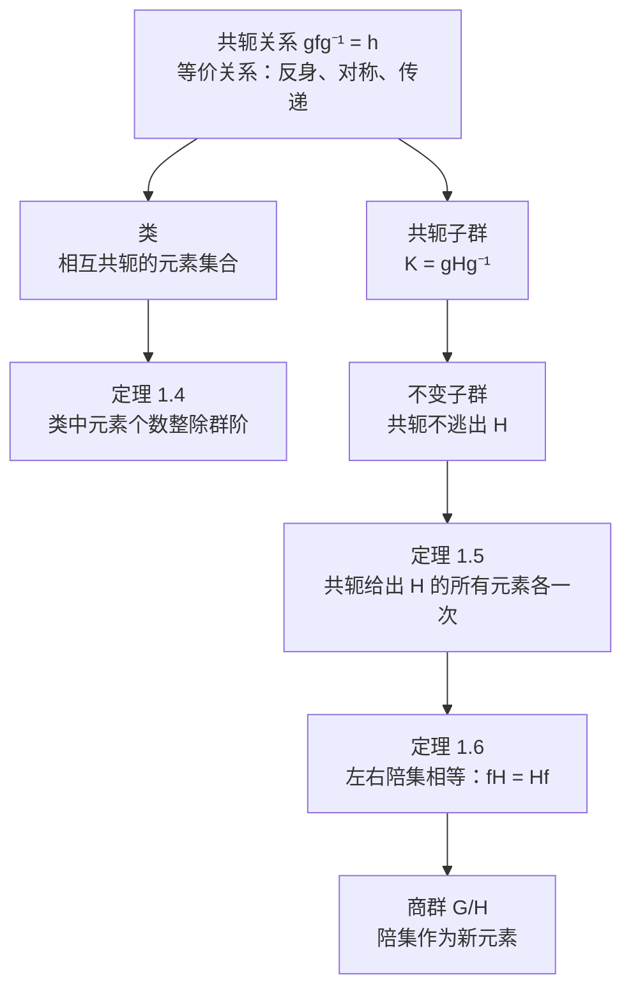

# 1.3 类与不变子群

> [!abstract] 本节核心
> 1.2 节从"子群"角度剖分群，本节从"共轭"角度剖分群。共轭是一种等价关系，由此引出类的概念；当子群在共轭下闭合时得到不变子群，不变子群的陪集可以构成商群——这是群论结构理论的第二条主线。

---

## 一、共轭：群元素之间的"相似性"

> [!note] 定义 1.7（共轭）
> 对群 $G$ 中两个元素 $f, h$，如果在 $G$ 中存在一个 $g$，使得 $gfg^{-1} = h$，则称 $f$ 与 $h$ **共轭**，记为 $f \sim h$。

### 共轭是等价关系

共轭满足等价关系的三个性质：

- **反身性**：$f = e f e^{-1}$，所以 $f \sim f$
- **对称性**：若 $gfg^{-1} = h$，则 $g^{-1}hg = f$，所以 $h \sim f$
- **传递性**：若 $g f_1 g^{-1} = f_2$ 且 $h f_2 h^{-1} = f_3$，则 $(hg) f_1 (hg)^{-1} = f_3$，所以 $f_1 \sim f_3$

> [!tip] 物理直觉
> 共轭的物理含义是"同一个操作在不同坐标系下的表达"。比如绕 $x$ 轴转 $90^\circ$ 和绕 $y$ 轴转 $90^\circ$，它们在几何上"类型相同"（都是 $90^\circ$ 转动），只是取向不同。存在一个坐标变换 $g$，使得 $g R_x g^{-1} = R_y$。共轭就是"本质上一样的操作"。

---

## 二、类：群的自然分类

> [!note] 定义 1.8（类）
> 群 $G$ 中所有相互共轭的元素形成的集合，称为群 $G$ 的一个**类**。

由于共轭是等价关系，类就是对群的一种**无重叠的分类**。每个元素恰好属于一个类。

### 关于类的三个重要结论

**（1）单位元自成一类**

对任意 $f \in G$，$f e f^{-1} = e$。所以 $e$ 只和自身共轭，$\{e\}$ 单独构成一个类。

**（2）Abel 群的每个元素自成一类**

对任意 $f \in G$ 和任意 $h \in G$，$hfh^{-1} = hh^{-1}f = f$。所以每个元素只和自身共轭，每个类只有一个元素。

> [!important] 推论
> Abel 群的类结构是"最无聊"的——每个元素各自一类。这也意味着 Abel 群没有非平庸的不变子群（见后面），商群很平凡。**非 Abel 群的类结构才丰富，这才是物理中真正有内容的部分。**

**（3）同类的元素有相同的阶**

设 $f$ 的阶为 $m$（$f^m = e$），$h = gfg^{-1}$，则：

$$h^k = (gfg^{-1})^k = gf^k g^{-1}$$

- 当 $k < m$ 时，$f^k \neq e$，所以 $h^k \neq e$
- 当 $k = m$ 时，$h^m = geg^{-1} = e$

所以 $h$ 的阶也是 $m$。

> [!tip] 直觉
> "本质相同的操作"持续做同样的次数后回到原状态，这很自然。

---

## 三、类中元素个数整除群阶

> [!important] 定理 1.4
> 有限群的每个类中元素的个数都是群阶的因子。

### 证明思路（三步）

这个证明很精巧，核心是构造一个"桥梁"子群。

**第一步**：证明所有与 $g$ 互易（即 $gh = hg$）的元素 $h$ 构成 $G$ 的一个子群，记为 $H_g$。

- **封闭性**：$h_1 g = g h_1, \; h_2 g = g h_2 \Rightarrow h_1 h_2 g = h_1 g h_2 = g h_1 h_2$
- **逆元**：$h g = g h \Rightarrow h^{-1} g = g h^{-1}$（两边同时左乘和右乘 $h^{-1}$ 可验证）

**第二步**：对 $G$ 按 $H_g$ 做陪集分解 $G = \{g_0 H_g, g_1 H_g, g_2 H_g, \cdots\}$。

证明每个陪集 $g_i H_g$ 在共轭操作 $g_i h_\alpha g (g_i h_\alpha)^{-1}$ 下给出**同一个**类中元素 $g_i g g_i^{-1}$，且不同陪集给出不同的类中元素。

- **同一陪集给出同一元素**：对陪集中任意元素 $g_i h_\alpha$，$g_i h_\alpha g (g_i h_\alpha)^{-1} = g_i h_\alpha g h_\alpha^{-1} g_i^{-1} = g_i g g_i^{-1}$（因为 $h_\alpha$ 与 $g$ 互易）
- **不同陪集给出不同元素**：反证法，利用重排定理（与陪集定理的证明类似）

**第三步**：由 Lagrange 定理，陪集个数为 $|G| / |H_g|$，所以类中元素个数为 $|G| / |H_g|$，是群阶的因子。$\square$

> [!tip] 与 Lagrange 定理的呼应
> 这个证明和 Lagrange 定理用的是同一套工具（陪集分解），但多了一层：不是直接分解，而是先找一个"中心化子" $H_g$，再通过它把类和陪集联系起来。

---

## 四、不变子群：类与子群的交汇点

### 从子群的共轭类比引出不变子群

共轭概念可以从元素推广到子群。

> [!note] 定义 1.9（共轭子群）
> 设 $H$ 和 $K$ 是群 $G$ 的两个子群，若存在 $g \in G$，使得 $K = gHg^{-1} = \{ghg^{-1} \mid h \in H\}$，则称 $H$ 和 $K$ 是**共轭子群**。

> [!tip] 例 1.13
> $D_3$ 群的三个子群 $\{e, a\}, \{e, b\}, \{e, c\}$ 相互共轭。比如 $\{e, c\} = f\{e, a\}f^{-1}$。同一个群的两个共轭子群一定同构。

现在引出本节最重要的概念：

> [!note] 定义 1.10（不变子群）
> 设 $H$ 是 $G$ 的子群，如果 $H$ 中所有元素的同类元素都属于 $H$，则称 $H$ 是 $G$ 的**不变子群**（正规子群）。

用数学语言说：$\forall h \in H, \forall g \in G$，有 $ghg^{-1} \in H$。

不变子群是一种"闭合"的子群：**共轭操作不会把 $H$ 中的元素搬到 $H$ 外面去**。

> [!tip] Abel 群的所有子群都是不变子群
> 因为 Abel 群中 $ghg^{-1} = h \in H$，自然满足不变子群条件。

### 定理 1.5：不变子群的共轭封闭性

> [!important] 定理 1.5
> 设 $H$ 是 $G$ 的不变子群，则对任意固定的 $f \in G$，当 $h_\alpha$ 取遍 $H$ 中所有元素时，$f h_\alpha f^{-1}$ 给出且**仅仅一次**给出 $H$ 中所有元素。

**证明**：
- **存在性**：对任意 $h_\beta \in H$，取 $h_\alpha = f^{-1} h_\beta f$。因为 $H$ 是不变子群，$h_\alpha \in H$，且 $f h_\alpha f^{-1} = h_\beta$。
- **唯一性**：若 $f h_\alpha f^{-1} = f h_\beta f^{-1}$，则 $h_\alpha = h_\beta$。$\square$

> [!tip] 直觉
> 这个定理说的是：用 $f$ 对 $H$ 做共轭操作，结果就是把 $H$ 中的元素**重新排列了一遍**。没有元素跑出 $H$，也没有元素重合。本质上就是重排定理在不变子群上的体现。

### 定理 1.6：不变子群的左右陪集相等

> [!important] 定理 1.6
> 若 $H$ 是 $G$ 的不变子群，$\forall f \in G$，有 $fH = Hf$。

**证明**：由定理 1.5，$f H f^{-1} = H$，右乘 $f$ 得 $fH = Hf$。$\square$

这意味着对不变子群，**不需要区分左右陪集**。

---

## 五、商群：不变子群的价值所在

> [!note] 定义 1.11（商群）
> 设 $H$ 是 $G$ 的不变子群，将 $G$ 分解为陪集 $G = \{g_0 H, g_1 H, g_2 H, \cdots\}$，把每个陪集看成一个新元素，定义乘法：
> $$g_i H \cdot g_j H = g_i g_j H$$
> 这样得到的群称为 $G$ 对 $H$ 的**商群**，记为 $G/H$。

> [!important] 为什么需要不变子群？
> 商群的乘法定义为 $(g_i H)(g_j H) = (g_i g_j) H$。这个定义要**良定**（well-defined），即不能依赖于代表元 $g_i, g_j$ 的选取。
>
> 假设 $g_i H = g_i' H$（即 $g_i' = g_i h_1$），那么需要 $(g_i' H)(g_j H) = (g_i g_j) H$。这要求 $g_i h_1 g_j H = g_i g_j H$，即 $h_1 g_j H = g_j H$，即 $g_j^{-1} h_1 g_j \in H$。这正是 $H$ 为不变子群的定义！
>
> 如果 $H$ 不是不变子群，这个乘法定义就可能有歧义，商群就不存在。

### 物理直觉：商群是一种粗粒化

想象你有一张高分辨率照片（群 $G$），你把每个 $m \times m$ 的像素块（陪集）压缩成一个像素（商群元素）。商群 $G/H$ 就是压缩后的低分辨率照片。你丢失了每个块内部的细节，但保留了块与块之间的结构关系。

物理上，当你只关心系统在某个对称性下的"宏观行为"而不关心"微观细节"时，商群就是合适的数学工具。

### 例 1.10 $D_3$ 群的商群

$D_3$ 的不变子群有：$\{e\}$、$G$、$\{e, d, f\}$（记为 $H$）。

用 $H$ 做陪集分解：

$$D_3 = \underbrace{\{e, d, f\}}_{H} \cup \underbrace{\{a, b, c\}}_{aH}$$

商群 $G/H$ 有两个元素：$f_0 \leftrightarrow H$，$f_1 \leftrightarrow aH$。

乘法：$f_0 f_0 = f_0$，$f_0 f_1 = f_1 f_0 = f_1$，$f_1 f_1 = f_0$（因为 $a^2 = e \in H$）。

所以 $G/H$ 是一个**二阶循环群** $Z_2$。

> [!tip] 验证
> 你也可以用 $D_3$ 的乘法表直接验证：把 $\{e, d, f\}$ 当成"0"，$\{a, b, c\}$ 当成"1"，乘法表的 $6 \times 6$ 结构确实可以粗粒化为 $2 \times 2$ 的结构。

---

## 六、陪集分解 vs 类分解：两种不同的"切群"方式

| | 陪集分解 | 类分解 |
|--|---------|--------|
| **切割工具** | 子群 $H$ | 共轭关系 |
| **每块大小** | 相等（都等于 $|H|$） | **不一定相等** |
| **每块结构** | 子群的平移副本 | 相互共轭的元素集合 |
| **约束** | Lagrange 定理：每块大小整除群阶 | 定理 1.4：每块大小整除群阶 |
| **块数** | $[G:H]$ | 类的个数 |

> [!important] 关键区别
> 陪集分解一定是**等分**的，但类分解**不一定等分**。比如 $D_3$ 群的类分解：
> - $\{e\}$：1 个元素
> - $\{d, f\}$：2 个元素
> - $\{a, b, c\}$：3 个元素
>
> 三块大小不相等，但都是 6 的因子。

---

## 七、1.3 节的核心逻辑链

这条链和 1.2 节的链（子群 → 陪集 → Lagrange 定理）是群论结构理论的两条主线，共同构成了后续表示论的物理基础。
