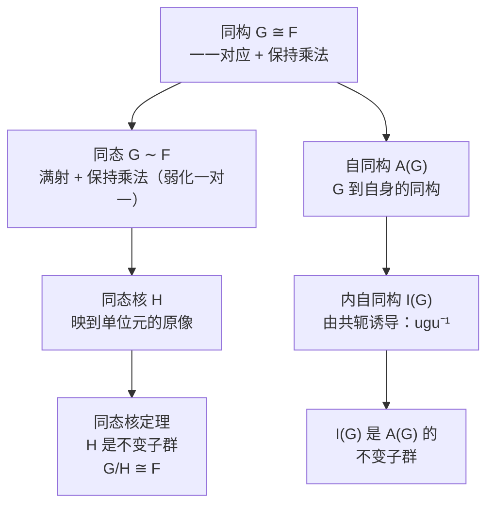

# 1.4 同构与同态

> [!abstract] 本节核心
> 从研究"群自身的结构"转向研究"群与群之间的关系"。同构是群间最强的相似性（结构完全相同），同态是弱化了一一对应的同态。同态核定理揭示了一个看似平淡的定义（保持乘法）内部蕴含的惊人结构。最后讨论自同构与内同构，把共轭（1.3节）和同态（1.4节）完美连接。

---

## 一、同构：群之间最强的相似性

> [!note] 定义 1.12（同构）
> 若从群 $G$ 到群 $F$ 上，存在一一对应的满映射 $\Phi$，且 $\forall g_i, g_j \in G$：
> $$\Phi(g_i g_j) = \Phi(g_i) \Phi(g_j)$$
> 则称群 $G$ 与群 $F$ **同构**，记作 $G \cong F$。映射 $\Phi$ 称为同构映射。

同构映射必然把单位元映到单位元，互逆元素映到互逆元素——否则乘法结构就破坏了。

### 三个典型例子

**例 1.11**：空间反演群 $\{E, I\}$ 与二阶循环群 $\{e, a\}$ 同构。

**例 1.12**：三阶置换群 $S_3$ 与 $D_3$ 群同构。

**例 1.13**：同一个群的两个共轭子群同构。比如 $D_3$ 群的 $\{e, a\}, \{e, b\}, \{e, c\}$ 相互共轭，也相互同构。

> [!tip] 同构的精髓
> 同构的群有**完全相同的数学结构**，但具体可指代不同内容。教材给了一个精彩的类比：
>
> $2 + 3 = 5$，计算的可能是糖，可能是钱，也可能是论文引用数、同行的支持。
>
> 载体不同，但加法结构完全一样。这就是同构的本质：**结构相同，载体无关。**

---

## 二、同态：弱化一对一的要求

同构是群之间最强的相似性。如果把"一一对应"这个限制弱化，就得到同态。

> [!note] 定义 1.13（同态）
> 设存在从群 $G$ 到群 $F$ 的满映射 $\Phi$，且 $\forall g_i, g_j \in G$：
> $$\Phi(g_i g_j) = \Phi(g_i) \Phi(g_j)$$
> 则称群 $G$ 与群 $F$ **同态**，记作 $G \sim F$。映射 $\Phi$ 称为同态映射。

> [!warning] 同态 vs. 同构
> 同态不要求一一对应，所以**同态映射一般不可逆**。同构是"一对一的同态"。
>
> 同态允许"多对一"：$G$ 中多个元素可以映射到 $F$ 中同一个元素。

### 同态的图像理解

想象 $G$ 是一组人，$F$ 是一组角色。同态映射 $\Phi$ 给每个人分配一个角色，且保持"合作结构"：如果 $g_i$ 和 $g_j$ 合作得到 $g_k$，那么 $\Phi(g_i)$ 和 $\Phi(g_j)$ 合作也得到 $\Phi(g_k)$。但多个人可以扮演同一个角色。

---

## 三、同态核定理：同态定义蕴含的惊人结构

这是 1.4 节最核心的内容。同态的定义看起来就是"保持乘法"这么一句话，但它内部蕴含的结构极其丰富。

### 同态核

> [!note] 定义 1.14（同态核）
> 设 $G$ 与 $F$ 同态，$G$ 中与 $F$ 的单位元素对应的所有元素的集合称为**同态核**。
>
> 记为 $H = \{h \in G \mid \Phi(h) = f_0\}$，其中 $f_0$ 是 $F$ 的单位元。

### 定理 1.7（同态核定理）

> [!important] 定理 1.7（同态核定理）
> 设 $G$ 与 $F$ 同态，则有：
> 1. 同态核 $H$ 是 $G$ 的不变子群
> 2. 商群 $G/H$ 与 $F$ 同构

### 证明（三步）

**第一步：同态核是子群**

只需验证封闭性和逆元存在。

- **封闭性**：对 $h_\alpha, h_\beta \in H$，$\Phi(h_\alpha h_\beta) = \Phi(h_\alpha)\Phi(h_\beta) = f_0 f_0 = f_0$，所以 $h_\alpha h_\beta \in H$。
- **逆元**：对 $h_\alpha \in H$，设 $h_\alpha^{-1}$ 对应 $f_i$。一方面 $\Phi(h_\alpha h_\alpha^{-1}) = \Phi(e) = f_0$，另一方面 $\Phi(h_\alpha h_\alpha^{-1}) = \Phi(h_\alpha)\Phi(h_\alpha^{-1}) = f_0 f_i = f_i$。所以 $f_i = f_0$，即 $h_\alpha^{-1} \in H$。

**第二步：$H$ 是不变子群**

$\forall h_\alpha \in H, \forall g \in G$：

$$\Phi(g h_\alpha g^{-1}) = \Phi(g)\Phi(h_\alpha)\Phi(g^{-1}) = \Phi(g) f_0 \Phi(g^{-1}) = \Phi(g)\Phi(g^{-1}) = \Phi(e) = f_0$$

所以 $g h_\alpha g^{-1} \in H$，$H$ 是不变子群。

**第三步：$G/H$ 与 $F$ 同构**

需要建立陪集与 $F$ 中元素之间的一一对应。

- **对应关系**：$H$ 对应 $f_0$（由定义），$g_i H$ 对应 $\Phi(g_i) = f_i$（因为 $g_i H$ 中所有元素都映射到 $\Phi(g_i)$）。
- **一对一**：设 $g_i H \neq g_j H$ 但 $f_i = f_j$。则 $g_i^{-1} g_j h_\alpha$ 对应 $f_i^{-1} f_j f_0 = f_0$，所以 $g_i^{-1} g_j h_\alpha \in H$，进而 $g_i^{-1} g_j \in H$。由重排定理，$g_i H = g_j H$，矛盾！

所以 $G/H \cong F$。$\square$

### 同态核定理的五条信息

教材特别强调了这个定理的丰富内涵。如果单从同态定义出发，你可能会觉得：

1. 与 $f_0, f_1, f_2$ 对应的 $G$ 中小圈内元素的个数不一定相同
2. 每个小圈内的元素形成一个子集，但不知道它有什么结构

同态核定理告诉你：

> [!important] 同态核定理的五条结论
> 1. **每个小圈内元素个数相同**（都等于 $|H|$）
> 2. **与 $f_0$ 对应的小圈构成 $G$ 的一个子群**（同态核 $H$）
> 3. **这个子群是不变子群**
> 4. **其他圈对应的是 $H$ 的陪集**
> 5. **把这些圈当成新元素，形成的群与 $F$ 完全同构**

> [!tip] 直觉
> 同态核定理本质上说的是：**任何同态都"本质上"是商群映射**。你从 $G$ 到 $F$ 的同态，等价于先从 $G$ 构造商群 $G/H$，再从 $G/H$ 到 $F$ 做一个同构。同态 = 商映射 + 同构。

### 例 1.14 $D_3$ 群与 $Z_2$ 的同态

$D_3$ 群与二阶循环群 $Z_2$ 同态。映射关系：

$$\{e, d, f\} \to e, \quad \{a, b, c\} \to a$$

同态核是 $\{e, d, f\}$。商群 $D_3 / \{e, d, f\}$ 就是 $Z_2$。

> [!tip] 用乘法表验证
> 如果你看 $D_3$ 的 $6 \times 6$ 乘法表，会发现它可以粗粒化为以 $3 \times 3$ 为基本单元的 $2 \times 2$ 结构。这就是 $Z_2$ 的"超结构"。同态核定理保证：这种粗粒化不是巧合，而是普遍结构。

---

## 四、自同构与内同构：群对自身的映射

现在把目光从"群与群之间"收回到"群与自身"。

> [!note] 定义 1.15（自同构映射）
> 群 $G$ 到自身的同构映射，称为**自同构映射**，记为 $\nu$。满足 $\forall g_\alpha \in G$：
> $$\nu(g_\alpha g_\beta) = \nu(g_\alpha) \nu(g_\beta)$$

自同构映射把单位元映到单位元，互逆元素映到互逆元素。

> [!note] 定义 1.16（自同构群）
> 群 $G$ 的所有自同构映射放在一起，定义乘法 $\nu_1 \nu_2$ 为先做 $\nu_2$ 再做 $\nu_1$，形成一个群，称为 $G$ 的**自同构群**，记为 $A(G)$。

### 内自同构：由共轭诱导的自同构

> [!note] 定义 1.17（内自同构映射）
> 在群 $G$ 中取一个元素 $u$，用它对 $G$ 中任意元素 $g$ 做 $u g u^{-1}$。因为：
> $$u g_i g_j u^{-1} = u g_i u^{-1} u g_j u^{-1}$$
> 所以这是一个自同构映射，称为**内自同构映射**。所有内自同构映射构成的群称为**内自同构群**，记为 $I(G)$。

> [!tip] 与 1.3 节的连接
> 内自同构映射就是 1.3 节的**共轭操作**！共轭 $gfg^{-1}$ 既是一种等价关系（定义 1.7），又是一种自同构映射（定义 1.17）。这是 1.3 节和 1.4 节之间的桥梁。

> [!warning] 不同 $u$ 可能对应同一个内自同构映射
> 取不同 $u$，可能得到相同的映射。比如 Abel 群中，不管 $u$ 取什么，$u g u^{-1} = g$，都是恒等映射。

### 核心定理：内自同构群是自同构群的不变子群

> [!important] 定理
> $I(G)$ 是 $A(G)$ 的不变子群。

**证明**：

先证 $I(G)$ 是 $A(G)$ 的子群：
- **封闭性**：$\nu_1(g) = f g f^{-1}$，$\nu_2(g) = h g h^{-1}$，则 $(\nu_1 \nu_2)(g) = f h g h^{-1} f^{-1} = (fh) g (fh)^{-1}$，仍是内自同构。
- **逆元**：$\nu_1$ 的逆就是 $f^{-1}$ 对应的内自同构。

再证 $I(G)$ 是 $A(G)$ 的不变子群（这是证明的精华）：

要证：$\mu \in I(G)$，$\nu \in A(G)$ 时，$\nu \mu \nu^{-1} \in I(G)$。

设 $\mu(g_\beta) = u g_\beta u^{-1}$（$u$ 是 $G$ 中固定元素）。$\nu^{-1}$ 把 $g_\alpha$ 映为 $g_\beta$，$\nu$ 把 $g_\beta$ 映回 $g_\alpha$。

$$(\nu \mu \nu^{-1})(g_\alpha) = \nu(\mu(g_\beta)) = \nu(u g_\beta u^{-1}) = \nu(u) \nu(g_\beta) \nu(u^{-1}) = \nu(u) g_\alpha \nu(u)^{-1}$$

其中 $\nu(u)$ 是 $G$ 中一个固定元素。所以 $\nu \mu \nu^{-1}$ 是内自同构映射。$\square$

> [!tip] 直觉
> 这个证明的关键是：自同构 $\nu$ 把"用 $u$ 做共轭"变成了"用 $\nu(u)$ 做共轭"。共轭的"类型"没变，只是换了具体的元素。

### 例 1.15 $Z_3$ 的自同构群与内自同构群

$Z_3 = \{e, a, a^2\}$：

- **自同构群 $A(Z_3)$**：自同构把单位元映到单位元，逆元映到逆元。所以只有两个：恒等映射，以及 $a \leftrightarrow a^2$ 的映射。$A(Z_3) \cong Z_2$。
- **内自同构群 $I(Z_3)$**：因为 $Z_3$ 是 Abel 群，$u g u^{-1} = g$，只有恒等映射。$I(Z_3) = \{e\}$。

$I(G)$ 是 $A(G)$ 的不变子群：$\{e\}$ 是 $Z_2$ 的不变子群。✓

---

## 五、1.4 节的核心逻辑链

这条链把"群间关系"（同态）和"群自身结构"（自同构、共轭）完美地编织在一起。
