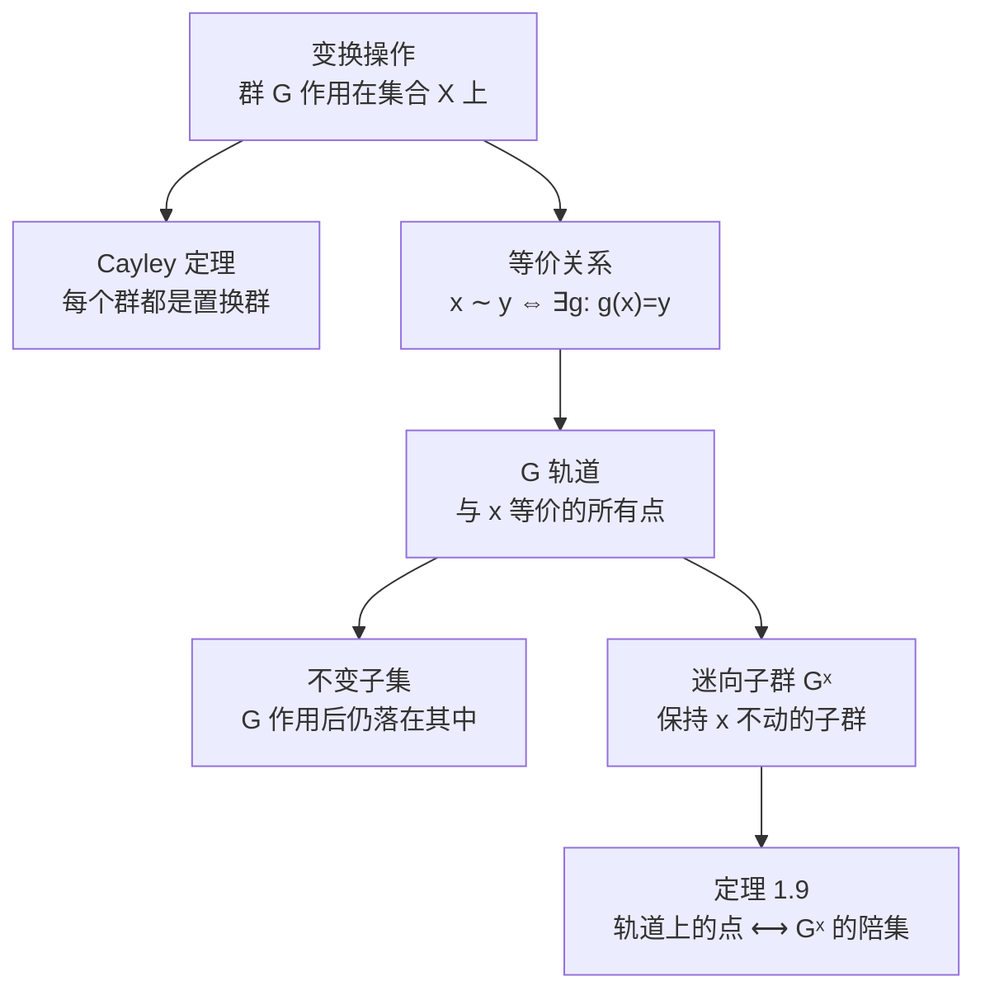

# 1.5 变换群

> [!abstract] 本节核心
> 从抽象的群论结构转向物理中最常见的应用场景——变换群。建立"操作"与"对象"两个层面的概念框架：Cayley 定理把抽象群具体化为置换群，等价关系和轨道描述群对对象的作用效果，迷向子群刻画局域对称性，定理 1.9 建立轨道与陪集的一一对应。

---

## 一、为什么要讲变换群？

前面四节讨论的是群的抽象结构——子群、陪集、类、同态。这些都是在群"内部"做文章。但物理中遇到的群几乎都是**变换群**：空间转动、反射、平移、置换……它们有具体的变换对象（分子、晶体、波函数），有具体的变换操作（转一个角度、沿一个方向平移）。

> [!important] 核心区别
> - 前面的群论：研究群自身的结构（元素之间的关系）
> - 变换群：研究**操作**（群元）对**对象**（空间中的点、函数、物理系统）的作用
>
> 两个层面：**变换操作** + **变换对象**。这是物理群论的核心框架。

---

## 二、变换操作与完全对称群

> [!note] 定义 1.18（变换/置换）
> 设 $X$ 是一个非空集合，$f$ 是将 $X$ 映入其自身的一一满映射，$f(x) = y \in X$，将 $f$ 称为 $X$ 上的**变换**或**置换**。
>
> 定义两个置换 $f, g$ 的乘积 $fg$ 为先做 $g$ 再做 $f$，即 $fg(x) = f(g(x))$。
>
> $X$ 的全体置换在此乘法规则下形成一个群，称为 $X$ 上的**完全对称群**，记为 $S_X$。
>
> 完全对称群的子群称为 $X$ 上的**变换群**或**对称群**。

> [!tip] 记号
> 若 $X$ 有 $n$ 个元素，则 $S_X$ 记为 $S_n$，就是前面讲的 $n$ 阶置换群。
>
> 对群 $G$，当我们把群元当成变换对象时，它也有完全对称群 $S_G$。

### Cayley 定理：每个群都是置换群

> [!important] 定理 1.8（Cayley 定理）
> 群 $G$ 同构于 $S_G$ 的一个子群。

**证明**：

取 $G$ 中任意一个元素 $g$，定义 $G$ 上的一个变换：$g$ 把 $G$ 中每个元素 $x$ 映为 $gx$。

由重排定理，$gx$ 给出且仅一次给出 $G$ 中所有元素，所以这是一个变换（一一满映射）。

把 $G$ 中每个元素都对应这样一个变换。单位元对应恒等变换，$g$ 对应变换的逆变换就是 $g^{-1}$ 对应的变换（因为 $g^{-1}gG = G$）。

这些变换构成 $S_G$ 的一个子群，且与 $G$ 同构。$\square$

> [!tip] Cayley 定理的意义
> 这个定理告诉我们：**任何抽象群都"本质上是"某个置换群**。不管群的结构多么抽象，它总可以具体化为某个集合上的变换操作。这保证了置换群理论的普适性——你在 $S_n$ 上证明的定理，对任何群都成立。

---

## 三、变换对象：等价、轨道与不变子集

现在从"操作"转向"对象"。

> [!note] 定义 1.19（等价）
> 设 $G$ 为 $X$ 上的变换群，若对 $x, y \in X$，$\exists g \in G$ 使得 $g(x) = y$，则称 $x$ 与 $y$ **等价**，记为 $x \sim y$。

等价关系满足：
- **对称性**：$g(x) = y \Rightarrow g^{-1}(y) = x$
- **传递性**：$g(x) = y, \; f(y) = z \Rightarrow (fg)(x) = z$，且 $fg \in G$（封闭性）

> [!note] 定义 1.20（$G$ 轨道）
> 设 $G$ 为 $X$ 上的变换群，$x$ 为 $X$ 中元素，$X$ 中所有与 $x$ 等价的元素的集合，称为 $x$ 的 **$G$ 轨道**。

> [!tip] 类比
> 轨道和类（1.3 节）有相似之处：类是群元在共轭关系下的等价类，轨道是变换对象在群作用下的等价类。但类是群"内部"的结构，轨道是群"外部"（对对象的作用）的结构。

> [!note] 定义 1.21（不变子集）
> 设 $G$ 为 $X$ 上的变换群，若有 $X$ 上的子集 $Y$，满足 $G$ 中任意元素 $g$ 作用在 $Y$ 中元素上，得到的结果还属于 $Y$，则称 $Y$ 为群 $G$ 在 $X$ 上的**不变子集**。

两个显然的例子：
1. 每个 $G$ 轨道都是 $G$ 不变的，所以轨道及其并集都是不变子集
2. 对任意子集 $Y$，至少存在 $G$ 的一个子群 $H$（比如只含恒等变换的子群）使得 $Y$ 对 $H$ 不变

### 例 1.16 二维平面上的转动

设 $X$ 是二维平面，$G$ 是绕 $z$ 轴转动的二维转动群 $G = \{C_{\hat{k}}(\Psi)\}$。

对平面上任意一点 $r = x\hat{i} + y\hat{j}$，转动操作把它映为：

$$r' = (x\cos\Psi - y\sin\Psi)\hat{i} + (x\sin\Psi + y\cos\Psi)\hat{j}$$

$r$ 与 $r'$ 等价。以原点为圆心、过 $r$ 的圆周上的所有点都与其等价——这个圆周就是 $r$ 的 $G$ 轨道。

> [!tip] 图像
> 这些同心圆及其并集是 $X$ 的 $G$ 不变子集。
>
> 如果取一个圆上等间距的 4 个点作为子集 $Y$，则 $Y$ 对应的不变变换群是 $G$ 的子群 $H = \{C_{\hat{k}}(n\pi/2)\}$（转动 $\pi/2$ 及其整数倍）。

---

## 四、迷向子群：保持一点不变的操作

> [!note] 定义 1.22（迷向子群）
> 设 $G$ 是 $X$ 上的变换群，$x$ 是 $X$ 中一点，若 $G$ 的子群 $G^x$ 保持 $x$ 不变，即：
> $$G^x = \{h \mid h \in G \text{ 且 } h(x) = x\}$$
> 则称 $G^x$ 是 $G$ 对 $x$ 的**迷向子群**（也叫稳定子群、各向同性子群）。

> [!important] 物理意义
> 迷向子群就是**保持空间中某个特定点不变的所有对称操作**。在分子对称性中，如果我们取一个原子所在的位置为 $x$，那么迷向子群就是保持那个原子不动的所有对称操作。这是判断分子点群类型的核心工具。

### 定理 1.9：轨道与陪集的一一对应

> [!important] 定理 1.9
> 设 $G^x$ 是 $G$ 对 $x$ 的迷向子群，则 $G^x$ 的每个左陪集把 $x$ 映为其 $G$ 轨道中一个特定的点 $y$，且不同陪集把它映为不同的点。
>
> 也就是说：**含 $x$ 的 $G$ 轨道上的点，与 $G^x$ 的左陪集一一对应**。

**证明**：

**第一点**：对轨道上任意一点 $y$，设 $y = g(x)$。定义陪集 $gG^x$，其中任意元素 $gh$（$h \in G^x$）作用在 $x$ 上：$gh(x) = g(h(x)) = g(x) = y$。所以陪集 $gG^x$ 中所有元素都把 $x$ 变为 $y$。

**第二点**：设不同陪集 $g_1 G^x$ 和 $g_2 G^x$ 对应同一个 $y$，即 $g_1 h_1(x) = g_2 h_2(x) = y$。

则 $g_2^{-1} g_1 h_1(x) = h_2(x) = x$，所以 $g_2^{-1} g_1 h_1 \in G^x$，进而 $g_2^{-1} g_1 \in G^x$。

由重排定理，$G^x = g_2^{-1} g_1 G^x$，所以 $g_2 G^x = g_1 G^x$，矛盾！$\square$

> [!important] 推论
> 当群 $G$ 的阶为 $n$，迷向子群 $G^x$ 的阶为 $m$ 时，含 $x$ 的 $G$ 轨道上点的个数就是 $n/m$。
>
> 这是 Lagrange 定理的直接推论：轨道大小 = $[G : G^x] = |G|/|G^x|$。

### 例 1.17 $D_3$ 群的迷向子群

设 $A, B, C$ 是平面正三角形的三个顶点，$D_3$ 是其对称群（只考虑转动）。取 $x = A$。

保持 $A$ 不动的操作：$e$（不动）和 $a$（绕通过 $A$ 的轴转 $\pi$，$A$ 在转轴上所以不动）。

所以 $G^A = \{e, a\}$，阶为 2。

陪集分解：
- $bG^A = \{b, f\}$，将 $A$ 映为 $C$
- $cG^A = \{c, d\}$，将 $A$ 映为 $B$

含 $A$ 的轨道上有 3 个点：$6/2 = 3$。✓

> [!tip] 物理图像
> 正三角形的三个顶点在 $D_3$ 作用下构成一个轨道。迷向子群 $\{e, a\}$ 的每个陪集对应轨道上的一个顶点。这个对应关系不是巧合，而是普遍结构：**对称性把一个点"搬运"到所有等价位置，搬运的方式由迷向子群的陪集决定**。

---

## 五、1.5 节的核心逻辑链

这条链建立了物理群论的基本框架：**操作（群）→ 对象（空间/系统）→ 轨道（等价类）→ 迷向子群（局域对称性）**。后续的点群和空间群理论就是在这套框架下展开的。
