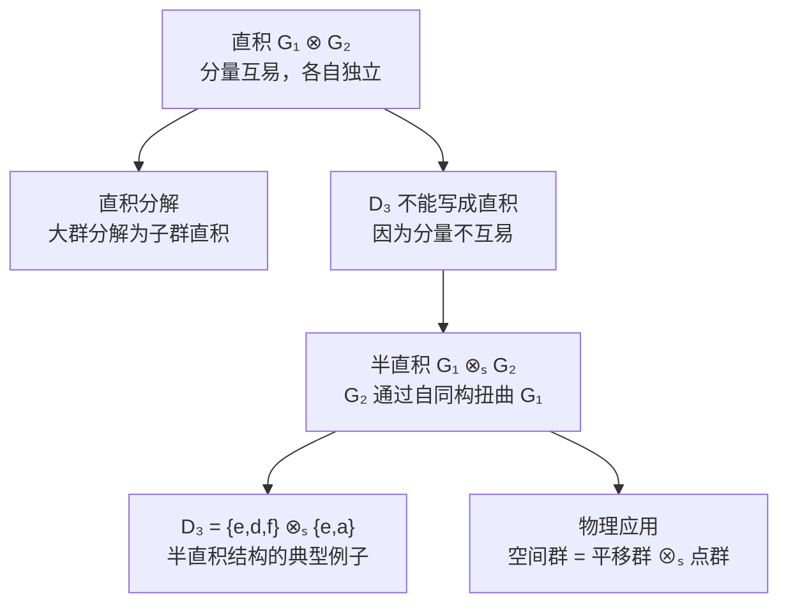
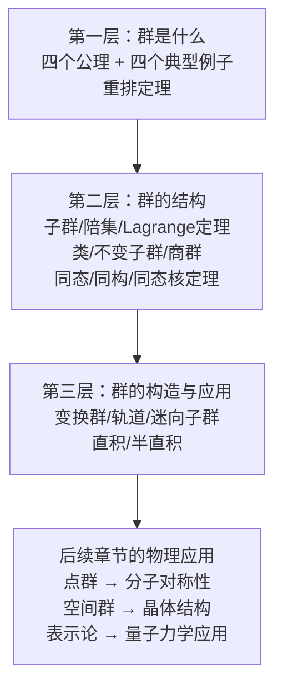

# 1.6 直积与半直积

> [!abstract] 本节核心
> 第一章的收官内容。从已知群构造新群：直积是无耦合的组合（分量互易），半直积是有耦合的组合（通过自同构映射联系）。$D_3$ 群不能写成直积但可以写成半直积，这是半直积适用性更广的典型例证。

---

## 一、为什么要讲直积与半直积？

前面五节做了两件事：
1. **剖析群的结构**（子群、陪集、类、不变子群、商群）
2. **建立群间关系**（同态、同构、自同构）

这一节要做第三件事：**从已知群构造新群**。具体来说，给定两个群 $G_1$ 和 $G_2$，如何构造一个更大的群 $G$，使得 $G_1$ 和 $G_2$ 都是 $G$ 的子群？

有两种方式：结构强的**直积**和结构弱但适用性更强的**半直积**。

---

## 二、直积：无耦合的组合

### 直积群的构造

直积的想法很自然：把两个群的元素配成有序对，乘法分量各自独立进行。

> [!note] 定义 1.23（直积群）
> 由两个群 $G_1$ 与 $G_2$ 的各一个群元 $g_{1\alpha}$ 与 $g_{2\beta}$ 形成有序对 $g_{\alpha\beta} = (g_{1\alpha}, g_{2\beta})$，定义乘法：
> $$g_{\alpha\beta} g_{\alpha'\beta'} = (g_{1\alpha} g_{1\alpha'}, \; g_{2\beta} g_{2\beta'})$$
> 即分量各自相乘，再组成新的有序对。这样形成的群称为 $G_1$ 与 $G_2$ 的**直积群**，记为 $G = G_1 \otimes G_2$。

### 直积分解：反过来用

直积群是"从小群构造大群"。反过来，如果一个大群 $G$ 可以分解为两个子群的直积，就叫**直积分解**。

> [!note] 定义 1.24（直积分解）
> 一个群 $G$ 有两个子群 $G_1$ 与 $G_2$，如果：
> 1. $G$ 中任何元素都可以**唯一地**表示为 $g = g_{1\alpha} g_{2\beta}$（$g_{1\alpha} \in G_1, g_{2\beta} \in G_2$）
> 2. $g_{1\alpha} g_{2\beta} = g_{2\beta} g_{1\alpha}$（两个分量群的元素互易）
>
> 则 $G$ 是 $G_1$ 与 $G_2$ 的直积，$G_1$ 与 $G_2$ 称为 $G$ 的**直积因子**。

### 直积因子的两个性质

**（1）只有一个公共元素 $e$**

用反证法。设除了 $e$ 还有 $a$ 是 $G_1$ 和 $G_2$ 的公共元素，则 $a$ 可以写成 $e \cdot a$（$G_1$ 出 $e$，$G_2$ 出 $a$），也可以写成 $a \cdot e$（$G_1$ 出 $a$，$G_2$ 出 $e$）。两种表示，与"唯一表示"矛盾。

**（2）$G_1$ 和 $G_2$ 都是 $G$ 的不变子群**

以 $G_1$ 为例，对 $G_1$ 中任意元素 $g_{1\alpha}$，其共轭元素为：

$$(g_{1\alpha'} g_{2\beta'}) g_{1\alpha} (g_{1\alpha'} g_{2\beta'})^{-1} = g_{1\alpha'} g_{2\beta'} g_{1\alpha} g_{2\beta'}^{-1} g_{1\alpha'}^{-1}$$

因为 $G_1$ 和 $G_2$ 的元素互易，$g_{2\beta'}$ 可以"穿过" $g_{1\alpha}$ 和 $g_{1\alpha'}^{-1}$：

$$= g_{1\alpha'} g_{1\alpha} g_{2\beta'} g_{2\beta'}^{-1} g_{1\alpha'}^{-1} = g_{1\alpha'} g_{1\alpha} g_{1\alpha'}^{-1} \in G_1$$

所以 $G_1$ 是不变子群。同理 $G_2$ 也是。✓

### 两个例子

**例 1.18 三维向量空间**

x-y 平面向量群 $G_1$ 和 z 轴向量群 $G_2$（乘法都是向量加法），直积得到三维向量群 $G$。

反过来，三维向量群可以分解为任意一个平面群和一条不在此平面内的直线群的直积。分解方法不唯一，但分解后一定满足两个性质。

**例 1.19 6 阶循环群 $Z_6$**

$Z_6 = \{e, a, a^2, a^3, a^4, a^5\}$，取 $G_1 = \{e, a^3\}$（2 阶），$G_2 = \{e, a^2, a^4\}$（3 阶）。

- 任何元素可唯一表示为 $G_1$ 元素 $\times$ $G_2$ 元素
- $G_1$ 和 $G_2$ 的元素互易（因为 $Z_6$ 是 Abel 群）

所以 $Z_6 = G_1 \otimes G_2$。

---

## 三、$D_3$ 群为什么不能写成直积？

> [!important] 例 1.20
> 取 $G_1 = \{e, d, f\}$，$G_2 = \{e, a\}$。
>
> $D_3$ 中任何元素可以唯一表示为 $g_{1\alpha} g_{2\beta}$，但 $G_1$ 与 $G_2$ 的元素**不互易**！
>
> 比如 $d \cdot a = c$，但 $a \cdot d = b$，$da \neq ad$。
>
> 所以 $D_3$ **不是** $G_1$ 与 $G_2$ 的直积。$G_1$ 是不变子群，但 $G_2$ 不是。

$D_3$ 的结构也很强，但比直积弱。怎么办？**退而求其次，弱化结构要求**——这就是半直积。

---

## 四、半直积：有耦合的组合

### 核心思想

直积要求 $G_1$ 和 $G_2$ 的元素互易。如果它们不互易，还能不能构造群？

可以，但需要一个"修正规则"：$G_2$ 的元素在"穿过" $G_1$ 时，会被 $G_1$ 的某个自同构映射"扭曲"。

> [!note] 定义 1.25（半直积群）
> 设群 $G_1 = \{g_{1\alpha}\}$，$G_2 = \{g_{2\beta}\}$。如果对 $G_1$，存在自同构映射群 $A(G_1)$，使得 $G_2$ 与之**同态**，即对 $G_2$ 中任意 $g_{2\beta}$，可以通过同态映射找到 $G_1$ 的一个自同构映射 $\nu_{g_{2\beta}}$。
>
> 利用这个自同构映射，定义有序对 $\langle g_{1\alpha} g_{2\beta} \rangle$ 的乘法：
> $$\langle g_{1\alpha} g_{2\beta} \rangle \langle g_{1\alpha'} g_{2\beta'} \rangle = \langle g_{1\alpha} \, \nu_{g_{2\beta}}(g_{1\alpha'}) \, g_{2\beta} g_{2\beta'} \rangle$$
>
> 这样形成的群称为 $G_1$ 与 $G_2$ 的**半直积群**，记为 $G_1 \otimes_s G_2$。

### 半直积的乘法规则详解

这是理解半直积的关键。对比直积和半直积的乘法：

| | 乘法公式 |
|--|---------|
| **直积** | $(g_{1\alpha}, g_{2\beta})(g_{1\alpha'}, g_{2\beta'}) = (g_{1\alpha} g_{1\alpha'}, \; g_{2\beta} g_{2\beta'})$ |
| **半直积** | $\langle g_{1\alpha} g_{2\beta} \rangle \langle g_{1\alpha'} g_{2\beta'} \rangle = \langle g_{1\alpha} \, \nu_{g_{2\beta}}(g_{1\alpha'}) \, g_{2\beta} g_{2\beta'} \rangle$ |

> [!important] 核心区别
> 直积中，$G_1$ 的分量直接相乘：$g_{1\alpha} g_{1\alpha'}$。
>
> 半直积中，$G_1$ 的分量在相乘前，$g_{1\alpha'}$ 要先被 $g_{2\beta}$ 对应的自同构映射 $\nu_{g_{2\beta}}$ "扭曲"一下：$g_{1\alpha} \nu_{g_{2\beta}}(g_{1\alpha'})$。
>
> $G_2$ 的分量不受影响，直接相乘：$g_{2\beta} g_{2\beta'}$。

> [!tip] 直觉
> 想象 $G_1$ 是一组积木，$G_2$ 是一组操作指令。直积意味着"积木和指令互不干扰"。半直积意味着"指令会改变积木的形状"——当你执行 $g_{2\beta}$ 后，$G_1$ 中的元素 $g_{1\alpha'}$ 被"变换"成了 $\nu_{g_{2\beta}}(g_{1\alpha'})$，然后再和 $g_{1\alpha}$ 组合。

### 半直积成群的关键性质

半直积定义能构成群，依赖两个基本性质：

**性质 (1)**：$\nu_{g_{2\beta}}(g_{1\alpha} g_{1\alpha'}) = \nu_{g_{2\beta}}(g_{1\alpha}) \nu_{g_{2\beta}}(g_{1\alpha'})$

这是因为 $\nu_{g_{2\beta}}$ 是 $G_1$ 的自同构映射，保持乘法。

**性质 (2)**：$\nu_{g_{2\beta} g_{2\beta'}}(g_{1\alpha'}) = \nu_{g_{2\beta}}(\nu_{g_{2\beta'}}(g_{1\alpha'}))$

这是因为 $G_2$ 与 $A(G_1)$ 同态：$G_2$ 中两个元素的乘积对应的自同构映射，等于各自对应自同构映射的乘积。

> [!tip] 两个性质的来源
> 性质 (1) 来自 $\nu$ 是 $G_1$ 的自同构映射（保持乘法）。
>
> 性质 (2) 来自 $G_2$ 与 $A(G_1)$ 的同态关系（$G_2$ 的乘法对应 $A(G_1)$ 的乘法）。

### 半直积成群的四条件验证

**结合律**（最复杂的一步）：

要证 $(\langle g_{1\alpha} g_{2\beta} \rangle \langle g_{1\alpha'} g_{2\beta'} \rangle) \langle g_{1\alpha''} g_{2\beta''} \rangle = \langle g_{1\alpha} g_{2\beta} \rangle (\langle g_{1\alpha'} g_{2\beta'} \rangle \langle g_{1\alpha''} g_{2\beta''} \rangle)$。

左边展开：

$$\langle g_{1\alpha} \nu_{g_{2\beta}}(g_{1\alpha'}) g_{2\beta} g_{2\beta'} \rangle \langle g_{1\alpha''} g_{2\beta''} \rangle = \langle g_{1\alpha} \nu_{g_{2\beta}}(g_{1\alpha'}) \nu_{g_{2\beta} g_{2\beta'}}(g_{1\alpha''}) g_{2\beta} g_{2\beta'} g_{2\beta''} \rangle$$

右边展开（利用性质 (1) 和 (2)）：

$$\langle g_{1\alpha} g_{2\beta} \rangle \langle g_{1\alpha'} \nu_{g_{2\beta'}}(g_{1\alpha''}) g_{2\beta'} g_{2\beta''} \rangle = \langle g_{1\alpha} \nu_{g_{2\beta}}(g_{1\alpha'} \nu_{g_{2\beta'}}(g_{1\alpha''})) g_{2\beta} g_{2\beta'} g_{2\beta''} \rangle$$

$$= \langle g_{1\alpha} \nu_{g_{2\beta}}(g_{1\alpha'}) \nu_{g_{2\beta}}(\nu_{g_{2\beta'}}(g_{1\alpha''})) g_{2\beta} g_{2\beta'} g_{2\beta''} \rangle$$

由性质 (2)，$\nu_{g_{2\beta}}(\nu_{g_{2\beta'}}(g_{1\alpha''})) = \nu_{g_{2\beta} g_{2\beta'}}(g_{1\alpha''})$，左右两边相等。✓

**封闭性**：乘积仍是有序对形式。✓

**单位元**：$\langle e_1, e_2 \rangle$，其中 $e_2$ 对应恒等自同构映射。✓

**逆元**：$\langle g_{1\alpha} g_{2\beta} \rangle^{-1} = \langle \nu_{g_{2\beta}^{-1}}(g_{1\alpha}^{-1}), \; g_{2\beta}^{-1} \rangle$。

> [!tip] 逆元的推导
> 设逆元为 $\langle g_{1\alpha'}, g_{2\beta}^{-1} \rangle$（$G_2$ 部分直接取逆，因为它不参与"扭曲"）。
>
> 要满足 $\langle g_{1\alpha} g_{2\beta} \rangle \langle g_{1\alpha'} g_{2\beta}^{-1} \rangle = \langle e_1, e_2 \rangle$。
>
> 即 $\langle g_{1\alpha} \nu_{g_{2\beta}}(g_{1\alpha'}) e_2 \rangle = \langle e_1, e_2 \rangle$。
>
> 所以 $\nu_{g_{2\beta}}(g_{1\alpha'}) = g_{1\alpha}^{-1}$，即 $g_{1\alpha'} = \nu_{g_{2\beta}^{-1}}(g_{1\alpha}^{-1})$。

### 半直积的重要性质

> [!important] $G_1$ 是半直积群的不变子群

对 $\langle g_{1\alpha} g_{2\beta} \rangle$ 和 $\langle g_{1\alpha'} e_2 \rangle$（$G_1$ 中元素）做共轭：

$$\langle g_{1\alpha} g_{2\beta} \rangle \langle g_{1\alpha'} e_2 \rangle \langle \nu_{g_{2\beta}^{-1}}(g_{1\alpha}^{-1}) g_{2\beta}^{-1} \rangle = \langle g_{1\alpha} \nu_{g_{2\beta}}(g_{1\alpha'}) g_{1\alpha}^{-1}, \; e_2 \rangle$$

结果仍在 $G_1$ 中。✓

> [!tip] 但 $G_2$ 不一定是半直积群的不变子群
> 当 $G_2$ 也是不变子群时，半直积退化为直积。因为 $G_2$ 是不变子群意味着 $\nu_{g_{2\beta}}$ 是恒等映射，乘法回到直积的形式。

---

## 五、例 1.21 $D_3$ 群的半直积结构

取 $G_1 = \{e, d, f\}$，$G_2 = \{e, a\}$。

**第一步**：找 $G_1$ 的自同构群 $A(G_1)$。

$G_1 \cong Z_3$，由例 1.15 知 $A(Z_3) \cong Z_2$，有两个元素：
- $\nu_e$：恒等映射
- $\nu_a$：$e \to e, \; d \to f, \; f \to d$

**第二步**：建立 $G_2$ 与 $A(G_1)$ 的同态映射。

$G_2 = \{e, a\} \cong Z_2$。同态映射：$e \to \nu_e$（恒等），$a \to \nu_a$（交换 $d, f$）。

**第三步**：定义半直积群的元素。

$$\langle ee \rangle, \; \langle ea \rangle, \; \langle de \rangle, \; \langle da \rangle, \; \langle fe \rangle, \; \langle fa \rangle$$

分别对应 $D_3$ 群中的：$e, a, d, c, f, b$。

**第四步**：验证乘法规则。

比如 $\langle da \rangle \langle fa \rangle$：

$$= \langle d \, \nu_a(f) \, a \cdot a \rangle = \langle d \, d \, e \rangle = \langle d^2, e \rangle = \langle f, e \rangle$$

对应 $D_3$ 乘法表：$c \cdot b = f$。✓

再比如 $\langle fa \rangle \langle da \rangle$：

$$= \langle f \, \nu_a(d) \, a \cdot a \rangle = \langle f \, f \, e \rangle = \langle f^2, e \rangle = \langle d, e \rangle$$

对应 $D_3$ 乘法表：$b \cdot c = d$。✓

> [!important] 结论
> $D_3$ 群具备以 $G_1 = \{e, d, f\}$、$G_2 = \{e, a\}$ 为因子的**半直积结构**，其中 $G_1$ 是 $D_3$ 的不变子群。

---

## 六、直积 vs 半直积：总结对比

| | 直积 $G_1 \otimes G_2$ | 半直积 $G_1 \otimes_s G_2$ |
|--|----------------------|--------------------------|
| **分量群关系** | 互易：$g_{1\alpha} g_{2\beta} = g_{2\beta} g_{1\alpha}$ | 不互易，通过自同态映射联系 |
| **乘法** | 分量直接相乘 | $G_1$ 分量被 $G_2$ 对应的自同构"扭曲" |
| **结构强度** | 强（完全可分解） | 弱（有耦合） |
| **适用范围** | 窄 | 广 |
| **$G_1$ 的性质** | 不变子群 | 不变子群 |
| **$G_2$ 的性质** | 不变子群 | **不一定**是不变子群 |
| **退化条件** | — | 当 $G_2$ 也是不变子群时，退化为直积 |

> [!tip] 物理意义
> 直积 = **无耦合**的组合。两个子系统完全独立，互不影响。
>
> 半直积 = **有耦合**的组合。$G_2$ 的操作会"改变" $G_1$ 的结构（通过自同构映射）。
>
> 物理上，半直积远比直积常见。比如**空间群** = 平移群 $\otimes_s$ 点群，就是半直积——平移操作和点群操作不互易（先平移再绕中心转，和先绕中心再平移，结果不同）。

---

## 七、1.6 节的核心逻辑链

---

## 八、第一章总结

第一章完成了群论的"基础架构建设"，可以概括为三个层次：

> [!important] 六个定义 + 三个定理（1.1–1.2节）
> - **定义**：群、有限/无限群、Abel群、子群、循环子群与群元的阶、陪集
> - **定理**：重排定理、陪集定理、Lagrange定理
>
> 这三个定理是最基本的结构性质，后续几乎所有证明都会用到它们。
